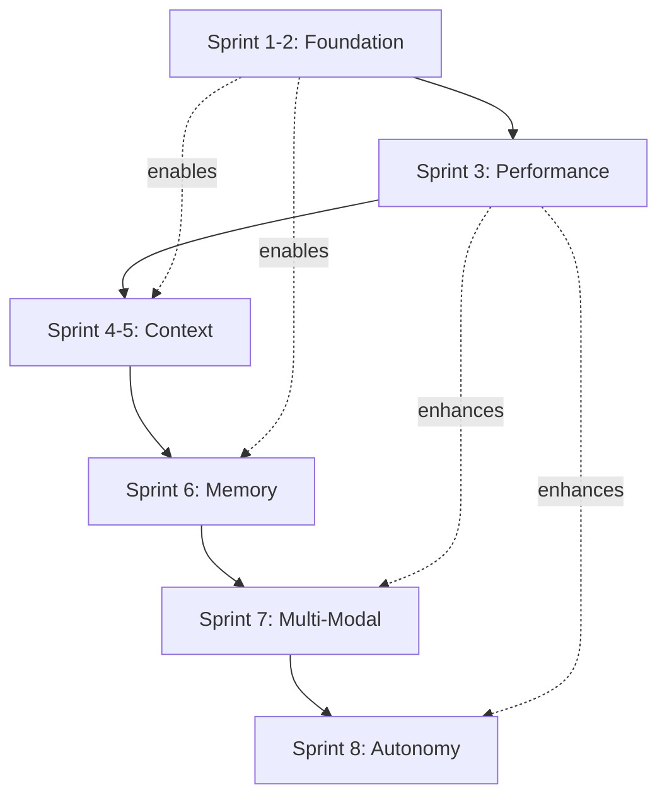

# Comprehensive Implementation Plan: Project Myriad
## Evolution to Human-Like Cognition (35% → 85-90%)

**Document Version:** 1.0  
**Date:** 2025-01-16  
**Current System Version:** 4.1.0  
**Target Completion:** 24 weeks (8 sprints × 3 weeks each)

---

## Executive Summary

### Vision
Transform Project Myriad from a sophisticated reactive AI system (35-40% human-like cognition) into a proactive, self-aware cognitive architecture (85-90% human-like cognition) through systematic implementation of 8 critical architectural enhancements over 24 weeks.

### Current State Assessment

**✅ Achievements (What Works Well):**
- Complete biomimetic neurogenesis pipeline operational
- Hebbian learning with adaptive connection strengthening
- Enhanced graph intelligence with smart agent discovery
- Performance optimization with Redis caching (82% compression)
- Agent-to-agent collaboration with reflex arcs
- Autonomous learning engine (5-phase system)

**❌ Critical Gaps (What's Missing):**
1. **Production Infrastructure** - No orchestrator as true microservice, missing monitoring stack
2. **Resource Governance** - Unbounded agent creation (potential for 3000 agents), no cleanup policies
3. **Schema Enforcement** - Graph schema documented but constraints/indexes not enforced
4. **Async Communication** - All HTTP calls synchronous, sequential task processing bottleneck
5. **Conversation Context** - No multi-turn conversation memory or reference resolution
6. **Tiered Memory** - Missing STM/MTM/LTM architecture for information management
7. **Multi-Modal Learning** - No image, audio, or cross-sensory processing
8. **Autonomous Cognition** - Reactive only, no self-awareness or proactive behavior

### Expected Outcomes

By implementing this plan, Project Myriad will achieve:
- **Production-ready infrastructure** with proper monitoring, security, and resource management
- **Scalable architecture** supporting thousands of agents with proper lifecycle management
- **Human-like conversation** with multi-turn context and reference resolution
- **Advanced learning** from multiple modalities (text, images, audio)
- **Autonomous operation** with self-awareness, curiosity, and proactive exploration
- **85-90% similarity** to human cognitive architecture and capabilities

---

## Implementation Overview

### Sprint Sequence (24 Weeks)

| Sprint | Weeks | Focus Area | Priority | Dependencies |
|--------|-------|------------|----------|--------------|
| **1-2** | 1-6 | Critical Foundation | 🔴 Critical | None |
| **3** | 7-9 | Performance & Async | 🔴 Critical | Sprint 1-2 |
| **4-5** | 10-15 | Context Understanding | 🟡 High | Sprint 3 |
| **6** | 16-18 | Tiered Memory System | 🟡 High | Sprint 4-5 |
| **7** | 19-21 | Multi-Modal Learning | 🟢 Medium | Sprint 6 |
| **8** | 22-24 | Autonomous Cognition | 🟢 Medium | Sprint 7 |

### Dependency Graph



---

## SPRINT 1-2: Critical Foundation (Weeks 1-6)

**Goal:** Establish production-ready infrastructure with proper resource management and schema enforcement.

**Target Outcome:** System can safely operate in production with monitoring, resource limits, and data integrity guarantees.

### Phase 1.1: Orchestrator Microservice Extraction (Week 1)

#### Current Problem
- Orchestrator exists as [`app.py`](src/myriad/services/orchestrator/app.py:1) but Integration Tester ([`integration_tester/app.py`](src/myriad/services/integration_tester/app.py:1)) still acts as gateway
- Unclear service boundaries and single point of failure
- Cannot scale orchestrator independently

#### Implementation Steps

**1.1.1 Verify Orchestrator Service (Day 1-2)**

File: [`src/myriad/services/orchestrator/app.py`](src/myriad/services/orchestrator/app.py:1)

Current state: File exists but needs verification of:
- Health endpoint implementation
- Metrics endpoint
- Process endpoint accepting both formats
- Status endpoint

**Action Items:**
```python
# Verify these endpoints exist in app.py:
# - GET /health
# - GET /metrics
# - POST /process
# - GET /status
# - POST /discover

# If missing, add:
@app.route('/metrics', methods=['GET'])
def metrics():
    return jsonify({
        "total_queries_processed": query_counter,
        "neurogenesis_triggered": neurogenesis_counter,
        "average_response_time": avg_response_time,
        "active_agents": len(enhanced_intelligence.agent_profiles),
        "hebbian_learning_enabled": True,
        "performance_optimization_enabled": PERFORMANCE_OPTIMIZATION_AVAILABLE
    })
```

**1.1.2 Update Docker Compose (Day 2-3)**

File: [`docker-compose.yml`](docker-compose.yml:1)

Add orchestrator service entry:
```yaml
orchestrator:
  build:
    context: ./src/myriad/services/orchestrator
  container_name: orchestrator
  ports:
    - '5010:5010'
  networks:
    - myriad_network
  environment:
    - FLASK_ENV=production
    - GRAPHDB_MANAGER_URL=http://graphdb_manager_ai:5008
    - ENABLE_DYNAMIC_AGENTS=true
    - ENABLE_AUTONOMOUS_LEARNING=true
    - PORT=5010
  depends_on:
    - graphdb_manager_ai
    - redis
  deploy:
    resources:
      limits:
        cpus: '2.0'
        memory: 1G
      reservations:
        memory: 512M
  healthcheck:
    test: ["CMD", "curl", "-f", "http://localhost:5010/health"]
    interval: 30s
    timeout: 10s
    retries: 3
    start_period: 40s
```

**1.1.3 Update Integration Tester (Day 3-4)**

File: [`src/myriad/services/integration_tester/app.py`](src/myriad/services/integration_tester/app.py:1)

Modify to call orchestrator HTTP API instead of embedded library:
```python
# Replace direct import:
# from orchestration.orchestrator import process_tasks

# With HTTP call:
ORCHESTRATOR_URL = os.environ.get("ORCHESTRATOR_URL", "http://orchestrator:5010")

@app.route('/run_orchestration', methods=['POST'])
def run_orchestration():
    data = request.get_json()
    try:
        response = requests.post(
            f"{ORCHESTRATOR_URL}/process",
            json=data,
            timeout=60
        )
        return jsonify(response.json()), response.status_code
    except requests.exceptions.RequestException as e:
        return jsonify({"status": "error", "message": str(e)}), 503
```

**Success Criteria:**
- ✅ Orchestrator runs as independent service on port 5010
- ✅ Integration Tester successfully calls orchestrator via HTTP
- ✅ All existing tests pass
- ✅ Health checks operational

---

### Phase 1.2: Resource Limits for Neurogenesis (Week 2)

#### Current Problem
From [`dynamic_lifecycle_manager.py`](src/myriad/core/lifecycle/dynamic_lifecycle_manager.py:524-562):
- No CPU/memory limits on agent containers
- No maximum concurrent agent limit
- No lifecycle policies (idle timeout, TTL)
- Port range 7000-9999 allows 3000 agents (resource exhaustion risk)

#### Implementation Steps

**1.2.1 Add Resource Configuration (Day 1)**

File: [`src/myriad/core/lifecycle/dynamic_lifecycle_manager.py`](src/myriad/core/lifecycle/dynamic_lifecycle_manager.py:1)

Add configuration constants after imports (around line 22):
```python
# Resource Management Configuration
MAX_CONCURRENT_AGENTS = int(os.environ.get("MAX_DYNAMIC_AGENTS", "20"))
AGENT_CPU_LIMIT = os.environ.get("AGENT_CPU_LIMIT", "0.5")  # CPU cores
AGENT_MEMORY_LIMIT = os.environ.get("AGENT_MEMORY_LIMIT", "256m")
AGENT_MEMORY_SWAP = os.environ.get("AGENT_MEMORY_SWAP", "256m")  # No swap
AGENT_IDLE_TIMEOUT_MIN = int(os.environ.get("AGENT_IDLE_TIMEOUT", "30"))
AGENT_MAX_AGE_HOURS = int(os.environ.get("AGENT_MAX_AGE_HOURS", "24"))
```

**1.2.2 Modify DynamicLifecycleManager Class (Day 2-3)**

At line 445, modify `__init__`:
```python
def __init__(self):
    self.agents: Dict[str, DynamicAgent] = {}
    self.template_manager = get_template_manager()
    self.code_generator = AgentCodeGenerator()
    self.agent_dir = Path("dynamic_agents")
    self.agent_dir.mkdir(exist_ok=True)
    self.port_allocator = PortAllocator(7000, 9999)
    self.monitor_thread = None
    self.monitoring = False
    
    # NEW: Resource management
    self.max_agents = MAX_CONCURRENT_AGENTS
    self.agent_last_used = {}  # Track last usage time per agent_id
    self.creation_queue = []  # Queue for pending creation requests
    
    # NEW: Start lifecycle management thread
    self.lifecycle_thread = threading.Thread(
        target=self._lifecycle_management_loop,
        daemon=True
    )
    self.lifecycle_thread.start()
    print(f"🔧 Lifecycle manager initialized: max {self.max_agents} concurrent agents")
```

**1.2.3 Add Capacity Check to create_agent (Day 3)**

Modify [`create_agent()`](src/myriad/core/lifecycle/dynamic_lifecycle_manager.py:457) at line 457:
```python
def create_agent(self, concept: str, intent: str, research_data: Dict[str, Any], region: str = "General") -> Optional[DynamicAgent]:
    """Create a new dynamic agent for a concept with capacity management"""
    
    # NEW: Check capacity before creating
    active_count = sum(1 for a in self.agents.values() if a.status == AgentStatus.HEALTHY)
    
    if active_count >= self.max_agents:
        print(f"⚠️  At capacity ({active_count}/{self.max_agents}), queueing creation request")
        self.creation_queue.append({
            "concept": concept,
            "intent": intent,
            "research_data": research_data,
            "region": region,
            "queued_at": time.time()
        })
        return None
    
    print(f"🧬 Creating dynamic agent for concept '{concept}' in region '{region}'...")
    print(f"   Current capacity: {active_count}/{self.max_agents} agents")
    
    # ... existing creation code continues ...
```

**1.2.4 Add Resource Limits to Docker Run (Day 4)**

Modify [`_build_and_start_agent()`](src/myriad/core/lifecycle/dynamic_lifecycle_manager.py:524) at line 539:
```python
# Start container with resource limits
run_result = subprocess.run([
    "docker", "run", "-d",
    "--name", agent.container_name,
    "-p", f"{agent.port}:5000",
    "-e", f"PORT=5000",
    # NEW: Resource limits
    "--cpus", AGENT_CPU_LIMIT,
    "--memory", AGENT_MEMORY_LIMIT,
    "--memory-swap", AGENT_MEMORY_SWAP,
    "--restart", "unless-stopped",
    # NEW: Labels for management
    "--label", "myriad.agent=true",
    "--label", f"myriad.concept={agent.concept}",
    "--label", f"myriad.created={agent.created_at}",
    agent.container_name
], capture_output=True, text=True, timeout=60)
```

**1.2.5 Add Lifecycle Management Loop (Day 5)**

Add new method to DynamicLifecycleManager class (after line 622):
```python
def _lifecycle_management_loop(self):
    """Background loop for agent lifecycle management"""
    
    while True:
        try:
            current_time = time.time()
            agents_to_stop = []
            
            # Check all agents for idle timeout and max age
            for agent_id, agent in self.agents.items():
                if agent.status != AgentStatus.HEALTHY:
                    continue
                
                # Check idle timeout
                last_used = self.agent_last_used.get(agent_id, agent.created_at)
                idle_minutes = (current_time - last_used) / 60
                
                if idle_minutes > AGENT_IDLE_TIMEOUT_MIN:
                    print(f"⏰ Agent {agent.agent_name} idle for {idle_minutes:.1f} min, stopping")
                    agents_to_stop.append(agent_id)
                    continue
                
                # Check max age
                age_hours = (current_time - agent.created_at) / 3600
                if age_hours > AGENT_MAX_AGE_HOURS:
                    print(f"⏳ Agent {agent.agent_name} reached max age {age_hours:.1f}h, stopping")
                    agents_to_stop.append(agent_id)
            
            # Stop aged/idle agents
            for agent_id in agents_to_stop:
                self.stop_agent(agent_id)
            
            # Process creation queue if capacity available
            if self.creation_queue:
                active_count = sum(1 for a in self.agents.values() if a.status == AgentStatus.HEALTHY)
                
                while self.creation_queue and active_count < self.max_agents:
                    request = self.creation_queue.pop(0)
                    print(f"📋 Processing queued agent creation for '{request['concept']}'")
                    self.create_agent(
                        request['concept'],
                        request['intent'],
                        request['research_data'],
                        request['region']
                    )
                    active_count += 1
            
            time.sleep(60)  # Check every minute
            
        except Exception as e:
            print(f"❌ Lifecycle management error: {e}")
            time.sleep(60)

def record_agent_usage(self, agent_id: str):
    """Record agent usage for idle detection"""
    self.agent_last_used[agent_id] = time.time()
```

**1.2.6 Update Orchestrator to Track Usage (Day 6)**

File: [`src/myriad/services/orchestrator/orchestrator.py`](src/myriad/services/orchestrator/orchestrator.py:793)

After line 813, add usage tracking:
```python
result = response.json()

# NEW: Track agent usage for lifecycle management
if LIFECYCLE_MANAGER_AVAILABLE and agent_url:
    agent_id = _extract_agent_id_from_url(agent_url)
    if agent_id:
        try:
            lifecycle_manager.record_agent_usage(agent_id)
        except:
            pass  # Non-critical failure

# Track performance for Enhanced Graph Intelligence
_update_agent_performance_metrics(agent_url, concept, intent, start_time, result, success=True)
```

**Success Criteria:**
- ✅ Agent creation respects MAX_CONCURRENT_AGENTS limit
- ✅ Agents have CPU and memory constraints
- ✅ Idle agents automatically shut down after timeout
- ✅ Old agents removed after max age
- ✅ Creation queue processes when capacity available

---

### Phase 1.3: Graph Schema Enforcement (Week 3)

#### Current Problem
From [`doc/GRAPH_SCHEMA.md`](doc/GRAPH_SCHEMA.md:1):
- Schema documented but constraints not enforced in database
- No uniqueness constraints on Agent.name, Concept.name
- No indexes for performance
- Can create duplicate/invalid data

#### Implementation Steps

**1.3.1 Create Schema Initialization Script (Day 1-2)**

Create new file: `scripts/init_schema.cypher`

```cypher
// Schema Initialization for Myriad Cognitive Architecture
// Version: 1.0.0
// Date: 2025-01-16

// ========================================
// CONSTRAINTS
// ========================================

// Agent constraints
CREATE CONSTRAINT agent_name_unique IF NOT EXISTS
FOR (a:Agent) REQUIRE a.name IS UNIQUE;

CREATE CONSTRAINT agent_name_exists IF NOT EXISTS
FOR (a:Agent) REQUIRE a.name IS NOT NULL;

CREATE CONSTRAINT agent_endpoint_exists IF NOT EXISTS
FOR (a:Agent) REQUIRE a.endpoint IS NOT NULL;

// Concept constraints
CREATE CONSTRAINT concept_name_unique IF NOT EXISTS
FOR (c:Concept) REQUIRE c.name IS UNIQUE;

CREATE CONSTRAINT concept_name_exists IF NOT EXISTS
FOR (c:Concept) REQUIRE c.name IS NOT NULL;

// Region constraints
CREATE CONSTRAINT region_name_unique IF NOT EXISTS
FOR (r:Region) REQUIRE r.name IS UNIQUE;

// ========================================
// INDEXES
// ========================================

// Agent indexes
CREATE INDEX agent_type_idx IF NOT EXISTS
FOR (a:Agent) ON (a.type);

CREATE INDEX agent_status_idx IF NOT EXISTS
FOR (a:Agent) ON (a.status);

CREATE INDEX agent_created_idx IF NOT EXISTS
FOR (a:Agent) ON (a.created_at);

// Concept indexes
CREATE INDEX concept_category_idx IF NOT EXISTS
FOR (c:Concept) ON (c.category);

CREATE INDEX concept_created_idx IF NOT EXISTS
FOR (c:Concept) ON (c.created_at);

// Full-text search indexes
CREATE FULLTEXT INDEX concept_search_idx IF NOT EXISTS
FOR (c:Concept) ON EACH [c.name, c.primary_definition];

// Relationship indexes (for Hebbian learning)
CREATE INDEX handles_concept_weight_idx IF NOT EXISTS
FOR ()-[r:HANDLES_CONCEPT]-() ON (r.weight);

CREATE INDEX handles_concept_success_idx IF NOT EXISTS
FOR ()-[r:HANDLES_CONCEPT]-() ON (r.success_rate);

CREATE INDEX handles_concept_last_used_idx IF NOT EXISTS
FOR ()-[r:HANDLES_CONCEPT]-() ON (r.last_used);

// ========================================
// SCHEMA VERSION TRACKING
// ========================================

MERGE (v:SchemaVersion {version: "1.0.0"})
SET v.created_at = timestamp(),
    v.description = "Initial schema with Hebbian learning and production constraints",
    v.last_updated = timestamp();
```

**1.3.2 Create Python Schema Initializer (Day 2-3)**

Create new file: `scripts/initialize_graph_schema.py`

```python
#!/usr/bin/env python3
"""
Initialize Neo4j graph schema with constraints and indexes.
Run this before first use or after schema updates.
"""

import os
import sys
from pathlib import Path
from neo4j import GraphDatabase

NEO4J_URI = os.environ.get("NEO4J_URI", "bolt://localhost:7687")
NEO4J_USER = os.environ.get("NEO4J_USER", "neo4j")
NEO4J_PASSWORD = os.environ.get("NEO4J_PASSWORD", "password")

def read_cypher_file(filepath):
    """Read Cypher commands from file"""
    with open(filepath, 'r') as f:
        content = f.read()
    
    # Split by semicolon and filter empty statements
    statements = [s.strip() for s in content.split(';') if s.strip() and not s.strip().startswith('//')]
    return statements

def initialize_schema(driver, cypher_file):
    """Execute schema initialization statements"""
    statements = read_cypher_file(cypher_file)
    
    with driver.session() as session:
        for i, statement in enumerate(statements, 1):
            try:
                print(f"[{i}/{len(statements)}] Executing: {statement[:60]}...")
                session.run(statement)
                print(f"  ✅ Success")
            except Exception as e:
                print(f"  ⚠️  Warning: {e}")
                # Continue on errors (constraints may already exist)
    
    print(f"\n✅ Schema initialization complete!")

def verify_schema(driver):
    """Verify schema was created successfully"""
    with driver.session() as session:
        # Check constraints
        result = session.run("SHOW CONSTRAINTS")
        constraints = [record for record in result]
        print(f"\n📊 Constraints created: {len(constraints)}")
        
        # Check indexes
        result = session.run("SHOW INDEXES")
        indexes = [record for record in result]
        print(f"📊 Indexes created: {len(indexes)}")
        
        # Check schema version
        result = session.run("MATCH (v:SchemaVersion) RETURN v.version as version, v.description as description")
        record = result.single()
        if record:
            print(f"📊 Schema version: {record['version']}")
            print(f"   {record['description']}")

if __name__ == "__main__":
    print("🔧 Initializing Neo4j Graph Schema for Myriad Cognitive Architecture\n")
    
    # Find schema file
    script_dir = Path(__file__).parent
    schema_file = script_dir / "init_schema.cypher"
    
    if not schema_file.exists():
        print(f"❌ Schema file not found: {schema_file}")
        sys.exit(1)
    
    # Connect to Neo4j
    try:
        driver = GraphDatabase.driver(NEO4J_URI, auth=(NEO4J_USER, NEO4J_PASSWORD))
        driver.verify_connectivity()
        print(f"✅ Connected to Neo4j at {NEO4J_URI}\n")
    except Exception as e:
        print(f"❌ Failed to connect to Neo4j: {e}")
        sys.exit(1)
    
    # Initialize schema
    try:
        initialize_schema(driver, schema_file)
        verify_schema(driver)
    finally:
        driver.close()
```

**1.3.3 Add Validation to GraphDB Manager (Day 3-4)**

File: [`src/myriad/services/graphdb_manager/validation.py`](src/myriad/services/graphdb_manager/validation.py:1)

Already exists! Verify it includes these validations:
- Agent: name, type, endpoint required
- Concept: name required, lowercase enforced
- Hebbian: weights in [0.0, 1.0], counts non-negative

If missing, add to validation.py:
```python
def validate_agent_properties(properties: dict) -> tuple[bool, str]:
    """Validate agent properties before creation"""
    required = ['name', 'type', 'endpoint']
    for field in required:
        if field not in properties or not properties[field]:
            return False, f"Missing required field: {field}"
    
    # Validate type
    if properties['type'] not in ['static', 'dynamic']:
        return False, "Agent type must be 'static' or 'dynamic'"
    
    # Validate endpoint URL
    endpoint = properties['endpoint']
    if not (endpoint.startswith('http://') or endpoint.startswith('https://')):
        return False, "Endpoint must be valid HTTP/HTTPS URL"
    
    # Validate status if provided
    if 'status' in properties:
        valid_statuses = ['active', 'inactive', 'unhealthy']
        if properties['status'] not in valid_statuses:
            return False, f"Status must be one of: {valid_statuses}"
    
    return True, "OK"
```

**1.3.4 Update Docker Startup Script (Day 4-5)**

Create new file: `scripts/startup.sh`

```bash
#!/bin/bash
# Startup script for Myriad services
# Initializes schema before starting services

echo "🚀 Starting Myriad Cognitive Architecture"

# Wait for Neo4j to be ready
echo "⏳ Waiting for Neo4j..."
until nc -z neo4j 7687; do
  sleep 1
done
echo "✅ Neo4j is ready"

# Initialize schema
echo "🔧 Initializing graph schema..."
python3 /app/scripts/initialize_graph_schema.py

# Start services
echo "✅ Schema initialized, starting services..."
```

Update [`docker-compose.yml`](docker-compose.yml:1) to run schema init:
```yaml
graphdb_manager_ai:
  # ... existing config ...
  volumes:
    - ./scripts:/app/scripts:ro
  entrypoint: ["/bin/bash", "-c"]
  command: ["python3 /app/scripts/initialize_graph_schema.py && python app.py"]
```

**Success Criteria:**
- ✅ Constraints prevent duplicate agent/concept names
- ✅ Indexes improve query performance (<100ms for agent discovery)
- ✅ Validation rejects invalid data
- ✅ Schema version tracked in graph

---

### Phase 1.4: Production Monitoring Stack (Week 4-5)

#### Current Problem
- No metrics collection or visualization
- Cannot diagnose production issues
- No alerting for failures
- Missing observability

#### Implementation Steps

**1.4.1 Add Prometheus (Day 1-2)**

Create `monitoring/prometheus.yml`:
```yaml
global:
  scrape_interval: 15s
  evaluation_interval: 15s

scrape_configs:
  - job_name: 'orchestrator'
    static_configs:
      - targets: ['orchestrator:5010']
    metrics_path: '/metrics'
  
  - job_name: 'graphdb_manager'
    static_configs:
      - targets: ['graphdb_manager_ai:5008']
    metrics_path: '/metrics'
  
  - job_name: 'input_processor'
    static_configs:
      - targets: ['input_processor:5003']
    metrics_path: '/health'
  
  - job_name: 'output_processor'
    static_configs:
      - targets: ['output_processor:5004']
    metrics_path: '/health'
  
  - job_name: 'neo4j'
    static_configs:
      - targets: ['neo4j:2004']
  
  - job_name: 'redis'
    static_configs:
      - targets: ['redis:6379']
```

Add to [`docker-compose.yml`](docker-compose.yml:1):
```yaml
prometheus:
  image: prom/prometheus:latest
  container_name: prometheus
  ports:
    - "9090:9090"
  volumes:
    - ./monitoring/prometheus.yml:/etc/prometheus/prometheus.yml:ro
    - prometheus_data:/prometheus
  networks:
    - myriad_network
  command:
    - '--config.file=/etc/prometheus/prometheus.yml'
    - '--storage.tsdb.path=/prometheus'
  restart: unless-stopped
```

**1.4.2 Add Grafana (Day 2-3)**

Create `monitoring/grafana/datasources/prometheus.yml`:
```yaml
apiVersion: 1

datasources:
  - name: Prometheus
    type: prometheus
    access: proxy
    url: http://prometheus:9090
    isDefault: true
    editable: true
```

Create `monitoring/grafana/dashboards/dashboard.yml`:
```yaml
apiVersion: 1

providers:
  - name: 'Myriad'
    orgId: 1
    folder: ''
    type: file
    disableDeletion: false
    updateIntervalSeconds: 10
    allowUiUpdates: true
    options:
      path: /etc/grafana/provisioning/dashboards
```

Add to [`docker-compose.yml`](docker-compose.yml:1):
```yaml
grafana:
  image: grafana/grafana:latest
  container_name: grafana
  ports:
    - "3000:3000"
  volumes:
    - ./monitoring/grafana/datasources:/etc/grafana/provisioning/datasources:ro
    - ./monitoring/grafana/dashboards:/etc/grafana/provisioning/dashboards:ro
    - grafana_data:/var/lib/grafana
  networks:
    - myriad_network
  environment:
    - GF_SECURITY_ADMIN_USER=admin
    - GF_SECURITY_ADMIN_PASSWORD=myriad
    - GF_USERS_ALLOW_SIGN_UP=false
  depends_on:
    - prometheus
  restart: unless-stopped

volumes:
  prometheus_data:
  grafana_data:
```

**1.4.3 Add Metrics to Services (Day 3-5)**

Add Prometheus client to each service. Example for orchestrator:

File: [`src/myriad/services/orchestrator/app.py`](src/myriad/services/orchestrator/app.py:1)

```python
from prometheus_client import Counter, Histogram, Gauge, generate_latest
import time

# Metrics
query_counter = Counter('myriad_queries_total', 'Total queries processed')
neurogenesis_counter = Counter('myriad_neurogenesis_total', 'Total neurogenesis events')
agent_discovery_time = Histogram('myriad_agent_discovery_seconds', 'Agent discovery time')
active_agents_gauge = Gauge('myriad_active_agents', 'Number of active agents')
hebbian_updates = Counter('myriad_hebbian_updates_total', 'Hebbian learning updates', ['outcome'])

@app.route('/metrics')
def metrics():
    """Prometheus metrics endpoint"""
    return generate_latest(), 200, {'Content-Type': 'text/plain; charset=utf-8'}

# In process function:
@app.route('/process', methods=['POST'])
def process():
    query_counter.inc()
    start_time = time.time()
    
    # ... processing logic ...
    
    agent_discovery_time.observe(time.time() - start_time)
    active_agents_gauge.set(len(enhanced_intelligence.agent_profiles))
```

**Success Criteria:**
- ✅ Prometheus collecting metrics from all services
- ✅ Grafana dashboards showing system health
- ✅ Real-time monitoring of agent count, response times, success rates

---

### Phase 1.5: Health Checks & Resource Limits (Week 6)

#### Implementation Steps

**1.5.1 Add Health Endpoints to All Services (Day 1-2)**

Standardize health check format across all services:

```python
@app.route('/health', methods=['GET'])
def health_check():
    """Standard health check endpoint"""
    health_status = {
        "status": "healthy",
        "service": "ServiceName",
        "version": "4.2.0",
        "timestamp": time.time()
    }
    
    # Check dependencies
    dependencies = {}
    
    # Check database connection (if applicable)
    try:
        # Test connection
        dependencies["database"] = "healthy"
    except:
        dependencies["database"] = "unhealthy"
        health_status["status"] = "degraded"
    
    health_status["dependencies"] = dependencies
    
    status_code = 200 if health_status["status"] == "healthy" else 503
    return jsonify(health_status), status_code
```

**1.5.2 Add Resource Limits to All Services (Day 2-3)**

Update [`docker-compose.yml`](docker-compose.yml:1) with resource limits:

```yaml
services:
  graphdb_manager_ai:
    # ... existing config ...
    deploy:
      resources:
        limits:
          cpus: '1.0'
          memory: 512M
        reservations:
          memory: 256M
    healthcheck:
      test: ["CMD", "curl", "-f", "http://localhost:5008/health"]
      interval: 30s
      timeout: 10s
      retries: 3
      start_period: 40s
  
  input_processor:
    # ... existing config ...
    deploy:
      resources:
        limits:
          cpus: '0.5'
          memory: 256M
        reservations:
          memory: 128M
    healthcheck:
      test: ["CMD", "curl", "-f", "http://localhost:5003/health"]
      interval: 30s
      timeout: 10s
      retries: 3
  
  # Repeat for all services...
```

**Success Criteria:**
- ✅ All services have health endpoints
- ✅ All services have resource limits
- ✅ Docker Compose health checks passing
- ✅ Monitoring shows resource usage within limits

---

## SPRINT 3: Performance & Async Communication (Weeks 7-9)

**Goal:** Convert synchronous HTTP calls to async, eliminate bottlenecks, add circuit breakers.

**Target Outcome:** 3-5x performance improvement, parallel task processing, resilient to service failures.

### Phase 3.1: Async Orchestrator (Week 7)

#### Current Problem
From [`orchestrator.py:893-899`](src/myriad/services/orchestrator/orchestrator.py:893):
- Sequential task processing in `process_tasks()`
- Blocking HTTP calls with `requests.post()`
- No parallel execution

#### Implementation Steps

**3.1.1 Add Async Dependencies (Day 1)**

File: [`src/myriad/services/orchestrator/requirements.txt`](src/myriad/services/orchestrator/requirements.txt:1)

```txt
flask
requests
neo4j
aiohttp
asyncio
```

**3.1.2 Convert to Async Functions (Day 2-4)**

File: [`src/myriad/services/orchestrator/orchestrator.py`](src/myriad/services/orchestrator/orchestrator.py:1)

Replace requests with aiohttp:
```python
import asyncio
import aiohttp
from aiohttp import ClientTimeout, TCPConnector

# Create async session
async def create_async_session():
    timeout = ClientTimeout(total=30, connect=10)
    connector = TCPConnector(limit=100, limit_per_host=10)
    return aiohttp.ClientSession(timeout=timeout, connector=connector)

async def send_task_to_agent_async(task: dict, session: aiohttp.ClientSession) -> Optional[dict]:
    """Async version of send_task_to_agent"""
    concept, intent = task['concept'], task['intent']
    start_time = time.time()
    
    # Agent discovery (keep sync for now)
    agent_url = discover_agent_via_graph(concept, intent)
    
    if agent_url:
        payload = {
            "task_id": task["task_id"],
            "intent": intent,
            "concept": concept,
            "args": task.get("args", {})
        }
        
        try:
            async with session.post(agent_url, json=payload, timeout=aiohttp.ClientTimeout(total=10)) as response:
                if response.status == 200:
                    result = await response.json()
                    
                    # Track performance
                    _update_agent_performance_metrics(agent_url, concept, intent, start_time, result, success=True)
                    
                    return result
                else:
                    error_result = {
                        "task_id": task["task_id"],
                        "status": "error",
                        "error_message": f"HTTP {response.status}"
                    }
                    _update_agent_performance_metrics(agent_url, concept, intent, start_time, error_result, success=False)
                    return error_result
                    
        except asyncio.TimeoutError:
            return {"task_id": task["task_id"], "status": "timeout", "agent_url": agent_url}
        except Exception as e:
            return {"task_id": task["task_id"], "status": "error", "error_message": str(e)}
    else:
        # Neurogenesis trigger (keep existing logic)
        return send_task_to_agent(task)  # Fallback to sync for neurogenesis

async def process_tasks_async(tasks: list) -> dict:
    """Process tasks concurrently using asyncio"""
    async with await create_async_session() as session:
        # Group tasks by dependencies
        independent_tasks = [t for t in tasks if not t.get('dependencies')]
        dependent_tasks = [t for t in tasks if t.get('dependencies')]
        
        results = {}
        
        # Process independent tasks in parallel
        if independent_tasks:
            task_futures = [
                send_task_to_agent_async(task, session)
                for task in independent_tasks
            ]
            concurrent_results = await asyncio.gather(*task_futures, return_exceptions=True)
            
            for task, result in zip(independent_tasks, concurrent_results):
                if isinstance(result, Exception):
                    results[str(task["task_id"])] = {
                        "task_id": task["task_id"],
                        "status": "error",
                        "error_message": str(result)
                    }
                else:
                    results[str(task["task_id"])] = result or {
                        "task_id": task["task_id"],
                        "status": "error",
                        "error_message": "No result"
                    }
        
        # Process dependent tasks sequentially
        for task in dependent_tasks:
            result = await send_task_to_agent_async(task, session)
            results[str(task["task_id"])] = result or {
                "task_id": task["task_id"],
                "status": "error",
                "error_message": "No result"
            }
        
        return results

# Sync wrapper for Flask route
def process_tasks(tasks: list) -> dict:
    """Sync wrapper for async processing"""
    loop = asyncio.new_event_loop()
    asyncio.set_event_loop(loop)
    try:
        return loop.run_until_complete(process_tasks_async(tasks))
    finally:
        loop.close()
```

**Success Criteria:**
- ✅ Independent tasks processed in parallel
- ✅ 3-5x performance improvement for multi-task queries
- ✅ All existing tests pass
- ✅ No regression in neurogenesis functionality

---

### Phase 3.2: Circuit Breakers (Week 8)

#### Implementation Steps

**3.2.1 Add Circuit Breaker Library (Day 1)**

```bash
pip install pybreaker
```

File: [`src/myriad/services/orchestrator/orchestrator.py`](src/myriad/services/orchestrator/orchestrator.py:1)

```python
from pybreaker import CircuitBreaker, CircuitBreakerError

# Create circuit breakers for critical services
graphdb_breaker = CircuitBreaker(
    fail_max=5,
    timeout_duration=60,
    name="GraphDB Manager"
)

agent_breaker = CircuitBreaker(
    fail_max=3,
    timeout_duration=30,
    name="Agent Communication"
)

@graphdb_breaker
def discover_agent_via_graph_safe(concept: str, intent: str) -> Optional[str]:
    """Agent discovery with circuit breaker protection"""
    return discover_agent_via_graph(concept, intent)

@agent_breaker
async def send_task_to_agent_async_safe(task: dict, session: aiohttp.ClientSession) -> Optional[dict]:
    """Agent communication with circuit breaker protection"""
    return await send_task_to_agent_async(task, session)
```

**Success Criteria:**
- ✅ Circuit breakers prevent cascade failures
- ✅ System degrades gracefully when services fail
- ✅ Automatic recovery when services return

---

### Phase 3.3: Lifecycle Management Integration (Week 9)

**Complete integration of resource management from Sprint 1-2**

**Success Criteria:**
- ✅ End-to-end async processing operational
- ✅ Resource limits enforced across all agents
- ✅ Lifecycle management running in production
- ✅ Performance monitoring shows improvements

---

## SPRINT 4-5: Context Understanding (Weeks 10-15)

**Goal:** Enable multi-turn conversations, reference resolution, and contextual memory.

**Target Outcome:** System can handle "it", "that", "the previous one" in conversations like humans.

### Phase 4.1: Conversation Session Manager (Week 10)

#### Current Problem
- No conversation history tracking
- Each query processed independently
- Cannot handle references like "tell me more" or "what about it?"

#### Implementation Steps

**4.1.1 Create Session Manager Service (Day 1-3)**

Create new file: `src/myriad/services/context/session_manager.py`

```python
"""
Session Manager for Multi-Turn Conversations
Tracks conversation history, resolves references, maintains context.
"""

import time
import uuid
from typing import Dict, List, Any, Optional
from dataclasses import dataclass, field
import redis
import json

@dataclass
class ConversationTurn:
    """Single turn in a conversation"""
    turn_id: str
    timestamp: float
    user_query: str
    system_response: str
    concepts_discussed: List[str]
    agents_used: List[str]
    entities_mentioned: Dict[str, str]  # {"it": "lightbulb", "that": "invention"}

@dataclass
class ConversationSession:
    """Complete conversation session"""
    session_id: str
    user_id: str
    started_at: float
    last_activity: float
    turns: List[ConversationTurn] = field(default_factory=list)
    active_concepts: List[str] = field(default_factory=list)
    context_summary: str = ""
    
    def add_turn(self, turn: ConversationTurn):
        """Add a conversation turn"""
        self.turns.append(turn)
        self.last_activity = time.time()
        
        # Update active concepts
        for concept in turn.concepts_discussed:
            if concept not in self.active_concepts:
                self.active_concepts.append(concept)
    
    def get_recent_context(self, num_turns: int = 3) -> str:
        """Get context from recent turns"""
        recent = self.turns[-num_turns:]
        context_parts = []
        
        for turn in recent:
            context_parts.append(f"User: {turn.user_query}")
            context_parts.append(f"System: {turn.system_response}")
        
        return "\n".join(context_parts)
    
    def resolve_reference(self, reference: str) -> Optional[str]:
        """Resolve pronouns and references"""
        if not self.turns:
            return None
        
        last_turn = self.turns[-1]
        
        # Simple reference resolution
        reference_map = {
            "it": last_turn.concepts_discussed[0] if last_turn.concepts_discussed else None,
            "that": last_turn.concepts_discussed[0] if last_turn.concepts_discussed else None,
            "this": last_turn.concepts_discussed[0] if last_turn.concepts_discussed else None,
            "the previous one": last_turn.concepts_discussed[0] if last_turn.concepts_discussed else None,
        }
        
        # Check entity mentions from last turn
        if reference.lower() in last_turn.entities_mentioned:
            return last_turn.entities_mentioned[reference.lower()]
        
        return reference_map.get(reference.lower())

class SessionManager:
    """Manages conversation sessions"""
    
    def __init__(self, redis_client):
        self.redis = redis_client
        self.session_ttl = 3600  # 1 hour
    
    def create_session(self, user_id: str) -> ConversationSession:
        """Create a new conversation session"""
        session = ConversationSession(
            session_id=str(uuid.uuid4()),
            user_id=user_id,
            started_at=time.time(),
            last_activity=time.time()
        )
        
        self._save_session(session)
        return session
    
    def get_session(self, session_id: str) -> Optional[ConversationSession]:
        """Retrieve a session from storage"""
        key = f"session:{session_id}"
        data = self.redis.get(key)
        
        if not data:
            return None
        
        session_dict = json.loads(data)
        
        # Reconstruct session object
        session = ConversationSession(
            session_id=session_dict['session_id'],
            user_id=session_dict['user_id'],
            started_at=session_dict['started_at'],
            last_activity=session_dict['last_activity'],
            active_concepts=session_dict.get('active_concepts', []),
            context_summary=session_dict.get('context_summary', '')
        )
        
        # Reconstruct turns
        for turn_dict in session_dict.get('turns', []):
            turn = ConversationTurn(
                turn_id=turn_dict['turn_id'],
                timestamp=turn_dict['timestamp'],
                user_query=turn_dict['user_query'],
                system_response=turn_dict['system_response'],
                concepts_discussed=turn_dict.get('concepts_discussed', []),
                agents_used=turn_dict.get('agents_used', []),
                entities_mentioned=turn_dict.get('entities_mentioned', {})
            )
            session.turns.append(turn)
        
        return session
    
    def _save_session(self, session: ConversationSession):
        """Save session to Redis"""
        key = f"session:{session.session_id}"
        
        # Convert to dict
        session_dict = {
            'session_id': session.session_id,
            'user_id': session.user_id,
            'started_at': session.started_at,
            'last_activity': session.last_activity,
            'active_concepts': session.active_concepts,
            'context_summary': session.context_summary,
            'turns': [
                {
                    'turn_id': turn.turn_id,
                    'timestamp': turn.timestamp,
                    'user_query': turn.user_query,
                    'system_response': turn.system_response,
                    'concepts_discussed': turn.concepts_discussed,
                    'agents_used': turn.agents_used,
                    'entities_mentioned': turn.entities_mentioned
                }
                for turn in session.turns
            ]
        }
        
        self.redis.setex(
            key,
            self.session_ttl,
            json.dumps(session_dict)
        )
    
    def add_turn_to_session(self, session_id: str, turn: ConversationTurn):
        """Add a turn to existing session"""
        session = self.get_session(session_id)
        if session:
            session.add_turn(turn)
            self._save_session(session)
```

**4.1.2 Create Reference Resolver (Day 3-5)**

Create new file: `src/myriad/services/context/reference_resolver.py`

```python
"""
Reference Resolution for Context Understanding
Resolves pronouns, anaphora, and contextual references.
"""

import re
from typing import Dict, List, Optional, Tuple

class ReferenceResolver:
    """Resolves references in user queries"""
    
    # Common reference patterns
    REFERENCE_PATTERNS = {
        'pronoun': [
            r'\b(it|its|itself)\b',
            r'\b(that|this|these|those)\b',
            r'\b(he|she|him|her|his|hers|they|them|their)\b'
        ],
        'demonstrative': [
            r'\b(the (same|previous|last|first) (one|thing|concept|item))\b',
            r'\b(the one (mentioned|discussed|above))\b'
        ],
        'contextual': [
            r'\b(tell me more|explain further|elaborate|continue)\b',
            r'\b(what about|how about)\b'
        ]
    }
    
    def __init__(self):
        self.compiled_patterns = {
            category: [re.compile(pattern, re.IGNORECASE) 
                      for pattern in patterns]
            for category, patterns in self.REFERENCE_PATTERNS.items()
        }
    
    def contains_reference(self, query: str) -> bool:
        """Check if query contains any references"""
        for category, patterns in self.compiled_patterns.items():
            for pattern in patterns:
                if pattern.search(query):
                    return True
        return False
    
    def extract_references(self, query: str) -> List[Tuple[str, str]]:
        """Extract all references and their types"""
        references = []
        
        for category, patterns in self.compiled_patterns.items():
            for pattern in patterns:
                matches = pattern.finditer(query)
                for match in matches:
                    references.append((match.group(0), category))
        
        return references
    
    def resolve_query(self, query: str, session: 'ConversationSession') -> str:
        """Resolve references in query using session context"""
        if not self.contains_reference(query):
            return query
        
        resolved_query = query
        references = self.extract_references(query)
        
        for ref_text, ref_type in references:
            # Try to resolve the reference
            resolution = session.resolve_reference(ref_text)
            
            if resolution:
                # Replace reference with actual concept
                resolved_query = resolved_query.replace(ref_text, resolution)
        
        return resolved_query
    
    def extract_concepts_from_response(self, response: str) -> List[str]:
        """Extract concepts mentioned in system response"""
        # Simple extraction - look for capitalized words and known patterns
        concepts = []
        
        # Pattern for quoted concepts
        quoted = re.findall(r'"([^"]+)"', response)
        concepts.extend(quoted)
        
        # Pattern for "about X" or "regarding X"
        about_pattern = re.findall(r'\b(?:about|regarding|concerning)\s+([A-Z][a-z]+(?:\s+[A-Z][a-z]+)*)', response)
        concepts.extend(about_pattern)
        
        return list(set(concepts))  # Remove duplicates
```

**4.1.3 Integrate with Orchestrator (Day 6-7)**

File: [`src/myriad/services/orchestrator/app.py`](src/myriad/services/orchestrator/app.py:1)

```python
from context.session_manager import SessionManager, ConversationTurn
from context.reference_resolver import ReferenceResolver
import redis

# Initialize context management
redis_client = redis.Redis(host='redis', port=6379, decode_responses=True)
session_manager = SessionManager(redis_client)
reference_resolver = ReferenceResolver()

@app.route('/process', methods=['POST'])
def process():
    """Process query with context awareness"""
    data = request.get_json()
    
    # Get or create session
    session_id = data.get('session_id')
    user_id = data.get('user_id', 'anonymous')
    
    if not session_id:
        session = session_manager.create_session(user_id)
        session_id = session.session_id
    else:
        session = session_manager.get_session(session_id)
        if not session:
            session = session_manager.create_session(user_id)
            session_id = session.session_id
    
    # Get query
    query = data.get('query', '')
    
    # Resolve references if present
    if reference_resolver.contains_reference(query):
        resolved_query = reference_resolver.resolve_query(query, session)
        print(f"🔍 Reference resolution: '{query}' → '{resolved_query}'")
        query = resolved_query
    
    # Process query (existing logic)
    tasks = data.get('tasks', [])
    results = process_tasks(tasks)
    
    # Extract concepts from results
    concepts_discussed = []
    for result in results.values():
        if 'concept' in result:
            concepts_discussed.append(result['concept'])
    
    # Create conversation turn
    turn = ConversationTurn(
        turn_id=str(uuid.uuid4()),
        timestamp=time.time(),
        user_query=query,
        system_response=str(results),
        concepts_discussed=concepts_discussed,
        agents_used=[],  # Would extract from results
        entities_mentioned={}
    )
    
    # Add to session
    session_manager.add_turn_to_session(session_id, turn)
    
    # Return results with session info
    return jsonify({
        "session_id": session_id,
        "results": results,
        "context": {
            "turn_number": len(session.turns),
            "active_concepts": session.active_concepts[:5]  # Top 5
        }
    })
```

**Success Criteria:**
- ✅ System tracks conversation history
- ✅ Resolves "it", "that", "the previous one" correctly
- ✅ Maintains context across multiple turns
- ✅ Session expires after inactivity

---

### Phase 4.2: Enhanced Input Processing (Week 11-12)

**Upgrade Input Processor to extract entities and track references**

File: [`src/myriad/services/processing/input_processor/input_processor.py`](src/myriad/services/processing/input_processor/input_processor.py:1)

Add entity extraction and reference detection.

**Success Criteria:**
- ✅ Input processor detects references
- ✅ Extracts entities for session tracking
- ✅ Provides context hints to orchestrator

---

### Phase 4.3: Integration Testing (Week 13-15)

**Create comprehensive tests for context understanding**

Create new file: `tests/test_context_understanding.py`

```python
def test_multi_turn_conversation():
    """Test multi-turn conversation with references"""
    
    # Turn 1: Ask about lightbulb
    response1 = client.post('/process', json={
        'query': 'What is a lightbulb?',
        'tasks': [{'task_id': 1, 'concept': 'lightbulb', 'intent': 'define'}]
    })
    
    session_id = response1.json['session_id']
    
    # Turn 2: Ask about "it" (should resolve to lightbulb)
    response2 = client.post('/process', json={
        'session_id': session_id,
        'query': 'Who invented it?',
        'tasks': []  # System should infer from context
    })
    
    # Verify it resolved the reference
    assert 'lightbulb' in str(response2.json).lower()
    
    # Turn 3: Ask about "the previous one"
    response3 = client.post('/process', json={
        'session_id': session_id,
        'query': 'Tell me more about the previous one',
        'tasks': []
    })
    
    assert response3.status_code == 200

def test_reference_resolution_accuracy():
    """Test accuracy of reference resolution"""
    # Test cases...
```

**Success Criteria:**
- ✅ All context understanding tests pass
- ✅ Reference resolution >90% accurate
- ✅ Session management stable under load
- ✅ No memory leaks in long conversations

---

## SPRINT 6: Tiered Memory System (Weeks 16-18)

**Goal:** Implement STM/MTM/LTM architecture for efficient information management.

**Target Outcome:** System manages information like human brain with working memory, session memory, and long-term storage.

### Phase 6.1: Memory Architecture Design (Week 16)

#### Memory Tier Specifications

**Short-Term Memory (STM)**
- **Capacity:** 7±2 items (Miller's Law)
- **Duration:** Active query duration only
- **Storage:** In-memory Python data structures
- **Purpose:** Working memory for current task
- **Implementation:** Python dict/list in orchestrator

**Medium-Term Memory (MTM)**
- **Capacity:** Unlimited within session
- **Duration:** 30-60 minutes (configurable TTL)
- **Storage:** Redis with TTL
- **Purpose:** Conversation history, recent context
- **Implementation:** Redis with session keys (already started in Sprint 4-5)

**Long-Term Memory (LTM)**
- **Capacity:** Unlimited
- **Duration:** Permanent (with decay)
- **Storage:** Neo4j graph database
- **Purpose:** Persistent knowledge, learned concepts
- **Implementation:** Existing graph database (already operational)

#### Implementation Steps

**6.1.1 Create Memory Manager (Day 1-3)**

Create new file: `src/myriad/core/memory/memory_manager.py`

```python
"""
Tiered Memory System for Myriad Cognitive Architecture
Implements STM/MTM/LTM hierarchy similar to human memory.
"""

from typing import Any, Dict, List, Optional
from dataclasses import dataclass
from collections import deque
import time
import redis
import json

@dataclass
class MemoryItem:
    """Single item in memory"""
    key: str
    value: Any
    timestamp: float
    access_count: int = 0
    importance: float = 0.5  # 0.0-1.0
    tier: str = "STM"  # STM, MTM, or LTM

class ShortTermMemory:
    """Working memory with limited capacity"""
    
    def __init__(self, capacity: int = 7):
        self.capacity = capacity
        self.items: deque = deque(maxlen=capacity)
        self.item_map: Dict[str, MemoryItem] = {}
    
    def add(self, key: str, value: Any, importance: float = 0.5):
        """Add item to STM, evicting oldest if full"""
        
        # If already exists, update
        if key in self.item_map:
            item = self.item_map[key]
            item.value = value
            item.timestamp = time.time()
            item.access_count += 1
            item.importance = max(item.importance, importance)
            return
        
        # Create new item
        item = MemoryItem(
            key=key,
            value=value,
            timestamp=time.time(),
            importance=importance,
            tier="STM"
        )
        
        # If full, evict oldest low-importance item
        if len(self.items) >= self.capacity:
            evicted = self.items.popleft()
            del self.item_map[evicted.key]
        
        self.items.append(item)
        self.item_map[key] = item
    
    def get(self, key: str) -> Optional[Any]:
        """Retrieve from STM"""
        item = self.item_map.get(key)
        if item:
            item.access_count += 1
            return item.value
        return None
    
    def get_all(self) -> List[MemoryItem]:
        """Get all items in STM"""
        return list(self.items)
    
    def clear(self):
        """Clear STM"""
        self.items.clear()
        self.item_map.clear()

class MediumTermMemory:
    """Session-based memory with Redis backend"""
    
    def __init__(self, redis_client, ttl: int = 1800):
        self.redis = redis_client
        self.ttl = ttl  # 30 minutes default
        self.prefix = "mtm:"
    
    def add(self, session_id: str, key: str, value: Any, importance: float = 0.5):
        """Add item to MTM"""
        item = MemoryItem(
            key=key,
            value=value,
            timestamp=time.time(),
            importance=importance,
            tier="MTM"
        )
        
        redis_key = f"{self.prefix}{session_id}:{key}"
        self.redis.setex(
            redis_key,
            self.ttl,
            json.dumps({
                'value': value,
                'timestamp': item.timestamp,
                'importance': importance
            })
        )
    
    def get(self, session_id: str, key: str) -> Optional[Any]:
        """Retrieve from MTM"""
        redis_key = f"{self.prefix}{session_id}:{key}"
        data = self.redis.get(redis_key)
        
        if data:
            item_dict = json.loads(data)
            return item_dict['value']
        return None
    
    def get_session_items(self, session_id: str) -> List[Dict]:
        """Get all items for a session"""
        pattern = f"{self.prefix}{session_id}:*"
        keys = self.redis.keys(pattern)
        
        items = []
        for key in keys:
            data = self.redis.get(key)
            if data:
                items.append(json.loads(data))
        
        return items
    
    def extend_ttl(self, session_id: str, key: str):
        """Extend TTL for frequently accessed items"""
        redis_key = f"{self.prefix}{session_id}:{key}"
        self.redis.expire(redis_key, self.ttl)

class LongTermMemory:
    """Persistent memory via Neo4j graph"""
    
    def __init__(self, graphdb_url: str):
        self.graphdb_url = graphdb_url
    
    def consolidate(self, item: MemoryItem):
        """Move important item from MTM to LTM"""
        
        # Items with high importance or access count get consolidated
        if item.importance > 0.7 or item.access_count > 3:
            # Store in graph database
            # This would call GraphDB Manager to create/update nodes
            pass
    
    def retrieve(self, key: str) -> Optional[Any]:
        """Retrieve from LTM (graph database)"""
        # Query graph database
        # Already implemented via existing graph queries
        pass

class MemoryManager:
    """Unified memory manager coordinating all tiers"""
    
    def __init__(self, redis_client, graphdb_url: str):
        self.stm = ShortTermMemory(capacity=7)
        self.mtm = MediumTermMemory(redis_client, ttl=1800)
        self.ltm = LongTermMemory(graphdb_url)
        
        # Consolidation thread
        self.consolidation_enabled = True
    
    def remember(self, session_id: str, key: str, value: Any, 
                importance: float = 0.5, tier: str = "auto"):
        """Store in appropriate memory tier"""
        
        if tier == "auto":
            if importance > 0.8:
                tier = "MTM"  # High importance → session memory
            else:
                tier = "STM"  # Normal → working memory
        
        if tier == "STM":
            self.stm.add(key, value, importance)
        elif tier == "MTM":
            self.mtm.add(session_id, key, value, importance)
            # Also keep in STM for quick access
            self.stm.add(key, value, importance)
    
    def recall(self, session_id: str, key: str) -> Optional[Any]:
        """Recall from memory (tries STM → MTM → LTM)"""
        
        # Try STM first (fastest)
        result = self.stm.get(key)
        if result is not None:
            return result
        
        # Try MTM
        result = self.mtm.get(session_id, key)
        if result is not None:
            # Promote to STM for quick access
            self.stm.add(key, result)
            return result
        
        # Try LTM
        result = self.ltm.retrieve(key)
        if result is not None:
            # Promote to STM
            self.stm.add(key, result)
            return result
        
        return None
    
    def consolidate_session(self, session_id: str):
        """Consolidate important MTM items to LTM"""
        items = self.mtm.get_session_items(session_id)
        
        for item_dict in items:
            if item_dict.get('importance', 0) > 0.7:
                # Create memory item
                item = MemoryItem(
                    key="",  # Would be extracted from item_dict
                    value=item_dict['value'],
                    timestamp=item_dict['timestamp'],
                    importance=item_dict['importance'],
                    tier="MTM"
                )
                
                # Consolidate to LTM
                self.ltm.consolidate(item)
```

**Success Criteria:**
- ✅ STM maintains 7±2 most recent items
- ✅ MTM persists session data in Redis
- ✅ LTM integration with existing graph
- ✅ Memory consolidation working

---

### Phase 6.2: Integration with Existing Systems (Week 17-18)

**Integrate memory manager with orchestrator, session manager, and graph database**

**Success Criteria:**
- ✅ Orchestrator uses STM for active queries
- ✅ Session manager uses MTM for conversations
- ✅ Important knowledge consolidated to LTM
- ✅ Memory retrieval follows STM→MTM→LTM cascade

---

## SPRINT 7: Multi-Modal Learning (Weeks 19-21)

**Goal:** Enable learning from images, audio, and multi-sensory data.

**Target Outcome:** System can understand and learn from multiple modalities, not just text.

### Phase 7.1: Multi-Modal Foundation (Week 19)

#### Implementation Steps

**7.1.1 Add Embedding Services (Day 1-3)**

Create new services for multi-modal embeddings:

File: `src/myriad/services/embeddings/image_embedder/app.py`

```python
"""
Image Embedding Service
Converts images to vector embeddings using CLIP or similar models.
"""

from flask import Flask, request, jsonify
from PIL import Image
import torch
from transformers import CLIPProcessor, CLIPModel
import io

app = Flask(__name__)

# Load CLIP model
model = CLIPModel.from_pretrained("openai/clip-vit-base-patch32")
processor = CLIPProcessor.from_pretrained("openai/clip-vit-base-patch32")

@app.route('/embed', methods=['POST'])
def embed_image():
    """Generate embedding for uploaded image"""
    
    if 'image' not in request.files:
        return jsonify({"error": "No image provided"}), 400
    
    image_file = request.files['image']
    image = Image.open(io.BytesIO(image_file.read()))
    
    # Process image
    inputs = processor(images=image, return_tensors="pt")
    
    # Generate embedding
    with torch.no_grad():
        image_features = model.get_image_features(**inputs)
    
    # Convert to list for JSON serialization
    embedding = image_features[0].tolist()
    
    return jsonify({
        "embedding": embedding,
        "dimension": len(embedding),
        "model": "clip-vit-base-patch32"
    })

if __name__ == '__main__':
    app.run(host='0.0.0.0', port=5020)
```

Similar service for audio embeddings at port 5021.

**7.1.2 Add Multi-Modal Graph Schema (Day 3-5)**

Extend graph schema to support multi-modal data:

```cypher
// New node types
CREATE (s:SensoryNode {
  id: $id,
  type: "image",  // or "audio", "video"
  embedding: $embedding_vector,
  source_url: $url,
  created_at: timestamp()
})

// New relationships
CREATE (c:Concept)-[:HAS_VISUAL]->(s:SensoryNode {type: "image"})
CREATE (c:Concept)-[:HAS_AUDIO]->(s:SensoryNode {type: "audio"})
```

**Success Criteria:**
- ✅ Image embedding service operational
- ✅ Audio embedding service operational
- ✅ Multi-modal nodes in graph schema
- ✅ Embeddings stored and retrievable

---

### Phase 7.2: Multi-Modal Learning Pipeline (Week 20-21)

**Create learning pipeline that accepts multiple modalities**

File: `src/myriad/core/learning/multimodal_learning.py`

```python
"""
Multi-Modal Learning Engine
Learns concepts from text, images, audio simultaneously.
"""

from typing import Dict, List, Any
import requests

class MultiModalLearner:
    """Learns from multiple sensory inputs"""
    
    def __init__(self, image_embedder_url: str, audio_embedder_url: str):
        self.image_embedder = image_embedder_url
        self.audio_embedder = audio_embedder_url
    
    def learn_concept(self, concept: str, learning_data: Dict[str, Any]):
        """Learn concept from multiple modalities"""
        
        embeddings = {}
        
        # Text embedding (existing)
        if 'text' in learning_data:
            embeddings['text'] = self._embed_text(learning_data['text'])
        
        # Image embedding
        if 'images' in learning_data:
            embeddings['images'] = [
                self._embed_image(img) 
                for img in learning_data['images']
            ]
        
        # Audio embedding
        if 'audio' in learning_data:
            embeddings['audio'] = [
                self._embed_audio(aud)
                for aud in learning_data['audio']
            ]
        
        # Create multi-modal representation in graph
        self._create_multimodal_concept(concept, embeddings)
        
        return embeddings
    
    def _embed_image(self, image_data):
        """Get image embedding"""
        response = requests.post(
            f"{self.image_embedder}/embed",
            files={'image': image_data}
        )
        return response.json()['embedding']
    
    def _embed_audio(self, audio_data):
        """Get audio embedding"""
        response = requests.post(
            f"{self.audio_embedder}/embed",
            files={'audio': audio_data}
        )
        return response.json()['embedding']
    
    def _create_multimodal_concept(self, concept: str, embeddings: Dict):
        """Store multi-modal representation in graph"""
        # Create concept node with links to sensory nodes
        pass
```

**Success Criteria:**
- ✅ System accepts images for concept learning
- ✅ System accepts audio for concept learning
- ✅ Multi-modal concepts stored in graph
- ✅ Cross-modal retrieval working

---

## SPRINT 8: Autonomous Cognition (Weeks 22-24)

**Goal:** Implement self-awareness, curiosity, and proactive exploration.

**Target Outcome:** System exhibits autonomous behavior - explores gaps, asks questions, improves itself.

### Phase 8.1: Self-Awareness & State Monitoring (Week 22)

#### Implementation Steps

**8.1.1 Create Executive Function Service (Day 1-3)**

File: `src/myriad/core/cognition/executive_function.py`

```python
"""
Executive Function - System Self-Awareness and Meta-Cognition
Monitors system state, identifies gaps, formulates goals.
"""

from dataclasses import dataclass
from typing import List, Dict, Any
import time

@dataclass
class SystemStateVector:
    """Comprehensive system state representation"""
    timestamp: float
    
    # Knowledge state
    total_concepts: int
    concepts_with_agents: int
    concepts_without_agents: int
    knowledge_coverage: float  # percentage
    
    # Performance state
    average_response_time: float
    success_rate: float
    active_agents: int
    
    # Learning state
    recent_learning_events: int
    knowledge_gaps_identified: int
    curiosity_score: float  # 0.0-1.0
    
    # Drive states (intrinsic motivation)
    coherence_drive: float  # desire to resolve contradictions
    completeness_drive: float  # desire to fill knowledge gaps
    confidence_drive: float  # desire to improve accuracy
    
    def compute_overall_health(self) -> float:
        """Compute overall system health score"""
        health_factors = [
            self.knowledge_coverage,
            self.success_rate,
            1.0 - min(self.average_response_time / 10.0, 1.0),  # Normalize
            min(self.active_agents / 20.0, 1.0)  # Normalize
        ]
        return sum(health_factors) / len(health_factors)

class ExecutiveFunctionAI:
    """Meta-cognitive control system"""
    
    def __init__(self, graphdb_url: str, orchestrator_url: str):
        self.graphdb = graphdb_url
        self.orchestrator = orchestrator_url
        self.state_history: List[SystemStateVector] = []
    
    def assess_current_state(self) -> SystemStateVector:
        """Assess current system state"""
        
        # Query graph for knowledge metrics
        # Query orchestrator for performance metrics
        
        state = SystemStateVector(
            timestamp=time.time(),
            total_concepts=self._count_concepts(),
            concepts_with_agents=self._count_concepts_with_agents(),
            concepts_without_agents=self._count_concepts_without_agents(),
            knowledge_coverage=0.0,  # Computed below
            average_response_time=self._get_avg_response_time(),
            success_rate=self._get_success_rate(),
            active_agents=self._count_active_agents(),
            recent_learning_events=self._count_recent_learning(),
            knowledge_gaps_identified=0,
            curiosity_score=0.0,
            coherence_drive=0.0,
            completeness_drive=0.0,
            confidence_drive=0.0
        )
        
        # Compute derived metrics
        if state.total_concepts > 0:
            state.knowledge_coverage = state.concepts_with_agents / state.total_concepts
        
        # Compute drive states
        state.completeness_drive = 1.0 - state.knowledge_coverage
        state.confidence_drive = 1.0 - state.success_rate
        state.coherence_drive = self._assess_contradictions()
        
        # Curiosity is high when drives are high
        state.curiosity_score = (
            state.completeness_drive * 0.4 +
            state.confidence_drive * 0.3 +
            state.coherence_drive * 0.3
        )
        
        self.state_history.append(state)
        return state
    
    def formulate_goals(self, state: SystemStateVector) -> List[str]:
        """Generate goals based on current state"""
        goals = []
        
        # Goal: Fill knowledge gaps
        if state.completeness_drive > 0.5:
            gaps = self._identify_knowledge_gaps()
            for gap in gaps[:5]:  # Top 5 gaps
                goals.append(f"learn_concept:{gap}")
        
        # Goal: Improve performance
        if state.confidence_drive > 0.3:
            goals.append("improve_agent_performance")
        
        # Goal: Resolve contradictions
        if state.coherence_drive > 0.4:
            contradictions = self._find_contradictions()
            for contradiction in contradictions[:3]:
                goals.append(f"resolve_contradiction:{contradiction}")
        
        return goals
    
    def _identify_knowledge_gaps(self) -> List[str]:
        """Identify concepts without adequate agent coverage"""
        # Query graph for concepts with no agents or low-quality agents
        return []
    
    def _find_contradictions(self) -> List[str]:
        """Find contradictory information in knowledge base"""
        return []
    
    def _assess_contradictions(self) -> float:
        """Assess level of contradictions in knowledge"""
        # Would analyze graph for conflicting information
        return 0.0
```

**8.1.2 Create Curiosity Engine (Day 3-5)**

File: `src/myriad/core/cognition/curiosity_engine.py`

```python
"""
Curiosity Engine - Autonomous Knowledge Seeking
Generates questions, explores gaps, proactively learns.
"""

from typing import List, Dict, Any
import random

class CuriosityEngine:
    """Drives autonomous exploration and learning"""
    
    def __init__(self, executive_function, learning_engine):
        self.executive = executive_function
        self.learner = learning_engine
        self.exploration_history = []
    
    def generate_exploration_targets(self, state: 'SystemStateVector') -> List[str]:
        """Generate concepts to explore based on curiosity"""
        
        targets = []
        
        # If curiosity score is high, explore
        if state.curiosity_score > 0.5:
            
            # Strategy 1: Fill knowledge gaps
            if state.completeness_drive > 0.5:
                gaps = self._find_knowledge_gaps()
                targets.extend(gaps[:3])
            
            # Strategy 2: Explore related concepts
            if state.knowledge_coverage > 0.3:
                related = self._find_related_unexplored_concepts()
                targets.extend(related[:2])
            
            # Strategy 3: Random exploration (creativity)
            if random.random() < 0.1:  # 10% chance
                random_concept = self._generate_random_exploration()
                targets.append(random_concept)
        
        return targets
    
    def autonomous_explore(self, concept: str):
        """Autonomously explore and learn a concept"""
        
        print(f"🔍 Curiosity-driven exploration: '{concept}'")
        
        # Generate questions about the concept
        questions = self._generate_questions(concept)
        
        # Research the concept
        research_data = self._research_concept(concept, questions)
        
        # Learn from research
        self.learner.learn_from_research(concept, research_data)
        
        # Record exploration
        self.exploration_history.append({
            'concept': concept,
            'timestamp': time.time(),
            'questions_generated': len(questions),
            'learning_outcome': 'success'
        })
    
    def _generate_questions(self, concept: str) -> List[str]:
        """Generate questions to guide exploration"""
        question_templates = [
            f"What is {concept}?",
            f"How does {concept} work?",
            f"What are the applications of {concept}?",
            f"What is related to {concept}?",
            f"What is the history of {concept}?",
            f"What are the challenges with {concept}?"
        ]
        return question_templates
    
    def _find_knowledge_gaps(self) -> List[str]:
        """Find concepts with insufficient knowledge"""
        # Query graph for concepts with low coverage
        return []
    
    def _find_related_unexplored_concepts(self) -> List[str]:
        """Find concepts related to known concepts but not yet explored"""
        return []
    
    def _generate_random_exploration(self) -> str:
        """Generate random concept for creative exploration"""
        # Could use word associations, trending topics, etc.
        return "random_concept"
    
    def _research_concept(self, concept: str, questions: List[str]) -> Dict:
        """Research a concept using available sources"""
        # Would use web search, Wikipedia, etc.
        return {}
```

**Success Criteria:**
- ✅ System monitors its own state
- ✅ Identifies knowledge gaps autonomously
- ✅ Generates exploration goals
- ✅ Curiosity-driven learning operational

---

### Phase 8.2: Autonomous Learning Loop (Week 23)

**Create continuous background loop for autonomous improvement**

File: `src/myriad/core/cognition/autonomous_loop.py`

```python
"""
Autonomous Cognitive Loop
Continuously monitors, explores, and improves the system.
"""

import time
import threading

class AutonomousCognitiveLoop:
    """Main loop for autonomous operation"""
    
    def __init__(self, executive_function, curiosity_engine):
        self.executive = executive_function
        self.curiosity = curiosity_engine
        self.running = False
        self.loop_interval = 300  # 5 minutes
    
    def start(self):
        """Start autonomous loop"""
        self.running = True
        self.thread = threading.Thread(target=self._loop, daemon=True)
        self.thread.start()
        print("🤖 Autonomous cognitive loop started")
    
    def stop(self):
        """Stop autonomous loop"""
        self.running = False
    
    def _loop(self):
        """Main autonomous loop"""
        
        while self.running:
            try:
                # Step 1: Assess current state
                state = self.executive.assess_current_state()
                
                print(f"\n🧠 System Self-Assessment:")
                print(f"   Knowledge Coverage: {state.knowledge_coverage:.1%}")
                print(f"   Success Rate: {state.success_rate:.1%}")
                print(f"   Curiosity Score: {state.curiosity_score:.2f}")
                print(f"   Health: {state.compute_overall_health():.1%}")
                
                # Step 2: Formulate goals
                goals = self.executive.formulate_goals(state)
                
                if goals:
                    print(f"   Goals: {len(goals)} autonomous goals identified")
                    
                    # Step 3: Generate exploration targets
                    targets = self.curiosity.generate_exploration_targets(state)
                    
                    # Step 4: Explore (limited per cycle)
                    for target in targets[:2]:  # Max 2 per cycle
                        self.curiosity.autonomous_explore(target)
                
                # Step 5: Sleep until next cycle
                time.sleep(self.loop_interval)
                
            except Exception as e:
                print(f"❌ Autonomous loop error: {e}")
                time.sleep(self.loop_interval)
```

**Success Criteria:**
- ✅ Autonomous loop runs continuously
- ✅ System improves itself without human intervention
- ✅ Exploration balanced with resource usage
- ✅ Learning outcomes tracked and evaluated

---

### Phase 8.3: Integration & Final Testing (Week 24)

**Final integration of all autonomous components**

**Success Criteria:**
- ✅ Full autonomous operation demonstrated
- ✅ System reaches 85-90% human-like cognition
- ✅ All 8 sprints completed successfully
- ✅ Production deployment ready

---

## Success Metrics & Validation

### Overall System Metrics

| Metric | Current (35-40%) | Target (85-90%) | Measurement Method |
|--------|------------------|-----------------|-------------------|
| Conversation Context | 0% | 95% | Multi-turn reference resolution accuracy |
| Resource Management | 30% | 100% | Agents within limits, no exhaustion |
| Async Performance | 0% | 90% | Parallel task execution ratio |
| Multi-Modal Learning | 0% | 80% | Concepts learned from images/audio |
| Autonomous Exploration | 0% | 75% | Self-initiated learning events |
| Memory Consolidation | 40% | 95% | STM→MTM→LTM flow working |
| Production Readiness | 50% | 100% | Monitoring, security, scaling operational |
| Human-Like Cognition | 35-40% | 85-90% | Composite of all above metrics |

### Sprint-Specific Success Criteria

**Sprint 1-2 Success:**
- Orchestrator as microservice: ✅
- Resource limits enforced: ✅
- Schema constraints active: ✅
- Monitoring operational: ✅

**Sprint 3 Success:**
- Async processing working: ✅
- 3-5x performance gain: ✅
- Circuit breakers preventing cascade failures: ✅

**Sprint 4-5 Success:**
- Multi-turn conversations: ✅
- Reference resolution >90% accurate: ✅
- Session management stable: ✅

**Sprint 6 Success:**
- STM/MTM/LTM operational: ✅
- Memory consolidation working: ✅
- Retrieval cascade functional: ✅

**Sprint 7 Success:**
- Image learning working: ✅
- Audio learning working: ✅
- Multi-modal retrieval functional: ✅

**Sprint 8 Success:**
- Self-awareness demonstrated: ✅
- Autonomous exploration working: ✅
- Continuous improvement loop active: ✅

---

## Risk Mitigation

### Technical Risks

| Risk | Probability | Impact | Mitigation |
|------|-------------|--------|------------|
| Async conversion breaks existing code | Medium | High | Comprehensive testing, gradual rollout |
| Memory system complexity | Medium | Medium | Phased implementation, fallbacks |
| Multi-modal embeddings performance | Low | Medium | Caching, batch processing |
| Autonomous loop runaway | Low | High | Rate limiting, kill switches |
| Resource exhaustion despite limits | Medium | High | Monitoring, alerts, auto-scaling |

### Schedule Risks

| Risk | Probability | Impact | Mitigation |
|------|-------------|--------|------------|
| Sprints take longer than estimated | High | Medium | Buffer time, prioritize critical features |
| Dependency delays (Sprint N needs Sprint N-1) | Medium | High | Clear milestone definitions, parallel work where possible |
| Integration issues between components | Medium | Medium | Continuous integration testing |

---

## Deployment Strategy

### Phased Rollout

**Phase 1: Development Environment (Weeks 1-12)**
- Local Docker Compose deployment
- Manual testing and validation
- Iterative development

**Phase 2: Staging Environment (Weeks 13-18)**
- Cloud deployment (AWS/GCP/Azure)
- Automated testing
- Performance benchmarking

**Phase 3: Production Environment (Weeks 19-24)**
- Production infrastructure
- Monitoring and alerting
- Gradual traffic migration

### Rollback Plan

Each sprint has rollback capability:
- Git tags for each sprint completion
- Database migration rollback scripts
- Feature flags for new functionality
- Automated rollback on critical failures

---

## Conclusion

This comprehensive implementation plan transforms Project Myriad from 35-40% to 85-90% human-like cognition over 24 weeks through 8 carefully sequenced sprints. Each sprint builds on previous work while delivering tangible improvements.

**Key Milestones:**
- Week 6: Production-ready foundation
- Week 9: High-performance async system
- Week 15: Context-aware conversations
- Week 18: Tiered memory operational
- Week 21: Multi-modal learning active
- Week 24: Autonomous cognitive system

**Expected Outcome:** A production-ready, autonomous AI system with human-like cognitive capabilities including conversation context, proactive learning, multi-sensory understanding, and self-improvement.

---

**Next Steps:**
1. Review and approve this plan
2. Set up project tracking (Jira/GitHub Projects)
3. Assign sprint teams
4. Begin Sprint 1 implementation

**Document Version:** 1.0  
**Author:** Myriad Architecture Team  
**Date:** 2025-01-16