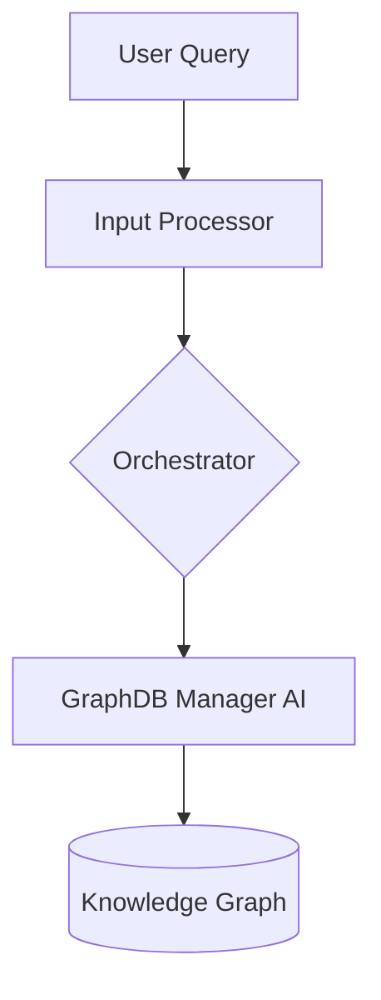

# Contributing to Project Myriad

First, thank you for considering contributing to Project Myriad! We welcome any contributions that help us improve and grow this biomimetic cognitive architecture.

This document provides guidelines for contributing to the project, with a focus on maintaining the quality and consistency of the code and documentation.

## How to Contribute

We encourage contributions in the form of pull requests and GitHub issues.

-   **Issues**: If you find a bug, have a feature request, or want to discuss a potential change, please open an issue. Provide as much detail as possible, including steps to reproduce for bugs.
-   **Pull Requests**: For code or documentation changes, please open a pull request. Ensure your PR is focused on a single change and follows the style guides below.

## Documentation Style Guide

Maintaining clear, professional, and consistent documentation is crucial for the project's success. All documentation, whether in the `README.md`, `doc/` folder, or in code comments, should adhere to the following style guide.

### 1. Tone and Language

The primary goal is to maintain a professional, technical, and objective tone.

-   **Be Neutral and Factual**: Describe the system's capabilities as they are. Avoid subjective or promotional language.
    -   **Instead of**: *"This revolutionary breakthrough is the world's first true biomimetic AI."*
    -   **Use**: *"The system implements biomimetic principles, such as neurogenesis, to dynamically create new agents."*
-   **Avoid Hype and Marketing Terms**: Do not use words like "revolutionary," "groundbreaking," "historic," "world's first," or "game-changing."
-   **No Emojis**: Do not use emojis in documentation files or technical diagrams.
-   **Clarity and Brevity**: Be clear and concise. Avoid jargon where possible, or explain it if necessary.

### 2. Document Structure

Each major documentation file has a specific purpose. When adding or updating information, ensure it is in the correct location.

-   `README.md`: The main entry point. Should contain a high-level overview, a summary of key features, the primary architecture diagram, and instructions for running the system.
-   `doc/ARCHITECTURE.md`: The detailed technical blueprint. Contains a deep dive into each component, process flows, and the architectural evolution path.
-   `doc/ROADMAP.md`: The long-term development plan. Outlines completed, in-progress, and future phases.
-   `doc/STATUS.md`: A snapshot of the current implementation status. Details completed components, performance metrics, and next steps.
-   `doc/PROTOCOLS.md`: The definitive source for all API endpoints, data payloads, and communication protocols.
-   `MISSING_COMPONENTS_ANALYSIS.md`: An internal-facing document for tracking progress against the initial roadmap and identifying remaining work.

### 3. Headings and Formatting

-   Use Markdown's hash-based headings (`#`, `##`, `###`, etc.) to structure documents.
-   Use bold (`**text**`) and italics (`*text*`) sparingly for emphasis.
-   Use backticks (`` ` ``) for inline code, filenames, and component names (e.g., `orchestrator.py`, `GraphDB Manager AI`).
-   Use triple-backtick code blocks for multi-line code snippets, specifying the language where appropriate (e.g., ` ```json `, ` ```python `).

### 4. Diagrams

All architectural and process flow diagrams must be created using **Mermaid.js**.

-   **Clarity over Complexity**: Diagrams should be easy to read and understand. Avoid overcrowding them with too much information.
-   **Consistency**: Use consistent naming and styling for components across all diagrams.
-   **Labels**: Use clear and concise labels. Use `\n` for line breaks in labels to keep the diagram clean.

**Example Mermaid Diagram:**


## Code Style Guide

-   **Python**: All Python code should follow the [PEP 8](https://www.python.org/dev/peps/pep-0008/) style guide.
-   **Comments**: Use comments to explain *why* something is done, not *what* is being done. The code itself should be clear enough to explain the "what."
-   **Docstrings**: All modules, classes, and functions should have clear and concise docstrings.

By following these guidelines, you help us keep Project Myriad well-documented, maintainable, and accessible to everyone. Thank you for your contribution!
