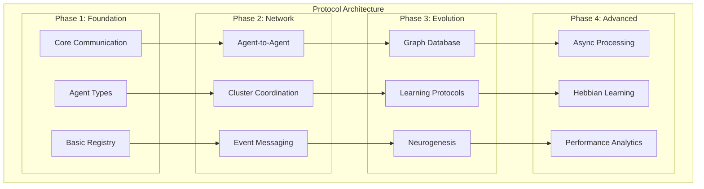

# Myriad Cognitive Architecture Communication Protocols

**Version**: 2.0  
**Based on**: [design and concept.md](design%20and%20concept.md) - Myriad Cognitive Architecture Blueprint  
**Last Updated**: 2024-01-01

This document defines the comprehensive communication protocols for the Myriad Cognitive Architecture, supporting evolution from basic MVP functionality through advanced biomimetic features.

## Table of Contents

1. [Architecture Overview](#architecture-overview)
2. [Protocol Evolution Phases](#protocol-evolution-phases)
3. [Phase 1: Foundation Protocols](#phase-1-foundation-protocols)
4. [Phase 2: Network Protocols](#phase-2-network-protocols)
5. [Phase 3: Evolution Protocols](#phase-3-evolution-protocols)
6. [Phase 4: Advanced Features](#phase-4-advanced-features)
7. [Implementation Guidelines](#implementation-guidelines)
8. [Migration Strategies](#migration-strategies)

---

## Architecture Overview

The Myriad Cognitive Architecture implements a decentralized network of hyper-specialized agents that collaborate to produce emergent intelligence. The protocols are designed to support the four core principles:

1. **Radical Specialization**: Each agent knows one thing perfectly
2. **Emergent Intelligence**: Complex answers from simple agent outputs
3. **Dynamic Growth**: Learning by creating new agents (neurogenesis)
4. **Efficiency**: Computational resource frugality



---

## Protocol Evolution Phases

### Phase Implementation Matrix

| Protocol Category | Phase 1 | Phase 2 | Phase 3 | Phase 4 |
|------------------|---------|---------|---------|---------|
| **Communication** | ✅ Basic REST | ⏳ Direct P2P | ⏳ Graph Routing | ⏳ Async Events |
| **Agent Types** | ✅ 4 Base Types | ⏳ Specialization | ⏳ Dynamic Creation | ⏳ Fine-tuning |
| **Registry** | ✅ Simple Lookup | ⏳ Clustering | ⏳ Graph Database | ⏳ Smart Discovery |
| **Learning** | ❌ Static | ❌ Static | ⏳ Hebbian Rules | ⏳ Continuous Adaptation |

**Legend**: ✅ Ready for Implementation | ⏳ Future Phase | ❌ Not Implemented

---

## Phase 1: Foundation Protocols

*Implements core architectural principles for MVP functionality*

### 1.1 Basic Communication Protocols (Current Implementation)

#### Processor-to-Orchestrator Protocol (The "Task List")

**Purpose**: Sent from Input Processor to Orchestrator  
**Format**:

```json
{
  "query_id": "xyz-123",
  "tasks": [
    { "task_id": 1, "intent": "define", "concept": "lightbulb", "args": {} },
    { "task_id": 2, "intent": "explain_limitation", "concept": "lightbulb", "args": {} }
  ]
}
```

**Fields**:

- `query_id`: Unique identifier for the query session
- `tasks`: Array of task objects to be distributed to agents
  - `task_id`: Sequential integer identifier for the task
  - `intent`: The action to be performed (e.g., "define", "explain_limitation")
  - `concept`: The subject matter (e.g., "lightbulb")
  - `args`: Additional parameters (currently empty object for MVP)

#### Orchestrator-to-Agent Protocol (The "Agent Job")

**Purpose**: Sent from Orchestrator to an Agent  
**Format**:

```json
{
  "task_id": 1,
  "intent": "define",
  "concept": "lightbulb",
  "args": { "detail_level": "high" }
}
```

**Fields**:

- `task_id`: The `task_id` from the original "Task List"
- `intent`: The specific action the agent should perform (e.g., "define", "explain_limitation")
- `concept`: The subject matter (e.g., "lightbulb")
- `args`: Additional parameters for the agent to perform the task (e.g., `{"detail_level": "high"}`)

#### Agent-to-Orchestrator Protocol (The "Agent Result")

**Purpose**: Sent from Agent back to Orchestrator  
**Format**:

```json
{
  "agent_name": "Lightbulb_Definition_AI",
  "status": "success",
  "data": "an electric device that produces light via an incandescent filament"
}
```

**Fields**:

- `agent_name`: The name of the responding agent
- `status`: Result status ("success" or "error")
- `data`: The agent's response data or error message

#### Orchestrator-to-OutputProcessor Protocol (The "Collected Results")

**Purpose**: Sent from Orchestrator to Output Processor (Synthesizer)  
**Format**:

```json
{
  "query_id": "xyz-123",
  "collected_results": {
    "1": { "agent_name": "Lightbulb_Definition_AI", "status": "success", "data": "an electric device..." },
    "2": { "agent_name": "Lightbulb_Function_AI", "status": "success", "data": "illuminates by converting..." }
  }
}
```

**Fields**:

- `query_id`: Unique identifier for the query session, same as in the "Task List"
- `collected_results`: An object where keys are `task_id` (as strings) and values are "Agent Result" objects.

### 1.2 Enhanced Input Processing Protocol

**Purpose**: Transform user queries into structured task lists for orchestration

**Protocol**: `Input Processor → Orchestrator`

```json
{
  "protocol_version": "1.0",
  "query_metadata": {
    "query_id": "q_20240101_001",
    "original_query": "Why was the lightbulb important for factories?",
    "timestamp": "2024-01-01T10:00:00Z",
    "user_context": {
      "session_id": "sess_123",
      "previous_queries": [],
      "preferred_detail_level": "standard"
    }
  },
  "parsed_query": {
    "primary_intent": "explain_importance",
    "concepts": ["lightbulb", "factories", "industrial_history"],
    "relationships": [
      {
        "type": "causal",
        "subject": "lightbulb",
        "object": "factory_productivity"
      }
    ],
    "complexity_score": 0.7,
    "estimated_agents_needed": 3
  },
  "task_list": [
    {
      "task_id": 1,
      "intent": "define",
      "concept": "lightbulb",
      "context": "industrial_application",
      "priority": 1,
      "dependencies": []
    },
    {
      "task_id": 2,
      "intent": "analyze_historical_context",
      "concept": "pre_electric_factories",
      "context": "working_conditions",
      "priority": 1,
      "dependencies": []
    },
    {
      "task_id": 3,
      "intent": "explain_impact",
      "concept": "electric_lighting_adoption",
      "context": "industrial_productivity",
      "priority": 2,
      "dependencies": [1, 2]
    }
  ]
}
```

### 1.3 Agent Type Protocols

#### Type A: Fact-Base Agent Protocol

**Purpose**: Agents that store and retrieve factual knowledge

**Protocol**: `Orchestrator → Fact-Base Agent`

```json
{
  "job_request": {
    "task_id": 1,
    "intent": "define",
    "concept": "lightbulb",
    "context": "industrial_application",
    "additional_params": {
      "detail_level": "standard",
      "focus_aspects": ["functionality", "historical_significance"],
      "exclude_aspects": ["manufacturing_process"]
    }
  },
  "agent_metadata": {
    "requesting_orchestrator": "main_orchestrator_001",
    "correlation_id": "q_20240101_001_t1",
    "timeout_ms": 5000
  }
}
```

**Response**: `Fact-Base Agent → Orchestrator`

```json
{
  "protocol_version": "1.0",
  "response_metadata": {
    "agent_id": "lightbulb_fact_001",
    "agent_type": "fact_base",
    "cluster_id": "industrial_technology",
    "processing_time_ms": 45,
    "correlation_id": "q_20240101_001_t1"
  },
  "response_data": {
    "status": "success",
    "confidence": 0.95,
    "primary_content": {
      "definition": "An electric light source that produces light through the heating of a filament until it glows",
      "key_attributes": [
        "electric_powered",
        "incandescent_technology",
        "replaceable_component",
        "standardized_fitting"
      ],
      "historical_context": "Commercially viable from 1879, revolutionized indoor lighting"
    },
    "supporting_data": {
      "sources": ["industrial_history_kb_v1.2", "technology_timeline_db"],
      "confidence_breakdown": {
        "fact_accuracy": 0.98,
        "relevance_to_context": 0.92,
        "completeness": 0.95
      },
      "reasoning_trace": [
        "Retrieved base definition from knowledge store",
        "Filtered for industrial application context",
        "Cross-referenced with historical timeline data"
      ]
    }
  },
  "collaboration_hints": {
    "related_concepts": ["electricity", "industrial_revolution", "productivity"],
    "suggest_collaborators": [
      {
        "agent_type": "function_executor",
        "concept": "productivity_analysis",
        "reason": "Can analyze impact on work efficiency"
      },
      {
        "agent_type": "pattern_matcher",
        "concept": "historical_trends",
        "reason": "Can identify broader industrial patterns"
      }
    ],
    "cross_reference_opportunities": [
      "working_hours_extension",
      "factory_shift_systems",
      "industrial_safety_improvements"
    ]
  }
}
```

#### Type B: Function-Executor Agent Protocol

**Purpose**: Agents that perform calculations, analyses, or transformations

**Protocol**: `Orchestrator → Function-Executor Agent`

```json
{
  "job_request": {
    "task_id": 2,
    "intent": "analyze_historical_context",
    "concept": "pre_electric_factories",
    "context": "working_conditions",
    "function_params": {
      "analysis_type": "comparative_study",
      "time_period": "1850-1880",
      "focus_metrics": ["working_hours", "productivity", "safety"],
      "comparison_baseline": "post_electric_adoption"
    }
  },
  "input_data": {
    "related_facts": ["limited_daylight_hours", "candle_gas_lighting", "fire_hazards"],
    "context_from_other_agents": []
  }
}
```

**Response**: `Function-Executor Agent → Orchestrator`

```json
{
  "protocol_version": "1.0",
  "response_metadata": {
    "agent_id": "historical_analysis_001",
    "agent_type": "function_executor",
    "cluster_id": "historical_analysis",
    "processing_time_ms": 150
  },
  "response_data": {
    "status": "success",
    "confidence": 0.88,
    "analysis_result": {
      "key_findings": [
        "Pre-electric factories limited to daylight hours (avg 8-10 hours)",
        "Candle/gas lighting created fire hazards and poor air quality",
        "Night shift work was dangerous and inefficient",
        "Productivity dropped 40-60% during low-light periods"
      ],
      "quantitative_data": {
        "average_working_hours_daylight": 9.5,
        "fire_incident_rate_per_month": 0.3,
        "productivity_index_low_light": 0.45
      },
      "transformation_applied": "historical_comparative_analysis",
      "methodology": "Statistical analysis of industrial records 1850-1880"
    },
    "supporting_data": {
      "data_sources": ["industrial_records_db", "safety_statistics_archive"],
      "calculation_details": {
        "sample_size": 847,
        "geographic_scope": "Northern England, Northeastern US",
        "reliability_score": 0.85
      }
    }
  },
  "collaboration_hints": {
    "output_useful_for": [
      "productivity_comparison_agents",
      "industrial_revolution_timeline_agents",
      "economic_impact_analysis_agents"
    ],
    "requires_synthesis_with": ["lightbulb_adoption_data", "factory_modernization_timeline"]
  }
}
```

#### Type C: Pattern-Matcher Agent Protocol

**Purpose**: Agents that classify, categorize, or identify patterns in data

**Protocol**: Similar structure with `"agent_type": "pattern_matcher"` and pattern-specific parameters

#### Type D: Micro-Generator Agent Protocol

**Purpose**: Agents that generate small pieces of content or explanations

**Protocol**: Similar structure with `"agent_type": "micro_generator"` and generation-specific parameters

### 1.4 System Management Protocols

#### Orchestrator-to-LifecycleManager Protocol (Agent Creation Request)

**Purpose**: Orchestrator requests `LifecycleManager` to create a new agent instance.  
**Format**:

```json
{
  "concept_name": "new_concept",
  "agent_type": "FactBase"
}
```

**Fields**:

- `concept_name`: The primary concept the new agent will handle.
- `agent_type`: The type or template of agent to create (e.g., "FactBase", "Calculator").

#### LifecycleManager-to-Orchestrator Protocol (Agent Creation Confirmation)

**Purpose**: `LifecycleManager` confirms agent creation and provides details.  
**Format**:

```json
{
  "agent_name": "NewConcept_AI",
  "status": "success",
  "endpoint": "http://new_concept_ai:5001/query"
}
```

**Fields**:

- `agent_name`: The assigned name of the newly created agent.
- `status`: Result status ("success" or "error").
- `endpoint`: The network endpoint where the new agent can be reached.

#### Orchestrator-to-AgentRegistry Protocol (Register Agent)

**Purpose**: Orchestrator requests `AgentRegistry` to register a new or updated agent's capabilities and endpoint.  
**Format**:

```json
{
  "agent_name": "NewConcept_AI",
  "concept": "new_concept",
  "intent_map": {
    "define": "/query",
    "explain_details": "/explain"
  },
  "endpoint": "http://new_concept_ai:5001"
}
```

**Fields**:

- `agent_name`: The name of the agent to register.
- `concept`: The primary concept the agent handles.
- `intent_map`: An object mapping intents the agent can handle to specific paths on its endpoint.
- `endpoint`: The base network endpoint of the agent.

### 1.5 Enhanced Orchestrator Registry Protocol

**Purpose**: Agent discovery, registration, and capability matching

**Agent Registration**: `Agent → Registry`

```json
{
  "registration_request": {
    "agent_metadata": {
      "agent_id": "lightbulb_fact_001",
      "agent_type": "fact_base",
      "version": "1.0.0",
      "deployment_url": "http://lightbulb-fact-service:5001",
      "health_check_endpoint": "/health"
    },
    "capabilities": {
      "primary_concept": "lightbulb",
      "supported_intents": ["define", "explain_properties", "historical_context"],
      "knowledge_domains": ["electrical_technology", "industrial_history"],
      "context_specializations": ["industrial_application", "consumer_use", "historical_development"]
    },
    "performance_characteristics": {
      "avg_response_time_ms": 45,
      "confidence_range": [0.85, 0.98],
      "knowledge_freshness": "2024-01-01",
      "max_concurrent_requests": 50
    },
    "cluster_preferences": {
      "preferred_cluster": "industrial_technology",
      "collaboration_affinities": ["productivity_analysis", "historical_trends"]
    }
  }
}
```

**Registry Response**: `Registry → Agent`

```json
{
  "registration_response": {
    "status": "success",
    "assigned_cluster": "industrial_technology",
    "agent_network_id": "inet_lightbulb_fact_001",
    "collaboration_opportunities": [
      {
        "agent_id": "factory_history_001",
        "synergy_score": 0.85,
        "common_concepts": ["industrial_revolution", "productivity"]
      }
    ],
    "performance_benchmarks": {
      "cluster_avg_response_time": 52,
      "cluster_avg_confidence": 0.91,
      "recommended_optimization": "response_time"
    }
  }
}
```

### 1.6 Output Synthesis Protocol

**Purpose**: Combine agent responses into coherent final answers

**Protocol**: `Orchestrator → Output Processor`

```json
{
  "synthesis_request": {
    "query_metadata": {
      "query_id": "q_20240101_001",
      "original_query": "Why was the lightbulb important for factories?",
      "synthesis_intent": "explain_importance"
    },
    "agent_responses": {
      "task_1": {
        "agent_id": "lightbulb_fact_001",
        "content": "Lightbulb definition and properties data...",
        "confidence": 0.95,
        "contribution_weight": 0.3
      },
      "task_2": {
        "agent_id": "historical_analysis_001", 
        "content": "Pre-electric factory analysis data...",
        "confidence": 0.88,
        "contribution_weight": 0.4
      },
      "task_3": {
        "agent_id": "impact_analysis_001",
        "content": "Industrial impact analysis data...",
        "confidence": 0.92,
        "contribution_weight": 0.3
      }
    },
    "synthesis_parameters": {
      "output_format": "explanatory_paragraph",
      "target_length": "medium",
      "evidence_level": "standard",
      "causal_chain_emphasis": true
    }
  }
}
```

### Protocol Notes

- All communication uses JSON format
- HTTP POST is the standard transport method
- Agents perform their cognitive reasoning internally before returning results
- The orchestrator is intentionally "dumb" - it only routes tasks and collects results
- Each agent specializes in specific intents and concepts

---

## Phase 2: Network Protocols

*Enables direct agent-to-agent communication and cluster coordination*

### 2.1 Agent-to-Agent Direct Communication

**Purpose**: Enable agents to communicate directly without orchestrator mediation

**Direct Query Protocol**: `Agent A → Agent B`

```json
{
  "direct_communication": {
    "protocol_version": "2.0",
    "communication_type": "peer_query",
    "source_agent": {
      "agent_id": "lightbulb_fact_001",
      "cluster_id": "industrial_technology"
    },
    "target_agent": {
      "agent_id": "factory_history_001",
      "cluster_id": "historical_analysis"
    },
    "query_context": {
      "original_user_query": "Why was the lightbulb important for factories?",
      "current_task": "building_historical_context",
      "collaboration_reason": "need_pre_electric_factory_conditions"
    },
    "specific_request": {
      "intent": "provide_context",
      "concept": "factory_working_conditions_1870s",
      "required_aspects": ["lighting_conditions", "working_hours", "productivity_limitations"],
      "response_format": "structured_facts"
    }
  }
}
```

**Direct Response Protocol**: `Agent B → Agent A`

```json
{
  "direct_response": {
    "protocol_version": "2.0", 
    "response_to": "lightbulb_fact_001",
    "collaboration_success": true,
    "contextual_data": {
      "factory_conditions_1870s": {
        "lighting": "primarily_daylight_candles_gas",
        "avg_working_hours": 9.5,
        "seasonal_variation": "30_percent_reduction_winter",
        "safety_incidents": "high_due_to_open_flames"
      },
      "productivity_impact": {
        "daylight_efficiency": 1.0,
        "artificial_light_efficiency": 0.45,
        "night_work_feasibility": "very_limited"
      }
    },
    "collaboration_metadata": {
      "response_confidence": 0.89,
      "data_freshness": "historical_archives_2023",
      "suggests_further_collaboration": [
        {
          "agent_id": "industrial_revolution_timeline_001",
          "reason": "can_provide_adoption_timeline"
        }
      ]
    }
  }
}
```

### 2.2 Cluster Coordination Protocol

**Purpose**: Manage agent clusters and optimize intra-cluster communication

**Cluster Formation**: `Registry → Cluster Manager`

```json
{
  "cluster_management": {
    "action": "form_cluster",
    "cluster_definition": {
      "cluster_id": "industrial_technology_v2",
      "concept_domain": "industrial_technology",
      "specialization_level": "detailed",
      "member_agents": [
        {
          "agent_id": "lightbulb_fact_001",
          "role": "primary_fact_provider",
          "specialization": "electric_lighting"
        },
        {
          "agent_id": "electricity_history_001", 
          "role": "contextual_support",
          "specialization": "electrical_development"
        },
        {
          "agent_id": "industrial_innovation_001",
          "role": "impact_analyzer", 
          "specialization": "technology_adoption"
        }
      ]
    },
    "coordination_rules": {
      "load_balancing": "round_robin_with_specialization_preference",
      "fallback_strategy": "cross_cluster_escalation",
      "performance_optimization": "cache_frequent_collaborations"
    }
  }
}
```

### 2.3 Event-Driven Messaging Protocol

**Purpose**: Asynchronous communication via message broker

**Event Publication**: `Agent → Event Broker`

```json
{
  "event_publication": {
    "event_type": "knowledge_update",
    "source_agent": "lightbulb_fact_001",
    "event_data": {
      "concept": "lightbulb",
      "update_type": "new_historical_context",
      "updated_knowledge": {
        "discovery": "Early factory adoption faster in textile industry",
        "evidence_quality": "high",
        "impact_on_queries": ["factory_productivity", "industrial_adoption_patterns"]
      }
    },
    "publication_metadata": {
      "timestamp": "2024-01-01T15:30:00Z",
      "relevance_topics": ["industrial_history", "technology_adoption"],
      "suggested_subscribers": ["factory_*", "industrial_*", "productivity_*"]
    }
  }
}
```

---

## Phase 3: Evolution Protocols

*Supports dynamic growth, learning, and graph-based intelligence*

### 3.1 Graph Database Schema

**Purpose**: Rich knowledge representation and traversal-based agent discovery

**Node Schema**: `Agent Nodes`

```json
{
  "node_type": "agent_node",
  "properties": {
    "agent_id": "lightbulb_fact_001",
    "agent_type": "fact_base",
    "concept_domain": "electrical_technology",
    "specialization_level": 0.85,
    "capabilities": ["define", "explain_properties", "historical_context"],
    "knowledge_depth": {
      "primary_concepts": ["lightbulb", "incandescent_lighting"],
      "secondary_concepts": ["electricity", "industrial_applications"],
      "tertiary_concepts": ["manufacturing", "innovation_adoption"]
    },
    "performance_metrics": {
      "avg_confidence": 0.94,
      "response_time_p95": 60,
      "collaboration_success_rate": 0.91,
      "query_satisfaction_score": 4.7
    },
    "learning_metadata": {
      "creation_date": "2024-01-01T00:00:00Z",
      "last_knowledge_update": "2024-01-01T12:00:00Z",
      "adaptation_count": 23,
      "neurogenesis_generation": 1
    }
  }
}
```

**Relationship Schema**: `Agent Collaboration Edges`

```json
{
  "relationship_type": "COLLABORATES_WITH",
  "source_node": "lightbulb_fact_001",
  "target_node": "factory_history_001", 
  "properties": {
    "collaboration_weight": 0.78,
    "activation_frequency": 47,
    "success_rate": 0.89,
    "hebbian_strength": 0.82,
    "collaboration_contexts": [
      "industrial_history_queries",
      "technology_impact_analysis",
      "productivity_studies"
    ],
    "performance_metrics": {
      "avg_combined_confidence": 0.91,
      "response_time_improvement": 0.23,
      "user_satisfaction_boost": 0.15
    },
    "learning_evolution": {
      "initial_weight": 0.1,
      "growth_rate": 0.68,
      "last_strengthening": "2024-01-01T14:45:00Z",
      "strengthening_trigger": "successful_collaboration"
    }
  }
}
```

**Graph Traversal Query Protocol**: `Orchestrator → Graph Database`

```json
{
  "graph_query": {
    "query_type": "find_optimal_agent_path",
    "start_concepts": ["lightbulb", "factories"],
    "target_intent": "explain_importance",
    "traversal_parameters": {
      "max_path_length": 4,
      "min_confidence_threshold": 0.7,
      "collaboration_weight_preference": 0.8,
      "avoid_overloaded_agents": true
    },
    "optimization_criteria": [
      "minimize_total_response_time",
      "maximize_combined_confidence",
      "prefer_proven_collaborations"
    ]
  }
}
```

### 3.2 Neurogenesis Protocol

**Purpose**: Dynamic agent creation when encountering unknown concepts

**Agent Creation Request**: `Lifecycle Manager → Agent Factory`

```json
{
  "neurogenesis_request": {
    "trigger_context": {
      "unknown_concept": "LED_lighting",
      "query_context": "Modern factory lighting comparison",
      "knowledge_gap": "no_agent_handles_LED_technology",
      "urgency_level": "medium"
    },
    "agent_specification": {
      "proposed_agent_type": "fact_base",
      "concept_specialization": "LED_lighting", 
      "knowledge_scope": {
        "primary_focus": "LED_technology_facts",
        "secondary_focus": ["energy_efficiency", "industrial_applications"],
        "knowledge_sources": ["LED_technical_specifications", "industrial_lighting_standards"]
      },
      "integration_cluster": "lighting_technology"
    },
    "scaffolding_requirements": {
      "initial_knowledge_base": "LED_basics_curated_dataset",
      "collaboration_bootstrapping": [
        {
          "mentor_agent": "lightbulb_fact_001",
          "knowledge_transfer": "lighting_fundamentals"
        },
        {
          "collaboration_partner": "energy_efficiency_001",
          "synergy_area": "power_consumption_analysis"
        }
      ]
    }
  }
}
```

**Agent Integration Protocol**: `New Agent → Network Integration`

```json
{
  "integration_protocol": {
    "new_agent_metadata": {
      "agent_id": "LED_lighting_fact_001",
      "generation": 2,
      "parent_agents": ["lightbulb_fact_001"],
      "knowledge_inheritance": ["lighting_principles", "industrial_applications"]
    },
    "network_integration": {
      "cluster_assignment": "lighting_technology_expanded",
      "initial_relationships": [
        {
          "target_agent": "lightbulb_fact_001",
          "relationship_type": "SPECIALIZATION_OF",
          "initial_weight": 0.6
        },
        {
          "target_agent": "energy_efficiency_001", 
          "relationship_type": "COLLABORATES_WITH",
          "initial_weight": 0.3
        }
      ]
    },
    "learning_initialization": {
      "bootstrap_training": "LED_knowledge_base_v1.0",
      "initial_confidence_baseline": 0.75,
      "learning_rate": 0.05,
      "collaboration_learning_enabled": true
    }
  }
}
```

### 3.3 Hebbian Learning Protocol

**Purpose**: Strengthen agent connections based on successful collaborations

**Learning Event**: `Collaboration Monitor → Learning Engine`

```json
{
  "hebbian_learning_event": {
    "collaboration_session": {
      "agents_involved": ["lightbulb_fact_001", "factory_history_001"],
      "query_context": "factory_lighting_importance",
      "collaboration_outcome": {
        "success": true,
        "user_satisfaction": 4.8,
        "response_accuracy": 0.93,
        "response_time": 145
      }
    },
    "learning_application": {
      "weight_adjustment": {
        "current_weight": 0.78,
        "adjustment_magnitude": 0.05,
        "new_weight": 0.83,
        "learning_rule": "hebbian_strengthening"
      },
      "activation_pattern_reinforcement": {
        "context_pattern": "industrial_history_queries",
        "pattern_strength_increase": 0.03,
        "pattern_specificity_improvement": 0.02
      }
    },
    "network_effects": {
      "indirect_weight_adjustments": [
        {
          "agent_pair": ["lightbulb_fact_001", "productivity_analysis_001"],
          "reason": "shared_collaboration_success",
          "weight_change": 0.01
        }
      ],
      "cluster_optimization": {
        "cluster_cohesion_improvement": 0.02,
        "inter_cluster_connection_strengthening": 0.01
      }
    }
  }
}
```

---

## Phase 4: Advanced Features

*Implements sophisticated biomimetic processing and continuous adaptation*

### 4.1 Asynchronous Processing Protocol

**Purpose**: Non-blocking, parallel agent activation for complex queries

**Async Orchestration**: `Orchestrator → Agent Network`

```json
{
  "async_orchestration": {
    "orchestration_session": {
      "session_id": "async_session_001",
      "query_complexity": "high",
      "estimated_agents": 8,
      "parallel_tracks": 3
    },
    "activation_plan": {
      "immediate_activations": [
        {
          "agent_id": "lightbulb_fact_001",
          "task_priority": 1,
          "expected_response_time": 50,
          "callback_endpoint": "/async/results/task1"
        },
        {
          "agent_id": "factory_history_001",
          "task_priority": 1, 
          "expected_response_time": 120,
          "callback_endpoint": "/async/results/task2"
        }
      ],
      "dependent_activations": [
        {
          "agent_id": "impact_synthesis_001",
          "dependencies": ["task1", "task2"],
          "activation_trigger": "all_dependencies_complete",
          "callback_endpoint": "/async/results/synthesis"
        }
      ]
    },
    "aggregation_strategy": {
      "partial_result_handling": "progressive_synthesis",
      "timeout_handling": "graceful_degradation",
      "error_recovery": "alternative_agent_activation"
    }
  }
}
```

### 4.2 Continuous Learning Protocol

**Purpose**: Real-time adaptation based on user feedback and performance

**Performance Feedback**: `User Interface → Learning Engine`

```json
{
  "continuous_learning_feedback": {
    "feedback_session": {
      "query_id": "q_20240101_001",
      "user_satisfaction": 4.2,
      "specific_feedback": {
        "accuracy_rating": 4.5,
        "completeness_rating": 3.8,
        "clarity_rating": 4.3,
        "response_time_satisfaction": 4.0
      },
      "detailed_comments": "Good historical context, but missing modern comparison"
    },
    "performance_analysis": {
      "agent_contributions": [
        {
          "agent_id": "lightbulb_fact_001",
          "contribution_quality": 4.5,
          "improvement_suggestions": ["add_modern_comparison_capability"]
        },
        {
          "agent_id": "factory_history_001",
          "contribution_quality": 4.0,
          "improvement_suggestions": ["increase_detail_level"]
        }
      ]
    },
    "learning_actions": {
      "agent_fine_tuning": [
        {
          "agent_id": "lightbulb_fact_001",
          "learning_objective": "expand_comparative_knowledge",
          "training_data": "modern_lighting_comparison_dataset",
          "learning_intensity": "light_adjustment"
        }
      ],
      "network_optimization": [
        {
          "action": "suggest_new_collaboration",
          "agents": ["lightbulb_fact_001", "modern_lighting_tech_001"],
          "reason": "fill_knowledge_gap_modern_comparison"
        }
      ]
    }
  }
}
```

### 4.3 Performance Analytics Protocol

**Purpose**: System monitoring, optimization, and health management

**System Health Report**: `Performance Monitor → System Dashboard`

```json
{
  "system_analytics": {
    "report_timestamp": "2024-01-01T16:00:00Z",
    "network_health": {
      "total_agents": 247,
      "active_agents": 239,
      "cluster_count": 23,
      "avg_cluster_size": 10.4,
      "network_connectivity": 0.87
    },
    "performance_metrics": {
      "avg_query_response_time": 1.2,
      "user_satisfaction_avg": 4.3,
      "system_accuracy": 0.91,
      "agent_utilization": 0.73,
      "collaboration_success_rate": 0.89
    },
    "learning_progress": {
      "new_agents_created_24h": 3,
      "agent_improvements_24h": 47,
      "network_weight_changes": 156,
      "knowledge_base_updates": 23
    },
    "optimization_recommendations": [
      {
        "category": "performance",
        "recommendation": "add_caching_layer_frequent_collaborations",
        "expected_improvement": "15_percent_response_time_reduction"
      },
      {
        "category": "coverage",
        "recommendation": "create_agents_for_underserved_concepts",
        "target_concepts": ["renewable_energy", "smart_manufacturing"]
      }
    ]
  }
}
```

---

## Implementation Guidelines

### Protocol Versioning

- **Version Format**: `major.minor.patch` (e.g., `2.1.0`)
- **Backward Compatibility**: Maintain support for previous major version
- **Migration Path**: Gradual phase-in with dual protocol support

### Error Handling

```json
{
  "error_response": {
    "status": "error",
    "error_code": "AGENT_UNAVAILABLE",
    "error_message": "Target agent temporarily unavailable",
    "retry_suggested": true,
    "retry_delay_ms": 5000,
    "alternative_agents": ["backup_agent_001", "cluster_fallback_002"],
    "degraded_service_options": {
      "cached_response": "available",
      "partial_response": "possible",
      "estimated_accuracy": 0.75
    }
  }
}
```

### Security Considerations

- **Authentication**: Agent-to-agent JWT tokens
- **Authorization**: Capability-based access control
- **Data Privacy**: Encrypt sensitive context information
- **Rate Limiting**: Per-agent request throttling

### Performance Optimization

- **Caching Strategy**: Frequent collaboration results
- **Connection Pooling**: Persistent agent connections
- **Load Balancing**: Cluster-aware request distribution
- **Circuit Breakers**: Automatic failure isolation

---

## Migration Strategies

### Phase 1 → Phase 2 Migration

1. **Dual Protocol Support**: Run both old and new protocols simultaneously
2. **Gradual Agent Updates**: Update agents to support agent-to-agent communication
3. **Registry Enhancement**: Extend registry with clustering capabilities
4. **Testing Strategy**: A/B testing with protocol comparison

### Phase 2 → Phase 3 Migration

1. **Graph Database Setup**: Parallel graph DB with relationship import
2. **Learning Engine Deployment**: Background learning system activation
3. **Neurogenesis Testing**: Controlled agent creation in sandbox environment
4. **Network Migration**: Gradual transition from simple to graph-based routing

### Phase 3 → Phase 4 Migration

1. **Async Infrastructure**: Message broker and async processing setup
2. **Performance Monitoring**: Advanced analytics and feedback systems
3. **Continuous Learning Activation**: Real-time adaptation mechanisms
4. **Full Network Optimization**: Complete biomimetic feature activation

---

## JSON Schema Validation

All protocols include JSON schema validation to ensure message integrity and compatibility across phases. Schemas are available in the `/schemas` directory and versioned alongside protocol specifications.

---

**This comprehensive protocol specification supports the full evolution of the Myriad Cognitive Architecture from basic MVP functionality through advanced biomimetic intelligence, maintaining alignment with the core architectural principles while enabling sophisticated emergent behavior.**
