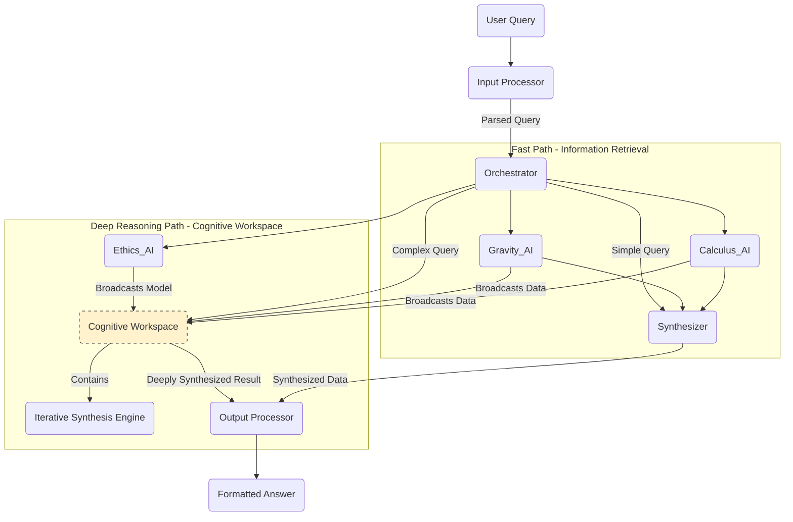

# Myriad Cognitive Architecture - C#/.NET Edition

**A decentralized, emergent AI system built from a network of hyper-specialized, minimalist agents.**

**Implementation**: C# 10+ / .NET 6.0+ with **zero external dependencies** - all components built from scratch.

This project explores a departure from monolithic AI models. Instead of a single, all-kwing entity, intelligence emerges from the collaboration of countless, computationally inexpensive agents, each an expert in a single, narrow domain.

## 📋 Documentation Index

**Getting Started:**

- 🏗️ [Architecture Overview](architecture/system-overview-csharp.md) - Complete system architecture
- 🧠 [Core Philosophy](architecture/core-philosophy.md) - Design principles and biological inspiration
- 🗺️ [Development Roadmap](roadmap.md) - Implementation phases and tasks

**Architecture Deep Dives:**

- 🔷 [Graph Intelligence](architecture/graph-intelligence-csharp.md) - Custom graph database and Hebbian learning
- 🔧 [Microservices](architecture/microservices-csharp.md) - Service catalog and communication patterns
- 🌱 [Neurogenesis Systems](architecture/neurogenesis-csharp.md) - Dynamic agent creation and autonomous learning

**Design Documents:**

- 📐 [Design & Concept](design%20and%20concept.md) - Complete architectural blueprint

## Core Concept

The Myriad architecture is inspired by neurobiology. Each "Myriad Agent" is like a neuron—a simple, specialized unit of knowledge or function. Complex reasoning isn't performed by any single agent; it's an **emergent property** of the network.

- **Radical Specialization:** An agent for "the concept of gravity" only knows about gravity.
- **Emergent Intelligence:** Complex answers are synthesized from the simple outputs of many collaborating agents.
- **Dynamic Growth ("Neurogenesis"):** The system learns by creating and integrating new agents, not by retraining a massive model.
- **Dual-Path Processing:** Simple queries use a fast retrieval path; complex queries activate a Cognitive Workspace for deep reasoning inspired by Global Workspace Theory.

## High-Level Architecture

The system routes a user query to a network of agents, synthesizes their responses, and generates a final answer.



## Key Components (C# Implementation)

- **Input Processor Service** - ASP.NET Core service that deconstructs natural language queries, detects complexity, and determines processing path using custom C# algorithms (no external NLP libraries).
- **Orchestrator Service** - The central nervous system (ASP.NET Core). Routes queries through Fast Path (simple retrieval) or Deep Reasoning Path (Cognitive Workspace) based on complexity.
- **Cognitive Workspace** - Ephemeral deep reasoning environment inspired by Global Workspace Theory. Provides intensive synthesis for complex queries through pattern recognition, causal analysis, and iterative refinement.
- **Myriad Agents** - The heart of the system. Independent ASP.NET Core microservices, each embodying a single concept. Built using Minimal APIs with hardcoded knowledge in C# `Dictionary` structures.
- **Output Processor Service** - Receives data packets from agents (from either path) and assembles them using LINQ and string interpolation into coherent, human-readable answers.
- **Custom Graph Database** - Built from scratch using `ConcurrentDictionary` and custom traversal algorithms. No external database dependencies.
- **Dynamic Lifecycle Manager** - Module responsible for "neurogenesis"—creating, compiling, and deploying new C# agents on the fly using Roslyn and Docker SDK for .NET.

## Development Status & Vision

**Current Status**: Architecture Definition Phase (Documentation Complete)

The project follows a detailed roadmap to build an initial MVP using C# and .NET, followed by a phased evolution towards a more powerful, decentralized, and brain-like system.

**Target Query for MVP:** `"Why was the lightbulb important for factories?"`

This will be answered by orchestrating two minimalist C# agents:

1. **Lightbulb_AI** - ASP.NET Core Minimal API service with facts about lightbulbs (Port 5001)
2. **Factory_AI** - ASP.NET Core Minimal API service with facts about pre-electrical factories (Port 5002)

**Technology Stack:**

- **Language**: C# 10+
- **Framework**: ASP.NET Core 6.0+ / .NET 6.0+
- **Deployment**: .NET Self-Contained Deployment + Custom Packaging
- **Orchestration**: Custom Process Management (built from scratch)
- **External Dependencies**: ZERO (everything built from scratch, .NET only)

For a detailed breakdown of the development plan, see the [**MVP Development Roadmap**](./roadmap.md).

For the complete architectural blueprint and the project's long-term evolutionary vision, see the [**Architectural Blueprint**](./design%20and%20concept.md) and the [**Architecture Documentation**](./architecture/).

## How to Run the MVP (Planned)

*(This section will be completed as per Task 3.3.5 in the roadmap. Current status: Architecture & Documentation Phase)*

### Prerequisites

- **.NET SDK 8.0 or later** - [Download](https://dotnet.microsoft.com/download)
- **Git** - For version control
- **Windows/Linux/macOS** - Cross-platform support via .NET

### Setup (Planned Implementation)

```bash
# Clone the repository
git clone https://github.com/your-username/myriad-csharp.git
cd myriad-csharp

# Restore and build the solution
dotnet restore
dotnet build

# Publish self-contained deployments for all services
dotnet publish -c Release --self-contained -r win-x64
# or for Linux: -r linux-x64
# or for macOS: -r osx-x64
```

### Run the System (Planned)

```bash
# Start all microservices using custom process orchestrator
# (Custom launcher built from scratch - no Docker dependency)

# Run the orchestrator launcher
cd src/Myriad.Orchestrator.Launcher
dotnet run

# The system will start all services:
# - Orchestrator Service (Port 5000)
# - GraphDB Manager Service (Port 5008)
# - Lightbulb_AI Agent (Port 5001)
# - Factory_AI Agent (Port 5002)
# - Input Processor Service (Port 5003)
# - Output Processor Service (Port 5004)

# Send a test query
curl -X POST http://localhost:5000/process \
  -H "Content-Type: application/json" \
  -d '{"query": "Why was the lightbulb important for factories?"}'
```

### Development

```bash
# Run a specific service locally
cd src/Myriad.Services.Orchestrator
dotnet run

# Run tests
dotnet test

# Watch mode for development
dotnet watch run
```

## Zero External Dependencies Philosophy

This project is built **entirely from scratch in C#** without using any third-party NuGet packages (except the .NET SDK itself). This means:

✅ **Custom Graph Database** - Built using `ConcurrentDictionary` and custom algorithms
✅ **Custom JSON Parser** - Built from scratch, no external JSON libraries
✅ **Custom HTTP Client Wrapper** - Built on `HttpClient` with custom retry logic
✅ **Custom Circuit Breaker** - Resilience patterns implemented from scratch
✅ **Custom Message Queue** (Future) - TCP/IP based, no RabbitMQ/Kafka
✅ **Custom Process Orchestrator** - Multi-service launcher, no Docker/containers
✅ **Custom Packaging** - Self-contained .NET deployments with custom packaging format

**Why?** This approach provides:

- Complete control over all behavior
- Deep understanding of every component
- No hidden dependencies or security vulnerabilities
- Educational value for learning system architecture
- Customization tailored to exact requirements

## Project Structure (Planned)

```
myriad-csharp/
├── src/
│   ├── Myriad.Services.Orchestrator/      # Central coordination service
│   ├── Myriad.Services.GraphDatabase/     # Custom graph DB service
│   ├── Myriad.Services.InputProcessor/    # Query parsing service
│   ├── Myriad.Services.OutputProcessor/   # Response synthesis service
│   ├── Myriad.Agents.Static/              # Static agent implementations
│   │   ├── LightbulbAgent/
│   │   └── FactoryAgent/
│   ├── Myriad.Core.Graph/                 # Custom graph database library
│   ├── Myriad.Core.Intelligence/          # Enhanced graph intelligence
│   ├── Myriad.Core.Lifecycle/             # Dynamic lifecycle manager
│   ├── Myriad.Core.Learning/              # Autonomous learning engine
│   └── Myriad.Common/                     # Shared types and interfaces
├── tests/
│   ├── Myriad.Tests.Unit/
│   └── Myriad.Tests.Integration/
├── architecture/                           # Comprehensive documentation
│   ├── core-philosophy.md
│   ├── system-overview-csharp.md
│   ├── graph-intelligence-csharp.md
│   ├── microservices-csharp.md
│   └── neurogenesis-csharp.md
├── design and concept.md                   # Architectural blueprint
├── roadmap.md                              # Development roadmap
├── launcher.config.json                    # Service orchestration config
├── Myriad.sln                             # Solution file
└── README.md                              # This file
```

## Contributing

This is an architecture definition and educational project. Contributions focusing on implementing the C# architecture from scratch (without external dependencies) are welcome.

## License

[Specify your license here]

## Learn More

- 📚 [Complete Architecture Documentation](./architecture/)
- 🗺️ [Development Roadmap](./roadmap.md)
- 📐 [Design & Concept Document](./design%20and%20concept.md)
