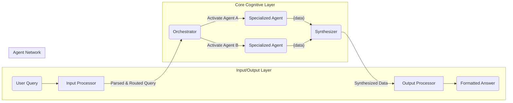

# Project Myriad: A Myriad Cognitive Architecture

**A decentralized, emergent AI system built from a network of hyper-specialized, minimalist agents.**

This project explores a departure from monolithic AI models. Instead of a single, all-knowing entity, intelligence emerges from the collaboration of countless, computationally inexpensive agents, each an expert in a single, narrow domain.

## Core Concept

The Myriad architecture is inspired by neurobiology. Each "Myriad Agent" is like a neuron—a simple, specialized unit of knowledge or function. Complex reasoning isn't performed by any single agent; it's an **emergent property** of the network.

-   **Radical Specialization:** An agent for "the concept of gravity" only knows about gravity.
-   **Emergent Intelligence:** Complex answers are synthesized from the simple outputs of many collaborating agents.
-   **Dynamic Growth ("Neurogenesis"):** The system learns by creating and integrating new agents, not by retraining a massive model.

## High-Level Architecture

The system routes a user query to a network of agents, synthesizes their responses, and generates a final answer.



## Key Components

-   **Input Processor:** Deconstructs the user's natural language query into keywords and intent for the system.
-   **Orchestrator:** The central nervous system. It is **intentionally unintelligent**. It receives keywords, looks up the required agents in the `Agent Registry`, and dispatches requests to them.
-   **Myriad Agents:** The heart of the system. These are independent microservices, each embodying a single concept. For the MVP, they are simple Flask apps with hardcoded knowledge.
-   **Output Processor / Synthesizer:** Receives data packets from the agents and assembles them into a single, coherent, human-readable answer based on the original query's intent.
-   **Lifecycle Manager (Future Goal):** The module responsible for "neurogenesis"—creating, registering, and populating new agents on the fly when the system encounters a novel concept.

## Development Status & Vision

The project is currently following a detailed roadmap to build an initial MVP, followed by a phased evolution towards a more powerful, decentralized, and brain-like system.

**Target Query for MVP:** `"Why was the lightbulb important for factories?"`

This will be answered by orchestrating two minimalist agents:
1.  `Lightbulb_AI`: Knows facts about the lightbulb.
2.  `Factory_AI`: Knows facts about pre-electrical factories.

For a detailed breakdown of the development plan, see the [**MVP Development Roadmap (roadmap.md)**](./roadmap.md).

For the complete architectural blueprint and the project's long-term evolutionary vision, see the [**Architectural Blueprint (design and concept.md)**](./design%20and%20concept.md).

## How to Run the MVP

*(This section will be completed as per Task 3.3.5 in the roadmap).*

1.  **Prerequisites:**
    -   Docker
    -   Python 3.9+

2.  **Setup:**
    ```bash
    # Clone the repository
    git clone https://github.com/your-username/myriad.git
    cd myriad

    # Create and activate a virtual environment
    python -m venv venv
    source venv/bin/activate

    # Install dependencies
    pip install -r requirements.txt
    ```

3.  **Run the System:**
    ```bash
    # (Instructions to launch agent containers and run the main script will go here)
    ```