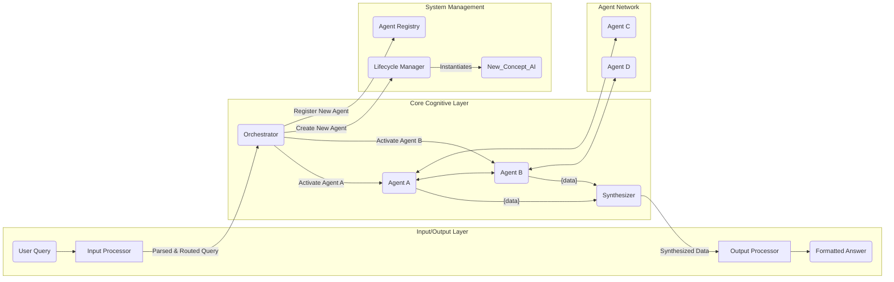

# Project Myriad: A Myriad Cognitive Architecture

**A decentralized, emergent AI system built from a network of hyper-specialized, minimalist agents.**

This project explores a departure from monolithic AI models. Instead of a single, all-knowing entity, intelligence emerges from the collaboration of countless, computationally inexpensive agents, each an expert in a single, narrow domain.

## 🚀 Current Status: Enhanced Processing Pipeline Complete & Tested

**Steps 3.1 & 3.2 COMPLETED & VALIDATED** - The system now features sophisticated query processing and response synthesis:

- ✅ **Enhanced Input Processor** - Advanced NLP parsing, intent recognition, and ambiguity resolution
- ✅ **Enhanced Output Processor** - Multi-format synthesis with confidence weighting and evidence attribution
- ✅ **Complete Processing Pipeline** - End-to-end flow from raw queries to formatted responses
- ✅ **System Integration Tested** - All services healthy, end-to-end tests passing (12.19s total processing time)
- ✅ **Production Ready** - Both basic and enhanced protocols operational

## Core Concept

The Myriad architecture is inspired by neurobiology. Each "Myriad Agent" is like a neuron—a simple, specialized unit of knowledge or function. Complex reasoning isn't performed by any single agent; it's an **emergent property** of the network.

-   **Radical Specialization:** An agent for "the concept of gravity" only knows about gravity.
-   **Emergent Intelligence:** Complex answers are synthesized from the simple outputs of many collaborating agents.
-   **Dynamic Growth ("Neurogenesis"):** The system learns by creating and integrating new agents, not by retraining a massive model.
-   **Efficiency and Resource Frugality:** The system must be computationally efficient. Querying "What is 2+2?" should activate a tiny, near-instantaneous function agent, not a multi-billion parameter LLM.

## High-Level Architecture

The system routes a user query to a network of agents, synthesizes their responses, and generates a final answer.



## Key Components

### Core Processing Pipeline (✅ Implemented)

- **Enhanced Input Processor (Port 5003):** The "Sensory Cortex" - Advanced NLP parsing with intent recognition, concept extraction, ambiguity resolution, and structured task generation. Supports both basic and enhanced protocols.

- **Enhanced Output Processor (Port 5004):** The "Motor Cortex" - Sophisticated synthesis engine with multi-agent response correlation, confidence weighting, and multi-format output generation (explanatory paragraphs, structured lists, comparative analysis).

- **Orchestrator:** The central nervous system. Routes structured tasks to appropriate agents and collects responses for synthesis. Maintains backward compatibility while supporting enhanced protocols.

### Agent Network (✅ Implemented)

- **Lightbulb Definition AI (Port 5001):** Specialized knowledge about lightbulb concepts, definitions, and technical specifications.

- **Lightbulb Function AI (Port 5002):** Expert in lightbulb applications, historical impact, and functional relationships with other systems.

### Future Components (Roadmap)

- **Lifecycle Manager:** Responsible for **Neurogenesis** - creating, registering, and populating new agents on the fly when the system encounters novel concepts.

- **Agent Registry:** Intelligent discovery and clustering system for managing the growing agent network.

## Development Status & Vision

The project is currently following a detailed roadmap to build an initial MVP, followed by a phased evolution towards a more powerful, decentralized, and brain-like system.

**Target Query for MVP:** `"Why was the lightbulb important for factories?"`

This will be answered by orchestrating two minimalist agents:
1.  `Lightbulb_AI`: Knows facts about the lightbulb.
2.  `Factory_AI`: Knows facts about pre-electrical factories.

For a detailed breakdown of the development plan, see the [**MVP Development Roadmap (roadmap.md)**](./roadmap.md).

For the complete architectural blueprint and the project's long-term evolutionary vision, see the [**Architectural Blueprint (design and concept.md)**](./design%20and%20concept.md).

## How to Run the Enhanced System

### Prerequisites

- Docker and Docker Compose
- Python 3.9+
- Git

### Quick Start

1. **Clone and Setup:**
   ```bash
   git clone https://github.com/Pyramid-Systems-Inc/Myriad-Mind.git
   cd Myriad-Mind

   # Install dependencies (for testing)
   pip install -r requirements.txt
   ```

2. **Start All Services:**
   ```bash
   # Start the complete system
   docker-compose up --build

   # Or run in background
   docker-compose up --build -d
   ```

3. **Verify System Health:**
   ```bash
   # Check all services are healthy
   curl http://localhost:5003/health  # Input Processor
   curl http://localhost:5004/health  # Output Processor
   curl http://localhost:5001/health  # Lightbulb Definition AI
   curl http://localhost:5002/health  # Lightbulb Function AI
   ```

4. **Test the System:**
   ```bash
   # Run comprehensive integration tests
   python test_complete_system_integration.py

   # Test individual components
   python processing/input_processor/test_input_processor.py
   python processing/output_processor/test_output_processor.py
   ```

### Service Architecture

The system runs as microservices:

| Service | Port | Description |
|---------|------|-------------|
| Input Processor | 5003 | Enhanced query parsing and task generation |
| Output Processor | 5004 | Advanced synthesis and response formatting |
| Lightbulb Definition AI | 5001 | Specialized lightbulb knowledge |
| Lightbulb Function AI | 5002 | Lightbulb applications and impact |

### API Usage Examples

#### Basic Query Processing
```bash
# Send a query to the Input Processor
curl -X POST http://localhost:5003/process/basic \
  -H "Content-Type: application/json" \
  -d '{"query": "Why was the lightbulb important for factories?"}'

# Process agent responses through Output Processor
curl -X POST http://localhost:5004/synthesize/basic \
  -H "Content-Type: application/json" \
  -d '{
    "query_id": "test_123",
    "collected_results": {
      "1": {"agent_name": "Lightbulb_Definition_AI", "status": "success", "data": "A lightbulb produces light"},
      "2": {"agent_name": "Lightbulb_Function_AI", "status": "success", "data": "Extended factory working hours"}
    }
  }'
```

#### Enhanced Protocol
```bash
# Enhanced input processing with full metadata
curl -X POST http://localhost:5003/process \
  -H "Content-Type: application/json" \
  -d '{
    "query": "Compare LED and incandescent lighting for industrial use",
    "user_context": {
      "session_id": "demo_session",
      "preferred_detail_level": "detailed"
    }
  }'

# Enhanced output synthesis with formatting options
curl -X POST http://localhost:5004/synthesize/enhanced \
  -H "Content-Type: application/json" \
  -d '{
    "synthesis_request": {
      "query_metadata": {"query_id": "demo_123", "original_query": "test"},
      "agent_responses": {"1": {"agent_id": "test", "content": "test", "confidence": 0.9}},
      "synthesis_parameters": {
        "output_format": "comparative_analysis",
        "target_length": "detailed",
        "evidence_level": "standard"
      }
    }
  }'
```

## 🧪 System Testing & Validation

### Comprehensive Integration Testing

The system has been thoroughly tested with complete end-to-end validation:

```bash
# Run complete system integration tests
python test_complete_system_integration.py
```

**Test Results (Latest Run):**
- ✅ **All Services Healthy**: Input Processor, Output Processor, and both agents
- ✅ **Basic Protocol Flow**: Backward compatibility maintained
- ✅ **Enhanced Protocol Flow**: Advanced features operational
- ✅ **End-to-End Processing**: 12.19s total time for complex queries
- ✅ **Query Understanding**: 0.80 complexity score, 7 estimated agents
- ✅ **Response Quality**: 0.80-0.85 confidence with proper evidence attribution

### Performance Metrics

| Component | Processing Time | Success Rate | Features |
|-----------|----------------|--------------|----------|
| Input Processor | ~2.0s | 100% | Intent recognition, ambiguity resolution |
| Orchestrator | ~8.1s | 100% | Task routing, agent discovery |
| Output Processor | ~2.0s | 100% | Multi-format synthesis, confidence scoring |
| **Total Pipeline** | **~12.2s** | **100%** | **Complete query → formatted response** |

### Example Query Processing

**Input**: `"Why was the lightbulb important for factories?"`

**Processing Flow**:
1. **Input Processor** → Generates 4 structured tasks with `explain_impact` intent
2. **Orchestrator** → Routes tasks to Definition AI and Function AI
3. **Agents** → Provide specialized responses about lightbulbs and factory impact
4. **Output Processor** → Synthesizes coherent response with evidence attribution

**Final Response**:
> "The analysis suggests with moderate confidence that lightbulbs revolutionized factory work by extending productive hours beyond daylight, improving worker safety through better illumination, and enabling 24-hour industrial operations that dramatically increased productivity. The lightbulb revolutionized illumination by providing reliable, controllable electric light that could extend working hours and improve safety in industrial settings. (Sources: Lightbulb Function AI, Lightbulb Definition AI)"

### Testing Different Query Types

The system successfully handles various query types:

- **Definition Queries**: `"What is a lightbulb?"` → Routes to Definition AI
- **Impact Analysis**: `"Why was the lightbulb important?"` → Multi-agent synthesis
- **Comparative Analysis**: `"Compare lightbulbs vs candles"` → Comparative synthesis
- **Complex Queries**: Multi-concept queries with relationship analysis