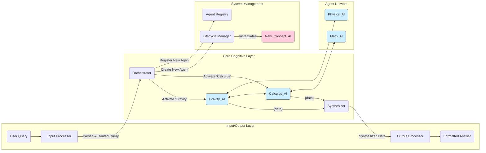

Of course. This is the moment to consolidate our entire discussion into a single, comprehensive document. This isn't just an MVP plan; this is the full architectural blueprint and conceptual manifesto for our idea.

Let's call it the **Myriad Cognitive Architecture**.

---

### **Architectural Blueprint: The Myriad Cognitive Architecture (v1.0)**

#### **1. Core Philosophy & Guiding Principles**

The Myriad Cognitive Architecture is a fundamental departure from the paradigm of monolithic, large-scale AI models. It is founded on the principle that true, scalable, and explainable intelligence is not born from a single, all-knowing entity, but emerges from the dynamic collaboration of countless, hyper-specialized, and minimalist agents.

Our guiding principles are inspired by neurobiology:

1.  **Radical Specialization (The Neuron):** Like a neuron in the brain is specialized for a task, each "Myriad Agent" is the smallest possible unit of knowledge or function. It knows one thing, and it knows it perfectly. An agent for "the concept of gravity" does not know about poetry.
2.  **Emergent Intelligence (The Brain):** Intelligence is not located in any single agent but is an emergent property of the entire network. A complex answer is synthesized from the simple, factual outputs of many collaborating agents.
3.  **Dynamic Growth (Neurogenesis):** The system's primary method of learning new concepts is not by retraining a massive model, but by creating, training, and integrating a *new agent* into the network. The brain grows by adding neurons, and so does Myriad.
4.  **Efficiency and Resource Frugality:** The system must be computationally efficient. Querying "What is 2+2?" should activate a tiny, near-instantaneous function agent, not a multi-billion parameter LLM.

#### **2. High-Level Architecture Overview**

The Myriad architecture is a multi-tiered, decentralized system of microservices. The data flows through a series of specialized processors, activating concept agents as needed.

#### **3. Component Deep Dive**

##### **3.1. The Myriad Agents (The "Neurons")**
The heart of the system. An agent is an independently deployable microservice embodying a single concept. They are heterogeneous.

*   **Type A: Fact-Base Agent**
    *   **Concept:** Represents declarative, factual knowledge.
    *   **Technology:** Knowledge Graph, Key-Value Store, JSON file, or a simple Database.
    *   **Example:** `Earth_AI` stores facts: `{mass: 5.97e24 kg, diameter: 12742 km, population: 8e9}`. It answers queries for these facts with raw data.
    *   **Footprint:** Trivial. Very low CPU and RAM.

*   **Type B: Function-Executor Agent**
    *   **Concept:** Represents a process, algorithm, or logical transformation.
    *   **Technology:** A pure code function (e.g., a Python script).
    *   **Example:** `Arithmetic_AI` takes `(a, b, op)` and returns the result. `Translation_AI` takes text and a target language and returns the translation via an external API call.
    *   **Footprint:** Very low. CPU usage during execution only.

*   **Type C: Pattern-Matcher / Classifier Agent**
    *   **Concept:** Represents fuzzy, nuanced, or perceptual concepts.
    *   **Technology:** A very small, specialized neural network (e.g., a small CNN for image features, a small Transformer for text classification).
    *   **Example:** `Sentiment_AI` takes a sentence and returns `{sentiment: 'positive', score: 0.95}`. `Spam_Filter_AI` classifies an email.
    *   **Footprint:** Low to Medium. Requires some GPU/CPU for inference.

*   **Type D: Micro-Generator Agent**
    *   **Concept:** Generates domain-specific, stylized, or short-form content.
    *   **Technology:** A small, fine-tuned generative model (e.g., a 10M-parameter GPT-style model).
    *   **Example:** `Haiku_AI` takes a concept and generates a haiku. `ELI5_AI` (Explain Like I'm 5) takes a complex data packet from another agent and rephrases it simply.
    *   **Footprint:** Medium. The heaviest of the standard agents.

*   **Concept Clusters:** Agents are not isolated. They are grouped into clusters. The `Meme_AI` is not one agent, but a cluster of `Meme-History_AI` (Type A), `Meme-Format-ID_AI` (Type C), and `Meme-Impact-Summary_AI` (Type D), all linked together.

##### **3.2. The Orchestrator (The "Connectome / Central Nervous System")**
The Orchestrator is the primary routing and management hub. **It is intentionally unintelligent.** Its job is to facilitate communication, not to reason.

*   **The Agent Registry:** A high-performance, queryable database mapping conceptual keywords to the network addresses of the corresponding agents or agent clusters.
*   **The Router:** Receives the processed query from the Input Processor. It looks up the necessary agents in the Registry and dispatches parallel requests to them.
*   **The Lifecycle Manager:** This is a crucial module responsible for **Neurogenesis**. When a query contains an unknown concept, the Lifecycle Manager is triggered to create a new, blank agent container, assign it a network address, and update the Registry.

##### **3.3. The Input Processor (The "Sensory Cortex")**
This is the "front door" of the system. It deconstructs a user's raw query into a machine-readable format for the Orchestrator.
*   **Parser:** Extracts keywords and entities from the query.
*   **Intent Recognizer:** Determines the user's goal (e.g., "define," "compare," "calculate," "summarize").
*   **Ambiguity Resolver:** If a keyword is ambiguous (e.g., "drive"), it queries the user for clarification ("Do you mean A or B?") or uses context to make an informed guess.

##### **3.4. The Output Processor (The "Motor Cortex")**
This is the "voice" of the system. It assembles the raw data from the agents into a coherent, final response.
*   **Synthesizer:** Receives the data packets from the queried agents. It uses the user's original intent to structure the information logically. For a "compare" query, it might structure the data in a table. For a "why" query, it will look for causal links.
*   **Formatter:** Converts the synthesized structure into the desired output format (e.g., natural language, a graph, a JSON object for an API response). This might be handled by a specialized Micro-Generator Agent (Type D).

#### **4. Core Process Flow: A Complex Query Example**

**Query:** *"Briefly explain why Apple's 'Think Different' campaign was so successful."*

1.  **Input Processing:**
    *   The `Input Processor` parses the query, identifying keywords: `'Apple Inc.'`, `'Think Different campaign'`, `'successful'`, and the intent `'explain why'`.
    *   It detects no ambiguity.

2.  **Orchestration & Routing:**
    *   The `Orchestrator` receives the keywords. It queries the `Agent Registry`.
    *   It finds matches for an `Apple_Inc_AI` (Type A, facts about the company), a `Marketing_Campaigns_AI` (Type C, classifies campaign types), and a `Branding_Psychology_AI` (Type D, explains branding concepts).
    *   It dispatches parallel requests to all three.

3.  **Agent Activation & Collaboration:**
    *   `Apple_Inc_AI` returns: `{ "state": "near bankruptcy in 1997", "key_figure": "Steve Jobs return" }`.
    *   `Marketing_Campaigns_AI` returns: `{ "campaign": "Think Different", "type": "brand identity, not product-focused" }`.
    *   `Branding_Psychology_AI` returns a general principle: `{ "principle": "successful branding sells an idea/identity, not just a product; resonates with customer self-perception" }`.

4.  **Synthesis & Output:**
    *   The `Output Processor`'s `Synthesizer` receives these three data packets.
    *   The intent is "explain why." The synthesizer's logic connects the pieces: Apple's dire situation (from Apple_AI) created the need for a radical move. The campaign's type (from Marketing_AI) was a perfect match for the psychological principle (from Branding_AI).
    *   The `Formatter` (a Micro-Generator agent) takes this structured synthesis and composes the final text: *"Apple's 'Think Different' campaign was successful because it was launched when the company was near bankruptcy. Instead of focusing on products, it sold an identity of creativity and rebellion, resonating deeply with customers' self-perception, a key principle of effective branding."*

#### **5. Principles of Growth: Neurogenesis and Synaptic Strengthening**

*   **Synaptic Strengthening:** The `Orchestrator` logs all agent interactions. When agents like `Physics_AI` and `Calculus_AI` are frequently used together, the "weight" or "priority" of the connection between them in the Registry is increased, making future co-activation faster.
*   **Neurogenesis (Dynamic Instantiation):** If a query contains a novel concept like "NFTs" (in 2020), the `Orchestrator` finds no agent. It triggers the `Lifecycle Manager`, which:
    1.  **Instantiates:** Creates a new, blank `Fact-Base Agent` container called `NFT_AI`.
    2.  **Registers:** Adds "NFT" to the `Agent Registry` and points it to the new agent's address.
    3.  **Scaffolds:** Performs a web search and populates the new agent with a few foundational, highly-cited facts (e.g., "stands for Non-Fungible Token," "is a unit of data on a blockchain").
    4.  **Integrates:** The system can now answer a basic query about NFTs and will enrich this agent over time with further interactions. The system has learned.
