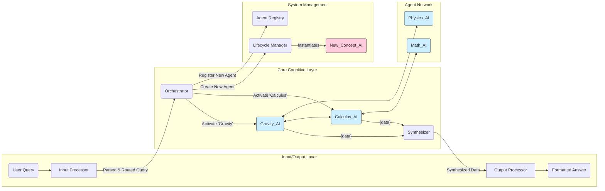

### **Architectural Blueprint: The Myriad Cognitive Architecture (v1.0)**

#### **1. Core Philosophy & Guiding Principles**

The Myriad Cognitive Architecture is a fundamental departure from the paradigm of monolithic, large-scale AI models. It is founded on the principle that true, scalable, and explainable intelligence is not born from a single, all-knowing entity, but emerges from the dynamic collaboration of countless, hyper-specialized, and minimalist agents.

Our guiding principles are inspired by neurobiology:

1.  **Radical Specialization (The Neuron):** Like a neuron in the brain is specialized for a task, each "Myriad Agent" is the smallest possible unit of knowledge or function. It knows one thing, and it knows it perfectly. An agent for "the concept of gravity" does not know about poetry.
2.  **Emergent Intelligence (The Brain):** Intelligence is not located in any single agent but is an emergent property of the entire network. A complex answer is synthesized from the simple, factual outputs of many collaborating agents.
3.  **Dynamic Growth (Neurogenesis):** The system's primary method of learning new concepts is not by retraining a massive model, but by creating, training, and integrating a *new agent* into the network. The brain grows by adding neurons, and so does Myriad.
4.  **Efficiency and Resource Frugality:** The system must be computationally efficient. Querying "What is 2+2?" should activate a tiny, near-instantaneous function agent, not a multi-billion parameter LLM.

#### **2. High-Level Architecture Overview**

The Myriad architecture is a multi-tiered, decentralized system of microservices. The data flows through a series of specialized processors, activating concept agents as needed.

#### **3. Component Deep Dive**

*(This section remains unchanged, as the component descriptions are foundational.)*

##### **3.1. The Myriad Agents (The "Neurons")**
The heart of the system. An agent is an independently deployable microservice embodying a single concept. They are heterogeneous.

*   **Type A: Fact-Base Agent**
*   **Type B: Function-Executor Agent**
*   **Type C: Pattern-Matcher / Classifier Agent**
*   **Type D: Micro-Generator Agent**
*   **Concept Clusters:** Agents are not isolated. They are grouped into clusters.

##### **3.2. The Orchestrator (The "Connectome / Central Nervous System")**
The Orchestrator is the primary routing and management hub. **It is intentionally unintelligent.** Its job is to facilitate communication, not to reason.

*   **The Agent Registry:** A high-performance, queryable database mapping conceptual keywords to the network addresses of the corresponding agents or agent clusters.
*   **The Router:** Receives the processed query from the Input Processor. It looks up the necessary agents in the Registry and dispatches parallel requests to them.
*   **The Lifecycle Manager:** This is a crucial module responsible for **Neurogenesis**. When a query contains an unknown concept, the Lifecycle Manager is triggered to create a new, blank agent container, assign it a network address, and update the Registry.

##### **3.3. The Input Processor (The "Sensory Cortex")**
This is the "front door" of the system. It deconstructs a user's raw query into a machine-readable format for the Orchestrator.
*   **Parser:** Extracts keywords and entities from the query.
*   **Intent Recognizer:** Determines the user's goal (e.g., "define," "compare," "calculate," "summarize").
*   **Ambiguity Resolver:** If a keyword is ambiguous (e.g., "drive"), it queries the user for clarification ("Do you mean A or B?") or uses context to make an informed guess.

##### **3.4. The Output Processor (The "Motor Cortex")**
This is the "voice" of the system. It assembles the raw data from the agents into a coherent, final response.
*   **Synthesizer:** Receives the data packets from the queried agents. It uses the user's original intent to structure the information logically.
*   **Formatter:** Converts the synthesized structure into the desired output format (e.g., natural language, a graph, a JSON object for an API response).

#### **4. Core Process Flow: A Complex Query Example**

*(This section remains unchanged, as it perfectly illustrates the foundational process.)*

**Query:** *"Briefly explain why Apple's 'Think Different' campaign was so successful."*

1.  **Input Processing:**...
2.  **Orchestration & Routing:**...
3.  **Agent Activation & Collaboration:**...
4.  **Synthesis & Output:**...

---
#### **5. Architectural Evolution: The Path to Deeper Biomimicry**

The v1.0 architecture is a pragmatic blueprint for a functional MVP. The long-term vision is to evolve the system to more closely mirror the efficiency, parallelism, and decentralized nature of the brain. The following paths outline this evolution.

##### **5.1. Communication: From Synchronous Calls to an Asynchronous Network**

*   **Current State (v1.0):** The Orchestrator uses synchronous REST calls (e.g., HTTP `GET`). It calls one agent and waits for the response before calling the next, or handles a small number of parallel calls. This is simple but slow.
*   **Next Step (Asynchronous I/O):** Rearchitect the Orchestrator to use asynchronous communication (`asyncio`). This allows it to fire off requests to all required agents simultaneously and process their responses as they arrive, dramatically improving performance and mimicking the brain's parallel processing.
*   **Advanced State (Event-Driven Architecture):** Replace direct calls with a message broker (e.g., Kafka, RabbitMQ). The Orchestrator publishes a "query event" to a public topic. Agents subscribe to topics they are interested in and publish their findings to a "synthesis" topic. This fully decouples all components, removing the Orchestrator as a bottleneck and more closely modeling the synaptic release of neurotransmitters.

##### **5.2. Orchestration: From a Central Hub to Decentralized Coordination**

*   **Current State (v1.0):** The Orchestrator is a central hub, creating a potential single point of failure and a hub-and-spoke communication pattern.
*   **Next Step (Agent-to-Agent Communication):** Empower agents to call each other directly, creating "reflex arcs." For example, the `Lightbulb_AI` could directly query the `Industrial_Revolution_AI` for context before returning its own data. This distributes some of the routing logic to the network edges.
*   **Advanced State (The Digital Connectome):** The path to true decentralization and agent awareness will follow three evolutionary stages:
    1.  **Stage 1: Explicit Connections (The "Cranial Nerves"):** The most direct approach. An agent is configured with a "contact list" of its most logical collaborators. This creates extremely fast, efficient, and predictable pathways for common collaborations, analogous to a hardwired neural pathway.
    2.  **Stage 2: Proximity-Based Discovery (The "Local Neighborhood"):** Agents become more autonomous by querying the `Agent Registry Service` not for a specific agent, but for other agents that handle related concepts (e.g., "Who else knows about 'lightbulbs'?"). This allows for dynamic discovery of collaborators within a "cognitive cluster," mimicking communication within a functional area of the brain.
    3.  **Stage 3: Emergent, Weighted Connections (The "Hebbian Connectome"):** The ultimate goal. The `Agent Registry` evolves into a rich **graph database** where agents are nodes and their relationships are weighted edges. The weights are determined by a `Collaboration Monitor` that reinforces connections between agents that successfully collaborate. This implements the "agents that fire together, wire together" principle, allowing the network structure to emerge from experience rather than design.

##### **5.3. Learning: From Explicit Creation to Continuous Plasticity**

*   **Neurogenesis (Dynamic Instantiation):** This remains a core principle. The `Lifecycle Manager`'s ability to create and scaffold new agents on the fly when encountering unknown concepts is the system's primary method of large-scale learning.
*   **Synaptic Strengthening (Hebbian Learning):** This principle is formalized. When agents are frequently co-activated to answer a query successfully, the weight of the edge connecting them in the graph database is increased. This is a direct implementation of the "neurons that fire together, wire together" rule, making the system learn common associations and become faster over time.
*   **Agent Fine-Tuning (Micro-learning):** For agents that are small, trainable models (Type C/D), user feedback can be used to perform targeted fine-tuning. If a `Sentiment_AI` misclassifies a sentence, the feedback loop can trigger a single training step on *that agent alone*, subtly improving its performance without the cost of retraining the entire system. This is analogous to refining a specific neural pathway through experience.