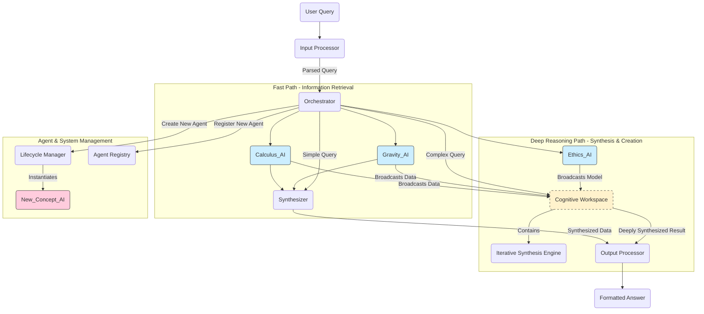

### **Architectural Blueprint: The Myriad Cognitive Architecture (v5.0 C#/.NET Edition)**

**Implementation**: C# 10+ / .NET 6.0+ with Zero External Dependencies
**Documentation**: See [`architecture/`](architecture/) for comprehensive guides

#### **1. Core Philosophy & Guiding Principles**

The Myriad Cognitive Architecture is a fundamental departure from the paradigm of monolithic, large-scale AI models. It is founded on the principle that true, scalable, and explainable intelligence is not born from a single, all-knowing entity, but emerges from the dynamic collaboration of countless, hyper-specialized, and minimalist agents.

Our guiding principles are inspired by neurobiology:

1. **Radical Specialization (The Neuron):** Like a neuron in the brain is specialized for a task, each "Myriad Agent" is the smallest possible unit of knowledge or function. It knows one thing, and it knows it perfectly. An agent for "the concept of gravity" does not know about poetry.
2. **Emergent Intelligence (The Brain):** Intelligence is not located in any single agent but is an emergent property of the entire network. A complex answer is synthesized from the simple, factual outputs of many collaborating agents.
3. **Dynamic Growth (Neurogenesis):** The system's primary method of learning new concepts is not by retraining a massive model, but by creating, training, and integrating a *new agent* into the network. The brain grows by adding neurons, and so does Myriad.
4. **Efficiency and Resource Frugality:** The system must be computationally efficient. Querying "What is 2+2?" should activate a tiny, near-instantaneous function agent, not a multi-billion parameter LLM.

#### **2. High-Level Architecture Overview**

The Myriad architecture is a multi-tiered, decentralized system of microservices. The data flows through a series of specialized processors, activating concept agents as needed.

#### **3. Component Deep Dive**

##### **3.1. The Myriad Agents (The "Neurons")**

The heart of the system. An agent is an independently deployable microservice embodying a single concept. They are heterogeneous.

* **Type A: Fact-Base Agent**
* **Type B: Function-Executor Agent**
* **Type C: Pattern-Matcher / Classifier Agent**
* **Type D: Micro-Generator Agent**
* **Concept Clusters:** Agents are not isolated. They are grouped into clusters.

##### **3.2. The Orchestrator (The "Connectome / Central Nervous System")**

The Orchestrator is the primary routing and management hub. **It is intentionally unintelligent.** Its job is to facilitate communication, not to reason.

* **The Agent Registry:** A high-performance, queryable database mapping conceptual keywords to the network addresses of the corresponding agents or agent clusters.
* **The Router:** Receives the processed query from the Input Processor. It looks up the necessary agents in the Registry and dispatches parallel requests to them.
* **The Lifecycle Manager:** This is a crucial module responsible for **Neurogenesis**. When a query contains an unknown concept, the Lifecycle Manager is triggered to create a new, blank agent container, assign it a network address, and update the Registry.

##### **3.3. The Input Processor (The "Sensory Cortex")**

This is the "front door" of the system. It deconstructs a user's raw query into a machine-readable format for the Orchestrator.

* **Parser:** Extracts keywords and entities from the query.
* **Intent Recognizer:** Determines the user's goal (e.g., "define," "compare," "calculate," "summarize").
* **Ambiguity Resolver:** If a keyword is ambiguous (e.g., "drive"), it queries the user for clarification ("Do you mean A or B?") or uses context to make an informed guess.

##### **3.4. The Output Processor (The "Motor Cortex")**

This is the "voice" of the system. It assembles the raw data from the agents into a coherent, final response.

* **Synthesizer:** Receives the data packets from the queried agents. It uses the user's original intent to structure the information logically.
* **Formatter:** Converts the synthesized structure into the desired output format (e.g., natural language, a graph, a JSON object for an API response).

##### 3.5. The Cognitive Workspace (The "Prefrontal Cortex")

**Bridging Efficient Retrieval with Deep Reasoning**

The Cognitive Workspace addresses a fundamental architectural tension: while the Myriad architecture excels at efficient retrieval and execution of known functions through radical specialization, complex novel queries require the kind of deep, computationally intensive processing that characterizes LLM-style reasoning. The Workspace provides this capability while remaining true to Myriad's core philosophy.

**Theoretical Foundation: Global Workspace Theory (GWT)**

Inspired by cognitive science's Global Workspace Theory, which posits that consciousness emerges when specialized brain regions broadcast information to a central "global workspace" for joint processing and integration, our Cognitive Workspace serves as a temporary computational arena where multiple specialized agents can collaborate intensively on complex problems.

**Key Characteristics:**

* **Ephemeral & On-Demand:** This is not a permanent service but a high-computation environment activated only when the Orchestrator detects queries requiring deep reasoning, synthesis, or solving novel problems. It exists only for the duration of a single complex query.

* **Broadcasting Mechanism:** Unlike the standard flow where agents simply return facts, in the Workspace flow agents "broadcast" their entire perspectives and data models into the shared environment. This is fundamentally different from simple data retrieval—agents project their reasoning frameworks, not just their knowledge.

* **Iterative Synthesis Engine:** The core of the Workspace. This engine:
  - Examines the collective data pool from all broadcasting agents
  - Identifies patterns, causal links, and contradictions
  - Runs simulations and explores counterfactuals
  - Performs logical deductions based on the combined knowledge
  - Iteratively refines hypotheses through multiple cycles
  - This is the primary consumer of heavy compute resources in the system

* **Emergent Solutions:** The final answer is more than the sum of its parts—it's a reasoned conclusion that emerges from the intensive, collaborative processing. This bridges the gap between Myriad's efficient specialization and the creative synthesis capabilities of monolithic models.

* **Resource Management:** The Workspace is immediately dissolved after generating its answer to conserve computational resources, maintaining the system's overall efficiency principle.

**Why This Approach Works:**

1. **Targeted Compute Usage:** Heavy computation is used only when necessary, preserving the fast path for simple queries
2. **Architectural Harmony:** The Workspace integrates seamlessly as another tool for the Orchestrator, powered by the same network of specialized agents
3. **Avoiding Monolithic Models:** Reasoning remains an emergent property of collaborating specialists, not a single, opaque model
4. **Explainability Preserved:** The synthesis process can be traced through the contributions of individual agents and the logical steps of the Synthesis Engine

##### **3.6. Architectural Decision: Why Two Paths?**

The dual-path architecture (Fast Path for retrieval, Cognitive Workspace for reasoning) represents a fundamental design decision that balances competing demands:

* **Efficiency vs. Capability:** Most queries (estimated 80-90%) are simple retrievals that should be answered instantly. The remaining complex queries justify additional compute investment for quality results.

* **Explainability vs. Creativity:** The Fast Path maintains perfect explainability—every answer can be traced to specific agent contributions. The Cognitive Workspace adds a reasoning layer that, while more complex, still maintains traceability through the Synthesis Engine's logical steps.

* **Specialization vs. Integration:** Individual agents remain radically specialized (honoring the neuron principle), but the Workspace provides a mechanism for deep integration when needed (honoring the emergence principle).

* **Resource Optimization:** By segregating paths, we avoid the "using a sledgehammer to crack a nut" problem of LLMs, where simple queries consume unnecessary resources, while still providing sledgehammer-level power when genuinely needed.

---

#### 4. Process Flows: Fast Path vs. Deep Reasoning

The architecture supports two distinct processing pathways, intelligently routing queries based on their complexity and novelty. This dual-path approach ensures optimal resource utilization—simple queries get rapid responses while complex problems receive the deep processing they require.

##### 4.1. Fast Path Flow (Information Retrieval)

**When to Use:** Simple factual queries, definitions, calculations, or any request that can be satisfied by retrieving and organizing existing knowledge ("What is 2+2?", "Define lightbulb", "List the causes of WWI").

**Characteristics:** Stateless, minimal compute, near-instantaneous response times.

**Example Query:** "Briefly explain why Apple's 'Think Different' campaign was so successful."

1. Input Processing: The Input Processor identifies keywords ("Apple," "Think Different," "marketing campaign," "success") and the intent ("explain why").
2. Orchestration & Routing: The Orchestrator queries the Agent Registry and identifies relevant agents: Apple_Inc_AI, Marketing_History_AI, Steve_Jobs_AI.
3. Agent Activation: The Orchestrator sends parallel requests to these agents. Each agent returns a simple packet of factual data (e.g., campaign dates, key figures, market conditions).
4. Synthesis & Output: The data packets are sent directly to the Output Processor's Synthesizer. It collates the facts, structures them into a logical explanation based on the "explain why" intent, and the Formatter produces the final text. The entire process is stateless and highly efficient.

##### 4.2. Deep Reasoning Flow (Creative Synthesis via Cognitive Workspace)

**When to Use:** Novel problems requiring reasoning from first principles, hypothetical scenarios, creative synthesis, complex causal analysis, or any query where the answer cannot be directly retrieved but must be constructed through intensive processing.

**Characteristics:** Stateful during processing, high compute usage, longer response times justified by answer quality and depth.

**Example Query:** "Based on the principles of the Industrial Revolution, what would be the societal impact of inventing a personal teleportation device?"

**Detailed Process:**

1. **Input Processing & Complexity Detection:** The Input Processor identifies the query as hypothetical and requiring deep synthesis beyond simple retrieval. Key indicators include counterfactual reasoning, cross-domain synthesis, or novel problem-solving requirements.

2. **Workspace Activation:** The Orchestrator, recognizing the complexity, activates a Cognitive Workspace—a temporary, sandboxed, high-computation environment. This is a critical decision point where the system commits additional resources for deep processing.

3. **Agent Selection & Broadcasting:**
   - The Orchestrator casts a wider net than usual, identifying not just directly relevant agents but those with foundational principles that might contribute to reasoning
   - Selected agents: `Industrial_Revolution_AI`, `Physics_AI`, `Sociology_AI`, `Economics_AI`, `Ethics_AI`
   - **Critical Difference:** These agents don't just return facts—they "broadcast" their entire conceptual models and reasoning frameworks into the Workspace
   - Example broadcasts:
     * `Industrial_Revolution_AI`: Models of societal upheaval from technological change
     * `Economics_AI`: Supply chain disruption models, labor market transformation patterns
     * `Sociology_AI`: Urban development models, social stratification dynamics
     * `Physics_AI`: Energy requirements, physical constraints of teleportation
     * `Ethics_AI`: Frameworks for evaluating societal good, equity concerns

4. **Iterative Synthesis (Heavy Compute Phase):**
   - The Iterative Synthesis Engine begins its work, consuming the bulk of computational resources
   - **Pattern Recognition:** Identifies commonalities across the different models (e.g., all major transport innovations led to urban restructuring)
   - **Simulation Running:** Executes what-if scenarios ("What happens to cities if commute is instant?")
   - **Causal Chain Analysis:** Traces second and third-order effects (instant commute → real estate collapse → economic restructuring → social reorganization)
   - **Contradiction Resolution:** When models conflict, the engine attempts to reconcile or identify the conditions under which each applies
   - **Counterfactual Exploration:** Tests alternative scenarios to strengthen conclusions
   - **Iterative Refinement:** Multiple cycles of hypothesis generation, testing against the combined models, and refinement

5. **Emergent Solution Generation:**
   - The final output is not a simple aggregation but a novel synthesis—a reasoned analysis that no single agent could have produced
   - The solution includes predictions, justifications, confidence levels, and identified uncertainties
   - This represents true emergent intelligence from the collaboration of specialists

6. **Output & Cleanup:**
   - The deeply synthesized result is passed to the Output Processor for formatting
   - The Cognitive Workspace and all its temporary state are immediately dissolved
   - Resources are released back to the system for other queries

#### **5. Architectural Evolution: The Path to Deeper Biomimicry**

The v1.0 architecture is a pragmatic blueprint for a functional MVP. The long-term vision is to evolve the system to more closely mirror the efficiency, parallelism, and decentralized nature of the brain. The following paths outline this evolution.

##### **5.1. Communication: From Synchronous Calls to an Asynchronous Network**

* **Current State (v1.0):** The Orchestrator uses synchronous REST calls (e.g., HTTP `POST` via `HttpClient`). It calls one agent and waits for the response before calling the next, or handles a small number of parallel calls. This is simple but slow.
* **Next Step (Asynchronous I/O):** Rearchitect the Orchestrator to use C#'s `async`/`await` pattern with `Task.WhenAll`. This allows it to fire off requests to all required agents simultaneously and process their responses as they arrive, dramatically improving performance and mimicking the brain's parallel processing.
* **Advanced State (Event-Driven Architecture):** Replace direct calls with a custom message broker (built from scratch using TCP/IP sockets and C# concurrent collections). The Orchestrator publishes a "query event" to a public topic. Agents subscribe to topics they are interested in and publish their findings to a "synthesis" topic. This fully decouples all components, removing the Orchestrator as a bottleneck and more closely modeling the synaptic release of neurotransmitters.

##### **5.2. Orchestration: From a Central Hub to Decentralized Coordination**

* **Current State (v1.0):** The Orchestrator is a central hub, creating a potential single point of failure and a hub-and-spoke communication pattern.
* **Next Step (Agent-to-Agent Communication):** Empower agents to call each other directly, creating "reflex arcs." For example, the `Lightbulb_AI` could directly query the `Industrial_Revolution_AI` for context before returning its own data. This distributes some of the routing logic to the network edges.
* **Advanced State (The Digital Connectome):** Evolve the `Agent Registry` from a simple dictionary into a rich **custom graph database** (built from scratch in C# using `ConcurrentDictionary` and custom traversal algorithms). Agents are nodes, and their relationships are weighted edges. Orchestration is no longer a simple lookup; it becomes a **graph traversal problem**, finding the most relevant path of agents to activate. This transforms the Orchestrator from a manager into a navigator of a complex knowledge graph.

##### **5.3. Learning: From Explicit Creation to Continuous Plasticity**

* **Neurogenesis (Dynamic Instantiation):** This remains a core principle. The `Lifecycle Manager`'s ability to create and scaffold new agents on the fly when encountering unknown concepts is the system's primary method of large-scale learning.
* **Synaptic Strengthening (Hebbian Learning):** This principle is formalized. When agents are frequently co-activated to answer a query successfully, the weight of the edge connecting them in the graph database is increased. This is a direct implementation of the "neurons that fire together, wire together" rule, making the system learn common associations and become faster over time.
* **Agent Fine-Tuning (Micro-learning):** For agents that are small, trainable models (Type C/D), user feedback can be used to perform targeted fine-tuning. If a `Sentiment_AI` misclassifies a sentence, the feedback loop can trigger a single training step on *that agent alone*, subtly improving its performance without the cost of retraining the entire system. This is analogous to refining a specific neural pathway through experience.
