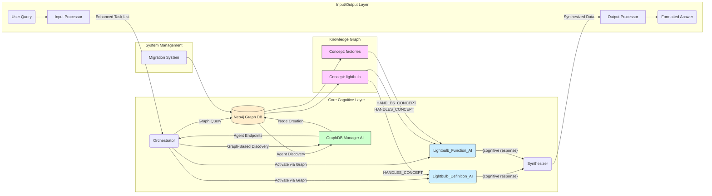

# Myriad Cognitive Architecture - Complete Design & Architectural Blueprint

**Version**: 2.5  
**Date**: 2024-01-01  
**Status**: Graph-Based Implementation Active

This document combines the foundational architectural blueprint with the advanced "Brain Approach" evolution strategy for the Myriad Cognitive Architecture.

---

## Table of Contents

1. [Core Philosophy & Guiding Principles](#core-philosophy--guiding-principles)
2. [High-Level Architecture Overview](#high-level-architecture-overview)
3. [Component Deep Dive](#component-deep-dive)
4. [Core Process Flow](#core-process-flow)
5. [Architectural Evolution Path](#architectural-evolution-path)
6. [The "Brain Approach" Evolution Roadmap](#the-brain-approach-evolution-roadmap)
7. [Ethical Considerations & Evaluation](#ethical-considerations--evaluation)
8. [Current Implementation Status](#current-implementation-status)

---

## Current Implementation Status

**🎉 Major Milestone Achieved: The "Neural Substrate" is Complete and Operational**

As of January 2025, the Myriad Cognitive Architecture has successfully transitioned from the foundational design phase to active implementation of the "Brain Approach" core infrastructure:

### ✅ Implemented Components

**Phase 1: Foundation Infrastructure**
- ✅ **Neo4j Graph Database**: Operational with full CRUD capabilities
- ✅ **GraphDB Manager AI**: Service providing graph database interface (Port 5008)
- ✅ **Graph-Based Orchestrator**: Agent discovery via traversal instead of registry lookup
- ✅ **Migration System**: Formal agent registration and graph population

**Phase 2: Enhanced Processing Pipeline**
- ✅ **Enhanced Input Processor**: Advanced NLP with intent recognition and task generation
- ✅ **Enhanced Output Processor**: Sophisticated synthesis and multi-format response generation
- ✅ **Specialized Agents**: Lightbulb Definition AI and Function AI with cognitive logic

**Phase 3: Integration & Validation**
- ✅ **End-to-End Testing**: Comprehensive integration tests with graph-based routing
- ✅ **Production Deployment**: Docker-compose ready with 6 operational microservices
- ✅ **Protocol Compliance**: Both basic and enhanced communication protocols

### 🚀 Architectural Evolution Achieved

The system has successfully implemented the **"Neural Substrate"** described in Section 6.1, establishing:

1. **Graph Database Core** replacing simple agent registry
2. **Relationship-Based Routing** for intelligent agent discovery  
3. **Concept-Agent Mapping** through HANDLES_CONCEPT relationships
4. **Foundation for Hebbian Learning** via graph weight properties

This represents the successful transition from **Phase 1 (Foundational Infrastructure)** through core components of **Phase 2 (Sensory Grounding)** as outlined in "The Brain Approach Evolution Roadmap."

---

## Core Philosophy & Guiding Principles

The Myriad Cognitive Architecture is a fundamental departure from the paradigm of monolithic, large-scale AI models. It is founded on the principle that true, scalable, and explainable intelligence is not born from a single, all-knowing entity, but emerges from the dynamic collaboration of countless, hyper-specialized, and minimalist agents.

Our guiding principles are inspired by neurobiology:

1. **Radical Specialization (The Neuron):** Like a neuron in the brain is specialized for a task, each "Myriad Agent" is the smallest possible unit of knowledge or function. It knows one thing, and it knows it perfectly. An agent for "the concept of gravity" does not know about poetry.

2. **Emergent Intelligence (The Brain):** Intelligence is not located in any single agent but is an emergent property of the entire network. A complex answer is synthesized from the simple, factual outputs of many collaborating agents.

3. **Dynamic Growth (Neurogenesis):** The system's primary method of learning new concepts is not by retraining a massive model, but by creating, training, and integrating a *new agent* into the network. The brain grows by adding neurons, and so does Myriad.

4. **Efficiency and Resource Frugality:** The system must be computationally efficient. Querying "What is 2+2?" should activate a tiny, near-instantaneous function agent, not a multi-billion parameter LLM.

---

## High-Level Architecture Overview

The Myriad architecture is a multi-tiered, decentralized system of microservices. The data flows through a series of specialized processors, activating concept agents as needed.

**Key Innovation**: The architecture now features a **Neo4j knowledge graph** at its core, with the Orchestrator using **graph traversal** to discover agents through concept relationships rather than simple registry lookup. This establishes the foundation for Hebbian learning and emergent intelligence.

---

## Component Deep Dive

### 3.1. The Myriad Agents (The "Neurons")

The heart of the system. An agent is an independently deployable microservice embodying a single concept. They are heterogeneous.

- **Type A: Fact-Base Agent** - Stores and retrieves factual knowledge
- **Type B: Function-Executor Agent** - Performs calculations, analyses, or transformations
- **Type C: Pattern-Matcher / Classifier Agent** - Classifies, categorizes, or identifies patterns in data
- **Type D: Micro-Generator Agent** - Generates small pieces of content or explanations
- **Concept Clusters:** Agents are not isolated. They are grouped into clusters.

### 3.2. The GraphDB Manager AI (The "Neural Substrate")

**🆕 IMPLEMENTED**: The GraphDB Manager AI serves as the interface between the cognitive architecture and the Neo4j knowledge graph, replacing the simple agent registry with sophisticated relationship-based discovery.

- **Graph Database Interface:** Provides CRUD operations for nodes and relationships in the Neo4j database
- **Agent Discovery:** Enables concept-based agent lookup through graph traversal queries
- **Relationship Management:** Maintains HANDLES_CONCEPT relationships between agents and concepts
- **Migration Support:** Facilitates systematic population of the knowledge graph from configuration

### 3.3. The Orchestrator (The "Connectome / Central Nervous System")

**🔄 EVOLVED**: The Orchestrator has evolved from registry-based to graph-based agent discovery, maintaining its role as an intelligent routing hub without reasoning capability.

- **Graph-Based Discovery:** Queries the GraphDB Manager AI to find agents via concept relationships instead of simple key-value lookup
- **The Router:** Receives enhanced task lists from the Input Processor and uses graph traversal to discover appropriate agents
- **Future Neurogenesis:** The foundation is established for dynamic agent creation through graph node instantiation

### 3.4. The Input Processor (The "Sensory Cortex")

**🔄 ENHANCED**: The Input Processor has been significantly upgraded with advanced NLP capabilities for sophisticated query understanding.

- **Advanced Parser:** Extracts concepts, relationships, and contextual information from complex queries
- **Intent Recognizer:** Determines user goals with confidence scoring across multiple intent types
- **Ambiguity Resolver:** Context-aware disambiguation with intelligent clarification requests
- **Task Generator:** Creates prioritized task lists with dependencies for orchestrator execution

### 3.5. The Output Processor (The "Motor Cortex")

**🔄 ENHANCED**: The Output Processor now features sophisticated synthesis capabilities for generating coherent, multi-format responses.

- **Advanced Synthesizer:** Combines multi-agent responses with weighted correlation and evidence attribution
- **Intelligent Formatter:** Supports multiple output formats (explanatory, comparative, structured) with length control
- **Quality Assessment:** Provides confidence scoring and response quality metrics

---

## Core Process Flow

### Complex Query Example

**Query:** *"Briefly explain why Apple's 'Think Different' campaign was so successful."*

1. **Input Processing:**
   - Parser extracts: ["Apple", "Think Different", "campaign", "successful"]
   - Intent Recognizer identifies: "explain_success_factors"
   - Ambiguity Resolver confirms: Apple Inc. (not fruit)

2. **Orchestration & Routing:**
   - Registry lookup finds agents: Apple_Company_AI, Marketing_Campaign_AI, Brand_Psychology_AI
   - Router dispatches parallel requests with context

3. **Agent Activation & Collaboration:**
   - Apple_Company_AI: Provides company context and brand positioning
   - Marketing_Campaign_AI: Details campaign execution and messaging
   - Brand_Psychology_AI: Explains psychological impact and effectiveness

4. **Synthesis & Output:**
   - Synthesizer correlates responses around success factors
   - Formatter generates coherent narrative explanation

---

## Architectural Evolution Path

The v1.0 architecture is a pragmatic blueprint for a functional MVP. The long-term vision is to evolve the system to more closely mirror the efficiency, parallelism, and decentralized nature of the brain.

### 5.1. Communication: From Synchronous Calls to an Asynchronous Network

- **Current State (v1.0):** The Orchestrator uses synchronous REST calls (e.g., HTTP `GET`). It calls one agent and waits for the response before calling the next, or handles a small number of parallel calls. This is simple but slow.

- **Next Step (Asynchronous I/O):** Rearchitect the Orchestrator to use asynchronous communication (`asyncio`). This allows it to fire off requests to all required agents simultaneously and process their responses as they arrive, dramatically improving performance and mimicking the brain's parallel processing.

- **Advanced State (Event-Driven Architecture):** Replace direct calls with a message broker (e.g., Kafka, RabbitMQ). The Orchestrator publishes a "query event" to a public topic. Agents subscribe to topics they are interested in and publish their findings to a "synthesis" topic. This fully decouples all components, removing the Orchestrator as a bottleneck and more closely modeling the synaptic release of neurotransmitters.

### 5.2. Orchestration: From a Central Hub to Decentralized Coordination

- **Current State (v1.0):** The Orchestrator is a central hub, creating a potential single point of failure and a hub-and-spoke communication pattern.

- **Next Step (Agent-to-Agent Communication):** Empower agents to call each other directly, creating "reflex arcs." For example, the `Lightbulb_AI` could directly query the `Industrial_Revolution_AI` for context before returning its own data. This distributes some of the routing logic to the network edges.

- **Advanced State (The Digital Connectome):** The path to true decentralization and agent awareness will follow three evolutionary stages:
  1. **Stage 1: Explicit Connections (The "Cranial Nerves"):** The most direct approach. An agent is configured with a "contact list" of its most logical collaborators. This creates extremely fast, efficient, and predictable pathways for common collaborations, analogous to a hardwired neural pathway.
  2. **Stage 2: Proximity-Based Discovery (The "Local Neighborhood"):** Agents become more autonomous by querying the `Agent Registry Service` not for a specific agent, but for other agents that handle related concepts (e.g., "Who else knows about 'lightbulbs'?"). This allows for dynamic discovery of collaborators within a "cognitive cluster," mimicking communication within a functional area of the brain.
  3. **Stage 3: Emergent, Weighted Connections (The "Hebbian Connectome"):** The ultimate goal. The `Agent Registry` evolves into a rich **graph database** where agents are nodes and their relationships are weighted edges. The weights are determined by a `Collaboration Monitor` that reinforces connections between agents that successfully collaborate. This implements the "agents that fire together, wire together" principle, allowing the network structure to emerge from experience rather than design.

### 5.3. Learning: From Explicit Creation to Continuous Plasticity

- **Neurogenesis (Dynamic Instantiation):** This remains a core principle. The `Lifecycle Manager`'s ability to create and scaffold new agents on the fly when encountering unknown concepts is the system's primary method of large-scale learning.

- **Synaptic Strengthening (Hebbian Learning):** This principle is formalized. When agents are frequently co-activated to answer a query successfully, the weight of the edge connecting them in the graph database is increased. This is a direct implementation of the "neurons that fire together, wire together" rule, making the system learn common associations and become faster over time.

- **Agent Fine-Tuning (Micro-learning):** For agents that are small, trainable models (Type C/D), user feedback can be used to perform targeted fine-tuning. If a `Sentiment_AI` misclassifies a sentence, the feedback loop can trigger a single training step on *that agent alone*, subtly improving its performance without the cost of retraining the entire system. This is analogous to refining a specific neural pathway through experience.

- **Advanced Optimization:** Implement distributed caching (e.g., etcd) for registry lookups and auto-scaling with Kubernetes for handling large agent networks.

- **Multi-Modality Depth:** Extend neurogenesis to include video and other sensory data.

- **Cost Management:** Track compute costs per agent/query to prune inefficiencies.

---

## The "Brain Approach" Evolution Roadmap

**Preamble:** This roadmap outlines the long-term architectural evolution required to transition the Myriad system from using pre-trained embedding models for semantic understanding to a state where "meaning" is an emergent property of the entire agent network. This is the path to true biomimicry.

### Phase 1: Foundational Infrastructure - The "Neural Substrate"

**Goal:** To replace the current memory and communication backbone with a system that can support a dynamic, interconnected knowledge graph.

- **Step 1.1: Implement the Graph Database Core**
  - **Task 1.1.1:** Integrate a graph database (e.g., Neo4j, ArangoDB, or a cloud-native equivalent) into the system via `docker-compose.yml`.
  - **Task 1.1.2:** Define the core graph schema as outlined in `PROTOCOLS.md (Section 3.1)`. This includes `AgentNode` properties and `COLLABORATES_WITH` relationship properties.
  - **Task 1.1.3:** Create a new `GraphDB_Manager_AI` service. This Genesis Agent will be the sole interface for all read/write operations to the graph, ensuring consistency and centralizing logic.

- **Step 1.2: Rearchitect the Orchestrator as a "Graph Traverser"**
  - **Task 1.2.1:** Modify `orchestration/orchestrator.py`. Remove the direct `requests.post` calls to agent microservices for knowledge retrieval.
  - **Task 1.2.2:** The orchestrator's primary function becomes query parsing followed by graph traversal. It will receive a query, identify the starting `ConceptNode`(s), and then query the `GraphDB_Manager_AI` to find the most relevant, strongly connected nodes.
  - **Task 1.2.3:** The "result" of an orchestration is no longer a collection of JSON responses, but a **subgraph** of activated nodes and their relationships.

- **Step 1.3: Migrate Existing Agents to Graph Nodes**
  - **Task 1.3.1:** Write a migration script. This script will read the capabilities of the existing `Lightbulb_Definition_AI` and `Lightbulb_Function_AI`.
  - **Task 1.3.2:** The script will use the `GraphDB_Manager_AI` to create `AgentNode`s in the graph that *represent* these agents. The node properties will contain their capabilities (intents, concepts) and their network endpoints.
  - **Note:** In this phase, `Function-Executor` agents (Type B) will still exist as microservices, but they will be activated based on graph lookups, not a simple registry. `Fact-Base` agents (Type A) will be fully replaced by the graph itself.

**Phase 1 Deliverable:** ✅ **COMPLETED** - A system where all knowledge and agent discovery is mediated by a central graph database. The `Orchestrator` can answer a query like "What is a lightbulb?" by traversing the graph, finding the `Lightbulb_Definition_AI` node, and then calling its endpoint. 

**Current Status**: The GraphDB Manager AI with Neo4j is operational, the Orchestrator uses graph traversal for agent discovery, and the migration system has populated the knowledge graph with agent-concept relationships.

### Phase 2: Sensory Grounding & Associative Learning - The "Hippocampus"

**Goal:** To implement the core learning mechanism where the system can form new connections between concepts based on sensory input.

- **Step 2.1: Implement the Primal Sensory Cortex**
  - **Task 2.1.1:** Build and deploy the `Image_Embedding_AI` and `Audio_Embedding_AI` as planned. These are the system's "eyes and ears."
  - **Task 2.1.2:** Enhance the graph schema to include `SensoryNode` types for storing image and audio vectors.

- **Step 2.2: Implement the `Learning_Engine_AI`**
  - **Task 2.2.1:** Create the `Learning_Engine_AI` service. This is a core Genesis Agent.
  - **Task 2.2.2:** Implement the `POST /learn/associate` endpoint. This endpoint will receive a learning event payload (e.g., a concept, an image, and a related textual fact).

- **Step 2.3: Implement the Associative Learning Process**
  - **Task 2.3.1:** When the `Learning_Engine_AI` receives a learning event, it will orchestrate the entire process:
    1. Create a `ConceptNode` for the new concept (if it doesn't exist).
    2. Call the sensory agents (`Image_Embedding_AI`, etc.) to get vectors for the sensory data.
    3. Create corresponding `SensoryNode`s in the graph.
    4. Create new, weighted `Relationship` edges in the graph connecting the `ConceptNode` to its sensory representations and other related concepts. For example: `(Dog) -[:HAS_VISUAL]-> (ImageVector123)`.

**Phase 2 Deliverable:** A system that can learn in a brain-like way. You can teach it the concept of "cat" by providing the word, a few pictures, and the sentence "a cat is a pet." The system will create a "cat" node and form weighted connections to the relevant image vectors and the existing "pet" node, creating its own distributed representation.

### Phase 3: Emergent Semantics & Hebbian Learning - The "Cortex"

**Goal:** To make the system's understanding of meaning truly dynamic by strengthening connections based on usage, allowing the knowledge graph to self-organize.

- **Step 3.1: Implement the `Collaboration_Monitor_AI`**
  - **Task 3.1.1:** Create a new `Collaboration_Monitor_AI` service.
  - **Task 3.1.2:** After every successful query, the `Orchestrator` will send the activated subgraph to this monitor.
  - **Task 3.1.3:** The monitor's job is to analyze which nodes were activated *together* to satisfy the query.

- **Step 3.2: Implement Hebbian Learning**
  - **Task 3.2.1:** The `Collaboration_Monitor` will send a request to the `GraphDB_Manager_AI` to update the graph.
  - **Task 3.2.2:** The manager will execute the Hebbian learning rule: for every pair of nodes that were co-activated, it will slightly increase the `weight` and `activation_frequency` properties on the relationship edge connecting them. "Agents that fire together, wire together."

- **Step 3.3: Evolve Graph Traversal Logic**
  - **Task 3.3.1:** Modify the `Orchestrator`'s traversal queries to prioritize paths with higher weights.
  - **Task 3.3.2:** This creates a feedback loop: frequently used pathways become stronger, and stronger pathways are more likely to be used in the future, mimicking the formation of strong neural pathways in the brain.

**Phase 3 Deliverable:** A self-optimizing cognitive architecture. As the system answers more queries, it will automatically learn common associations. The connection between "lightbulb" and "factories" will become stronger over time, making queries about their relationship faster and more accurate. The system's intelligence is now truly emergent and adaptive.

### Phase 4: Autonomous Refinement & Pruning - The "Sleep Cycle"

**Goal:** To implement background processes for memory consolidation, optimization, and the removal of weak or irrelevant connections.

- **Step 4.1: Implement the `Consolidator_AI` (The "Sleep" Agent)**
  - **Task 4.1.1:** Create the `Consolidator_AI` as a background worker.
  - **Task 4.1.2:** During idle periods, this agent will perform maintenance on the knowledge graph.

- **Step 4.2: Implement Synaptic Pruning**
  - **Task 4.2.1:** The `Consolidator` will periodically scan the graph for relationship edges with very low weights and low activation frequencies.
  - **Task 4.2.2:** These weak, unused connections will be removed from the graph. This is analogous to synaptic pruning in the brain, which improves cognitive efficiency by removing "noise."

- **Step 4.3: Implement Higher-Order Concept Formation**
  - **Task 4.3.1:** The `Consolidator` will also look for "cliques" or clusters of highly interconnected nodes.
  - **Task 4.3.2:** When a dense cluster is found, it can create a new, higher-order `ConceptNode` that represents the entire cluster, forming an abstraction. For example, if it finds that "dog," "cat," and "hamster" are all strongly connected to "pet," it might create a new concept called "domestic_animals."

**Phase 4 Deliverable:** A mature and efficient cognitive system. It not only learns and adapts but also actively refines its own knowledge structure, improving its performance, removing irrelevant information, and forming abstract concepts autonomously. This completes the core framework for the "Brain Approach."

---

## Ethical Considerations & Evaluation

### Ethical Considerations & Bias Mitigation

To ensure responsible AI, incorporate:
- **Bias Detection:** A Diversity_Checker_AI evaluates sources during ingestion for balanced viewpoints.
- **Guardrails:** Protocols to avoid forbidden topics in exploration and anonymize user data.
- **Auditability:** Log all learning events with provenance for traceability.

### Evaluation & Metrics

- **Holistic Metrics:** Measure emergent intelligence via knowledge retention, adaptation speed, and coherence over time.
- **Simulation & Benchmarks:** Run idle simulations and compare against monolithic models (e.g., GPT) for efficiency and accuracy.

---

**This comprehensive architectural blueprint supports the complete evolution of the Myriad Cognitive Architecture from basic functionality through advanced biomimetic intelligence, maintaining alignment with core principles while enabling sophisticated emergent behavior.**
