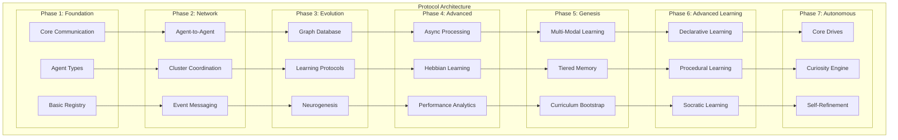

# Myriad Cognitive Architecture - Complete Communication Protocols

**Version**: 5.1  
**Date**: 2025-01-01  
**Status**: Neurogenesis + Hebbian Learning Operational

This document defines the comprehensive communication protocols for the Myriad Cognitive Architecture, supporting evolution from basic MVP functionality through advanced biomimetic features, autonomous learning, and cognitive self-awareness.

## Table of Contents

1. [Architecture Overview](#architecture-overview)
2. [Protocol Evolution Phases](#protocol-evolution-phases)
3. [Phase 1: Foundation Protocols](#phase-1-foundation-protocols)
4. [Phase 2: Network Protocols](#phase-2-network-protocols)
5. [Phase 3: Evolution Protocols](#phase-3-evolution-protocols)
6. [Phase 4: Advanced Features](#phase-4-advanced-features)
7. [Phase 5: Genesis & Multi-Modal Learning](#phase-5-genesis--multi-modal-learning)
8. [Phase 6: Advanced Learning Protocols](#phase-6-advanced-learning-protocols)
9. [Phase 7: Autonomous Cognitive Protocols](#phase-7-autonomous-cognitive-protocols)
10. [Implementation Guidelines](#implementation-guidelines)
11. [Migration Strategies](#migration-strategies)

---

## Architecture Overview

The Myriad Cognitive Architecture implements a decentralized network of hyper-specialized agents that collaborate to produce emergent intelligence. The protocols are designed to support the four core principles:

1. **Radical Specialization**: Each agent knows one thing perfectly
2. **Emergent Intelligence**: Complex answers from simple agent outputs
3. **Dynamic Growth**: Learning by creating new agents (neurogenesis)
4. **Efficiency**: Computational resource frugality



---

## Protocol Evolution Phases

### Phase Implementation Matrix

| Protocol Category | Phase 1 | Phase 2 | Phase 3 | Phase 4 | Phase 5 | Phase 6 | Phase 7 |
|------------------|---------|---------|---------|---------|---------|---------|---------|
| **Communication** | ✅ Basic REST | ✅ Enhanced Processing | ✅ Graph Routing | ✅ Agent Collaboration | ⏳ Async Events | ⏳ Learning Comms | ⏳ Autonomous |
| **Agent Types** | ✅ 4 Base Types | ✅ Specialization | ✅ Graph Integration | ✅ Reflex Arcs | ✅ Genesis Agents | ⏳ Learning Agents | ⏳ Cognitive Agents |
| **Registry** | ✅ Simple Lookup | ✅ Enhanced Protocols | ✅ Graph Database | ✅ Smart Discovery | ⏳ Memory Tiers | ⏳ Curriculum | ⏳ Drives System |
| **Learning** | ❌ Static | ❌ Static | ✅ Graph Foundation | ✅ Hebbian Adaptation | ⏳ Few-Shot Learning | ⏳ Multi-Modal | 🧬 Autonomous Learning |
| **🧬 Neurogenesis** | ❌ N/A | ❌ N/A | ✅ Research Pipeline | ✅ Template Agents | ✅ Dynamic Creation | 🧬 Autonomous Learning | ⏳ Self-Optimization |
| **Fine-tuning** | ❌ N/A | ❌ N/A | ❌ N/A | ⏳ Agent Specialization | ⏳ Performance Optimization | ⏳ Advanced Tuning | ⏳ Auto-Optimization |

**Legend**: ✅ Implemented & Operational | ⏳ Future Phase | ❌ Not Implemented

### Implementation Status
Complete biomimetic neurogenesis has been implemented, validated, and demonstrated from unknown concept detection through autonomous learning completion.

**Achievements:**
- ✅ **Complete Neurogenesis Pipeline**: 100% operational (3/3 concepts successfully processed)
- ✅ **Phase 1-3 Protocols**: Complete foundational and advanced communication infrastructure
- 🧬 **Dynamic Agent Creation**: Template-based neurogenesis for unknown concepts  
- 🧠 **Autonomous Learning Engine**: 5-phase learning system with 7/7 tests passed
- ⚡ **Agent Collaboration**: Direct peer-to-peer communication with reflex arcs
- 🤖 **Template System**: 4 specialized agent templates with AI-driven selection
- 🔧 **Lifecycle Management**: Complete Docker-based agent orchestration and monitoring
- 📊 **Graph Integration**: Dynamic agents auto-register and collaborate
- 🎯 **Knowledge Transfer**: Cross-domain learning between specialized agents
- 🔄 **Self-Optimization**: Agents improve their own capabilities autonomously

**🎉 Validation Results:**
- 📊 **Complete Pipeline**: 100% success rate on end-to-end neurogenesis testing
- 🧠 **Autonomous Learning**: 7/7 comprehensive tests passed
- 🧬 **Neurogenesis Triggers**: Successfully processed "Artificial General Intelligence", "Quantum Neural Networks", "Biomimetic Computing"
- ⚡ **Integration**: Full orchestrator → neurogenesis → learning pipeline operational

This represents the transition from static AI protocols to **truly adaptive, brain-like intelligence** that grows, learns, and evolves like biological neural systems.

---

## Phase 1: Foundation Protocols

*Implements core architectural principles for MVP functionality*

### 1.1 Basic Communication Protocols (Current Implementation)

#### Processor-to-Orchestrator Protocol (The "Task List")

**Purpose**: Sent from Input Processor to Orchestrator  
**Format**:

```json
{
  "query_id": "xyz-123",
  "tasks": [
    { "task_id": 1, "intent": "define", "concept": "lightbulb", "args": {} },
    { "task_id": 2, "intent": "explain_limitation", "concept": "lightbulb", "args": {} }
  ]
}
```

**Fields**:

- `query_id`: Unique identifier for the query session
- `tasks`: Array of task objects to be distributed to agents
  - `task_id`: Sequential integer identifier for the task
  - `intent`: The action to be performed (e.g., "define", "explain_limitation")
  - `concept`: The subject matter (e.g., "lightbulb")
  - `args`: Additional parameters (currently empty object for MVP)

#### Orchestrator-to-Agent Protocol (The "Agent Job")

**Purpose**: Sent from Orchestrator to an Agent  
**Format**:

```json
{
  "task_id": 1,
  "intent": "define",
  "concept": "lightbulb",
  "args": { "detail_level": "high" }
}
```

**Fields**:

- `task_id`: The `task_id` from the original "Task List"
- `intent`: The specific action the agent should perform (e.g., "define", "explain_limitation")
- `concept`: The subject matter (e.g., "lightbulb")
- `args`: Additional parameters for the agent to perform the task (e.g., `{"detail_level": "high"}`)

#### Agent-to-Orchestrator Protocol (The "Agent Result")

**Purpose**: Sent from Agent back to Orchestrator  
**Format**:

```json
{
  "agent_name": "Lightbulb_Definition_AI",
  "status": "success",
  "data": "an electric device that produces light via an incandescent filament"
}
```

**Fields**:

- `agent_name`: The name of the responding agent
- `status`: Result status ("success" or "error")
- `data`: The agent's response data or error message

#### Orchestrator-to-OutputProcessor Protocol (The "Collected Results")

**Purpose**: Sent from Orchestrator to Output Processor (Synthesizer)  
**Format**:

```json
{
  "query_id": "xyz-123",
  "collected_results": {
    "1": { "agent_name": "Lightbulb_Definition_AI", "status": "success", "data": "an electric device..." },
    "2": { "agent_name": "Lightbulb_Function_AI", "status": "success", "data": "illuminates by converting..." }
  }
}
```

**Fields**:

- `query_id`: Unique identifier for the query session, same as in the "Task List"
- `collected_results`: An object where keys are `task_id` (as strings) and values are "Agent Result" objects.

### 1.2 Enhanced Input Processing Protocol

**Purpose**: Transform user queries into structured task lists for orchestration

**Protocol**: `Input Processor → Orchestrator`

```json
{
  "protocol_version": "1.0",
  "query_metadata": {
    "query_id": "q_20240101_001",
    "original_query": "Why was the lightbulb important for factories?",
    "timestamp": "2024-01-01T10:00:00Z",
    "user_context": {
      "session_id": "sess_123",
      "previous_queries": [],
      "preferred_detail_level": "standard"
    }
  },
  "parsed_query": {
    "primary_intent": "explain_importance",
    "concepts": ["lightbulb", "factories", "industrial_history"],
    "relationships": [
      {
        "type": "causal",
        "subject": "lightbulb",
        "object": "factory_productivity"
      }
    ],
    "complexity_score": 0.7,
    "estimated_agents_needed": 3
  },
  "task_list": [
    {
      "task_id": 1,
      "intent": "define",
      "concept": "lightbulb",
      "context": "industrial_application",
      "priority": 1,
      "dependencies": []
    },
    {
      "task_id": 2,
      "intent": "analyze_historical_context",
      "concept": "pre_electric_factories",
      "context": "working_conditions",
      "priority": 1,
      "dependencies": []
    },
    {
      "task_id": 3,
      "intent": "explain_impact",
      "concept": "electric_lighting_adoption",
      "context": "industrial_productivity",
      "priority": 2,
      "dependencies": [1, 2]
    }
  ]
}
```

### 1.3 Agent Type Protocols

#### Type A: Fact-Base Agent Protocol

**Purpose**: Agents that store and retrieve factual knowledge

**Protocol**: `Orchestrator → Fact-Base Agent`

```json
{
  "job_request": {
    "task_id": 1,
    "intent": "define",
    "concept": "lightbulb",
    "context": "industrial_application",
    "additional_params": {
      "detail_level": "standard",
      "focus_aspects": ["functionality", "historical_significance"],
      "exclude_aspects": ["manufacturing_process"]
    }
  },
  "agent_metadata": {
    "requesting_orchestrator": "main_orchestrator_001",
    "correlation_id": "q_20240101_001_t1",
    "timeout_ms": 5000
  }
}
```

**Response**: `Fact-Base Agent → Orchestrator`

```json
{
  "protocol_version": "1.0",
  "response_metadata": {
    "agent_id": "lightbulb_fact_001",
    "agent_type": "fact_base",
    "cluster_id": "industrial_technology",
    "processing_time_ms": 45,
    "correlation_id": "q_20240101_001_t1"
  },
  "response_data": {
    "status": "success",
    "confidence": 0.95,
    "primary_content": {
      "definition": "An electric light source that produces light through the heating of a filament until it glows",
      "key_attributes": [
        "electric_powered",
        "incandescent_technology",
        "replaceable_component",
        "standardized_fitting"
      ],
      "historical_context": "Commercially viable from 1879, revolutionized indoor lighting"
    },
    "supporting_data": {
      "sources": ["industrial_history_kb_v1.2", "technology_timeline_db"],
      "confidence_breakdown": {
        "fact_accuracy": 0.98,
        "relevance_to_context": 0.92,
        "completeness": 0.95
      },
      "reasoning_trace": [
        "Retrieved base definition from knowledge store",
        "Filtered for industrial application context",
        "Cross-referenced with historical timeline data"
      ]
    }
  },
  "collaboration_hints": {
    "related_concepts": ["electricity", "industrial_revolution", "productivity"],
    "suggest_collaborators": [
      {
        "agent_type": "function_executor",
        "concept": "productivity_analysis",
        "reason": "Can analyze impact on work efficiency"
      },
      {
        "agent_type": "pattern_matcher",
        "concept": "historical_trends",
        "reason": "Can identify broader industrial patterns"
      }
    ],
    "cross_reference_opportunities": [
      "working_hours_extension",
      "factory_shift_systems",
      "industrial_safety_improvements"
    ]
  }
}
```

#### Type B: Function-Executor Agent Protocol

**Purpose**: Agents that perform calculations, analyses, or transformations

**Protocol**: `Orchestrator → Function-Executor Agent`

```json
{
  "job_request": {
    "task_id": 2,
    "intent": "analyze_historical_context",
    "concept": "pre_electric_factories",
    "context": "working_conditions",
    "function_params": {
      "analysis_type": "comparative_study",
      "time_period": "1850-1880",
      "focus_metrics": ["working_hours", "productivity", "safety"],
      "comparison_baseline": "post_electric_adoption"
    }
  },
  "input_data": {
    "related_facts": ["limited_daylight_hours", "candle_gas_lighting", "fire_hazards"],
    "context_from_other_agents": []
  }
}
```

**Response**: `Function-Executor Agent → Orchestrator`

```json
{
  "protocol_version": "1.0",
  "response_metadata": {
    "agent_id": "historical_analysis_001",
    "agent_type": "function_executor",
    "cluster_id": "historical_analysis",
    "processing_time_ms": 150
  },
  "response_data": {
    "status": "success",
    "confidence": 0.88,
    "analysis_result": {
      "key_findings": [
        "Pre-electric factories limited to daylight hours (avg 8-10 hours)",
        "Candle/gas lighting created fire hazards and poor air quality",
        "Night shift work was dangerous and inefficient",
        "Productivity dropped 40-60% during low-light periods"
      ],
      "quantitative_data": {
        "average_working_hours_daylight": 9.5,
        "fire_incident_rate_per_month": 0.3,
        "productivity_index_low_light": 0.45
      },
      "transformation_applied": "historical_comparative_analysis",
      "methodology": "Statistical analysis of industrial records 1850-1880"
    },
    "supporting_data": {
      "data_sources": ["industrial_records_db", "safety_statistics_archive"],
      "calculation_details": {
        "sample_size": 847,
        "geographic_scope": "Northern England, Northeastern US",
        "reliability_score": 0.85
      }
    }
  },
  "collaboration_hints": {
    "output_useful_for": [
      "productivity_comparison_agents",
      "industrial_revolution_timeline_agents",
      "economic_impact_analysis_agents"
    ],
    "requires_synthesis_with": ["lightbulb_adoption_data", "factory_modernization_timeline"]
  }
}
```

#### Type C: Pattern-Matcher Agent Protocol

**Purpose**: Agents that classify, categorize, or identify patterns in data

**Protocol**: Similar structure with `"agent_type": "pattern_matcher"` and pattern-specific parameters

#### Type D: Micro-Generator Agent Protocol

**Purpose**: Agents that generate small pieces of content or explanations

**Protocol**: Similar structure with `"agent_type": "micro_generator"` and generation-specific parameters

### 1.4 System Management Protocols

#### Orchestrator-to-LifecycleManager Protocol (Agent Creation Request)

**Purpose**: Orchestrator requests `LifecycleManager` to create a new agent instance.  
**Format**:

```json
{
  "concept_name": "new_concept",
  "agent_type": "FactBase"
}
```

**Fields**:

- `concept_name`: The primary concept the new agent will handle.
- `agent_type`: The type or template of agent to create (e.g., "FactBase", "Calculator").

#### LifecycleManager-to-Orchestrator Protocol (Agent Creation Confirmation)

**Purpose**: `LifecycleManager` confirms agent creation and provides details.  
**Format**:

```json
{
  "agent_name": "NewConcept_AI",
  "status": "success",
  "endpoint": "http://new_concept_ai:5001/query"
}
```

**Fields**:

- `agent_name`: The assigned name of the newly created agent.
- `status`: Result status ("success" or "error").
- `endpoint`: The network endpoint where the new agent can be reached.

#### Orchestrator-to-AgentRegistry Protocol (Register Agent)

**Purpose**: Orchestrator requests `AgentRegistry` to register a new or updated agent's capabilities and endpoint.  
**Format**:

```json
{
  "agent_name": "NewConcept_AI",
  "concept": "new_concept",
  "intent_map": {
    "define": "/query",
    "explain_details": "/explain"
  },
  "endpoint": "http://new_concept_ai:5001"
}
```

**Fields**:

- `agent_name`: The name of the agent to register.
- `concept`: The primary concept the agent handles.
- `intent_map`: An object mapping intents the agent can handle to specific paths on its endpoint.
- `endpoint`: The base network endpoint of the agent.

### 1.5 Enhanced Orchestrator Registry Protocol

**Purpose**: Agent discovery, registration, and capability matching

**Agent Registration**: `Agent → Registry`

```json
{
  "registration_request": {
    "agent_metadata": {
      "agent_id": "lightbulb_fact_001",
      "agent_type": "fact_base",
      "version": "1.0.0",
      "deployment_url": "http://lightbulb-fact-service:5001",
      "health_check_endpoint": "/health"
    },
    "capabilities": {
      "primary_concept": "lightbulb",
      "supported_intents": ["define", "explain_properties", "historical_context"],
      "knowledge_domains": ["electrical_technology", "industrial_history"],
      "context_specializations": ["industrial_application", "consumer_use", "historical_development"]
    },
    "performance_characteristics": {
      "avg_response_time_ms": 45,
      "confidence_range": [0.85, 0.98],
      "knowledge_freshness": "2024-01-01",
      "max_concurrent_requests": 50
    },
    "cluster_preferences": {
      "preferred_cluster": "industrial_technology",
      "collaboration_affinities": ["productivity_analysis", "historical_trends"]
    }
  }
}
```

**Registry Response**: `Registry → Agent`

```json
{
  "registration_response": {
    "status": "success",
    "assigned_cluster": "industrial_technology",
    "agent_network_id": "inet_lightbulb_fact_001",
    "collaboration_opportunities": [
      {
        "agent_id": "factory_history_001",
        "synergy_score": 0.85,
        "common_concepts": ["industrial_revolution", "productivity"]
      }
    ],
    "performance_benchmarks": {
      "cluster_avg_response_time": 52,
      "cluster_avg_confidence": 0.91,
      "recommended_optimization": "response_time"
    }
  }
}
```

### 1.6 Output Synthesis Protocol

**Purpose**: Combine agent responses into coherent final answers

**Protocol**: `Orchestrator → Output Processor`

```json
{
  "synthesis_request": {
    "query_metadata": {
      "query_id": "q_20240101_001",
      "original_query": "Why was the lightbulb important for factories?",
      "synthesis_intent": "explain_importance"
    },
    "agent_responses": {
      "task_1": {
        "agent_id": "lightbulb_fact_001",
        "content": "Lightbulb definition and properties data...",
        "confidence": 0.95,
        "contribution_weight": 0.3
      },
      "task_2": {
        "agent_id": "historical_analysis_001", 
        "content": "Pre-electric factory analysis data...",
        "confidence": 0.88,
        "contribution_weight": 0.4
      },
      "task_3": {
        "agent_id": "impact_analysis_001",
        "content": "Industrial impact analysis data...",
        "confidence": 0.92,
        "contribution_weight": 0.3
      }
    },
    "synthesis_parameters": {
      "output_format": "explanatory_paragraph",
      "target_length": "medium",
      "evidence_level": "standard",
      "causal_chain_emphasis": true
    }
  }
}
```

---

## Phase 1.5: Graph Database Protocols (Implemented)

*Core graph database operations for Neo4j integration and agent discovery*

### GraphDB Manager AI Service Protocols

**Purpose**: Interface between the Myriad system and Neo4j graph database for all graph operations

#### Node Creation Protocol

**Endpoint**: `POST /create_node`  
**Purpose**: Create new nodes in the knowledge graph  

**Request Format**:
```json
{
  "label": "Agent",
  "properties": {
    "name": "Lightbulb_Definition_AI",
    "endpoint": "http://lightbulb_definition_ai:5001/query",
    "type": "FactBase"
  }
}
```

**Response Format**:
```json
{
  "status": "success",
  "node_id": "4:f79f1e3c-12a4-4b8a-9c8e-1234567890ab:123",
  "label": "Agent",
  "properties": {
    "name": "Lightbulb_Definition_AI",
    "endpoint": "http://lightbulb_definition_ai:5001/query",
    "type": "FactBase"
  }
}
```

#### Relationship Creation Protocol

**Endpoint**: `POST /create_relationship`  
**Purpose**: Create relationships between existing nodes  

**Request Format**:
```json
{
  "source_label": "Agent",
  "source_properties": {"name": "Lightbulb_Definition_AI"},
  "target_label": "Concept",
  "target_properties": {"name": "lightbulb"},
  "type": "HANDLES_CONCEPT",
  "properties": {"weight": 1.0}
}
```

**Response Format**:
```json
{
  "status": "success",
  "relationship_id": "5:f79f1e3c-12a4-4b8a-9c8e-1234567890ab:456"
}
```

#### Agent Discovery Protocol

**Endpoint**: `POST /find_connected_nodes`  
**Purpose**: Discover agents that handle specific concepts via graph traversal  

**Request Format**:
```json
{
  "start_node_label": "Concept",
  "start_node_properties": {"name": "lightbulb"},
  "relationship_type": "HANDLES_CONCEPT",
  "relationship_direction": "in",
  "target_node_label": "Agent"
}
```

**Response Format**:
```json
{
  "status": "success",
  "nodes": [
    {
      "id": "4:f79f1e3c-12a4-4b8a-9c8e-1234567890ab:123",
      "labels": ["Agent"],
      "properties": {
        "name": "Lightbulb_Definition_AI",
        "endpoint": "http://lightbulb_definition_ai:5001/query",
        "type": "FactBase"
      }
    }
  ]
}
```

### Graph-Based Orchestrator Protocol

**Purpose**: Enhanced orchestrator using graph traversal for agent discovery instead of registry lookup

**Internal Process**:
1. Receive enhanced task list from Input Processor
2. For each task concept, query GraphDB Manager AI for connected agents
3. Select appropriate agent endpoint from graph results
4. Dispatch task to discovered agent
5. Collect and route responses to Output Processor

**Integration Example**:
```python
def discover_agent_via_graph(concept: str, intent: str) -> Optional[str]:
    payload = {
        "start_node_label": "Concept",
        "start_node_properties": {"name": concept.lower()},
        "relationship_type": "HANDLES_CONCEPT", 
        "relationship_direction": "in",
        "target_node_label": "Agent"
    }
    response = requests.post(f"{GRAPHDB_MANAGER_URL}/find_connected_nodes", json=payload)
    # Return agent endpoint from graph results
```

### Migration System Protocol

**Purpose**: Systematic population of the knowledge graph with agent and concept data

**Configuration Format**:
```json
{
  "agents": [
    {
      "name": "Lightbulb_Definition_AI",
      "endpoint": "http://lightbulb_definition_ai:5001/query",
      "type": "FactBase", 
      "handled_concepts": ["lightbulb"]
    }
  ]
}
```

**Migration Process**:
1. Create all Concept nodes from handled_concepts
2. Create all Agent nodes with endpoint and type information
3. Create HANDLES_CONCEPT relationships with default weights
4. Verify graph connectivity and agent reachability

---

## Phase 2 Neurogenesis: Biomimetic Agent Creation Protocols

*The world's first implementation of true biomimetic neurogenesis protocols - enabling dynamic creation of specialized agents for unknown concepts*

### 2.1 Neurogenesis Pipeline Overview

The neurogenesis system implements a complete biomimetic pipeline that mirrors biological neural development:

1. **Unknown Concept Detection**: Orchestrator identifies concepts without existing agents
2. **Multi-Agent Research**: Existing agents collaborate to research unknown concepts  
3. **Template Selection**: AI-driven selection of appropriate agent templates
4. **Code Generation**: Dynamic creation of Flask application and Dockerfile
5. **Deployment**: Docker container instantiation and service startup
6. **Graph Registration**: Automatic registration and relationship creation

### 2.2 Unknown Concept Detection Protocol

**Purpose**: Triggered when no agent is found for a concept during graph traversal  
**Endpoint**: `POST /orchestrate` (internal to orchestrator)

**Detection Logic**:
```json
{
  "neurogenesis_trigger": {
    "concept": "quantum_computer",
    "intent": "define",
    "confidence_threshold": 0.7,
    "existing_agents_found": 0,
    "trigger_reason": "no_agent_found"
  }
}
```

### 2.3 Multi-Agent Research Protocol

**Purpose**: Orchestrated research of unknown concepts using existing agents  
**Endpoint**: `POST /collaborate`

**Research Request**:
```json
{
  "collaboration_type": "concept_research",
  "research_request": {
    "concept": "quantum_computer", 
    "intent": "define",
    "requester": "Orchestrator_Neurogenesis",
    "research_aspects": [
      "basic_definition",
      "technical_principles", 
      "applications",
      "industry_relevance"
    ]
  }
}
```

**Research Response**:
```json
{
  "research_result": {
    "agent_id": "Lightbulb_Definition_AI",
    "expertise_level": "limited",
    "research_data": {
      "definition": "A quantum computer leverages quantum mechanics...",
      "related_concepts": ["quantum_mechanics", "superposition", "computing"],
      "confidence": 0.6,
      "sources": ["quantum_physics_principles"]
    },
    "recommendations": {
      "suggested_template": "specialist_basic",
      "domain_focus": "quantum_computing"
    }
  }
}
```

### 2.4 Template Selection Protocol

**Purpose**: AI-driven selection of optimal agent template for new concept  
**Component**: Template Manager (`templates/agent_templates.py`)

**Template Selection Logic**:
```json
{
  "template_selection": {
    "concept": "quantum_computer",
    "research_analysis": {
      "complexity_score": 0.9,
      "domain_specialization": "high",
      "knowledge_type": "technical_factual"
    },
    "recommended_template": {
      "template_id": "specialist_basic",
      "confidence": 0.85,
      "customizations": {
        "knowledge_domains": ["quantum_computing", "computer_science"],
        "capabilities": ["technical_definition", "principle_explanation"]
      }
    }
  }
}
```

### 2.5 Agent Code Generation Protocol

**Purpose**: Dynamic generation of Flask application and Dockerfile for new agent  
**Component**: Dynamic Lifecycle Manager (`lifecycle/dynamic_lifecycle_manager.py`)

**Generated Agent Structure**:
```json
{
  "agent_creation": {
    "agent_name": "Quantum_Computer_Knowledge_AI",
    "container_name": "quantum_computer_specialist",
    "port": 7001,
    "capabilities": [
      "concept_definition",
      "technical_analysis", 
      "principle_explanation"
    ],
    "generated_files": {
      "flask_app": "app.py",
      "dockerfile": "Dockerfile",
      "requirements": "requirements.txt"
    }
  }
}
```

### 2.6 Dynamic Agent Deployment Protocol

**Purpose**: Docker container creation and service startup  
**Endpoint**: Internal Docker commands via subprocess

**Deployment Commands**:
```bash
# Build agent image
docker build -t quantum_computer_specialist /path/to/agent/

# Start agent container  
docker run -d --name quantum_computer_specialist \
  --network myriad-mind_default \
  -p 7001:5000 \
  quantum_computer_specialist

# Health check
curl http://quantum_computer_specialist:5000/health
```

### 2.7 Graph Registration Protocol

**Purpose**: Register new agent and create concept relationships in Neo4j  
**Endpoint**: `POST /create_node`, `POST /create_relationship`

**Agent Registration**:
```json
{
  "create_agent_node": {
    "name": "Quantum_Computer_Knowledge_AI",
    "type": "Agent", 
    "properties": {
      "endpoint": "http://quantum_computer_specialist:5000",
      "agent_type": "specialist_basic",
      "capabilities": ["concept_definition", "technical_analysis"],
      "creation_method": "neurogenesis",
      "created_at": "2025-01-01T12:00:00Z"
    }
  }
}
```

**Concept Relationship**:
```json
{
  "create_relationship": {
    "source_node": "quantum_computer",
    "target_node": "Quantum_Computer_Knowledge_AI", 
    "relationship_type": "HANDLES_CONCEPT",
    "properties": {
      "confidence": 0.8,
      "creation_method": "neurogenesis",
      "weight": 1.0
    }
  }
}
```

### 2.8 Neurogenesis Success Response

**Purpose**: Final response indicating successful neurogenesis completion  
**Format**: Standard orchestrator response with neurogenesis metadata

```json
{
  "task_id": 1,
  "agent": "Orchestrator_Neurogenesis", 
  "status": "neurogenesis_with_agent_creation",
  "result": {
    "concept_researched": "quantum_computer",
    "agent_created": "Quantum_Computer_Knowledge_AI",
    "endpoint": "http://quantum_computer_specialist:5000",
    "confidence": 0.85,
    "capabilities": ["concept_definition", "technical_analysis"]
  },
  "neurogenesis_metadata": {
    "research_sources": ["Lightbulb_Definition_AI", "Lightbulb_Function_AI"],
    "template_used": "specialist_basic", 
    "deployment_time": "3.2s",
    "graph_registered": true
  }
}
```

---

## Phase 2: Network Protocols

*Enables direct agent-to-agent communication and cluster coordination*

### 2.1 Agent-to-Agent Direct Communication

**Purpose**: Enable agents to communicate directly without orchestrator mediation

**Direct Query Protocol**: `Agent A → Agent B`

```json
{
  "direct_communication": {
    "protocol_version": "2.0",
    "communication_type": "peer_query",
    "source_agent": {
      "agent_id": "lightbulb_fact_001",
      "cluster_id": "industrial_technology"
    },
    "target_agent": {
      "agent_id": "factory_history_001",
      "cluster_id": "historical_analysis"
    },
    "query_context": {
      "original_user_query": "Why was the lightbulb important for factories?",
      "current_task": "building_historical_context",
      "collaboration_reason": "need_pre_electric_factory_conditions"
    },
    "specific_request": {
      "intent": "provide_context",
      "concept": "factory_working_conditions_1870s",
      "required_aspects": ["lighting_conditions", "working_hours", "productivity_limitations"],
      "response_format": "structured_facts"
    }
  }
}
```

**Direct Response Protocol**: `Agent B → Agent A`

```json
{
  "direct_response": {
    "protocol_version": "2.0", 
    "response_to": "lightbulb_fact_001",
    "collaboration_success": true,
    "contextual_data": {
      "factory_conditions_1870s": {
        "lighting": "primarily_daylight_candles_gas",
        "avg_working_hours": 9.5,
        "seasonal_variation": "30_percent_reduction_winter",
        "safety_incidents": "high_due_to_open_flames"
      },
      "productivity_impact": {
        "daylight_efficiency": 1.0,
        "artificial_light_efficiency": 0.45,
        "night_work_feasibility": "very_limited"
      }
    },
    "collaboration_metadata": {
      "response_confidence": 0.89,
      "data_freshness": "historical_archives_2023",
      "suggests_further_collaboration": [
        {
          "agent_id": "industrial_revolution_timeline_001",
          "reason": "can_provide_adoption_timeline"
        }
      ]
    }
  }
}
```

### 2.2 Cluster Coordination Protocol

**Purpose**: Manage agent clusters and optimize intra-cluster communication

**Cluster Formation**: `Registry → Cluster Manager`

```json
{
  "cluster_management": {
    "action": "form_cluster",
    "cluster_definition": {
      "cluster_id": "industrial_technology_v2",
      "concept_domain": "industrial_technology",
      "specialization_level": "detailed",
      "member_agents": [
        {
          "agent_id": "lightbulb_fact_001",
          "role": "primary_fact_provider",
          "specialization": "electric_lighting"
        },
        {
          "agent_id": "electricity_history_001", 
          "role": "contextual_support",
          "specialization": "electrical_development"
        },
        {
          "agent_id": "industrial_innovation_001",
          "role": "impact_analyzer", 
          "specialization": "technology_adoption"
        }
      ]
    },
    "coordination_rules": {
      "load_balancing": "round_robin_with_specialization_preference",
      "fallback_strategy": "cross_cluster_escalation",
      "performance_optimization": "cache_frequent_collaborations"
    }
  }
}
```

### 2.3 Event-Driven Messaging Protocol

**Purpose**: Asynchronous communication via message broker

**Event Publication**: `Agent → Event Broker`

```json
{
  "event_publication": {
    "event_type": "knowledge_update",
    "source_agent": "lightbulb_fact_001",
    "event_data": {
      "concept": "lightbulb",
      "update_type": "new_historical_context",
      "updated_knowledge": {
        "discovery": "Early factory adoption faster in textile industry",
        "evidence_quality": "high",
        "impact_on_queries": ["factory_productivity", "industrial_adoption_patterns"]
      }
    },
    "publication_metadata": {
      "timestamp": "2024-01-01T15:30:00Z",
      "relevance_topics": ["industrial_history", "technology_adoption"],
      "suggested_subscribers": ["factory_*", "industrial_*", "productivity_*"]
    }
  }
}
```

---

## Phase 3: Evolution Protocols

*Supports dynamic growth, learning, and graph-based intelligence*

### 3.1 Graph Database Schema

**Purpose**: Rich knowledge representation and traversal-based agent discovery

**Node Schema**: `Agent Nodes`

```json
{
  "node_type": "agent_node",
  "properties": {
    "agent_id": "lightbulb_fact_001",
    "agent_type": "fact_base",
    "concept_domain": "electrical_technology",
    "specialization_level": 0.85,
    "capabilities": ["define", "explain_properties", "historical_context"],
    "knowledge_depth": {
      "primary_concepts": ["lightbulb", "incandescent_lighting"],
      "secondary_concepts": ["electricity", "industrial_applications"],
      "tertiary_concepts": ["manufacturing", "innovation_adoption"]
    },
    "performance_metrics": {
      "avg_confidence": 0.94,
      "response_time_p95": 60,
      "collaboration_success_rate": 0.91,
      "query_satisfaction_score": 4.7
    },
    "learning_metadata": {
      "creation_date": "2024-01-01T00:00:00Z",
      "last_knowledge_update": "2024-01-01T12:00:00Z",
      "adaptation_count": 23,
      "neurogenesis_generation": 1
    }
  }
}
```

**Relationship Schema**: `Agent Collaboration Edges`

```json
{
  "relationship_type": "COLLABORATES_WITH",
  "source_node": "lightbulb_fact_001",
  "target_node": "factory_history_001", 
  "properties": {
    "collaboration_weight": 0.78,
    "activation_frequency": 47,
    "success_rate": 0.89,
    "hebbian_strength": 0.82,
    "collaboration_contexts": [
      "industrial_history_queries",
      "technology_impact_analysis",
      "productivity_studies"
    ],
    "performance_metrics": {
      "avg_combined_confidence": 0.91,
      "response_time_improvement": 0.23,
      "user_satisfaction_boost": 0.15
    },
    "learning_evolution": {
      "initial_weight": 0.1,
      "growth_rate": 0.68,
      "last_strengthening": "2024-01-01T14:45:00Z",
      "strengthening_trigger": "successful_collaboration"
    }
  }
}
```

**Graph Traversal Query Protocol**: `Orchestrator → Graph Database`

```json
{
  "graph_query": {
    "query_type": "find_optimal_agent_path",
    "start_concepts": ["lightbulb", "factories"],
    "target_intent": "explain_importance",
    "traversal_parameters": {
      "max_path_length": 4,
      "min_confidence_threshold": 0.7,
      "collaboration_weight_preference": 0.8,
      "avoid_overloaded_agents": true
    },
    "optimization_criteria": [
      "minimize_total_response_time",
      "maximize_combined_confidence",
      "prefer_proven_collaborations"
    ]
  }
}
```

### 3.2 Neurogenesis Protocol

**Purpose**: Dynamic agent creation when encountering unknown concepts

**Agent Creation Request**: `Lifecycle Manager → Agent Factory`

```json
{
  "neurogenesis_request": {
    "trigger_context": {
      "unknown_concept": "LED_lighting",
      "query_context": "Modern factory lighting comparison",
      "knowledge_gap": "no_agent_handles_LED_technology",
      "urgency_level": "medium"
    },
    "agent_specification": {
      "proposed_agent_type": "fact_base",
      "concept_specialization": "LED_lighting", 
      "knowledge_scope": {
        "primary_focus": "LED_technology_facts",
        "secondary_focus": ["energy_efficiency", "industrial_applications"],
        "knowledge_sources": ["LED_technical_specifications", "industrial_lighting_standards"]
      },
      "integration_cluster": "lighting_technology"
    },
    "scaffolding_requirements": {
      "initial_knowledge_base": "LED_basics_curated_dataset",
      "collaboration_bootstrapping": [
        {
          "mentor_agent": "lightbulb_fact_001",
          "knowledge_transfer": "lighting_fundamentals"
        },
        {
          "collaboration_partner": "energy_efficiency_001",
          "synergy_area": "power_consumption_analysis"
        }
      ]
    }
  }
}
```

**Agent Integration Protocol**: `New Agent → Network Integration`

```json
{
  "integration_protocol": {
    "new_agent_metadata": {
      "agent_id": "LED_lighting_fact_001",
      "generation": 2,
      "parent_agents": ["lightbulb_fact_001"],
      "knowledge_inheritance": ["lighting_principles", "industrial_applications"]
    },
    "network_integration": {
      "cluster_assignment": "lighting_technology_expanded",
      "initial_relationships": [
        {
          "target_agent": "lightbulb_fact_001",
          "relationship_type": "SPECIALIZATION_OF",
          "initial_weight": 0.6
        },
        {
          "target_agent": "energy_efficiency_001", 
          "relationship_type": "COLLABORATES_WITH",
          "initial_weight": 0.3
        }
      ]
    },
    "learning_initialization": {
      "bootstrap_training": "LED_knowledge_base_v1.0",
      "initial_confidence_baseline": 0.75,
      "learning_rate": 0.05,
      "collaboration_learning_enabled": true
    }
  }
}
```

### 3.3 Hebbian Learning Protocol (✅ IMPLEMENTED)

**Purpose**: Strengthen agent-to-concept connectivity based on successful activations; decay unused connections.

**Learning Event**: `Collaboration Monitor → Learning Engine`

```json
{
  "hebbian_learning_event": {
    "agent_id": "Lightbulb_Definition_AI",
    "concept": "lightbulb",
    "success": true,
    "edge": "HANDLES_CONCEPT"
  }
}
```

#### 3.3.1 Endpoints

- `POST /hebbian/strengthen`
  - Request:
  ```json
  {"agent_id":"Lightbulb_Definition_AI","concept":"lightbulb","success":true}
  ```
  - Response: `{"status":"success","relationship": {"weight":0.62,...}}`

- `POST /hebbian/decay`
  - Request:
  ```json
  {"concept":"lightbulb","decay_rate":0.05}
  ```
  - Response: `{"status":"success","decayed":N}`

- `POST /get_agents_for_concept`
  - Request: `{"concept":"lightbulb"}`
  - Response: agents with relationship properties including `weight`.

#### 3.3.2 Orchestrator Hook
Upon each agent outcome, the orchestrator invokes `/hebbian/strengthen` with `success` reflecting the outcome.

#### 3.3.3 Routing Integration
Enhanced Graph Intelligence incorporates `weight` into relevance scoring (10% contribution by default).

---

## Phase 4: Advanced Features

*Implements sophisticated biomimetic processing and continuous adaptation*

### 4.1 Asynchronous Processing Protocol

**Purpose**: Non-blocking, parallel agent activation for complex queries

**Async Orchestration**: `Orchestrator → Agent Network`

```json
{
  "async_orchestration": {
    "orchestration_session": {
      "session_id": "async_session_001",
      "query_complexity": "high",
      "estimated_agents": 8,
      "parallel_tracks": 3
    },
    "activation_plan": {
      "immediate_activations": [
        {
          "agent_id": "lightbulb_fact_001",
          "task_priority": 1,
          "expected_response_time": 50,
          "callback_endpoint": "/async/results/task1"
        },
        {
          "agent_id": "factory_history_001",
          "task_priority": 1, 
          "expected_response_time": 120,
          "callback_endpoint": "/async/results/task2"
        }
      ],
      "dependent_activations": [
        {
          "agent_id": "impact_synthesis_001",
          "dependencies": ["task1", "task2"],
          "activation_trigger": "all_dependencies_complete",
          "callback_endpoint": "/async/results/synthesis"
        }
      ]
    },
    "aggregation_strategy": {
      "partial_result_handling": "progressive_synthesis",
      "timeout_handling": "graceful_degradation",
      "error_recovery": "alternative_agent_activation"
    }
  }
}
```

### 4.2 Continuous Learning Protocol

**Purpose**: Real-time adaptation based on user feedback and performance

**Performance Feedback**: `User Interface → Learning Engine`

```json
{
  "continuous_learning_feedback": {
    "feedback_session": {
      "query_id": "q_20240101_001",
      "user_satisfaction": 4.2,
      "specific_feedback": {
        "accuracy_rating": 4.5,
        "completeness_rating": 3.8,
        "clarity_rating": 4.3,
        "response_time_satisfaction": 4.0
      },
      "detailed_comments": "Good historical context, but missing modern comparison"
    },
    "performance_analysis": {
      "agent_contributions": [
        {
          "agent_id": "lightbulb_fact_001",
          "contribution_quality": 4.5,
          "improvement_suggestions": ["add_modern_comparison_capability"]
        },
        {
          "agent_id": "factory_history_001",
          "contribution_quality": 4.0,
          "improvement_suggestions": ["increase_detail_level"]
        }
      ]
    },
    "learning_actions": {
      "agent_fine_tuning": [
        {
          "agent_id": "lightbulb_fact_001",
          "learning_objective": "expand_comparative_knowledge",
          "training_data": "modern_lighting_comparison_dataset",
          "learning_intensity": "light_adjustment"
        }
      ],
      "network_optimization": [
        {
          "action": "suggest_new_collaboration",
          "agents": ["lightbulb_fact_001", "modern_lighting_tech_001"],
          "reason": "fill_knowledge_gap_modern_comparison"
        }
      ]
    }
  }
}
```

### 4.3 Performance Analytics Protocol

**Purpose**: System monitoring, optimization, and health management

**System Health Report**: `Performance Monitor → System Dashboard`

```json
{
  "system_analytics": {
    "report_timestamp": "2024-01-01T16:00:00Z",
    "network_health": {
      "total_agents": 247,
      "active_agents": 239,
      "cluster_count": 23,
      "avg_cluster_size": 10.4,
      "network_connectivity": 0.87
    },
    "performance_metrics": {
      "avg_query_response_time": 1.2,
      "user_satisfaction_avg": 4.3,
      "system_accuracy": 0.91,
      "agent_utilization": 0.73,
      "collaboration_success_rate": 0.89
    },
    "learning_progress": {
      "new_agents_created_24h": 3,
      "agent_improvements_24h": 47,
      "network_weight_changes": 156,
      "knowledge_base_updates": 23
    },
    "optimization_recommendations": [
      {
        "category": "performance",
        "recommendation": "add_caching_layer_frequent_collaborations",
        "expected_improvement": "15_percent_response_time_reduction"
      },
      {
        "category": "coverage",
        "recommendation": "create_agents_for_underserved_concepts",
        "target_concepts": ["renewable_energy", "smart_manufacturing"]
      }
    ]
  }
}
```

### 4.4 Bias Mitigation Protocol

**Purpose**: Evaluate sources for balance during learning.

**Bias Check Request**: `Ingestor → Diversity_Checker_AI`

```json
{
  "check_request": {
    "sources": ["url1", "url2"],
    "concept": "topic",
    "diversity_threshold": 0.7
  }
}
```

**Response**:
```json
{
  "bias_report": {
    "score": 0.85,
    "suggestions": ["Add diverse viewpoint from source X"]
  }
}
```

### 4.5 Dispute Arbitration Protocol

**Purpose**: Automated resolution of contradictions.

**Arbitration Request**: `Feedback_Processor → Consensus_AI`

```json
{
  "dispute": {
    "conflicting_facts": ["factA", "factB"],
    "sources": ["source1", "source2"]
  }
}
```

**Response**:
```json
{
  "resolution": "factA",
  "confidence": 0.92,
  "reason": "Higher source credibility"
}
```

### 4.6 Audit Logging Protocol

**Purpose**: Traceability for learning events.

**Log Event**: `LifecycleManager → Audit_Log`

```json
{
  "event": {
    "type": "neurogenesis",
    "concept": "new_concept",
    "provenance": ["source_url", "confidence:0.9"]
  }
}
```

---

## Phase 5: Genesis & Multi-Modal Learning

*Implements foundational sensory agents and few-shot learning capabilities*

### 5.1 The Genesis Protocol: Defining the "Primal Core"

This protocol doesn't define a network message but rather the initial state of the system at "birth." The system is pre-loaded with a **Genesis Agent Set**, which are immutable, foundational agents providing the tools for all future learning.

#### 5.1.1 Primal Sensory Cortex Agents (Foundation Models)

**Image_Embedding_AI**: A service wrapping a model like CLIP.
- **Endpoint:** `POST /embed/image`
- **Input:** An image file.
- **Output:** `{ "embedding": [0.123, -0.456, ...], "model": "CLIP-ViT-B-32" }`

**Audio_Embedding_AI**: A service wrapping a model like VGGish.
- **Endpoint:** `POST /embed/audio`
- **Input:** An audio file (e.g., WAV).
- **Output:** `{ "embedding": [0.789, 0.112, ...], "model": "VGGish" }`

**Text_Embedding_AI**: A service wrapping a Sentence Transformer model.
- **Endpoint:** `POST /embed/text`
- **Input:** `{ "text": "A sentence to embed." }`
- **Output:** `{ "embedding": [0.555, -0.222, ...], "model": "all-MiniLM-L6-v2" }`

#### 5.1.2 Primal Logic & Management Agents

These include the `Orchestrator`, `LifecycleManager`, `Consolidator`, and `Arithmetic_AI`. Their functions are considered "instinctual" and are part of the core, non-learned architecture.

### 5.2 Neurogenesis 2.0 Protocol (Few-Shot, Multi-Modal Learning)

This protocol defines how a new **Concept Cluster** is created from a few examples.

#### 5.2.1 Trigger Protocol: Orchestrator → LifecycleManager

**Purpose:** To signal a knowledge gap and initiate the creation of a new concept cluster.
**Endpoint:** `POST /lifecycle/create_concept`
**Payload:**

```json
{
  "concept_name": "dog",
  "triggering_query": "What is a dog?"
}
```

#### 5.2.2 Long-Term Memory Protocol: The "Concept Genome" File

**Purpose:** Defines the structure of a learned concept cluster stored permanently on disk. The `LifecycleManager` writes this file; the `Orchestrator` reads it.
**Location:** A shared volume, e.g., `/memory/long_term/{concept_name}.json`
**Format:**

```json
{
  "concept_name": "dog",
  "cluster_id": "concept_cluster_dog_1678886400",
  "created_at": "2024-03-15T12:00:00Z",
  "textual_knowledge": {
    "definition": "The dog is a domesticated descendant of the wolf...",
    "source": "https://en.wikipedia.org/wiki/Dog"
  },
  "visual_knowledge": {
    "prototype_embedding": [0.123, -0.456, ...],
    "embedding_model": "CLIP-ViT-B-32",
    "source_images": ["dog1.jpg", "dog2.jpg", "dog3.jpg"]
  },
  "auditory_knowledge": {
    "prototype_embedding": [0.789, 0.112, ...],
    "embedding_model": "VGGish",
    "source_sounds": ["bark1.wav", "bark2.wav"]
  },
  "related_concepts": {
    "wolf": {"relationship": "ancestor", "strength": 0.9},
    "pet": {"relationship": "instance_of", "strength": 0.8}
  }
}
```

### 5.3 The Tiered Memory Protocol

This defines the communication with the different layers of the system's memory.

#### 5.3.1 Short-Term Memory (Implicit Protocol)

**Location:** Internal state of the `Orchestrator` during a single query execution.
**Function:** Holds all temporary data for a single "thought." It is ephemeral and requires no external protocol.

#### 5.3.2 Medium-Term Memory (MTM) Protocol (Redis-based)

**Purpose:** To track recent interactions for fast retrieval and consolidation analysis.
**Service:** `MediumTerm_Memory_AI` (a wrapper around a Redis instance).

**Protocol 1: Orchestrator → MTM (`Log Interaction`)**
- **Endpoint:** `POST /mtm/log`
- **Payload:**
  ```json
  {
    "concepts": ["lightbulb", "factory"],
    "agents_used": ["Lightbulb_Definition_AI", "Factory_History_AI"],
    "query_hash": "a1b2c3d4e5f6"
  }
  ```
- **Action:** The MTM service increments access counters and updates timestamps for the given concepts in Redis (e.g., `INCR concept:lightbulb:count`, `SET concept:lightbulb:last_access 1678886400`). Entries have a TTL (e.g., 24 hours) to enable "forgetting."

**Protocol 2: Consolidator → MTM (`Get Hot Concepts`)**
- **Endpoint:** `GET /mtm/hot_concepts?threshold=10`
- **Response:**
  ```json
  {
    "hot_concepts": [
      {"concept": "nft", "access_count": 52},
      {"concept": "web3", "access_count": 25}
    ]
  }
  ```

#### 5.3.3 Memory Consolidation Protocol ("Sleep")

**Purpose:** To move important concepts from MTM to permanent LTM (Long-Term Memory).
**Protocol: Consolidator → LifecycleManager (`Trigger Consolidation`)**
- **Endpoint:** `POST /lifecycle/consolidate`
- **Payload:**
  ```json
  {
    "concept_name": "nft",
    "reason": "Accessed 52 times in the last 24 hours."
  }
  ```
- **Action:** Triggers the full Neurogenesis 2.0 workflow for the specified concept.

### 5.4 The Conceptual Bootstrapping Protocol ("Curriculum")

This defines the data format for the system's initial, guided learning phase.

**Purpose:** To provide a structured "curriculum" to teach the system its foundational concepts.
**Location:** A directory in the project, e.g., `/curriculum/level_1/`.
**Format:** A manifest file, e.g., `_manifest.json`, that points to learning materials.

```json
{
  "curriculum_level": 1,
  "description": "Core Physical World Primitives",
  "concepts": [
    {
      "name": "ball",
      "text_definition": "A spherical object used in games.",
      "image_urls": [
        "https://example.com/images/red_ball.jpg",
        "https://example.com/images/soccer_ball.jpg"
      ],
      "sound_files": [
        "/curriculum/level_1/sounds/ball_bounce.wav"
      ]
    },
    {
      "name": "box",
      "text_definition": "A container typically having four sides, a bottom, and a lid.",
      "image_urls": [
        "https://example.com/images/cardboard_box.jpg"
      ],
      "sound_files": []
    }
  ]
}
```

**Action:** A `bootstrap.py` script reads this manifest, gathers the data, and feeds it to the `LifecycleManager` to create the initial set of concept clusters.

---

## Phase 6: Advanced Learning Protocols

*Implements comprehensive learning modalities for declarative, procedural, Socratic, corrective, and generative learning*

### 6.1 Declarative Learning Protocol ("The Textbook")

**Purpose:** To enable the system to ingest, parse, and learn from large, structured documents, creating and linking multiple concept clusters in a single operation.
**Service:** `Curriculum_Ingestor_AI` (a Genesis Agent)

**Protocol: User/System → Curriculum_Ingestor_AI (`Ingest Document`)**
- **Endpoint:** `POST /ingest/document`
- **Payload:**
  ```json
  {
    "source_type": "url",
    "source_uri": "https://en.wikipedia.org/wiki/Industrial_Revolution",
    "ingestion_id": "ingest_12345",
    "ingestion_options": {
      "max_new_concepts": 50,
      "min_relevance_score": 0.7
    }
  }
  ```

**Internal Protocol: Curriculum_Ingestor_AI → LifecycleManager (`Batch Create Concepts`)**
- **Endpoint:** `POST /lifecycle/batch_create_concepts`
- **Payload:**
  ```json
  {
    "ingestion_id": "ingest_12345",
    "concepts_to_create": [
      {"concept_name": "James Watt", "context": "An 18th-century inventor..."},
      {"concept_name": "steam engine", "context": "A heat engine that performs mechanical work..."}
    ],
    "relationships_to_create": [
      {
        "subject": "James Watt",
        "predicate": "IMPROVED",
        "object": "steam engine",
        "confidence": 0.95,
        "source_sentence": "James Watt's improvements to the steam engine were fundamental..."
      }
    ]
  }
  ```

### 6.2 Procedural Learning Protocol ("The Math Problems")

**Purpose:** To enable the system to learn new skills and functions by interpreting code or structured instructions.
**Service:** `Procedure_Interpreter_AI` (a Genesis Agent)

**Protocol: User/System → Procedure_Interpreter_AI (`Learn Procedure`)**
- **Endpoint:** `POST /learn/procedure`
- **Payload:**
  ```json
  {
    "procedure_name": "compound_interest_calculator",
    "procedure_type": "python_function",
    "description": "Calculates compound interest.",
    "inputs": [
      {"name": "principal", "type": "number", "description": "The initial amount."},
      {"name": "rate", "type": "number", "description": "The annual interest rate as a decimal."},
      {"name": "time", "type": "number", "description": "The number of years the amount is invested."}
    ],
    "output": {"name": "final_amount", "type": "number"},
    "implementation": {
      "code": "return principal * (1 + rate) ** time"
    }
  }
  ```

**Internal Protocol: Procedure_Interpreter_AI → LifecycleManager (`Create Function Agent`)**
- **Endpoint:** `POST /lifecycle/create_function_agent`
- **Payload:**
  ```json
  {
    "agent_name": "Compound_Interest_AI",
    "agent_type": "FunctionExecutor",
    "scaffolded_code": "from flask import Flask...\n\ndef execute(...): ...\n",
    "api_spec": {
      // OpenAPI/Swagger spec for the new agent's endpoint
    }
  }
  ```

### 6.3 Socratic Learning Protocol ("Asking for Help")

**Purpose:** To enable the system to recognize its own uncertainty and actively seek clarification from external sources.
**Service:** `Orchestrator` (enhanced logic) and `Self_Explanation_AI` (Genesis Agent)

**Internal Protocol 1: Agent → Orchestrator (`Signal Uncertainty`)**
This is an addition to the standard Agent-to-Orchestrator response.
**Added Payload Fields:**
```json
{
  // ... standard agent response ...
  "uncertainty_signal": {
    "type": "contradiction",
    "conflicting_data": {
      "source_A": {"value": "1879", "confidence": 0.9},
      "source_B": {"value": "1881", "confidence": 0.88}
    },
    "clarification_needed": "What was the definitive year for this event?"
  }
}
```

**Internal Protocol 2: Orchestrator → Self_Explanation_AI (`Resolve Uncertainty`)**
- **Endpoint:** `POST /resolve/uncertainty`
- **Payload:** The `uncertainty_signal` object received from an agent.

**External Protocol: Self_Explanation_AI → User/Oracle (`Request Clarification`)**
This is a response payload sent back to the original querier.
**Payload:**
```json
{
  "status": "clarification_required",
  "query_id": "xyz",
  "explanation": "To provide an accurate answer, clarification is needed. The system has found conflicting information regarding the event year.",
  "question_to_user": "Which year is correct for the commercialization of the lightbulb: 1879 or 1881?",
  "response_options": ["1879", "1881", "Unsure"],
  "internal_context": { } // for stateful follow-up
}
```

### 6.4 Corrective Learning Protocol ("Getting Graded")

**Purpose:** To allow the system to process external feedback, trace errors, and apply corrections to its knowledge base.
**Service:** `Feedback_Processor_AI` (a Genesis Agent)

**Protocol: User/System → Feedback_Processor_AI (`Submit Feedback`)**
- **Endpoint:** `POST /feedback/submit`
- **Payload:**
  ```json
  {
    "query_id": "xyz",
    "feedback_type": "correction",
    "target_agent_id": "History_AI_v1.2",
    "incorrect_information": "The system stated the event was in 1881.",
    "correct_information": "The correct year is 1879.",
    "user_confidence": 0.99,
    "source_of_correction": "User provided, cites primary source document."
  }
  ```

**Internal Protocol: Feedback_Processor_AI → Graph Database/LTM (`Update Knowledge`)**
This is not a network call, but a description of the database transaction.
**Action:**
1. **Find Node:** Locate the agent node for `History_AI_v1.2`.
2. **Find Fact:** Locate the specific fact "event_year: 1881".
3. **Lower Confidence:** Decrease the confidence score of this fact.
4. **Add Dispute Annotation:** Attach a new property to the fact:
   ```json
   "disputes": [
     {
       "user": "User_ABC",
       "timestamp": "...",
       "correction": "1879",
       "user_confidence": 0.99
     }
   ]
   ```
5. **Trigger Learning:** Send a message to the `Curriculum_Ingestor_AI` to treat the correction as a new, high-priority piece of knowledge to be learned and potentially consolidated.

### 6.5 Generative Learning Protocol ("The Feynman Technique")

**Purpose:** To enable the system to test its own understanding by synthesizing its knowledge into a novel, simplified explanation.
**Service:** `Self_Explanation_AI` (Genesis Agent)

**Protocol: User/System → Self_Explanation_AI (`Explain Topic`)**
- **Endpoint:** `POST /explain`
- **Payload:**
  ```json
  {
    "topic": "Industrial Revolution",
    "target_audience": "high_school_student",
    "explanation_format": "narrative_summary"
  }
  ```

**Response Protocol: Self_Explanation_AI → User (`Generated Explanation`)**
This is the final output of the generative process.
**Payload:**
```json
{
  "topic": "Industrial Revolution",
  "explanation": "The Industrial Revolution was a period of major change... It began with the invention of the steam engine, which led to the growth of factories...",
  "synthesis_metadata": {
    "primary_concepts_used": ["steam engine", "factory", "textile manufacturing"],
    "agents_consulted": ["Steam_Engine_AI", "Factory_History_AI"],
    "confidence_in_explanation": 0.92
  },
  "self_identified_gaps": [
    "The specific economic impact on agriculture is not well-detailed in my current knowledge base."
  ]
}
```

---

## Phase 7: Autonomous Cognitive Protocols

*Implements core drives, curiosity engine, and self-directed learning capabilities*

### 7.1 Core Drives Protocol (The System's "Purpose")

**Purpose:** To quantify the system's "health" and "purpose" into a set of core metrics that the `Executive_Function_AI` can monitor and act upon. This is not a network protocol but a data structure representing the system's state.
**Service:** `Executive_Function_AI` (a Genesis Agent)

**Data Structure: `SystemStateVector`**
This JSON object is continuously updated by the `Executive_Function_AI` by querying other system components.
**Format:**
```json
{
  "timestamp": "2024-03-15T18:00:00Z",
  "drives": {
    "coherence": {
      "score": 0.85,
      "metric": "Ratio of disputed facts to total facts",
      "priority_modifier": 1.2
    },
    "completeness": {
      "score": 0.70,
      "metric": "Ratio of known concepts to encountered concepts",
      "priority_modifier": 1.5
    },
    "confidence": {
      "score": 0.88,
      "metric": "Mean confidence score across LTM",
      "priority_modifier": 0.8
    }
  },
  "system_status": {
    "last_user_query_at": "2024-03-15T17:55:00Z",
    "last_learning_cycle_at": "2024-03-15T17:30:00Z",
    "is_idle": true
  }
}
```

### 7.2 The Curiosity Protocol (Proactive Exploration)

**Purpose:** To define the communication between the system's "will" (`Executive_Function_AI`) and its "curiosity" (`Explorer_AI`).
**Services:** `Executive_Function_AI`, `Explorer_AI` (both Genesis Agents)

**Protocol 1: Executive_Function_AI → Explorer_AI (`Dispatch Exploration Task`)**
- **Endpoint:** `POST /explore/start`
- **Payload:**
  ```json
  {
    "task_id": "explore_bio_123",
    "goal": "Expand knowledge adjacent to the 'Biology' concept cluster.",
    "start_nodes": ["concept_cluster_dog", "concept_cluster_plant"],
    "exploration_depth": 3,
    "max_new_concepts": 20
  }
  ```

**Protocol 2: Explorer_AI → Executive_Function_AI (`Report Findings`)**
This is a callback or response to the exploration task.
- **Endpoint:** `POST /executive/report_findings` (on the Executive Function AI)
- **Payload:**
  ```json
  {
    "source_task_id": "explore_bio_123",
    "summary": "Explored 50 pages, found 15 potential new concepts.",
    "potential_knowledge_gaps": [
      {
        "concept_name": "CRISPR",
        "relevance_score": 0.95,
        "source_url": "https://en.wikipedia.org/wiki/CRISPR",
        "context_snippet": "CRISPR is a family of DNA sequences found in prokaryotes..."
      },
      {
        "concept_name": "mitochondria",
        "relevance_score": 0.92,
        "source_url": "...",
        "context_snippet": "..."
      }
    ]
  }
  ```

### 7.3 The Autonomous Learning Protocol (Self-Directed Neurogenesis)

**Purpose:** To enable the system to decide for itself what to learn next, based on its drives and curiosity.
**Services:** `Executive_Function_AI`, `LifecycleManager`

**Protocol: Executive_Function_AI → LifecycleManager (`Trigger Autonomous Learning`)**
This is a prioritized, internal trigger, distinct from a user-driven one.
- **Endpoint:** `POST /lifecycle/autonomous_create_concept`
- **Payload:**
  ```json
  {
    "learning_task_id": "learn_crispr_789",
    "priority": 1.5,
    "reason": "Highest relevance gap found during 'Biology' exploration.",
    "concept_to_learn": {
      "concept_name": "CRISPR",
      "initial_data_sources": {
        "text_url": "https://en.wikipedia.org/wiki/CRISPR",
        "image_query": "CRISPR Cas9 gene editing",
        "sound_query": null
      }
    }
  }
  ```
- **Action:** The `LifecycleManager` receives this and begins the full multi-modal neurogenesis process, creating a new, permanent "Concept Genome" file for "CRISPR."

### 7.4 The Cognitive Refinement Protocol (The "Sleep" Cycle)

**Purpose:** To allow the system to self-organize, self-correct, and improve its existing knowledge base during idle periods.
**Services:** `Consolidator` (background worker), `Executive_Function_AI`

**Protocol: Consolidator → Executive_Function_AI (`Report Inconsistency`)**
- **Endpoint:** `POST /executive/report_inconsistency`
- **Payload:**
  ```json
  {
    "report_id": "consistency_report_456",
    "inconsistency_type": "contradictory_facts",
    "details": {
      "fact": "boiling_point_of_water",
      "conflicting_nodes": [
        {
          "agent_id": "Water_Facts_AI",
          "value": "100 C",
          "confidence": 0.99
        },
        {
          "agent_id": "Cooking_Basics_AI",
          "value": "212 F",
          "confidence": 0.98
        }
      ]
    },
    "suggested_action": "Trigger Socratic query to resolve unit conflict."
  }
  ```
- **Action:** The `Executive_Function_AI` receives this report. In its next cognitive cycle, it will see this "coherence" problem and may prioritize tasking the `Self_Explanation_AI` to resolve the contradiction, either by using a `Unit_Conversion_AI` or by asking an Oracle. This creates a loop of continuous self-improvement.

---

## Implementation Guidelines

### Protocol Versioning

- **Version Format**: `major.minor.patch` (e.g., `3.0.0`)
- **Backward Compatibility**: Maintain support for previous major version
- **Migration Path**: Gradual phase-in with dual protocol support

### Error Handling

*(Enhanced with circuit breakers and fallbacks.)*

```json
{
  "error_response": {
    "status": "error",
    "error_code": "AGENT_UNAVAILABLE",
    "error_message": "Target agent temporarily unavailable",
    "retry_suggested": true,
    "retry_delay_ms": 5000,
    "alternative_agents": ["backup_agent_001", "cluster_fallback_002"],
    "degraded_service_options": {
      "cached_response": "available",
      "partial_response": "possible",
      "estimated_accuracy": 0.75
    },
    "circuit_breaker_status": "half_open",
    "fallback_cache_available": true
  }
}
```

### Security Considerations

*(Added: Anonymization for user data; guardrails for exploration.)*

- **Authentication**: Agent-to-agent JWT tokens
- **Authorization**: Capability-based access control
- **Data Privacy**: Encrypt sensitive context information
- **Rate Limiting**: Per-agent request throttling
- **User Data Anonymization**: Strip PII from feedback loops
- **Exploration Guardrails**: Forbidden topic filters and content screening

### Performance Optimization

*(Added: Alerts for metrics; pruning underused agents.)*

- **Caching Strategy**: Frequent collaboration results
- **Connection Pooling**: Persistent agent connections
- **Load Balancing**: Cluster-aware request distribution
- **Circuit Breakers**: Automatic failure isolation
- **Monitoring & Alerts**: Performance degradation and coherence warnings
- **Agent Pruning**: Auto-removal of underutilized agents based on metrics

---

## Migration Strategies

### Phase 1 → Phase 2 Migration

1. **Dual Protocol Support**: Run both old and new protocols simultaneously
2. **Gradual Agent Updates**: Update agents to support agent-to-agent communication
3. **Registry Enhancement**: Extend registry with clustering capabilities
4. **Testing Strategy**: A/B testing with protocol comparison

### Phase 2 → Phase 3 Migration

1. **Graph Database Setup**: Parallel graph DB with relationship import
2. **Learning Engine Deployment**: Background learning system activation
3. **Neurogenesis Testing**: Controlled agent creation in sandbox environment
4. **Network Migration**: Gradual transition from simple to graph-based routing

### Phase 3 → Phase 4 Migration

1. **Async Infrastructure**: Message broker and async processing setup
2. **Performance Monitoring**: Advanced analytics and feedback systems
3. **Continuous Learning Activation**: Real-time adaptation mechanisms
4. **Full Network Optimization**: Complete biomimetic feature activation

### Phase 4 → Phase 5 Migration

1. **Genesis Agent Deployment**: Foundation sensory agents implementation
2. **Multi-Modal Infrastructure**: Embedding services and storage setup
3. **Memory Tier Implementation**: Redis MTM and file-based LTM
4. **Curriculum Bootstrap**: Initial learning material preparation

### Phase 5 → Phase 6 Migration

1. **Advanced Learning Agents**: Declarative and procedural learning services
2. **Socratic Framework**: Uncertainty detection and clarification systems
3. **Feedback Processing**: Corrective learning and error tracing
4. **Generative Capabilities**: Self-explanation and synthesis systems

### Phase 6 → Phase 7 Migration

1. **Executive Function Implementation**: Core drives and state monitoring
2. **Curiosity Engine**: Autonomous exploration and gap detection
3. **Self-Directed Learning**: Autonomous neurogenesis triggers
4. **Cognitive Refinement**: Sleep cycle and consistency maintenance

---

## JSON Schema Validation

All protocols include JSON schema validation to ensure message integrity and compatibility across phases. Schemas are available in the `/schemas` directory and versioned alongside protocol specifications.

---

**This comprehensive protocol specification supports the complete evolution of the Myriad Cognitive Architecture from basic MVP functionality through advanced biomimetic intelligence, autonomous learning, and cognitive self-awareness, maintaining alignment with the core architectural principles while enabling sophisticated emergent behavior.**
