# Myriad-Mind Architecture: Graph Intelligence & Context Understanding

**Architecture Documentation** | [Overview](architecture-overview.md) | [Microservices](architecture-microservices.md) | [Neurogenesis](architecture-neurogenesis.md)

Comprehensive documentation of the Myriad-Mind graph database architecture, intelligent agent discovery, Hebbian learning, and human-like context understanding systems.

[← Back to Index](../INDEX.md#architecture) | [Protocols →](../protocols/)

---

## Table of Contents

- [Graph Database Core](#graph-database-core)
- [Neo4j Schema Design](#neo4j-schema-design)
- [GraphDB Manager AI](#graphdb-manager-ai)
- [Enhanced Graph Intelligence](#enhanced-graph-intelligence)
- [Hebbian Learning System](#hebbian-learning-system)
- [Context Understanding Architecture](#context-understanding-architecture)
- [Multi-Layer Context System](#multi-layer-context-system)
- [Reference Resolution](#reference-resolution)
- [Implementation Guidelines](#implementation-guidelines)
- [Performance Optimization](#performance-optimization)

---

## Graph Database Core

### Overview

The Neo4j graph database serves as the **neural substrate** of the Myriad-Mind system, replacing simple registry lookups with sophisticated relationship-based discovery and learning.

**Key Capabilities:**

- **Agent Discovery**: Concept-based agent lookup through graph traversal
- **Relationship Management**: Dynamic agent-concept connections with learning weights
- **Hebbian Learning**: "Neurons that fire together, wire together" principle
- **Context Tracking**: Conversation history and user profile persistence
- **Knowledge Representation**: Rich semantic relationships between concepts

### Core Architecture

```
┌─────────────────────────────────────────────────────────┐
│                    Neo4j Graph Database                  │
│                                                          │
│  ┌──────────┐  HANDLES_CONCEPT  ┌──────────┐           │
│  │  Agent   │──────────────────>│ Concept  │           │
│  └──────────┘                   └──────────┘           │
│       │                               │                 │
│       │ BELONGS_TO              BELONGS_TO             │
│       ▼                               ▼                 │
│  ┌──────────┐                   ┌──────────┐           │
│  │  Region  │                   │  Region  │           │
│  └──────────┘                   └──────────┘           │
│                                                          │
│  ┌──────────┐  STARTED    ┌──────────────┐             │
│  │   User   │────────────>│ Conversation │             │
│  └──────────┘              └──────────────┘             │
│       │                           │                     │
│       │                           │ HAS_TURN            │
│       │                           ▼                     │
│       │                    ┌──────────┐                │
│       │                    │   Turn   │                │
│       │                    └──────────┘                │
│       │                           │                     │
│       │                           │ MENTIONS            │
│       │                           ▼                     │
│       │                    ┌──────────┐                │
│       └───KNOWS_ABOUT─────>│ Concept  │                │
│                            └──────────┘                │
└─────────────────────────────────────────────────────────┘
```

---

## Neo4j Schema Design

### Node Types

#### 1. Agent Nodes

```cypher
(Agent {
  name: string,              // Unique agent identifier
  type: string,              // "factbase_basic", "function_basic", etc.
  endpoint: string,          // HTTP URL for agent communication
  port: int,                 // Service port number
  capabilities: [string],    // List of agent capabilities
  description: string,       // Agent purpose and function
  created_at: timestamp,     // Creation timestamp
  status: string            // "healthy", "degraded", "failed"
})
```

#### 2. Concept Nodes

```cypher
(Concept {
  name: string,              // Lowercased concept name
  primary_definition: string,// Core definition
  description: string,       // Detailed description
  domain: string,           // "Technology", "Science", etc.
  complexity: float,        // 0.0-1.0 complexity score
  created_at: timestamp
})
```

#### 3. Region Nodes

```cypher
(Region {
  name: string,              // "Technology", "Science", "General"
  description: string,
  agent_count: int,         // Number of agents in region
  concept_count: int        // Number of concepts in region
})
```

#### 4. User Nodes

```cypher
(User {
  user_id: string,          // Unique user identifier
  created_at: timestamp,
  preferences: map,         // User preferences (verbosity, language, etc.)
  expertise_levels: map     // Domain expertise tracking
})
```

#### 5. Conversation Nodes

```cypher
(Conversation {
  conversation_id: string,  // Unique conversation identifier
  session_id: string,       // Session identifier
  started_at: timestamp,
  ended_at: timestamp,
  topic: string,           // Main conversation topic
  summary: string,         // Conversation summary
  status: string           // "active", "completed"
})
```

#### 6. Turn Nodes

```cypher
(Turn {
  turn_id: int,            // Sequential turn number
  query: string,           // Original user query
  resolved_query: string,  // Query with references resolved
  response_summary: string,// Response summary
  intent: string,          // Recognized intent
  timestamp: timestamp
})
```

### Relationship Types

#### 1. HANDLES_CONCEPT (Agent → Concept)

**Purpose**: Links agents to concepts they can process, with Hebbian learning weights.

```cypher
-[HANDLES_CONCEPT {
  weight: float,           // 0.0-1.0, connection strength
  usage_count: int,        // Total times used
  success_count: int,      // Successful executions
  failure_count: int,      // Failed executions
  success_rate: float,     // success_count / usage_count
  decay_rate: float,       // Learning decay rate (default: 0.01)
  last_updated: timestamp  // Last Hebbian update
}]->
```

**Hebbian Learning Rules:**

- **Strengthening**: Success adds +0.05 (configurable `HEBBIAN_DELTA_SUCCESS`)
- **Weakening**: Failure subtracts -0.02 (configurable `HEBBIAN_DELTA_FAILURE`)
- **Decay**: Multiplicative decay every 15 minutes: `weight *= (1.0 - decay_rate)`
- **Bounds**: Weight always ∈ [0.0, 1.0]

#### 2. BELONGS_TO (Agent/Concept → Region)

```cypher
-[BELONGS_TO]->
```

Groups agents and concepts into cognitive regions for hierarchical discovery.

#### 3. COLLABORATES_WITH (Agent → Agent)

```cypher
-[COLLABORATES_WITH {
  collaboration_count: int,
  success_rate: float,
  last_collaboration: timestamp
}]->
```

Tracks agent-to-agent collaboration patterns for peer discovery.

#### 4. STARTED (User → Conversation)

```cypher
-[STARTED]->
```

Links users to their conversations for history tracking.

#### 5. HAS_TURN (Conversation → Turn)

```cypher
-[HAS_TURN {
  sequence: int            // Turn order in conversation
}]->
```

Maintains conversation flow and turn sequence.

#### 6. MENTIONS (Turn → Concept)

```cypher
-[MENTIONS {
  salience: float          // Entity salience in turn (0.0-1.0)
}]->
```

Tracks which concepts were discussed in each turn.

#### 7. FOLLOWS (Turn → Turn)

```cypher
-[FOLLOWS]->
```

Creates conversation flow for discourse analysis.

#### 8. KNOWS_ABOUT (User → Concept)

```cypher
-[KNOWS_ABOUT {
  expertise_level: string  // "beginner", "intermediate", "advanced"
}]->
```

Tracks user knowledge and expertise per concept.

### Schema Constraints & Indexes

```cypher
// Uniqueness constraints
CREATE CONSTRAINT agent_name_unique IF NOT EXISTS
FOR (a:Agent) REQUIRE a.name IS UNIQUE;

CREATE CONSTRAINT concept_name_unique IF NOT EXISTS
FOR (c:Concept) REQUIRE c.name IS UNIQUE;

CREATE CONSTRAINT region_name_unique IF NOT EXISTS
FOR (r:Region) REQUIRE r.name IS UNIQUE;

CREATE CONSTRAINT user_id_unique IF NOT EXISTS
FOR (u:User) REQUIRE u.user_id IS UNIQUE;

// Performance indexes
CREATE INDEX agent_name_idx IF NOT EXISTS
FOR (a:Agent) ON (a.name);

CREATE INDEX concept_name_idx IF NOT EXISTS
FOR (c:Concept) ON (c.name);

CREATE INDEX agent_type_idx IF NOT EXISTS
FOR (a:Agent) ON (a.type);

// Text search indexes
CREATE TEXT INDEX concept_search_idx IF NOT EXISTS
FOR (c:Concept) ON (c.primary_definition);

// Schema version tracking
CREATE (v:SchemaVersion {
  version: "2.0.0",
  created_at: timestamp(),
  description: "Context understanding + Hebbian learning"
});
```

**Reference**: See [`scripts/init_schema.cypher`](../../scripts/init_schema.cypher) for complete initialization.

---

## GraphDB Manager AI

### Service Overview

**Service**: GraphDB Manager AI  
**Port**: 5008  
**Role**: Genesis Agent - sole interface to Neo4j graph database  
**Implementation**: [`src/myriad/services/graphdb_manager/app.py`](../../src/myriad/services/graphdb_manager/app.py)

### Core Responsibilities

1. **Graph Database Interface**: Provides CRUD operations for nodes and relationships
2. **Agent Discovery**: Enables concept-based agent lookup through graph traversal
3. **Hebbian Learning**: Manages connection weight updates based on usage patterns
4. **Relationship Management**: Maintains all graph relationships with metadata
5. **Migration Support**: Facilitates systematic population of the knowledge graph

### REST API Endpoints

#### Node Operations

**POST /create_node**

```json
{
  "label": "Agent",
  "properties": {
    "name": "lightbulb_definition_ai",
    "type": "factbase_enhanced",
    "endpoint": "http://lightbulb_definition_ai:5001",
    "capabilities": ["define", "explain"],
    "description": "Lightbulb knowledge expert"
  }
}
```

**GET /get_node/:label/:property_name/:property_value**

Returns node matching criteria.

#### Relationship Operations

**POST /create_relationship**

```json
{
  "from_label": "Agent",
  "from_property": "name",
  "from_value": "lightbulb_definition_ai",
  "to_label": "Concept",
  "to_property": "name",
  "to_value": "lightbulb",
  "relationship_type": "HANDLES_CONCEPT",
  "properties": {
    "weight": 0.5,
    "usage_count": 0,
    "success_count": 0
  }
}
```

#### Hebbian Learning Operations

**POST /hebbian/strengthen**

Updates connection weight based on success/failure:

```json
{
  "agent_id": "lightbulb_definition_ai",
  "concept": "lightbulb",
  "success": true
}
```

**Implementation** ([`app.py:340-368`](../../src/myriad/services/graphdb_manager/app.py:340)):

```cypher
MERGE (a:Agent {name: $agent_id})
MERGE (c:Concept {name: $concept})
MERGE (a)-[r:HANDLES_CONCEPT]->(c)
ON CREATE SET 
  r.weight = 0.5, 
  r.usage_count = 0,
  r.success_count = 0,
  r.failure_count = 0,
  r.success_rate = 0.5,
  r.decay_rate = $decay_rate,
  r.last_updated = timestamp()
WITH r, (CASE $success WHEN true THEN $delta_success ELSE -$delta_failure END) AS delta
SET 
  r.usage_count = r.usage_count + 1,
  r.success_count = r.success_count + (CASE $success WHEN true THEN 1 ELSE 0 END),
  r.failure_count = r.failure_count + (CASE $success WHEN true THEN 0 ELSE 1 END),
  r.success_rate = toFloat(r.success_count) / toFloat(r.usage_count),
  r.weight = CASE 
    WHEN r.weight + delta > 1.0 THEN 1.0 
    WHEN r.weight + delta < 0.0 THEN 0.0 
    ELSE r.weight + delta 
  END,
  r.last_updated = timestamp()
```

**POST /hebbian/decay**

Applies decay to connection weights (runs automatically every 15 minutes):

```json
{
  "scope": "global"  // or "concept", "agent", "pair"
}
```

**GET /hebbian/metrics**

Returns Hebbian learning statistics for monitoring:

```json
{
  "total_relationships": 150,
  "avg_weight": 0.62,
  "avg_success_rate": 0.78,
  "top_performers": [
    {"agent": "lightbulb_definition_ai", "concept": "lightbulb", "weight": 0.95}
  ]
}
```

#### Agent Discovery

**GET /get_agents_for_concept/:concept**

Returns all agents that handle a concept, ordered by Hebbian weight:

```cypher
MATCH (a:Agent)-[r:HANDLES_CONCEPT]->(c:Concept {name: $concept})
RETURN a, r
ORDER BY r.weight DESC, r.success_rate DESC
```

---

## Enhanced Graph Intelligence

### Overview

The Enhanced Graph Intelligence layer provides **context-aware agent discovery** with multi-criteria relevance scoring, performance tracking, and intelligent routing.

**Implementation**: [`src/myriad/core/intelligence/enhanced_graph_intelligence.py`](../../src/myriad/core/intelligence/enhanced_graph_intelligence.py)

### Multi-Criteria Relevance Scoring

Agents are evaluated based on **6 weighted criteria**:

```python
relevance_score = (
    expertise_match * 0.28 +      # Concept alignment
    capability_match * 0.22 +     # Required vs available capabilities
    domain_overlap * 0.18 +       # Domain/region match
    performance_factor * 0.14 +   # Historical success rate
    availability_factor * 0.08 +  # Current load and status
    hebbian_weight * 0.10         # Learned associations
)
```

#### 1. Expertise Match

Evaluates how well agent's expertise aligns with the concept:

```python
def _calculate_expertise_match(self, agent: AgentProfile, concept: str) -> float:
    # Direct concept match
    if concept.lower() in [c.lower() for c in agent.expertise]:
        return 1.0
    
    # Semantic similarity using embeddings
    concept_embedding = self.embedding_model.encode(concept)
    expertise_embeddings = [self.embedding_model.encode(e) for e in agent.expertise]
    
    max_similarity = max([
        cosine_similarity(concept_embedding, exp_emb)
        for exp_emb in expertise_embeddings
    ])
    
    return max_similarity
```

#### 2. Capability Match

Checks if agent has required capabilities for the intent:

```python
def _calculate_capability_match(self, agent: AgentProfile, intent: str) -> float:
    if intent in agent.capabilities:
        return 1.0
    
    # Check for capability categories
    intent_category = self._categorize_intent(intent)
    agent_categories = [self._categorize_intent(cap) for cap in agent.capabilities]
    
    return 1.0 if intent_category in agent_categories else 0.3
```

#### 3. Domain Overlap

Measures alignment with cognitive regions:

```python
def _calculate_domain_overlap(self, agent: AgentProfile, context: QueryContext) -> float:
    if agent.region == context.domain:
        return 1.0
    
    # Check for related domains
    related_domains = self._get_related_domains(agent.region)
    return 0.6 if context.domain in related_domains else 0.2
```

#### 4. Performance Factor

Based on historical success rates and response quality:

```python
def _calculate_performance_factor(self, agent: AgentProfile) -> float:
    metrics = self.performance_tracker.get(agent.agent_id, {})
    
    success_rate = metrics.get('success_rate', 0.5)
    avg_response_time = metrics.get('avg_response_time', 1000)
    quality_score = metrics.get('quality_score', 0.5)
    
    # Normalize and weight
    time_factor = 1.0 - min(avg_response_time / 5000, 1.0)  # Penalize slow agents
    
    return (success_rate * 0.5 + quality_score * 0.3 + time_factor * 0.2)
```

#### 5. Availability Factor

Considers current load and operational status:

```python
def _calculate_availability_factor(self, agent: AgentProfile) -> float:
    if agent.status != 'healthy':
        return 0.0
    
    current_load = self.load_tracker.get(agent.agent_id, 0)
    max_load = self.config.get('max_agent_load', 10)
    
    # Linear degradation with load
    load_factor = 1.0 - (current_load / max_load)
    
    return max(load_factor, 0.1)  # Minimum 0.1 for healthy agents
```

#### 6. Hebbian Weight

Learned association strength from graph database:

```python
def _fetch_hebbian_weight(self, agent_id: str, concept: str) -> float:
    try:
        response = requests.get(
            f"{self.graphdb_url}/get_hebbian_weight/{agent_id}/{concept}",
            timeout=2
        )
        
        if response.status_code == 200:
            return response.json().get('weight', 0.5)
    except:
        pass
    
    return 0.5  # Default weight if fetch fails
```

### Context-Aware Discovery

**API**: `discover_intelligent_agents(concept, intent, context)`

```python
def discover_intelligent_agents(self, concept: str, intent: str, 
                               context: Optional[Dict[str, Any]] = None) -> List[AgentRelevanceScore]:
    # Parse query context
    query_context = self._parse_query_context(concept, intent, context or {})
    
    # Get candidate agents from graph
    candidates = self._get_candidate_agents(concept)
    
    # Score each candidate
    scored_agents = []
    for agent in candidates:
        score = self._calculate_relevance_score(agent, query_context)
        scored_agents.append(score)
    
    # Sort by relevance
    scored_agents.sort(key=lambda x: x.relevance_score, reverse=True)
    
    # Return top N agents
    return scored_agents[:self.config['max_agents_per_query']]
```

### Dynamic Agent Clustering

Agents are automatically organized into clusters:

1. **Performance Tiers**: High (>0.8), Medium (0.5-0.8), Low (<0.5)
2. **Domain Clusters**: Technology, Science, General, etc.
3. **Capability Groups**: Knowledge retrieval, function execution, analysis

```python
def _update_agent_clusters(self):
    """Background task to maintain agent clusters"""
    
    # Performance-based clustering
    for agent_id, profile in self.agent_profiles.items():
        perf_score = self._calculate_performance_factor(profile)
        
        if perf_score >= 0.8:
            self.clusters['high_performance'].add(agent_id)
        elif perf_score >= 0.5:
            self.clusters['medium_performance'].add(agent_id)
        else:
            self.clusters['low_performance'].add(agent_id)
    
    # Domain-based clustering
    for agent_id, profile in self.agent_profiles.items():
        domain = profile.region
        if domain not in self.clusters:
            self.clusters[domain] = set()
        self.clusters[domain].add(agent_id)
```

---

## Hebbian Learning System

### Theoretical Foundation

**Hebb's Rule**: "Neurons that fire together, wire together"

In Myriad-Mind:

- **Neurons** = Agents
- **Synapses** = HANDLES_CONCEPT relationships
- **Firing together** = Agent successfully processes concept
- **Wire together** = Increase relationship weight

### Learning Parameters

**Environment Variables** (configurable via [`docker-compose.yml`](../../docker-compose.yml)):

```yaml
environment:
  - HEBBIAN_DELTA_SUCCESS=0.05      # Weight increase on success
  - HEBBIAN_DELTA_FAILURE=0.02      # Weight decrease on failure
  - HEBBIAN_DECAY_RATE=0.01         # 1% decay per interval
  - HEBBIAN_DECAY_INTERVAL=900      # 15 minutes
  - ENABLE_HEBBIAN_DECAY=true       # Enable automatic decay
```

### Learning Cycle

```mermaid
graph LR
    A[Agent Processes Concept] --> B{Success?}
    B -->|Yes| C[Strengthen Weight +0.05]
    B -->|No| D[Weaken Weight -0.02]
    C --> E[Update Success Rate]
    D --> E
    E --> F[Increment Usage Count]
    F --> G[Record Timestamp]
    
    H[Background Decay Thread] --> I[Every 15 min]
    I --> J[Decay All Weights × 0.99]
    J --> K[Remove Weak Connections]
```



### Weight Update Algorithm

```python
def update_hebbian_weight(agent_id: str, concept: str, success: bool):
    """
    Update Hebbian weight based on agent-concept interaction
    
    Args:
        agent_id: Agent identifier
        concept: Concept name
        success: Whether interaction was successful
    """
    delta = HEBBIAN_DELTA_SUCCESS if success else -HEBBIAN_DELTA_FAILURE
    
    # Fetch current weight
    current_weight = get_hebbian_weight(agent_id, concept)
    
    # Calculate new weight with bounds
    new_weight = max(0.0, min(1.0, current_weight + delta))
    
    # Update in graph database
    update_relationship_weight(agent_id, concept, new_weight)
    
    # Update statistics
    increment_usage_count(agent_id, concept)
    if success:
        increment_success_count(agent_id, concept)
    else:
        increment_failure_count(agent_id, concept)
    
    # Recalculate success rate
    update_success_rate(agent_id, concept)
```

### Decay Strategy

**Purpose**: Prevent outdated associations from persisting

**Selective Decay** (optimized):

```python
def hebbian_decay_selective():
    """
    Decay only recently active relationships
    Improves performance by reducing graph scans
    """
    decay_window = HEBBIAN_DECAY_INTERVAL_SEC * 10  # Last 10 intervals
    current_time = time.time()
    
    query = """
    MATCH ()-[r:HANDLES_CONCEPT]->()
    WHERE r.last_updated > timestamp() - ($window * 1000)
    SET r.weight = CASE 
        WHEN r.weight * (1.0 - $decay_rate) < 0.0 THEN 0.0 
        ELSE r.weight * (1.0 - $decay_rate) 
    END,
    r.last_updated = timestamp()
    RETURN count(r) as cnt
    """
    
    result = execute_cypher(query, decay_rate=HEBBIAN_DECAY_RATE, window=decay_window)
    print(f"🧠 Hebbian decay: Updated {result['cnt']} active relationships")
```

### Monitoring & Metrics

**Grafana Dashboard Metrics**:

1. **Weight Distribution Histogram**: Shows relationship weight distribution
2. **Average Success Rate**: Tracks learning effectiveness over time
3. **Top Performing Pairs**: Highlights strongest agent-concept connections
4. **Weak Relationships**: Identifies candidates for pruning
5. **Learning Rate**: Measures weight change velocity

**Prometheus Metrics**:

```python
# Metrics endpoint
@app.route('/hebbian/metrics')
def hebbian_metrics():
    return {
        "total_relationships": count_all_handles_concept(),
        "avg_weight": calculate_average_weight(),
        "weight_distribution": {
            "0.0-0.2": count_weights_in_range(0.0, 0.2),
            "0.2-0.4": count_weights_in_range(0.2, 0.4),
            "0.4-0.6": count_weights_in_range(0.4, 0.6),
            "0.6-0.8": count_weights_in_range(0.6, 0.8),
            "0.8-1.0": count_weights_in_range(0.8, 1.0)
        },
        "top_performers": get_top_performers(limit=10),
        "weak_relationships": get_weak_relationships(threshold=0.2)
    }
```

---

## Context Understanding Architecture

### Overview

Human-like context understanding through **multi-layer context system** that mimics cognitive architecture:

1. **Session Context** (Working Memory) - Redis-based, 30-minute TTL
2. **User Context** (Episodic Memory) - Neo4j-based, persistent
3. **World Context** (Semantic Memory) - Common sense knowledge
4. **Discourse Context** - Conversation flow and reference resolution

**Reference**: Full details in [`CONTEXT_UNDERSTANDING_ARCHITECTURE.md`](../CONTEXT_UNDERSTANDING_ARCHITECTURE.md)

### Layer 1: Session Context (Working Memory)

**Storage**: Redis with automatic TTL expiration  
**Retention**: 30-60 minutes  
**Purpose**: Track immediate conversation state

**Data Structure**:

```python
{
    "session_id": "sess_abc123",
    "user_id": "user_xyz789",
    "created_at": "2025-10-11T00:00:00Z",
    "last_active": "2025-10-11T00:15:30Z",
    "turn_history": [
        {
            "turn_id": 1,
            "query": "What is a lightbulb?",
            "resolved_query": "What is a lightbulb?",
            "concepts": ["lightbulb"],
            "entities": {"lightbulb": {"type": "Concept", "salience": 0.9}},
            "intent": "define",
            "timestamp": "2025-10-11T00:00:00Z"
        },
        {
            "turn_id": 2,
            "query": "Who invented it?",
            "resolved_query": "Who invented the lightbulb?",
            "concepts": ["lightbulb", "invention"],
            "entities": {
                "lightbulb": {"type": "Concept", "salience": 0.8, "referent_from": "it"},
                "Thomas Edison": {"type": "Person", "salience": 0.9}
            },
            "intent": "analyze_historical_context",
            "timestamp": "2025-10-11T00:05:00Z"
        }
    ],
    "entity_tracker": {
        "lightbulb": {
            "first_mention": 1,
            "last_mention": 2,
            "mention_count": 2,
            "salience": 0.85,
            "type": "Concept"
        },
        "Thomas Edison": {
            "first_mention": 2,
            "last_mention": 2,
            "mention_count": 1,
            "salience": 0.9,
            "type": "Person"
        }
    },
    "active_topics": ["technology", "invention_history"],
    "current_goal": "learn_about_lightbulb_history"
}
```

**Components**:

1. **Turn History Manager**: Stores last 10 turns (sliding window)
2. **Entity Tracker**: Maintains entity salience with decay
3. **Topic Tracker**: Identifies active topics and topic shifts
4. **Goal Stack**: Infers user's current goal from intent history

### Layer 2: User Context (Episodic Memory)

**Storage**: Neo4j graph database + Redis cache  
**Retention**: Persistent (with GDPR compliance)  
**Purpose**: Long-term user profile and conversation history

**Neo4j Schema Extensions**:

```cypher
// User profile
(User {
  user_id: string,
  created_at: timestamp,
  preferences: {
    verbosity: "brief" | "moderate" | "detailed",
    language: "en",
    explanation_style: "technical" | "analogies"
  },
  expertise_levels: {
    physics: "beginner",
    programming: "advanced"
  }
})

// Conversation history
(User)-[:STARTED]->(Conversation)-[:HAS_TURN {sequence: int}]->(Turn)
(Turn)-[:MENTIONS {salience: float}]->(Concept)
(Turn)-[:FOLLOWS]->(Turn)  // Conversation flow
```

**Capabilities**:

- Retrieve past conversations about specific concepts
- Track user expertise per domain
- Learn communication preferences
- Identify interaction patterns

### Layer 3: World Context (Semantic Memory)

**Purpose**: Provide common sense reasoning and general knowledge

**Components**:

1. **Common Sense Knowledge Base**: Physical causality, typical properties
2. **Temporal Context Manager**: Current date/time, historical vs current events
3. **Cultural Context Provider**: Domain conventions, idioms
4. **Domain Knowledge Integration**: Leverages Neo4j concept graph

### Layer 4: Discourse Context

**Purpose**: Understand conversation structure and flow

**Components**:

1. **Conversation Flow Analyzer**: Turn-taking patterns, adjacency pairs
2. **Topic Transition Detector**: Smooth transitions vs abrupt shifts
3. **Reference Resolution Engine**: Pronoun and ellipsis resolution
4. **Question-Answer Tracker**: Links answers to earlier questions

---

## Reference Resolution

### Pronoun Resolution

**Problem**: Resolve "it", "that", "they", "he", "she" to specific entities

**Hybrid Approach**:

1. **Rule-Based** (fast, Phase 1):

```python
def resolve_pronoun_rule_based(pronoun: str, entity_tracker: Dict) -> Tuple[str, float]:
    """
    Rule-based pronoun resolution using entity salience
    
    Returns: (resolved_entity, confidence)
    """
    if pronoun.lower() in ["it", "that", "this"]:
        # Get highest salience non-person entity
        non_person_entities = {
            name: data for name, data in entity_tracker.items()
            if data.get("type") != "Person"
        }
        
        if not non_person_entities:
            return None, 0.0
        
        most_salient = max(non_person_entities.items(), 
                          key=lambda x: x[1]["salience"])
        
        return most_salient[0], most_salient[1]["salience"]
    
    elif pronoun.lower() in ["he", "him", "his"]:
        # Get highest salience male person
        male_entities = {
            name: data for name, data in entity_tracker.items()
            if data.get("type") == "Person" and data.get("gender") == "male"
        }
        
        if male_entities:
            most_salient = max(male_entities.items(), 
                              key=lambda x: x[1]["salience"])
            return most_salient[0], most_salient[1]["salience"]
    
    return None, 0.0
```

2. **LLM-Based** (accurate, Phase 4):

```python
def resolve_pronoun_llm(pronoun: str, conversation_history: List[Dict]) -> str:
    """
    LLM-powered pronoun resolution with context
    """
    history_text = "\n".join([
        f"Turn {turn['turn_id']}: {turn['query']}"
        for turn in conversation_history[-3:]
    ])
    
    prompt = f"""Given this conversation:

{history_text}

In the latest query, what does '{pronoun}' refer to?
Answer with just the entity name."""
    
    response = llm_client.generate(prompt, max_tokens=50)
    return response.strip()
```

3. **Hybrid Strategy**:

```python
def resolve_reference(pronoun: str, conversation_history: List[Dict], 
                     entity_tracker: Dict) -> str:
    """
    Hybrid resolution: rule-based with LLM fallback
    """
    # Try rule-based first
    resolved, confidence = resolve_pronoun_rule_based(pronoun, entity_tracker)
    
    if confidence >= 0.7:
        return resolved  # High confidence, use rule-based result
    
    # Low confidence, use LLM
    try:
        return resolve_pronoun_llm(pronoun, conversation_history)
    except (TimeoutError, RateLimitError):
        return resolved  # Fallback to rule-based on LLM failure
```

### Ellipsis Completion

**Problem**: Complete queries with missing information

**Example**:

```
Turn 1: "Tell me about Einstein"
Turn 2: "What about his theories?"
→ Completed: "Tell me about Einstein's theories"
```

**Implementation**:

```python
def complete_ellipsis(query: str, conversation_history: List[Dict]) -> str:
    """
    Complete elliptical queries using conversation context
    """
    # Check for ellipsis patterns
    ellipsis_patterns = [
        r"^what about",
        r"^how about",
        r"^and.*\?$"
    ]
    
    is_ellipsis = any(re.match(pattern, query.lower()) 
                      for pattern in ellipsis_patterns)
    
    if not is_ellipsis:
        return query  # Not an ellipsis
    
    # Get previous turn's main entity
    if conversation_history:
        prev_turn = conversation_history[-1]
        prev_entities = prev_turn.get('entities', {})
        
        if prev_entities:
            main_entity = max(prev_entities.items(), 
                             key=lambda x: x[1]['salience'])[0]
            
            # Insert entity into query
            if query.lower().startswith("what about"):
                return f"What about {main_entity}'s {query[11:]}"
    
    return query  # Cannot complete
```

---

## Implementation Guidelines

### Integration with Input Processor

```python
from myriad.core.intelligence import ContextAwareGraphIntelligence

class ContextAwareInputProcessor(InputProcessor):
    def __init__(self):
        super().__init__()
        self.session_context = SessionContextManager(redis_client)
        self.graph_context = GraphContextManager(graphdb_url)
        self.graph_intelligence = ContextAwareGraphIntelligence()
    
    def process_query_with_context(self, raw_query: str, user_id: str, 
                                   session_id: Optional[str] = None) -> TaskList:
        # Get or create session
        session_id = self.session_context.get_or_create_session(user_id, session_id)
        
        # Retrieve context
        recent_turns = self.session_context.get_recent_context(session_id, n_turns=3)
        entity_tracker = self.session_context.get_entity_tracker(session_id)
        
        # Resolve references
        resolved_query = self.resolve_references(raw_query, recent_turns, entity_tracker)
        
        # Process with context
        enriched_context = {
            "session_id": session_id,
            "user_id": user_id,
            "previous_queries": [t["query"] for t in recent_turns],
            "entity_tracker": entity_tracker,
            "active_topics": self.session_context.get_active_topics(session_id)
        }
        
        # Continue with standard processing
        task_list = self.process_query(resolved_query, enriched_context)
        
        # Store turn in context
        self.session_context.add_turn(session_id, {
            "query": raw_query,
            "resolved_query": resolved_query,
            "concepts": task_list.concepts,
            "entities": self.extract_entities(task_list),
            "intent": task_list.primary_intent
        })
        
        return task_list
```

### Integration with Orchestrator

```python
def discover_agent_with_context(concept: str, intent: str, 
                               session_context: Dict, user_context: Dict) -> str:
    """
    Context-aware agent discovery
    """
    if ENHANCED_INTELLIGENCE_AVAILABLE:
        try:
            agent_scores = enhanced_intelligence.discover_agents_with_context(
                concept=concept,
                intent=intent,
                session_context=session_context,
                user_context=user_context
            )
            
            if agent_scores:
                best_agent = agent_scores[0]
                return best_agent.endpoint
        except Exception as e:
            logger.error(f"Context-aware discovery failed: {e}")
    
    # Fallback to basic discovery
    return discover_agent_basic(concept, intent)
```

---

## Performance Optimization

### Query Optimization

**Index Usage**:

```cypher
// Good: Uses index
MATCH (a:Agent {name: $agent_name})
RETURN a

// Bad: Full scan
MATCH (a:Agent)
WHERE a.name = $agent_name
RETURN a
```

**Relationship Filtering**:

```cypher
// Good: Filter early
MATCH (a:Agent)-[r:HANDLES_CONCEPT {weight: > 0.5}]->(c:Concept {name: $concept})
RETURN a, r

// Bad: Filter late
MATCH (a:Agent)-[r:HANDLES_CONCEPT]->(c:Concept)
WHERE c.name = $concept AND r.weight > 0.5
RETURN a, r
```

### Caching Strategy

1. **Redis Cache**: Session context (hot data)
2. **In-Memory Cache**: Agent profiles and clusters
3. **LLM Response Cache**: Common reference resolutions

```python
from functools import lru_cache

@lru_cache(maxsize=1000)
def get_agent_profile(agent_id: str) -> AgentProfile:
    """Cache agent profiles in memory"""
    return fetch_agent_profile_from_graph(agent_id)
```

### Background Optimization

**Tasks**:

1. **Hebbian Decay**: Every 15 minutes
2. **Cluster Update**: Every 5 minutes
3. **Cache Cleanup**: Every 30 minutes
4. **Metrics Aggregation**: Every 1 minute

```python
def start_background_tasks():
    scheduler = BackgroundScheduler()
    
    scheduler.add_job(hebbian_decay_loop, 'interval', minutes=15)
    scheduler.add_job(update_agent_clusters, 'interval', minutes=5)
    scheduler.add_job(cleanup_expired_sessions, 'interval', minutes=30)
    scheduler.add_job(aggregate_metrics, 'interval', minutes=1)
    
    scheduler.start()
```

---

## Related Documentation

**Architecture:**

- [System Overview](architecture-overview.md)
- [Microservices Architecture](architecture-microservices.md)
- [Neurogenesis Systems](architecture-neurogenesis.md)

**Implementation:**

- [Sprint 1: Foundation](../implementation/implementation-sprint-1.md)
- [Sprint 2: Core Services](../implementation/implementation-sprint-2.md)
- [Sprint 3: Enhanced Intelligence](../implementation/implementation-sprint-3.md)

**Protocols:**

- [Foundation Protocols](../protocols/protocols-level-1-foundation.md)
- [Graph Intelligence Protocols](../protocols/protocols-level-3-advanced.md)

**Source Code:**

- [`enhanced_graph_intelligence.py`](../../src/myriad/core/intelligence/enhanced_graph_intelligence.py)
- [`graphdb_manager/app.py`](../../src/myriad/services/graphdb_manager/app.py)
- [`init_schema.cypher`](../../scripts/init_schema.cypher)

[↑ Back to Index](../INDEX.md) | [Microservices →](architecture-microservices.md)
