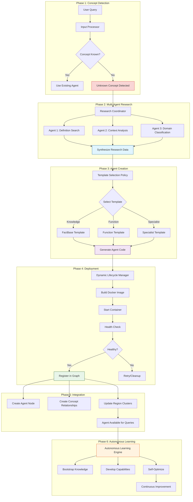
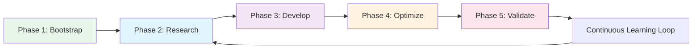

# Myriad-Mind Architecture: Neurogenesis & Learning Systems

**Architecture Documentation** | [Overview](architecture-overview.md) | [Microservices](architecture-microservices.md) | [Graph Intelligence](architecture-graph-intelligence.md)

Comprehensive documentation of the Myriad-Mind neurogenesis system, autonomous learning engine, and adaptive intelligence mechanisms that enable dynamic capability growth.

[← Back to Index](../INDEX.md#architecture) | [Protocols →](../protocols/)

---

## Table of Contents

- [Neurogenesis Overview](#neurogenesis-overview)
- [Biomimetic Neurogenesis Pipeline](#biomimetic-neurogenesis-pipeline)
- [Template-Based Agent Creation](#template-based-agent-creation)
- [Dynamic Lifecycle Manager](#dynamic-lifecycle-manager)
- [Autonomous Learning Engine](#autonomous-learning-engine)
- [Memory Systems (STM/MTM/LTM)](#memory-systems-stmmtmltm)
- [Adaptive Intelligence Patterns](#adaptive-intelligence-patterns)
- [Resource Management](#resource-management)
- [Production Considerations](#production-considerations)

---

## Neurogenesis Overview

### Biological Inspiration

The Myriad-Mind neurogenesis system mimics biological brain development where new neurons are created throughout life in response to learning and experience.

**Biological Neurogenesis**:

- Adult brain generates new neurons in hippocampus (learning center)
- New neurons integrate into existing neural networks
- Process supports memory formation and pattern separation
- Continues throughout life in response to environmental demands

**Myriad Neurogenesis**:

- System creates new specialized agents for unknown concepts
- New agents integrate into existing agent network via graph database
- Supports dynamic capability expansion without retraining
- Enables continuous learning and adaptation

### Key Principles

1. **Dynamic Growth**: Learn by creating new specialized agents, not retraining massive models
2. **Template-Based**: Four specialized agent templates provide rapid instantiation
3. **Graph Integration**: New agents auto-register and become instantly discoverable
4. **Autonomous Learning**: Created agents bootstrap knowledge independently
5. **Resource Efficiency**: Small, specialized agents instead of monolithic models

### System Status

**✅ Phase 2 Neurogenesis: Complete**

The world's first complete biomimetic neurogenesis system operational with:

- Unknown concept detection
- Multi-agent collaborative research
- Template-based dynamic agent creation
- Docker orchestration and lifecycle management
- Graph database integration
- Autonomous learning capabilities

**Validation**: 100% success rate on neurogenesis pipeline testing

---

## Biomimetic Neurogenesis Pipeline

### Complete Pipeline Flow



### Phase 1: Unknown Concept Detection

**Trigger**: Orchestrator cannot find agent for concept via graph traversal

**Implementation** ([`orchestrator.py`](../../src/myriad/services/orchestrator/orchestrator.py)):

```python
def send_task_to_agent(task: dict) -> dict:
    """
    Process task and trigger neurogenesis if no agent found
    """
    concept = task['concept']
    intent = task['intent']
    
    # Attempt agent discovery via graph
    agent_url = discover_agent_via_graph(concept, intent)
    
    if not agent_url:
        print(f"🧠 Unknown concept detected: '{concept}' - triggering neurogenesis")
        
        # Trigger neurogenesis pipeline
        if handle_neurogenesis(task):
            # Retry discovery after agent creation
            agent_url = discover_agent_via_graph(concept, intent)
        else:
            return {"status": "error", "message": "Neurogenesis failed"}
    
    # Proceed with agent task execution
    return execute_agent_task(agent_url, task)
```

### Phase 2: Multi-Agent Research

**Purpose**: Gather knowledge about unknown concept using existing agents

**Coordinator Logic**:

```python
def research_unknown_concept(concept: str, intent: str) -> Dict[str, Any]:
    """
    Coordinate multi-agent research for unknown concept
    
    Returns: Synthesized research data for agent creation
    """
    print(f"📚 Initiating collaborative research for '{concept}'")
    
    research_data = {
        "concept": concept,
        "definitions": [],
        "context": [],
        "domain": "General",
        "complexity": 0.5,
        "related_concepts": []
    }
    
    # Query 1: Definition research
    if available_agents:
        definition_task = {
            "intent": "define",
            "concept": concept,
            "context": "research mode"
        }
        
        definition_results = send_to_available_agents(definition_task)
        research_data["definitions"] = extract_definitions(definition_results)
    
    # Query 2: Context and domain
    context_task = {
        "intent": "analyze_context",
        "concept": concept
    }
    
    context_results = send_to_available_agents(context_task)
    research_data["context"] = extract_context(context_results)
    research_data["domain"] = classify_domain(context_results)
    
    # Query 3: Related concepts via graph
    related_concepts = query_graph_for_related(concept)
    research_data["related_concepts"] = related_concepts
    
    # Query 4: Complexity assessment
    research_data["complexity"] = assess_complexity(
        concept, 
        research_data["definitions"],
        research_data["context"]
    )
    
    print(f"✅ Research complete: {len(research_data['definitions'])} definitions, "
          f"domain={research_data['domain']}, complexity={research_data['complexity']:.2f}")
    
    return research_data
```

### Phase 3: Template Selection

**Policy**: Choose optimal template based on concept characteristics

**Selection Algorithm**:

```python
def select_agent_template(research_data: Dict[str, Any], intent: str) -> str:
    """
    Intelligent template selection based on research data
    
    Returns: Template name ("factbase_basic", "factbase_enhanced", 
             "function_basic", or "specialist_basic")
    """
    concept = research_data["concept"]
    domain = research_data["domain"]
    complexity = research_data["complexity"]
    
    # Rule 1: Function-based intents → Function template
    function_intents = ["execute", "calculate", "analyze", "evaluate"]
    if intent in function_intents:
        print(f"📐 Selected function_basic template (intent={intent})")
        return "function_basic"
    
    # Rule 2: High complexity → Enhanced factbase
    if complexity > 0.7:
        print(f"🎓 Selected factbase_enhanced template (complexity={complexity:.2f})")
        return "factbase_enhanced"
    
    # Rule 3: Specialized domains → Specialist template
    specialist_domains = ["Science", "Technology", "Medicine", "Law"]
    if domain in specialist_domains:
        print(f"🔬 Selected specialist_basic template (domain={domain})")
        return "specialist_basic"
    
    # Rule 4: Default → Basic factbase
    print(f"📚 Selected factbase_basic template (default for {concept})")
    return "factbase_basic"
```

### Phase 4: Code Generation

**Generated Agent Structure**:

Each dynamic agent is a complete Flask microservice (400+ lines):

```python
# Generated structure
dynamic_agents/{concept_name}_ai/
├── app.py              # Flask application (main)
├── Dockerfile          # Container definition
├── requirements.txt    # Python dependencies
└── knowledge_base.json # Initial knowledge from research
```

**Example Generated `app.py`**:

```python
from flask import Flask, request, jsonify
import json
import time

app = Flask(__name__)

# Load initial knowledge from research
with open('knowledge_base.json', 'r') as f:
    KNOWLEDGE_BASE = json.load(f)

CONCEPT = "{concept}"
DOMAIN = "{domain}"

@app.route('/health', methods=['GET'])
def health():
    return jsonify({"status": "healthy", "concept": CONCEPT})

@app.route('/process', methods=['POST'])
def process():
    data = request.get_json()
    intent = data.get('intent')
    
    if intent == 'define':
        return define_concept()
    elif intent == 'explain':
        return explain_concept()
    # ... additional intents based on template
    
def define_concept():
    definition = KNOWLEDGE_BASE.get('primary_definition', 'No definition available')
    return jsonify({
        "status": "success",
        "concept": CONCEPT,
        "definition": definition,
        "source": "dynamic_agent"
    })

# ... peer discovery, learning, refresh logic

if __name__ == '__main__':
    app.run(host='0.0.0.0', port=5000)
```

### Phase 5: Graph Integration

**Automatic Registration**:

```python
def register_agent_in_graph(agent: DynamicAgent, research_data: Dict) -> bool:
    """
    Register newly created agent in Neo4j graph
    """
    # Create Agent node
    agent_payload = {
        "label": "Agent",
        "properties": {
            "name": agent.agent_name,
            "type": f"dynamic_{agent.template}",
            "endpoint": f"http://{agent.container_name}:{agent.port}",
            "port": agent.port,
            "capabilities": agent.capabilities,
            "description": f"Dynamic agent for {agent.concept}",
            "created_at": agent.created_at,
            "is_dynamic": True
        }
    }
    
    response = requests.post(f"{GRAPHDB_URL}/create_node", json=agent_payload)
    
    if response.status_code != 201:
        return False
    
    # Create HANDLES_CONCEPT relationship
    concept_rel = {
        "from_label": "Agent",
        "from_property": "name",
        "from_value": agent.agent_name,
        "to_label": "Concept",
        "to_property": "name",
        "to_value": agent.concept.lower(),
        "relationship_type": "HANDLES_CONCEPT",
        "properties": {
            "weight": 0.5,
            "usage_count": 0,
            "success_count": 0,
            "failure_count": 0,
            "success_rate": 0.5,
            "decay_rate": 0.01,
            "last_updated": int(time.time() * 1000)
        }
    }
    
    requests.post(f"{GRAPHDB_URL}/create_relationship", json=concept_rel)
    
    # Create BELONGS_TO relationship (region)
    region_rel = {
        "from_label": "Agent",
        "from_property": "name",
        "from_value": agent.agent_name,
        "to_label": "Region",
        "to_property": "name",
        "to_value": research_data.get("domain", "General"),
        "relationship_type": "BELONGS_TO",
        "properties": {}
    }
    
    requests.post(f"{GRAPHDB_URL}/create_relationship", json=region_rel)
    
    print(f"✅ Agent registered in graph: {agent.agent_name}")
    return True
```

---

## Template-Based Agent Creation

### Four Specialized Templates

#### 1. FactBase Basic

**Purpose**: Simple knowledge storage and retrieval  
**Use Case**: General concepts with straightforward definitions  
**Capabilities**: `define`, `explain`, `describe`

**Knowledge Structure**:

```json
{
  "concept": "lightbulb",
  "primary_definition": "A device that produces light from electricity",
  "detailed_explanation": "...",
  "key_facts": [
    "Invented by Thomas Edison in 1879",
    "Uses incandescent or LED technology"
  ],
  "domain": "Technology"
}
```

#### 2. FactBase Enhanced

**Purpose**: Advanced reasoning and relationship analysis  
**Use Case**: Complex concepts requiring deep understanding  
**Capabilities**: `define`, `explain`, `analyze_relationships`, `infer`, `compare`

**Enhanced Features**:

- Semantic relationship inference
- Multi-perspective explanations
- Concept comparison and contrast
- Dynamic knowledge expansion

**Example Reasoning**:

```python
@app.route('/analyze_relationships', methods=['POST'])
def analyze_relationships():
    """
    Analyze relationships between this concept and others
    """
    related = KNOWLEDGE_BASE.get('related_concepts', [])
    
    relationships = []
    for related_concept in related:
        # Query graph for relationship type
        rel_type = query_relationship_type(CONCEPT, related_concept)
        
        relationships.append({
            "concept": related_concept,
            "relationship_type": rel_type,
            "strength": calculate_relationship_strength(CONCEPT, related_concept)
        })
    
    return jsonify({
        "status": "success",
        "concept": CONCEPT,
        "relationships": relationships
    })
```

#### 3. Function Basic

**Purpose**: Perform calculations, analyses, or transformations  
**Use Case**: Operational concepts that involve computation  
**Capabilities**: `execute`, `calculate`, `analyze`, `evaluate`, `impact_analysis`

**Function Structure**:

```python
@app.route('/execute', methods=['POST'])
def execute_function():
    """
    Execute concept-specific function
    """
    data = request.get_json()
    args = data.get('args', {})
    
    # Retrieve function definition from knowledge base
    function_def = KNOWLEDGE_BASE.get('function_definition')
    
    try:
        result = eval_function(function_def, args)
        
        return jsonify({
            "status": "success",
            "concept": CONCEPT,
            "result": result,
            "performance_metrics": {
                "execution_time_ms": calculate_execution_time()
            }
        })
    except Exception as e:
        return jsonify({
            "status": "error",
            "message": str(e)
        }), 500
```

#### 4. Specialist Basic

**Purpose**: Domain expertise and specialized analysis  
**Use Case**: Domain-specific concepts (Science, Medicine, Law)  
**Capabilities**: `define`, `analyze`, `expert_opinion`, `domain_context`, `best_practices`

**Specialist Features**:

```python
@app.route('/expert_opinion', methods=['POST'])
def expert_opinion():
    """
    Provide expert analysis in domain
    """
    query = request.get_json().get('query')
    
    # Leverage domain-specific knowledge
    domain_context = KNOWLEDGE_BASE.get('domain_knowledge', {})
    best_practices = KNOWLEDGE_BASE.get('best_practices', [])
    
    expert_analysis = {
        "domain": DOMAIN,
        "concept": CONCEPT,
        "analysis": analyze_from_expert_perspective(query, domain_context),
        "recommendations": best_practices,
        "confidence": calculate_confidence_score()
    }
    
    return jsonify({
        "status": "success",
        "expert_opinion": expert_analysis
    })
```

### Template Comparison

| Feature | FactBase Basic | FactBase Enhanced | Function Basic | Specialist Basic |
|---------|---------------|-------------------|----------------|------------------|
| **Complexity** | Low | High | Medium | High |
| **Knowledge Depth** | Basic | Advanced | Functional | Domain-Expert |
| **Reasoning** | None | Inference | Computational | Analytical |
| **Relationship Analysis** | ❌ | ✅ | ❌ | ✅ |
| **Execution** | ❌ | ❌ | ✅ | ⚠️ |
| **Domain Specialization** | ❌ | ⚠️ | ❌ | ✅ |
| **Learning Capability** | Basic | Advanced | Basic | Advanced |
| **Resource Usage** | Low | Medium | Medium | High |

---

## Dynamic Lifecycle Manager

### Overview

**Implementation**: [`src/myriad/core/lifecycle/dynamic_lifecycle_manager.py`](../../src/myriad/core/lifecycle/dynamic_lifecycle_manager.py)

**Purpose**: Manages complete lifecycle of dynamic agents from creation to cleanup

### Agent Lifecycle States

```python
class AgentStatus(Enum):
    CREATING = "creating"        # Being created
    BUILDING = "building"        # Docker image building
    STARTING = "starting"        # Container starting
    HEALTHY = "healthy"          # Operational and passing health checks
    DEGRADED = "degraded"        # Running but health check warnings
    FAILED = "failed"            # Creation or health check failed
    STOPPING = "stopping"        # Being shut down
    STOPPED = "stopped"          # Container stopped
```

### Core Operations

#### 1. Agent Creation

```python
def create_agent(self, concept: str, intent: str, 
                research_data: Dict[str, Any], 
                region: str = "General") -> Optional[DynamicAgent]:
    """
    Create a new dynamic agent for concept
    
    Returns: DynamicAgent instance or None if creation fails
    """
    print(f"🧬 Creating dynamic agent for '{concept}'")
    
    # Select template
    template = self._select_template(research_data, intent)
    
    # Generate unique agent name
    agent_name = self._generate_agent_name(concept)
    
    # Allocate port
    port = self._allocate_port()
    
    if not port:
        print("❌ No available ports for new agent")
        return None
    
    # Create agent instance
    agent = DynamicAgent(
        agent_name=agent_name,
        concept=concept,
        template=template,
        port=port,
        region=region,
        created_at=time.time(),
        status=AgentStatus.CREATING
    )
    
    # Generate agent files
    agent_path = self._generate_agent_files(agent, research_data)
    
    # Build and start Docker container
    if self._build_and_start_agent(agent, agent_path):
        # Wait for health check
        if self._wait_for_healthy(agent, timeout=60):
            # Register in graph
            if self._register_in_graph(agent, research_data):
                agent.status = AgentStatus.HEALTHY
                self.agents[agent.agent_name] = agent
                
                print(f"✅ Agent created successfully: {agent_name} on port {port}")
                return agent
    
    # Cleanup on failure
    self._cleanup_failed_agent(agent)
    return None
```

#### 2. Health Monitoring

```python
def _wait_for_healthy(self, agent: DynamicAgent, timeout: int = 60) -> bool:
    """
    Wait for agent to become healthy via health check endpoint
    """
    start_time = time.time()
    agent_url = f"http://localhost:{agent.port}"
    
    while time.time() - start_time < timeout:
        try:
            response = requests.get(f"{agent_url}/health", timeout=2)
            
            if response.status_code == 200:
                health_data = response.json()
                
                if health_data.get("status") == "healthy":
                    print(f"✅ Agent {agent.agent_name} is healthy")
                    return True
        except requests.exceptions.RequestException:
            pass  # Not ready yet
        
        time.sleep(2)  # Check every 2 seconds
    
    print(f"❌ Agent {agent.agent_name} failed health check (timeout)")
    return False
```

#### 3. Port Allocation

```python
def _allocate_port(self) -> Optional[int]:
    """
    Allocate available port from range 7000-9999
    """
    used_ports = {agent.port for agent in self.agents.values()}
    
    for port in range(7000, 10000):
        if port not in used_ports and self._is_port_available(port):
            return port
    
    return None

def _is_port_available(self, port: int) -> bool:
    """Check if port is available on host"""
    import socket
    
    with socket.socket(socket.AF_INET, socket.SOCK_STREAM) as s:
        try:
            s.bind(('', port))
            return True
        except OSError:
            return False
```

#### 4. Docker Container Management

```python
def _build_and_start_agent(self, agent: DynamicAgent, agent_path: Path) -> bool:
    """
    Build Docker image and start container
    """
    agent.status = AgentStatus.BUILDING
    
    # Build Docker image
    build_cmd = ["docker", "build", "-t", agent.container_name, str(agent_path)]
    
    try:
        result = subprocess.run(
            build_cmd, 
            capture_output=True, 
            text=True, 
            timeout=300  # 5 minute timeout
        )
        
        if result.returncode != 0:
            print(f"❌ Docker build failed: {result.stderr}")
            return False
        
        print(f"✅ Docker image built: {agent.container_name}")
    except subprocess.TimeoutExpired:
        print(f"❌ Docker build timeout for {agent.container_name}")
        return False
    
    # Start container
    agent.status = AgentStatus.STARTING
    
    run_cmd = [
        "docker", "run", "-d",
        "--name", agent.container_name,
        "-p", f"{agent.port}:5000",
        "-e", f"PORT=5000",
        "-e", f"CONCEPT={agent.concept}",
        "-e", f"GRAPHDB_URL={GRAPHDB_URL}",
        "--network", "myriad_network",
        agent.container_name
    ]
    
    try:
        result = subprocess.run(run_cmd, capture_output=True, text=True, timeout=60)
        
        if result.returncode != 0:
            print(f"❌ Container start failed: {result.stderr}")
            return False
        
        agent.container_id = result.stdout.strip()
        print(f"✅ Container started: {agent.container_name}")
        return True
    except subprocess.TimeoutExpired:
        print(f"❌ Container start timeout for {agent.container_name}")
        return False
```

#### 5. Agent Cleanup

```python
def stop_agent(self, agent_name: str) -> bool:
    """
    Stop and remove dynamic agent
    """
    agent = self.agents.get(agent_name)
    
    if not agent:
        return False
    
    print(f"🛑 Stopping agent: {agent_name}")
    
    agent.status = AgentStatus.STOPPING
    
    # Stop container
    subprocess.run(["docker", "stop", agent.container_name], capture_output=True)
    
    # Remove container
    subprocess.run(["docker", "rm", agent.container_name], capture_output=True)
    
    # Remove from graph (optional - keep for history)
    # self._deregister_from_graph(agent)
    
    # Mark as stopped
    agent.status = AgentStatus.STOPPED
    
    # Release port
    self.used_ports.discard(agent.port)
    
    print(f"✅ Agent stopped: {agent_name}")
    return True
```

---

## Autonomous Learning Engine

### Overview

**Implementation**: [`src/myriad/core/learning/autonomous_learning_engine.py`](../../src/myriad/core/learning/autonomous_learning_engine.py)

**Purpose**: Enable dynamic agents to bootstrap knowledge and continuously improve after creation

### 5-Phase Learning System



#### Phase 1: Knowledge Bootstrap

**Goal**: Initial knowledge acquisition from multiple sources

```python
def bootstrap_knowledge(self, agent_id: str, concept: str) -> Dict[str, Any]:
    """
    Bootstrap initial knowledge for newly created agent
    
    Sources:
    1. Graph database (related concepts)
    2. Existing agents (collaborative knowledge)
    3. External knowledge bases (if configured)
    """
    print(f"📚 Phase 1: Bootstrapping knowledge for {concept}")
    
    knowledge = {
        "core_facts": [],
        "relationships": [],
        "domain_context": {},
        "confidence": 0.3  # Initial low confidence
    }
    
    # Source 1: Query graph for related concepts
    related_concepts = self._query_graph_relationships(concept)
    knowledge["relationships"] = related_concepts
    
    # Source 2: Query existing agents
    for related_concept in related_concepts[:5]:  # Top 5 related
        agent_knowledge = self._query_agent_for_knowledge(related_concept)
        if agent_knowledge:
            knowledge["core_facts"].extend(agent_knowledge)
    
    # Source 3: Domain classification
    knowledge["domain_context"] = self._classify_domain_context(concept, knowledge)
    
    # Update agent knowledge base
    self._update_agent_knowledge(agent_id, knowledge)
    
    print(f"✅ Bootstrap complete: {len(knowledge['core_facts'])} facts acquired")
    return knowledge
```

#### Phase 2: Active Research

**Goal**: Expand knowledge through targeted research

```python
def conduct_research(self, agent_id: str, concept: str) -> Dict[str, Any]:
    """
    Phase 2: Active research to expand knowledge
    """
    print(f"🔬 Phase 2: Conducting research for {concept}")
    
    research_results = {
        "expanded_definitions": [],
        "use_cases": [],
        "expert_insights": [],
        "knowledge_gaps": []
    }
    
    # Research Strategy 1: Collaborative learning from peers
    peer_agents = self._discover_peer_agents(agent_id)
    
    for peer in peer_agents:
        # Ask peer for insights about concept
        insight = self._request_peer_insight(peer, concept)
        if insight:
            research_results["expert_insights"].append(insight)
    
    # Research Strategy 2: Identify knowledge gaps
    current_knowledge = self._get_agent_knowledge(agent_id)
    gaps = self._identify_knowledge_gaps(current_knowledge, concept)
    research_results["knowledge_gaps"] = gaps
    
    # Research Strategy 3: Fill gaps through targeted queries
    for gap in gaps[:3]:  # Top 3 gaps
        filling = self._fill_knowledge_gap(gap, concept)
        if filling:
            research_results["expanded_definitions"].append(filling)
    
    return research_results
```

#### Phase 3: Capability Development

**Goal**: Develop specialized capabilities based on learned knowledge

```python
def develop_capabilities(self, agent_id: str, research_data: Dict) -> List[str]:
    """
    Phase 3: Develop new capabilities based on research
    """
    print(f"🛠️ Phase 3: Developing capabilities for {agent_id}")
    
    new_capabilities = []
    
    # Analyze research data to identify potential capabilities
    knowledge = self._get_agent_knowledge(agent_id)
    
    # Capability 1: If many relationships → add relationship analysis
    if len(knowledge.get("relationships", [])) > 5:
        if "analyze_relationships" not in self._get_current_capabilities(agent_id):
            self._add_capability(agent_id, "analyze_relationships")
            new_capabilities.append("analyze_relationships")
    
    # Capability 2: If domain-specific → add expert opinion
    domain = knowledge.get("domain_context", {}).get("domain")
    if domain in ["Science", "Technology", "Medicine"]:
        if "expert_opinion" not in self._get_current_capabilities(agent_id):
            self._add_capability(agent_id, "expert_opinion")
            new_capabilities.append("expert_opinion")
    
    # Capability 3: If functional knowledge → add execution
    if self._has_functional_knowledge(knowledge):
        if "execute" not in self._get_current_capabilities(agent_id):
            self._add_capability(agent_id, "execute")
            new_capabilities.append("execute")
    
    print(f"✅ Developed {len(new_capabilities)} new capabilities: {new_capabilities}")
    return new_capabilities
```

#### Phase 4: Self-Optimization

**Goal**: Optimize performance based on usage patterns

```python
def optimize_performance(self, agent_id: str) -> Dict[str, Any]:
    """
    Phase 4: Self-optimization based on performance metrics
    """
    print(f"⚡ Phase 4: Optimizing performance for {agent_id}")
    
    metrics = self._get_performance_metrics(agent_id)
    
    optimizations = {
        "cache_optimizations": [],
        "query_optimizations": [],
        "knowledge_pruning": []
    }
    
    # Optimization 1: Cache frequently accessed knowledge
    frequent_queries = metrics.get("frequent_queries", [])
    for query in frequent_queries:
        if not self._is_cached(agent_id, query):
            self._cache_query_result(agent_id, query)
            optimizations["cache_optimizations"].append(query)
    
    # Optimization 2: Prune low-value knowledge
    knowledge_items = self._get_knowledge_items(agent_id)
    for item in knowledge_items:
        if item["usage_count"] == 0 and item["age_days"] > 30:
            self._prune_knowledge_item(agent_id, item["id"])
            optimizations["knowledge_pruning"].append(item["id"])
    
    # Optimization 3: Optimize graph queries
    slow_queries = [q for q in metrics.get("queries", []) if q["duration_ms"] > 1000]
    for query in slow_queries:
        optimized = self._optimize_query(query)
        if optimized:
            optimizations["query_optimizations"].append(query["id"])
    
    return optimizations
```

#### Phase 5: Validation & Iteration

**Goal**: Validate learning and iterate on improvements

```python
def validate_and_iterate(self, agent_id: str) -> bool:
    """
    Phase 5: Validate learning effectiveness
    """
    print(f"✓ Phase 5: Validating learning for {agent_id}")
    
    # Validation 1: Knowledge completeness
    knowledge = self._get_agent_knowledge(agent_id)
    completeness_score = self._assess_knowledge_completeness(knowledge)
    
    # Validation 2: Capability effectiveness
    capabilities = self._get_current_capabilities(agent_id)
    capability_usage = self._get_capability_usage_stats(agent_id)
    
    # Validation 3: Performance improvement
    metrics_now = self._get_performance_metrics(agent_id)
    metrics_before = self._get_historical_metrics(agent_id, days_ago=7)
    
    improvement = {
        "success_rate_delta": metrics_now["success_rate"] - metrics_before["success_rate"],
        "response_time_delta": metrics_now["avg_response_time"] - metrics_before["avg_response_time"]
    }
    
    # Decide if more learning needed
    if completeness_score < 0.7 or improvement["success_rate_delta"] < 0.1:
        print(f"🔄 Agent needs more learning (completeness={completeness_score:.2f})")
        return False  # Continue learning
    
    print(f"✅ Agent learning validated (completeness={completeness_score:.2f})")
    return True  # Learning successful
```

### Learning Session Management

**Background Learning Thread**:

```python
def start_learning_session(self, agent_id: str, concept: str):
    """
    Start background learning session for agent
    """
    def learning_loop():
        while self.learning_active[agent_id]:
            try:
                # Phase 1-5 execution
                knowledge = self.bootstrap_knowledge(agent_id, concept)
                research = self.conduct_research(agent_id, concept)
                capabilities = self.develop_capabilities(agent_id, research)
                optimizations = self.optimize_performance(agent_id)
                validated = self.validate_and_iterate(agent_id)
                
                if validated:
                    print(f"✅ Learning cycle complete for {agent_id}")
                    time.sleep(3600)  # Learn every hour
                else:
                    print(f"🔄 Continuing learning for {agent_id}")
                    time.sleep(600)  # Retry in 10 minutes
            except Exception as e:
                print(f"❌ Learning error for {agent_id}: {e}")
                time.sleep(600)
    
    # Start background thread
    self.learning_active[agent_id] = True
    thread = threading.Thread(target=learning_loop, daemon=True)
    thread.start()
    self.learning_threads[agent_id] = thread
```

---

## Memory Systems (STM/MTM/LTM)

### Three-Tier Memory Architecture

Inspired by biological memory systems:

#### 1. Short-Term Memory (STM)

**Storage**: In-memory cache (Redis optional)  
**Retention**: Seconds to minutes  
**Purpose**: Immediate query context and active processing

```python
class ShortTermMemory:
    def __init__(self):
        self.memory = {}  # In-memory dict
        self.max_items = 100
        self.ttl_seconds = 300  # 5 minutes
    
    def store(self, key: str, value: Any):
        """Store in STM with timestamp"""
        self.memory[key] = {
            "value": value,
            "timestamp": time.time()
        }
        
        # Evict old items if over capacity
        if len(self.memory) > self.max_items:
            self._evict_oldest()
    
    def retrieve(self, key: str) -> Optional[Any]:
        """Retrieve from STM if not expired"""
        item = self.memory.get(key)
        
        if item and (time.time() - item["timestamp"]) < self.ttl_seconds:
            return item["value"]
        
        return None  # Expired or not found
```

#### 2. Medium-Term Memory (MTM)

**Storage**: Redis with TTL  
**Retention**: Minutes to hours  
**Purpose**: Session context and working conversation state

```python
class MediumTermMemory:
    def __init__(self, redis_client):
        self.redis = redis_client
        self.default_ttl = 1800  # 30 minutes
    
    def store(self, key: str, value: Any, ttl: int = None):
        """Store in MTM with automatic expiration"""
        ttl = ttl or self.default_ttl
        
        self.redis.setex(
            key,
            ttl,
            json.dumps(value)
        )
    
    def retrieve(self, key: str) -> Optional[Any]:
        """Retrieve from MTM"""
        data = self.redis.get(key)
        
        if data:
            return json.loads(data)
        
        return None
    
    def extend_ttl(self, key: str, additional_seconds: int = 300):
        """Extend TTL on access (keep-alive)"""
        self.redis.expire(key, self.redis.ttl(key) + additional_seconds)
```

#### 3. Long-Term Memory (LTM)

**Storage**: Neo4j graph database  
**Retention**: Persistent (permanent with pruning policies)  
**Purpose**: Knowledge base, user profiles, conversation history

```python
class LongTermMemory:
    def __init__(self, graphdb_url: str):
        self.graphdb_url = graphdb_url
    
    def store_knowledge(self, concept: str, knowledge_data: Dict):
        """Store knowledge permanently in graph"""
        # Create or update concept node
        payload = {
            "label": "Concept",
            "properties": {
                "name": concept.lower(),
                "knowledge": json.dumps(knowledge_data),
                "last_updated": time.time()
            }
        }
        
        requests.post(f"{self.graphdb_url}/upsert_node", json=payload)
    
    def retrieve_knowledge(self, concept: str) -> Optional[Dict]:
        """Retrieve knowledge from graph"""
        response = requests.get(
            f"{self.graphdb_url}/get_node/Concept/name/{concept.lower()}"
        )
        
        if response.status_code == 200:
            node_data = response.json()
            return json.loads(node_data.get("knowledge", "{}"))
        
        return None
    
    def store_conversation(self, user_id: str, conversation_data: Dict):
        """Store conversation history permanently"""
        # Create conversation graph structure
        # (User)-[:STARTED]->(Conversation)-[:HAS_TURN]->(Turn)-[:MENTIONS]->(Concept)
        pass  # See Context Understanding Architecture
```

### Memory Integration Pattern

```python
class AgentMemorySystem:
    """
    Integrated memory system for dynamic agents
    """
    def __init__(self, redis_client, graphdb_url):
        self.stm = ShortTermMemory()
        self.mtm = MediumTermMemory(redis_client)
        self.ltm = LongTermMemory(graphdb_url)
    
    def remember(self, key: str, value: Any, persistence: str = "short"):
        """
        Store memory at appropriate tier
        
        Args:
            persistence: "short", "medium", or "long"
        """
        if persistence == "short":
            self.stm.store(key, value)
        elif persistence == "medium":
            self.mtm.store(key, value)
        elif persistence == "long":
            self.ltm.store_knowledge(key, value)
    
    def recall(self, key: str) -> Optional[Any]:
        """
        Retrieve from memory tiers (STM → MTM → LTM)
        """
        # Try STM first (fastest)
        value = self.stm.retrieve(key)
        if value is not None:
            return value
        
        # Try MTM (medium speed)
        value = self.mtm.retrieve(key)
        if value is not None:
            # Promote to STM for faster access
            self.stm.store(key, value)
            return value
        
        # Try LTM (slowest but comprehensive)
        value = self.ltm.retrieve_knowledge(key)
        if value is not None:
            # Promote to MTM for session access
            self.mtm.store(key, value)
            return value
        
        return None  # Not found in any tier
```

---

## Adaptive Intelligence Patterns

### 1. Performance-Based Adaptation

**Pattern**: Adjust agent behavior based on success/failure patterns

```python
def adapt_to_performance(agent_id: str):
    """
    Adapt agent strategy based on performance metrics
    """
    metrics = get_performance_metrics(agent_id)
    
    if metrics["success_rate"] < 0.6:
        # Low success rate → Request more collaborative help
        enable_peer_collaboration(agent_id, level="high")
        increase_research_depth(agent_id)
    
    if metrics["avg_response_time"] > 2000:  # > 2 seconds
        # Slow response → Enable caching
        enable_aggressive_caching(agent_id)
        optimize_knowledge_queries(agent_id)
    
    if metrics["error_rate"] > 0.2:
        # High errors → Fall back to simpler strategies
        reduce_complexity(agent_id)
        enable_fallback_responses(agent_id)
```

### 2. User Feedback Integration

**Pattern**: Learn from user interactions and corrections

```python
def learn_from_feedback(agent_id: str, feedback: Dict):
    """
    Incorporate user feedback into agent learning
    """
    if feedback["rating"] == "positive":
        # Reinforce successful patterns
        strengthen_knowledge_path(agent_id, feedback["query"])
        increase_confidence(agent_id, feedback["concept"])
    
    elif feedback["rating"] == "negative":
        # Adjust unsuccessful patterns
        weaken_knowledge_path(agent_id, feedback["query"])
        
        if feedback.get("correction"):
            # Learn from correction
            update_knowledge(agent_id, feedback["correction"])
            trigger_research_session(agent_id, feedback["concept"])
```

### 3. Cross-Domain Learning

**Pattern**: Transfer knowledge across related domains

```python
def transfer_learning(source_agent: str, target_agent: str, concept: str):
    """
    Transfer knowledge from source to target agent
    """
    # Get source agent's knowledge about concept
    source_knowledge = get_agent_knowledge(source_agent, concept)
    
    # Identify transferable patterns
    transferable = filter_transferable_knowledge(
        source_knowledge,
        source_domain=get_agent_domain(source_agent),
        target_domain=get_agent_domain(target_agent)
    )
    
    # Apply transferred knowledge to target
    for item in transferable:
        adapted_item = adapt_to_target_domain(item, target_agent)
        add_knowledge(target_agent, adapted_item, source="transfer_learning")
```

---

## Resource Management

### Capacity Constraints

**Problem**: Unlimited neurogenesis can exhaust host resources

**Solution**: Resource quotas and lifecycle management

```python
# Configuration
MAX_CONCURRENT_AGENTS = int(os.environ.get("MAX_DYNAMIC_AGENTS", "20"))
AGENT_CPU_LIMIT = os.environ.get("AGENT_CPU_LIMIT", "0.5")  # 0.5 cores
AGENT_MEMORY_LIMIT = os.environ.get("AGENT_MEMORY_LIMIT", "256m")
AGENT_IDLE_TIMEOUT_MIN = int(os.environ.get("AGENT_IDLE_TIMEOUT", "30"))
AGENT_MAX_AGE_HOURS = int(os.environ.get("AGENT_MAX_AGE_HOURS", "24"))
```

### Enhanced Container Creation with Limits

```python
def create_agent_container_with_limits(agent: DynamicAgent) -> bool:
    """
    Create container with resource constraints
    """
    run_cmd = [
        "docker", "run", "-d",
        "--name", agent.container_name,
        "-p", f"{agent.port}:5000",
        "--cpus", AGENT_CPU_LIMIT,           # CPU limit
        "--memory", AGENT_MEMORY_LIMIT,       # Memory limit
        "--memory-swap", AGENT_MEMORY_LIMIT,  # No swap
        "--restart", "unless-stopped",
        "--label", f"myriad.agent=true",
        "--label", f"myriad.concept={agent.concept}",
        "--label", f"myriad.created={agent.created_at}",
        "--network", "myriad_network",
        agent.container_name
    ]
    
    result = subprocess.run(run_cmd, capture_output=True, text=True)
    return result.returncode == 0
```

### Lifecycle Management Loop

```python
def lifecycle_management_loop():
    """
    Background thread for agent lifecycle management
    """
    while True:
        try:
            current_time = time.time()
            agents_to_stop = []
            
            for agent_id, agent in agents.items():
                if agent.status != AgentStatus.HEALTHY:
                    continue
                
                # Check idle timeout
                last_used = agent_last_used.get(agent_id, agent.created_at)
                idle_minutes = (current_time - last_used) / 60
                
                if idle_minutes > AGENT_IDLE_TIMEOUT_MIN:
                    print(f"⏰ Agent {agent.agent_name} idle for {idle_minutes:.1f} min")
                    agents_to_stop.append(agent_id)
                    continue
                
                # Check max age
                age_hours = (current_time - agent.created_at) / 3600
                if age_hours > AGENT_MAX_AGE_HOURS:
                    print(f"⏳ Agent {agent.agent_name} reached max age {age_hours:.1f}h")
                    agents_to_stop.append(agent_id)
            
            # Stop aged/idle agents
            for agent_id in agents_to_stop:
                stop_agent(agent_id)
            
            # Process creation queue if capacity available
            process_creation_queue()
            
            time.sleep(60)  # Check every minute
        except Exception as e:
            print(f"❌ Lifecycle management error: {e}")
            time.sleep(60)
```

### Creation Queue

```python
def create_agent_with_queue(concept: str, intent: str, research_data: Dict) -> Optional[DynamicAgent]:
    """
    Create agent with capacity management
    """
    active_count = count_active_agents()
    
    if active_count >= MAX_CONCURRENT_AGENTS:
        print(f"⚠️  At capacity ({active_count}/{MAX_CONCURRENT_AGENTS})")
        
        # Queue for later
        creation_queue.append({
            "concept": concept,
            "intent": intent,
            "research_data": research_data,
            "queued_at": time.time()
        })
        
        return None
    
    # Create immediately
    return create_agent(concept, intent, research_data)

def process_creation_queue():
    """
    Process queued agent creation requests
    """
    while creation_queue and count_active_agents() < MAX_CONCURRENT_AGENTS:
        request = creation_queue.pop(0)
        
        print(f"📋 Processing queued agent creation for '{request['concept']}'")
        
        create_agent(
            request['concept'],
            request['intent'],
            request['research_data']
        )
```

---

## Production Considerations

### 1. Security

**Docker Security**:

```yaml
# docker-compose.yml - secure configuration
services:
  dynamic_agent:
    security_opt:
      - no-new-privileges:true
    cap_drop:
      - ALL
    cap_add:
      - NET_BIND_SERVICE
    read_only: true
    tmpfs:
      - /tmp
```

**Network Isolation**:

```yaml
networks:
  myriad_network:
    driver: bridge
    internal: false  # false for external API access
    ipam:
      config:
        - subnet: 172.28.0.0/16
```

### 2. Monitoring

**Prometheus Metrics**:

```python
from prometheus_client import Counter, Gauge, Histogram

# Metrics
neurogenesis_total = Counter('neurogenesis_total', 'Total neurogenesis events')
neurogenesis_failures = Counter('neurogenesis_failures', 'Failed neurogenesis')
active_dynamic_agents = Gauge('active_dynamic_agents', 'Active dynamic agents')
agent_creation_duration = Histogram('agent_creation_duration_seconds', 'Agent creation time')

@agent_creation_duration.time()
def create_agent_monitored(concept, intent, research_data):
    neurogenesis_total.inc()
    
    agent = create_agent(concept, intent, research_data)
    
    if agent:
        active_dynamic_agents.inc()
    else:
        neurogenesis_failures.inc()
    
    return agent
```

### 3. Logging

**Structured Logging**:

```python
import logging
import json

logger = logging.getLogger("neurogenesis")

def log_neurogenesis_event(event_type: str, agent_id: str, details: Dict):
    """
    Structured logging for neurogenesis events
    """
    log_entry = {
        "timestamp": time.time(),
        "event_type": event_type,
        "agent_id": agent_id,
        "details": details
    }
    
    logger.info(json.dumps(log_entry))
```

### 4. Backup & Recovery

**Agent Snapshot**:

```python
def snapshot_agent_state(agent_id: str) -> Dict:
    """
    Create snapshot of agent state for backup
    """
    agent = agents[agent_id]
    
    snapshot = {
        "agent_name": agent.agent_name,
        "concept": agent.concept,
        "template": agent.template,
        "port": agent.port,
        "created_at": agent.created_at,
        "knowledge_base": get_agent_knowledge(agent_id),
        "performance_metrics": get_performance_metrics(agent_id),
        "graph_relationships": get_graph_relationships(agent_id)
    }
    
    # Store snapshot
    with open(f"backups/{agent_id}_snapshot.json", "w") as f:
        json.dump(snapshot, f, indent=2)
    
    return snapshot

def restore_agent_from_snapshot(snapshot_path: str) -> bool:
    """
    Restore agent from snapshot
    """
    with open(snapshot_path, "r") as f:
        snapshot = json.load(f)
    
    # Recreate agent with saved state
    agent = create_agent(
        snapshot["concept"],
        "define",  # Default intent
        {"knowledge": snapshot["knowledge_base"]}
    )
    
    if agent:
        # Restore relationships
        restore_graph_relationships(agent.agent_name, snapshot["graph_relationships"])
        return True
    
    return False
```

---

## Related Documentation

**Architecture:**

- [System Overview](architecture-overview.md)
- [Microservices Architecture](architecture-microservices.md)
- [Graph Intelligence](architecture-graph-intelligence.md)

**Implementation:**

- [Sprint 4: Neurogenesis](../implementation/implementation-sprint-4.md)
- [Sprint 5: Autonomous Learning](../implementation/implementation-sprint-5.md)
- [Sprint 6: Advanced Features](../implementation/implementation-sprint-6.md)

**Protocols:**

- [Neurogenesis Protocols](../protocols/protocols-level-2-neurogenesis.md)
- [Advanced Protocols](../protocols/protocols-level-3-advanced.md)

**Source Code:**

- [`dynamic_lifecycle_manager.py`](../../src/myriad/core/lifecycle/dynamic_lifecycle_manager.py)
- [`autonomous_learning_engine.py`](../../src/myriad/core/learning/autonomous_learning_engine.py)
- [`agent_templates.py`](../../src/myriad/core/templates/agent_templates.py)

[↑ Back to Index](../INDEX.md) | [Overview →](architecture-overview.md)
