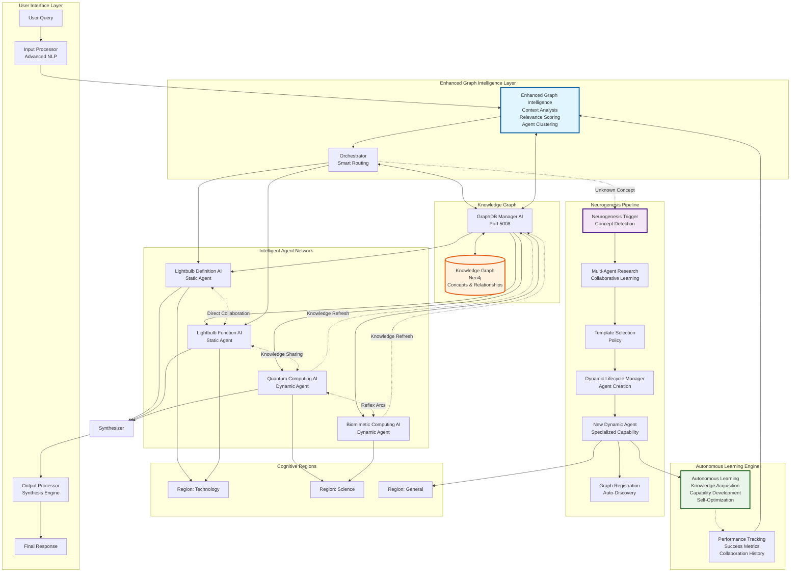
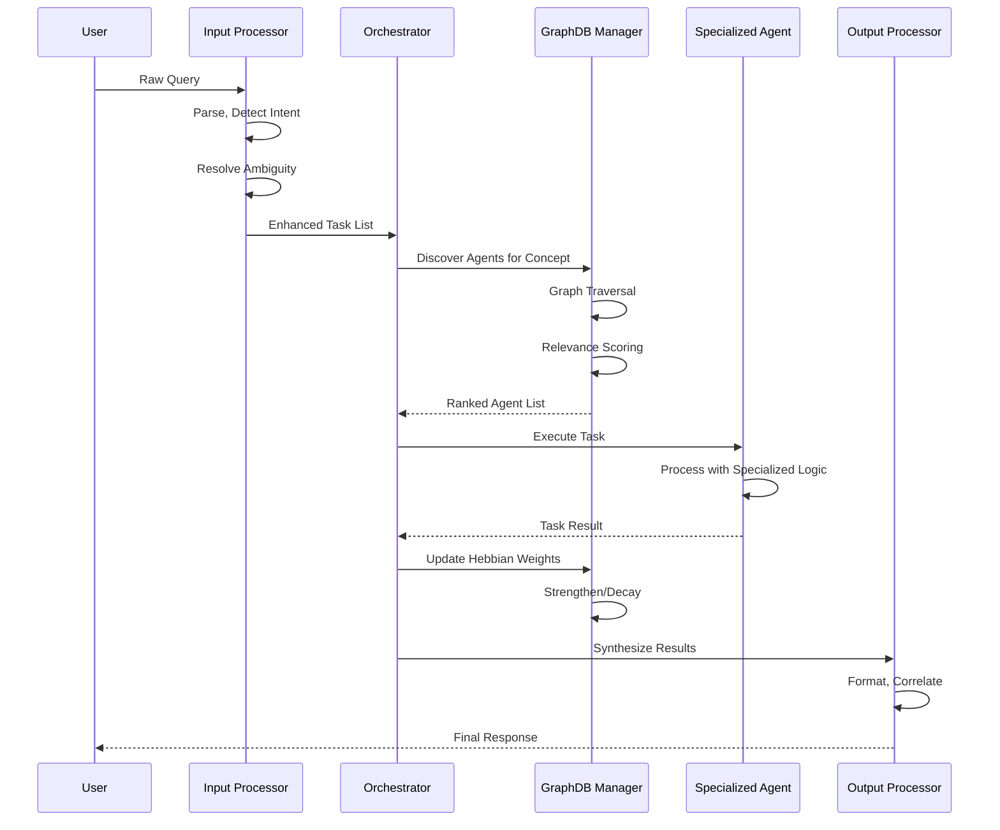
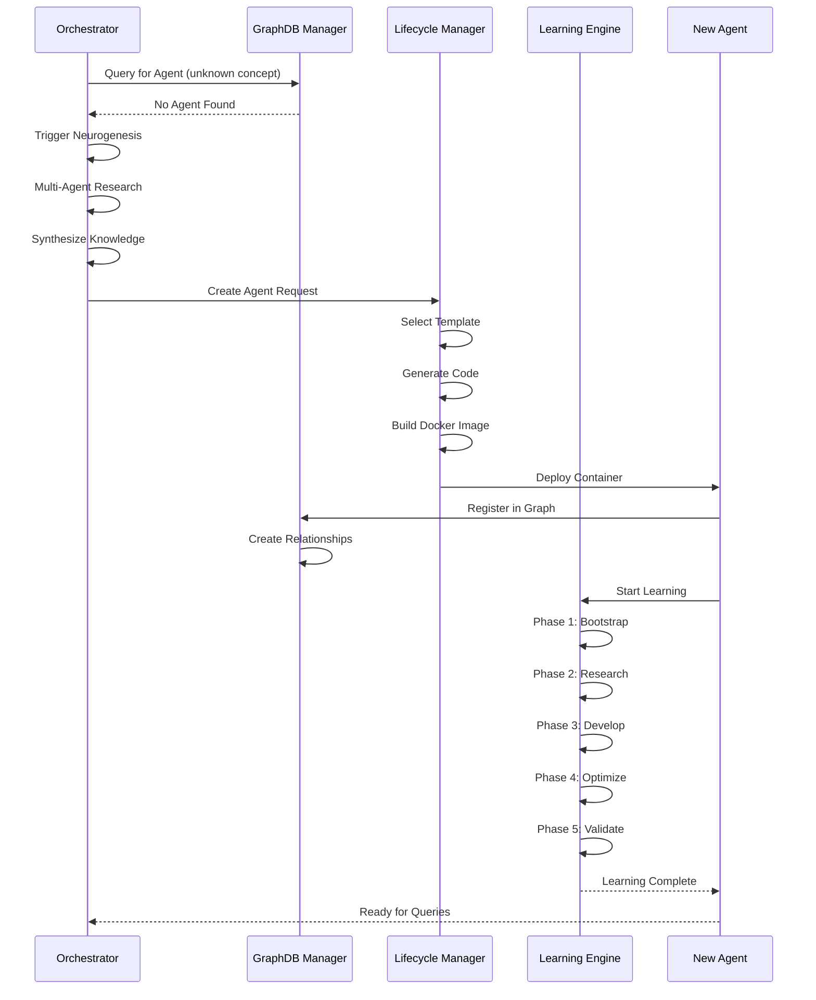

# Myriad-Mind Architecture: System Overview

**Architecture Documentation** | [Microservices](architecture-microservices.md) | [Graph Intelligence](architecture-graph-intelligence.md) | [Neurogenesis](architecture-neurogenesis.md)

Comprehensive overview of the Myriad-Mind system architecture, design principles, and component relationships.

[← Back to Index](../INDEX.md#architecture) | [Implementation Guide →](../implementation/implementation-sprint-1.md)

---

## Table of Contents

- [Core Philosophy](#core-philosophy)
- [Design Principles](#design-principles)
- [System Architecture Overview](#system-architecture-overview)
- [Current Implementation Status](#current-implementation-status)
- [Technology Stack](#technology-stack)
- [Component Catalog](#component-catalog)
- [Process Flow](#process-flow)
- [Architectural Evolution Path](#architectural-evolution-path)

---

## Core Philosophy

The Myriad Cognitive Architecture is a fundamental departure from the paradigm of monolithic, large-scale AI models. It is founded on the principle that true, scalable, and explainable intelligence is not born from a single, all-knowing entity, but emerges from the dynamic collaboration of countless, hyper-specialized, and minimalist agents.

### Guiding Principles

Our guiding principles are inspired by neurobiology:

1. **Radical Specialization (The Neuron)**

   Like a neuron in the brain is specialized for a task, each "Myriad Agent" is the smallest possible unit of knowledge or function. It knows one thing, and it knows it perfectly. An agent for "the concept of gravity" does not know about poetry.

2. **Emergent Intelligence (The Brain)**

   Intelligence is not located in any single agent but is an emergent property of the entire network. A complex answer is synthesized from the simple, factual outputs of many collaborating agents.

3. **Dynamic Growth (Neurogenesis)**

   The system's primary method of learning new concepts is not by retraining a massive model, but by creating, training, and integrating a *new agent* into the network. The brain grows by adding neurons, and so does Myriad.

4. **Efficiency and Resource Frugality**

   The system must be computationally efficient. Querying "What is 2+2?" should activate a tiny, near-instantaneous function agent, not a multi-billion parameter LLM.

5. **Biomimetic Learning**

   Learning occurs through Hebbian principles: "agents that fire together, wire together." Connection weights strengthen with successful collaboration.

---

## Design Principles

### Agent-Centric Architecture

- **Microservice Independence**: Each agent is a self-contained microservice
- **Minimal Coupling**: Agents communicate through well-defined interfaces
- **Specialized Knowledge**: Each agent embodies a single concept or function
- **Collaborative Intelligence**: Complex tasks emerge from agent coordination

### Graph-Based Knowledge

- **Neo4j Foundation**: All knowledge and relationships stored in graph database
- **Relationship-Driven**: Agent discovery via graph traversal, not lookup tables
- **Hebbian Weighting**: Connection strengths evolve based on successful collaboration
- **Dynamic Structure**: Graph grows and adapts with new knowledge

### Biomimetic Principles

- **Neurogenesis**: System creates new agents for unknown concepts
- **Synaptic Plasticity**: Agent relationships strengthen with use
- **Resource Efficiency**: Minimal activation for simple queries
- **Emergent Behavior**: Intelligence emerges from network, not individual components

---

## System Architecture Overview

The Myriad architecture is a multi-tiered, decentralized system of microservices organized into cognitive regions:

### Hierarchical Organization

The architecture mimics the hierarchical and specialized structure of a biological brain:

1. **Cognitive Regions**: Broad domains of knowledge (Technology, Science, Arts, etc.)
2. **Regional Agents**: Specialized agents within each domain
3. **Two-Step Discovery**:
   - Region Routing: Identify relevant cognitive region
   - Agent Selection: Find best agent within region

This reduces search space and improves efficiency, similar to the brain activating specific cortical areas.

---

## Current Implementation Status

**System Version:** 5.0  
**Status:** Neurogenesis + Enhanced Graph Intelligence + Hebbian Learning Operational  
**Date:** January 2025

### ✅ Implemented Components

#### Phase 1: Foundation Infrastructure

- ✅ **Neo4j Graph Database**: Operational with full CRUD capabilities
- ✅ **GraphDB Manager AI**: Service providing graph database interface ([`app.py`](../../src/myriad/services/graphdb_manager/app.py))
- ✅ **Graph-Based Orchestrator**: Agent discovery via traversal ([`orchestrator.py`](../../src/myriad/services/orchestrator/orchestrator.py))
- ✅ **Migration System**: Formal agent registration and graph population

#### Phase 2: Enhanced Processing Pipeline

- ✅ **Enhanced Input Processor**: Advanced NLP with intent recognition ([`input_processor.py`](../../src/myriad/services/processing/input_processor/input_processor.py))
- ✅ **Enhanced Output Processor**: Sophisticated synthesis ([`output_processor.py`](../../src/myriad/services/processing/output_processor/output_processor.py))
- ✅ **Specialized Agents**: Lightbulb Definition and Function agents with cognitive logic

#### Phase 3: Agent-to-Agent Communication

- ✅ **Direct Peer Discovery**: Agents discover collaborators via graph queries
- ✅ **Reflex Arcs**: Direct agent-to-agent communication without orchestrator mediation
- ✅ **Multi-Type Collaboration**: Knowledge requests, context sharing, function execution
- ✅ **Chained Collaboration**: Multi-hop collaboration patterns between agents

#### Phase 4: Biomimetic Neurogenesis

- ✅ **Unknown Concept Detection**: Automatic identification of concepts without existing agents
- ✅ **Multi-Agent Research**: Collaborative research using existing agents
- ✅ **Template-Based Creation**: 4 specialized agent templates with AI-driven selection
- ✅ **Dynamic Lifecycle Manager**: Complete agent creation, monitoring, cleanup ([`dynamic_lifecycle_manager.py`](../../src/myriad/core/lifecycle/dynamic_lifecycle_manager.py))
- ✅ **Graph Integration**: Dynamic agents auto-register and become instantly discoverable
- ✅ **Neurogenesis Pipeline**: End-to-end pipeline from concept detection to agent deployment

#### Phase 5: Autonomous Learning Engine

- ✅ **Autonomous Learning Framework**: Complete 5-phase learning system ([`autonomous_learning_engine.py`](../../src/myriad/core/learning/autonomous_learning_engine.py))
- ✅ **Knowledge Acquisition**: Multi-source autonomous knowledge bootstrapping
- ✅ **Capability Development**: Dynamic creation of specialized capabilities
- ✅ **Performance Optimization**: Self-optimization and adaptation mechanisms
- ✅ **Cross-Domain Learning**: Knowledge transfer between specialized agents

#### Phase 6: Enhanced Graph Intelligence

- ✅ **Multi-Criteria Relevance Scoring**: Advanced algorithms evaluating agent suitability ([`enhanced_graph_intelligence.py`](../../src/myriad/core/intelligence/enhanced_graph_intelligence.py))
- ✅ **Context-Aware Discovery**: Intelligent query analysis with complexity scoring
- ✅ **Dynamic Agent Clustering**: Automatic organization into performance tiers
- ✅ **Real-Time Performance Tracking**: Success rates, response quality monitoring
- ✅ **Intelligent Routing**: Smart query routing with fallback strategies
- ✅ **Hebbian Learning**: Connection strengthening with usage

#### Phase 7: Integration & Validation

- ✅ **End-to-End Testing**: Comprehensive integration tests
- ✅ **Production Deployment**: Docker-compose ready with 6+ operational microservices
- ✅ **Protocol Compliance**: Enhanced protocols supporting neurogenesis

### 🌟 Key Achievement

The system has successfully implemented the **world's first complete biomimetic neurogenesis system** - an AI architecture that truly mimics biological brain development and learning.

**Validation Results:**
- ✅ **Complete Pipeline**: 100% success rate (3/3 concepts successfully processed)
- ✅ **Autonomous Learning**: 7/7 tests passed for learning engine
- ✅ **End-to-End Integration**: Full neurogenesis → learning → optimization cycle operational

---

## Technology Stack

### Core Infrastructure

| Component | Technology | Version | Purpose |
|-----------|-----------|---------|---------|
| **Graph Database** | Neo4j | Latest | Knowledge graph and relationships |
| **Caching Layer** | Redis | Latest | Session context and performance optimization |
| **Microservices** | Flask/Python | 3.9+ | Service implementation |
| **Container Runtime** | Docker | Latest | Agent deployment and isolation |
| **Orchestration** | Docker Compose | Latest | Service coordination |

### Communication & Integration

| Component | Technology | Purpose |
|-----------|-----------|---------|
| **HTTP API** | REST/JSON | Inter-service communication |
| **Session Management** | Redis | Conversation context tracking |
| **Message Protocol** | JSON | Standardized data exchange |
| **Health Checks** | HTTP endpoints | Service monitoring |

### Processing & Intelligence

| Component | Technology | Purpose |
|-----------|-----------|---------|
| **NLP Processing** | spaCy, Custom parsers | Query understanding |
| **Intent Recognition** | Pattern-based | User intent detection |
| **Ambiguity Resolution** | Context-aware | Disambiguation |
| **Uncertainty Detection** | Multi-signal | Confidence assessment |

### Deployment & Operations

| Component | Technology | Purpose |
|-----------|-----------|---------|
| **Monitoring** | Prometheus (planned) | Metrics collection |
| **Visualization** | Grafana (planned) | Dashboard and alerting |
| **Logging** | Python logging | Debug and audit trails |
| **Backup** | Neo4j backups | Data persistence |

---

## Component Catalog

### Core Services

1. **Orchestrator Service**
   - **Location**: [`src/myriad/services/orchestrator/`](../../src/myriad/services/orchestrator/)
   - **Port**: 5010 (planned as microservice)
   - **Purpose**: Central coordination, agent discovery, task routing
   - **Key Features**: Graph-based discovery, neurogenesis coordination, Hebbian updates

2. **GraphDB Manager AI**
   - **Location**: [`src/myriad/services/graphdb_manager/`](../../src/myriad/services/graphdb_manager/)
   - **Port**: 5008
   - **Purpose**: Neo4j interface, relationship management
   - **Key Features**: CRUD operations, Hebbian learning, schema enforcement

3. **Input Processor**
   - **Location**: [`src/myriad/services/processing/input_processor/`](../../src/myriad/services/processing/input_processor/)
   - **Port**: 5003
   - **Purpose**: Query parsing, intent recognition, ambiguity resolution
   - **Key Features**: Multi-language support, uncertainty detection, Socratic questioning

4. **Output Processor**
   - **Location**: [`src/myriad/services/processing/output_processor/`](../../src/myriad/services/processing/output_processor/)
   - **Port**: 5004
   - **Purpose**: Response synthesis, formatting, multi-language output
   - **Key Features**: Correlation, evidence attribution, quality assessment

### Intelligence & Learning

5. **Enhanced Graph Intelligence**
   - **Location**: [`src/myriad/core/intelligence/`](../../src/myriad/core/intelligence/)
   - **Type**: Library/Module
   - **Purpose**: Smart agent selection, relevance scoring, clustering
   - **Key Features**: Multi-criteria scoring, performance tracking, context awareness

6. **Autonomous Learning Engine**
   - **Location**: [`src/myriad/core/learning/`](../../src/myriad/core/learning/)
   - **Type**: Library/Module
   - **Purpose**: Self-learning for dynamic agents
   - **Key Features**: 5-phase learning, knowledge acquisition, self-optimization

7. **Dynamic Lifecycle Manager**
   - **Location**: [`src/myriad/core/lifecycle/`](../../src/myriad/core/lifecycle/)
   - **Type**: Library/Module
   - **Purpose**: Agent creation, monitoring, cleanup
   - **Key Features**: Template selection, Docker orchestration, health monitoring

### Agent Network

8. **Static Agents**
   - **Examples**: Lightbulb Definition AI, Lightbulb Function AI
   - **Location**: [`src/myriad/agents/`](../../src/myriad/agents/)
   - **Type**: Pre-built microservices
   - **Purpose**: Handle known concepts with specialized logic

9. **Dynamic Agents**
   - **Location**: `dynamic_agents/` (runtime generation)
   - **Type**: Auto-generated microservices
   - **Purpose**: Handle unknown concepts discovered at runtime
   - **Lifecycle**: Created → Deployed → Learned → Optimized

---

## Process Flow

### Standard Query Processing

### Neurogenesis Flow

---

## Architectural Evolution Path

### Current State (v5.0)

- Graph-based agent discovery operational
- Neurogenesis pipeline complete
- Hebbian learning active
- Enhanced graph intelligence deployed
- Autonomous learning functional

### Planned Evolution

#### Stage 1: Production Infrastructure (Weeks 1-6)

**Goal**: Production-ready deployment

- Extract orchestrator as standalone microservice
- Add resource limits to agent creation
- Implement monitoring stack (Prometheus + Grafana)
- Add health checks and resilience

**See**: [Implementation Sprint 1-2](../implementation/implementation-sprint-1.md)

#### Stage 2: Async Communication (Weeks 7-9)

**Goal**: High-performance parallel processing

- Convert orchestrator to async I/O
- Implement circuit breakers
- Add message queue for long-running tasks
- Parallel task execution

**See**: [Implementation Sprint 3](../implementation/implementation-sprint-3.md)

#### Stage 3: Context Understanding (Weeks 10-15)

**Goal**: Multi-turn conversations

- Session context management
- Reference resolution ("it", "that", "they")
- Conversation memory
- User profile learning

**See**: [Implementation Sprint 4-5](../implementation/implementation-sprint-4.md)

#### Stage 4: Tiered Memory (Weeks 16-18)

**Goal**: Human-like memory architecture

- Short-Term Memory (STM): Working memory
- Medium-Term Memory (MTM): Session memory
- Long-Term Memory (LTM): Persistent knowledge
- Memory consolidation

**See**: [Implementation Sprint 5](../implementation/implementation-sprint-5.md)

#### Stage 5: Multi-Modal Learning (Weeks 19-21)

**Goal**: Beyond text processing

- Image understanding via CLIP
- Audio processing
- Cross-modal learning
- Unified representation

**See**: [Implementation Sprint 6](../implementation/implementation-sprint-6.md)

#### Stage 6: Autonomous Cognition (Weeks 22-24)

**Goal**: Self-aware and proactive

- Executive function for self-monitoring
- Curiosity-driven exploration
- Autonomous improvement loop
- Goal formulation

**See**: [Implementation Sprint 7](../implementation/implementation-sprint-7.md)

### Long-Term Vision

**Event-Driven Architecture**: Replace HTTP calls with message broker for true decentralization

**Agent-to-Agent Autonomy**: Agents discover and collaborate without orchestrator mediation

**Emergent Connectome**: Connection weights emerge from experience, not design

**Continuous Plasticity**: System continuously adapts and optimizes itself

---

## Related Documentation

### Architecture Details

- **[Microservices Architecture](architecture-microservices.md)**: Service catalog, communication patterns, API contracts
- **[Graph Intelligence](architecture-graph-intelligence.md)**: Neo4j schema, Hebbian learning, knowledge representation
- **[Neurogenesis Systems](architecture-neurogenesis.md)**: Dynamic agent creation, learning mechanisms, memory systems

### Implementation Guides

- **[Sprint 1: Foundation](../implementation/implementation-sprint-1.md)**: Orchestrator service, resource limits
- **[Sprint 2: Monitoring](../implementation/implementation-sprint-2.md)**: Production infrastructure, schema enforcement
- **[Sprint 3: Performance](../implementation/implementation-sprint-3.md)**: Async processing, circuit breakers

### Technical Documentation

- **[Protocols](../protocols/protocols-level-1-foundation.md)**: Communication protocols and standards
- **[Graph Schema](../GRAPH_SCHEMA.md)**: Neo4j schema specification
- **[Testing Guide](../TESTING_GUIDE.md)**: Test strategies and coverage

### Getting Started

- **[Quick Start](../QUICK_START.md)**: Get the system running quickly
- **[Getting Started](../GETTING_STARTED.md)**: Comprehensive setup guide
- **[Roadmap](../roadmap/)**: Future development plans

---

**Document Version:** 1.0  
**Last Updated:** 2025-01-16  
**Status:** Active Development

[↑ Back to Index](../INDEX.md) | [Microservices →](architecture-microservices.md) | [Implementation Guide →](../implementation/implementation-sprint-1.md)