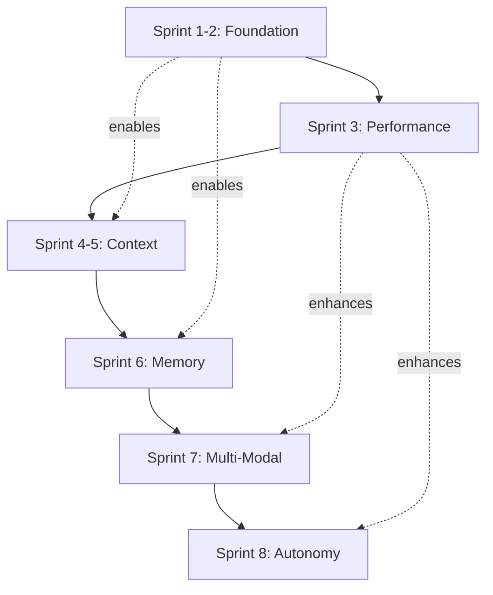

# Implementation Plan - Sprint 1: Foundation & Infrastructure

**Sprint 1 of 7** | [Next Sprint →](implementation-sprint-2.md)

This document covers Sprint 1 of the Myriad-Mind implementation plan, focusing on foundation setup and core infrastructure (Weeks 1-2).

[← Back to Implementation Overview](../INDEX.md#implementation) | [View All Sprints](../INDEX.md#implementation)

---

# Comprehensive Implementation Plan: Project Myriad
## Evolution to Human-Like Cognition (35% → 85-90%)

**Document Version:** 1.0  
**Date:** 2025-01-16  
**Current System Version:** 4.1.0  
**Target Completion:** 24 weeks (8 sprints × 3 weeks each)

---

## Executive Summary

### Vision
Transform Project Myriad from a sophisticated reactive AI system (35-40% human-like cognition) into a proactive, self-aware cognitive architecture (85-90% human-like cognition) through systematic implementation of 8 critical architectural enhancements over 24 weeks.

### Current State Assessment

**✅ Achievements (What Works Well):**
- Complete biomimetic neurogenesis pipeline operational
- Hebbian learning with adaptive connection strengthening
- Enhanced graph intelligence with smart agent discovery
- Performance optimization with Redis caching (82% compression)
- Agent-to-agent collaboration with reflex arcs
- Autonomous learning engine (5-phase system)

**❌ Critical Gaps (What's Missing):**
1. **Production Infrastructure** - No orchestrator as true microservice, missing monitoring stack
2. **Resource Governance** - Unbounded agent creation (potential for 3000 agents), no cleanup policies
3. **Schema Enforcement** - Graph schema documented but constraints/indexes not enforced
4. **Async Communication** - All HTTP calls synchronous, sequential task processing bottleneck
5. **Conversation Context** - No multi-turn conversation memory or reference resolution
6. **Tiered Memory** - Missing STM/MTM/LTM architecture for information management
7. **Multi-Modal Learning** - No image, audio, or cross-sensory processing
8. **Autonomous Cognition** - Reactive only, no self-awareness or proactive behavior

### Expected Outcomes

By implementing this plan, Project Myriad will achieve:
- **Production-ready infrastructure** with proper monitoring, security, and resource management
- **Scalable architecture** supporting thousands of agents with proper lifecycle management
- **Human-like conversation** with multi-turn context and reference resolution
- **Advanced learning** from multiple modalities (text, images, audio)
- **Autonomous operation** with self-awareness, curiosity, and proactive exploration
- **85-90% similarity** to human cognitive architecture and capabilities

---

## Implementation Overview

### Sprint Sequence (24 Weeks)

| Sprint | Weeks | Focus Area | Priority | Dependencies |
|--------|-------|------------|----------|--------------|
| **1-2** | 1-6 | Critical Foundation | 🔴 Critical | None |
| **3** | 7-9 | Performance & Async | 🔴 Critical | Sprint 1-2 |
| **4-5** | 10-15 | Context Understanding | 🟡 High | Sprint 3 |
| **6** | 16-18 | Tiered Memory System | 🟡 High | Sprint 4-5 |
| **7** | 19-21 | Multi-Modal Learning | 🟢 Medium | Sprint 6 |
| **8** | 22-24 | Autonomous Cognition | 🟢 Medium | Sprint 7 |

### Dependency Graph



---

## SPRINT 1-2: Critical Foundation (Weeks 1-6)

**Goal:** Establish production-ready infrastructure with proper resource management and schema enforcement.

**Target Outcome:** System can safely operate in production with monitoring, resource limits, and data integrity guarantees.

### Phase 1.1: Orchestrator Microservice Extraction (Week 1)

#### Current Problem
- Orchestrator exists as [`app.py`](../../src/myriad/services/orchestrator/app.py:1) but Integration Tester ([`integration_tester/app.py`](../../src/myriad/services/integration_tester/app.py:1)) still acts as gateway
- Unclear service boundaries and single point of failure
- Cannot scale orchestrator independently

#### Implementation Steps

**1.1.1 Verify Orchestrator Service (Day 1-2)**

File: [`src/myriad/services/orchestrator/app.py`](../../src/myriad/services/orchestrator/app.py:1)

Current state: File exists but needs verification of:
- Health endpoint implementation
- Metrics endpoint
- Process endpoint accepting both formats
- Status endpoint

**Action Items:**
```python
# Verify these endpoints exist in app.py:
# - GET /health
# - GET /metrics
# - POST /process
# - GET /status
# - POST /discover

# If missing, add:
@app.route('/metrics', methods=['GET'])
def metrics():
    return jsonify({
        "total_queries_processed": query_counter,
        "neurogenesis_triggered": neurogenesis_counter,
        "average_response_time": avg_response_time,
        "active_agents": len(enhanced_intelligence.agent_profiles),
        "hebbian_learning_enabled": True,
        "performance_optimization_enabled": PERFORMANCE_OPTIMIZATION_AVAILABLE
    })
```

**1.1.2 Update Docker Compose (Day 2-3)**

File: [`docker-compose.yml`](../../docker-compose.yml:1)

Add orchestrator service entry:
```yaml
orchestrator:
  build:
    context: ./src/myriad/services/orchestrator
  container_name: orchestrator
  ports:
    - '5010:5010'
  networks:
    - myriad_network
  environment:
    - FLASK_ENV=production
    - GRAPHDB_MANAGER_URL=http://graphdb_manager_ai:5008
    - ENABLE_DYNAMIC_AGENTS=true
    - ENABLE_AUTONOMOUS_LEARNING=true
    - PORT=5010
  depends_on:
    - graphdb_manager_ai
    - redis
  deploy:
    resources:
      limits:
        cpus: '2.0'
        memory: 1G
      reservations:
        memory: 512M
  healthcheck:
    test: ["CMD", "curl", "-f", "http://localhost:5010/health"]
    interval: 30s
    timeout: 10s
    retries: 3
    start_period: 40s
```

**1.1.3 Update Integration Tester (Day 3-4)**

File: [`src/myriad/services/integration_tester/app.py`](../../src/myriad/services/integration_tester/app.py:1)

Modify to call orchestrator HTTP API instead of embedded library:
```python
# Replace direct import:
# from orchestration.orchestrator import process_tasks

# With HTTP call:
ORCHESTRATOR_URL = os.environ.get("ORCHESTRATOR_URL", "http://orchestrator:5010")

@app.route('/run_orchestration', methods=['POST'])
def run_orchestration():
    data = request.get_json()
    try:
        response = requests.post(
            f"{ORCHESTRATOR_URL}/process",
            json=data,
            timeout=60
        )
        return jsonify(response.json()), response.status_code
    except requests.exceptions.RequestException as e:
        return jsonify({"status": "error", "message": str(e)}), 503
```

**Success Criteria:**
- ✅ Orchestrator runs as independent service on port 5010
- ✅ Integration Tester successfully calls orchestrator via HTTP
- ✅ All existing tests pass
- ✅ Health checks operational

---

### Phase 1.2: Resource Limits for Neurogenesis (Week 2)

#### Current Problem
From [`dynamic_lifecycle_manager.py`](../../src/myriad/core/lifecycle/dynamic_lifecycle_manager.py:524-562):
- No CPU/memory limits on agent containers
- No maximum concurrent agent limit
- No lifecycle policies (idle timeout, TTL)
- Port range 7000-9999 allows 3000 agents (resource exhaustion risk)

#### Implementation Steps

**1.2.1 Add Resource Configuration (Day 1)**

File: [`src/myriad/core/lifecycle/dynamic_lifecycle_manager.py`](../../src/myriad/core/lifecycle/dynamic_lifecycle_manager.py:1)

Add configuration constants after imports (around line 22):
```python
# Resource Management Configuration
MAX_CONCURRENT_AGENTS = int(os.environ.get("MAX_DYNAMIC_AGENTS", "20"))
AGENT_CPU_LIMIT = os.environ.get("AGENT_CPU_LIMIT", "0.5")  # CPU cores
AGENT_MEMORY_LIMIT = os.environ.get("AGENT_MEMORY_LIMIT", "256m")
AGENT_MEMORY_SWAP = os.environ.get("AGENT_MEMORY_SWAP", "256m")  # No swap
AGENT_IDLE_TIMEOUT_MIN = int(os.environ.get("AGENT_IDLE_TIMEOUT", "30"))
AGENT_MAX_AGE_HOURS = int(os.environ.get("AGENT_MAX_AGE_HOURS", "24"))
```

**1.2.2 Modify DynamicLifecycleManager Class (Day 2-3)**

At line 445, modify `__init__`:
```python
def __init__(self):
    self.agents: Dict[str, DynamicAgent] = {}
    self.template_manager = get_template_manager()
    self.code_generator = AgentCodeGenerator()
    self.agent_dir = Path("dynamic_agents")
    self.agent_dir.mkdir(exist_ok=True)
    self.port_allocator = PortAllocator(7000, 9999)
    self.monitor_thread = None
    self.monitoring = False
    
    # NEW: Resource management
    self.max_agents = MAX_CONCURRENT_AGENTS
    self.agent_last_used = {}  # Track last usage time per agent_id
    self.creation_queue = []  # Queue for pending creation requests
    
    # NEW: Start lifecycle management thread
    self.lifecycle_thread = threading.Thread(
        target=self._lifecycle_management_loop,
        daemon=True
    )
    self.lifecycle_thread.start()
    print(f"🔧 Lifecycle manager initialized: max {self.max_agents} concurrent agents")
```

**1.2.3 Add Capacity Check to create_agent (Day 3)**

Modify [`create_agent()`](../../src/myriad/core/lifecycle/dynamic_lifecycle_manager.py:457) at line 457:
```python
def create_agent(self, concept: str, intent: str, research_data: Dict[str, Any], region: str = "General") -> Optional[DynamicAgent]:
    """Create a new dynamic agent for a concept with capacity management"""
    
    # NEW: Check capacity before creating
    active_count = sum(1 for a in self.agents.values() if a.status == AgentStatus.HEALTHY)
    
    if active_count >= self.max_agents:
        print(f"⚠️  At capacity ({active_count}/{self.max_agents}), queueing creation request")
        self.creation_queue.append({
            "concept": concept,
            "intent": intent,
            "research_data": research_data,
            "region": region,
            "queued_at": time.time()
        })
        return None
    
    print(f"🧬 Creating dynamic agent for concept '{concept}' in region '{region}'...")
    print(f"   Current capacity: {active_count}/{self.max_agents} agents")
    
    # ... existing creation code continues ...
```

**1.2.4 Add Resource Limits to Docker Run (Day 4)**

Modify [`_build_and_start_agent()`](../../src/myriad/core/lifecycle/dynamic_lifecycle_manager.py:524) at line 539:
```python
# Start container with resource limits
run_result = subprocess.run([
    "docker", "run", "-d",
    "--name", agent.container_name,
    "-p", f"{agent.port}:5000",
    "-e", f"PORT=5000",
    # NEW: Resource limits
    "--cpus", AGENT_CPU_LIMIT,
    "--memory", AGENT_MEMORY_LIMIT,
    "--memory-swap", AGENT_MEMORY_SWAP,
    "--restart", "unless-stopped",
    # NEW: Labels for management
    "--label", "myriad.agent=true",
    "--label", f"myriad.concept={agent.concept}",
    "--label", f"myriad.created={agent.created_at}",
    agent.container_name
], capture_output=True, text=True, timeout=60)
```

**1.2.5 Add Lifecycle Management Loop (Day 5)**

Add new method to DynamicLifecycleManager class (after line 622):
```python
def _lifecycle_management_loop(self):
    """Background loop for agent lifecycle management"""
    
    while True:
        try:
            current_time = time.time()
            agents_to_stop = []
            
            # Check all agents for idle timeout and max age
            for agent_id, agent in self.agents.items():
                if agent.status != AgentStatus.HEALTHY:
                    continue
                
                # Check idle timeout
                last_used = self.agent_last_used.get(agent_id, agent.created_at)
                idle_minutes = (current_time - last_used) / 60
                
                if idle_minutes > AGENT_IDLE_TIMEOUT_MIN:
                    print(f"⏰ Agent {agent.agent_name} idle for {idle_minutes:.1f} min, stopping")
                    agents_to_stop.append(agent_id)
                    continue
                
                # Check max age
                age_hours = (current_time - agent.created_at) / 3600
                if age_hours > AGENT_MAX_AGE_HOURS:
                    print(f"⏳ Agent {agent.agent_name} reached max age {age_hours:.1f}h, stopping")
                    agents_to_stop.append(agent_id)
            
            # Stop aged/idle agents
            for agent_id in agents_to_stop:
                self.stop_agent(agent_id)
            
            # Process creation queue if capacity available
            if self.creation_queue:
                active_count = sum(1 for a in self.agents.values() if a.status == AgentStatus.HEALTHY)
                
                while self.creation_queue and active_count < self.max_agents:
                    request = self.creation_queue.pop(0)
                    print(f"📋 Processing queued agent creation for '{request['concept']}'")
                    self.create_agent(
                        request['concept'],
                        request['intent'],
                        request['research_data'],
                        request['region']
                    )
                    active_count += 1
            
            time.sleep(60)  # Check every minute
            
        except Exception as e:
            print(f"❌ Lifecycle management error: {e}")
            time.sleep(60)

def record_agent_usage(self, agent_id: str):
    """Record agent usage for idle detection"""
    self.agent_last_used[agent_id] = time.time()
```

**1.2.6 Update Orchestrator to Track Usage (Day 6)**

File: [`src/myriad/services/orchestrator/orchestrator.py`](../../src/myriad/services/orchestrator/orchestrator.py:793)

After line 813, add usage tracking:
```python
result = response.json()

# NEW: Track agent usage for lifecycle management
if LIFECYCLE_MANAGER_AVAILABLE and agent_url:
    agent_id = _extract_agent_id_from_url(agent_url)
    if agent_id:
        try:
            lifecycle_manager.record_agent_usage(agent_id)
        except:
            pass  # Non-critical failure

# Track performance for Enhanced Graph Intelligence
_update_agent_performance_metrics(agent_url, concept, intent, start_time, result, success=True)
```

**Success Criteria:**
- ✅ Agent creation respects MAX_CONCURRENT_AGENTS limit
- ✅ Agents have CPU and memory constraints
- ✅ Idle agents automatically shut down after timeout
- ✅ Old agents removed after max age
- ✅ Creation queue processes when capacity available

---

## Continue Reading

**Next:** [Sprint 2: Schema Enforcement & Monitoring](implementation-sprint-2.md) - Graph schema constraints, production monitoring stack, and health checks

**Related Documentation:**
- [Project Index](../INDEX.md)
- [Architecture Overview](../architecture/)
- [Protocols](../protocols/)
- [Roadmap](../roadmap/)

[↑ Back to Index](../INDEX.md) | [Next Sprint →](implementation-sprint-2.md)