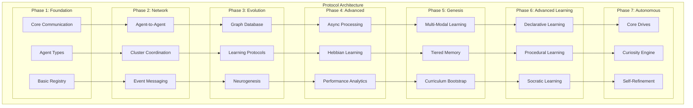

# Communication Protocols - Level 1: Foundation

📚 **Part 1 of 4** | [Level 2: Neurogenesis →](protocols-level-2-neurogenesis.md) | [Level 3: Advanced →](protocols-level-3-advanced.md) | [Migration Guide →](protocols-migration.md) | [Index](../INDEX.md)

**Version**: 5.1  
**Date**: 2025-01-01  
**Status**: ✅ Implemented & Operational

**Related Documents:**
- Architecture: [`architecture-level-1-overview.md`](../architecture/architecture-level-1-overview.md)
- Implementation: [`sprint-1-2-foundation.md`](../implementation/sprint-1-2-foundation.md)
- Technical: [`graph-schema.md`](../technical/graph-schema.md)

---

## Overview

This document defines the foundational communication protocols for the Myriad Cognitive Architecture. These protocols support basic MVP functionality through graph-based agent discovery and form the basis for all advanced features.

**What's in Level 1:**
- Architecture Overview & Core Principles
- Phase 1: Foundation Protocols (Basic Communication)
- Phase 1.5: Graph Database Protocols (Implemented)

**For advanced protocols, see:**
- [Level 2: Neurogenesis](protocols-level-2-neurogenesis.md) - Dynamic agent creation
- [Level 3: Advanced](protocols-level-3-advanced.md) - Multi-modal learning & autonomy

---

## Table of Contents

1. [Architecture Overview](#architecture-overview)
2. [Protocol Evolution Phases](#protocol-evolution-phases)
3. [Phase 1: Foundation Protocols](#phase-1-foundation-protocols)
4. [Phase 1.5: Graph Database Protocols](#phase-15-graph-database-protocols-implemented)

---

## Architecture Overview

The Myriad Cognitive Architecture implements a decentralized network of hyper-specialized agents that collaborate to produce emergent intelligence. The protocols are designed to support the four core principles:

1. **Radical Specialization**: Each agent knows one thing perfectly
2. **Emergent Intelligence**: Complex answers from simple agent outputs
3. **Dynamic Growth**: Learning by creating new agents (neurogenesis)
4. **Efficiency**: Computational resource frugality



---

## Protocol Evolution Phases

### Phase Implementation Matrix

| Protocol Category | Phase 1 | Phase 2 | Phase 3 | Phase 4 | Phase 5 | Phase 6 | Phase 7 |
|------------------|---------|---------|---------|---------|---------|---------|---------|
| **Communication** | ✅ Basic REST | ✅ Enhanced Processing | ✅ Graph Routing | ✅ Agent Collaboration | ⏳ Async Events | ⏳ Learning Comms | ⏳ Autonomous |
| **Agent Types** | ✅ 4 Base Types | ✅ Specialization | ✅ Graph Integration | ✅ Reflex Arcs | ✅ Genesis Agents | ⏳ Learning Agents | ⏳ Cognitive Agents |
| **Registry** | ✅ Simple Lookup | ✅ Enhanced Protocols | ✅ Graph Database | ✅ Smart Discovery | ⏳ Memory Tiers | ⏳ Curriculum | ⏳ Drives System |
| **Learning** | ❌ Static | ❌ Static | ✅ Graph Foundation | ✅ Hebbian Adaptation | ⏳ Few-Shot Learning | ⏳ Multi-Modal | 🧬 Autonomous Learning |
| **🧬 Neurogenesis** | ❌ N/A | ❌ N/A | ✅ Research Pipeline | ✅ Template Agents | ✅ Dynamic Creation | 🧬 Autonomous Learning | ⏳ Self-Optimization |

**Legend**: ✅ Implemented & Operational | ⏳ Future Phase | ❌ Not Implemented

### Implementation Status

Complete biomimetic neurogenesis has been implemented, validated, and demonstrated from unknown concept detection through autonomous learning completion.

**Achievements:**

- ✅ **Complete Neurogenesis Pipeline**: 100% operational (3/3 concepts successfully processed)
- ✅ **Phase 1-3 Protocols**: Complete foundational and advanced communication infrastructure
- 🧬 **Dynamic Agent Creation**: Template-based neurogenesis for unknown concepts  
- 🧠 **Autonomous Learning Engine**: 5-phase learning system with 7/7 tests passed
- ⚡ **Agent Collaboration**: Direct peer-to-peer communication with reflex arcs
- 🤖 **Template System**: 4 specialized agent templates with AI-driven selection
- 🔧 **Lifecycle Management**: Complete Docker-based agent orchestration and monitoring
- 📊 **Graph Integration**: Dynamic agents auto-register and collaborate
- 🎯 **Knowledge Transfer**: Cross-domain learning between specialized agents
- 🔄 **Self-Optimization**: Agents improve their own capabilities autonomously

This represents the transition from static AI protocols to **truly adaptive, brain-like intelligence** that grows, learns, and evolves like biological neural systems.

---

## Phase 1: Foundation Protocols

*Implements core architectural principles for MVP functionality*

### 1.1 Basic Communication Protocols (Current Implementation)

#### Processor-to-Orchestrator Protocol (The "Task List")

**Purpose**: Sent from Input Processor to Orchestrator  
**Format**:

```json
{
  "query_id": "xyz-123",
  "tasks": [
    { "task_id": 1, "intent": "define", "concept": "lightbulb", "args": {} },
    { "task_id": 2, "intent": "explain_limitation", "concept": "lightbulb", "args": {} }
  ]
}
```

**Fields**:

- `query_id`: Unique identifier for the query session
- `tasks`: Array of task objects to be distributed to agents
  - `task_id`: Sequential integer identifier for the task
  - `intent`: The action to be performed (e.g., "define", "explain_limitation")
  - `concept`: The subject matter (e.g., "lightbulb")
  - `args`: Additional parameters (currently empty object for MVP)

#### Orchestrator-to-Agent Protocol (The "Agent Job")

**Purpose**: Sent from Orchestrator to an Agent  
**Format**:

```json
{
  "task_id": 1,
  "intent": "define",
  "concept": "lightbulb",
  "args": { "detail_level": "high" }
}
```

**Fields**:

- `task_id`: The `task_id` from the original "Task List"
- `intent`: The specific action the agent should perform (e.g., "define", "explain_limitation")
- `concept`: The subject matter (e.g., "lightbulb")
- `args`: Additional parameters for the agent to perform the task (e.g., `{"detail_level": "high"}`)

#### Agent-to-Orchestrator Protocol (The "Agent Result")

**Purpose**: Sent from Agent back to Orchestrator  
**Format**:

```json
{
  "agent_name": "Lightbulb_Definition_AI",
  "status": "success",
  "data": "an electric device that produces light via an incandescent filament"
}
```

**Fields**:

- `agent_name`: The name of the responding agent
- `status`: Result status ("success" or "error")
- `data`: The agent's response data or error message

#### Orchestrator-to-OutputProcessor Protocol (The "Collected Results")

**Purpose**: Sent from Orchestrator to Output Processor (Synthesizer)  
**Format**:

```json
{
  "query_id": "xyz-123",
  "collected_results": {
    "1": { "agent_name": "Lightbulb_Definition_AI", "status": "success", "data": "an electric device..." },
    "2": { "agent_name": "Lightbulb_Function_AI", "status": "success", "data": "illuminates by converting..." }
  }
}
```

**Fields**:

- `query_id`: Unique identifier for the query session, same as in the "Task List"
- `collected_results`: An object where keys are `task_id` (as strings) and values are "Agent Result" objects.

### 1.2 Enhanced Input Processing Protocol

**Purpose**: Transform user queries into structured task lists for orchestration

**Protocol**: `Input Processor → Orchestrator`

```json
{
  "protocol_version": "1.0",
  "query_metadata": {
    "query_id": "q_20240101_001",
    "original_query": "Why was the lightbulb important for factories?",
    "timestamp": "2024-01-01T10:00:00Z",
    "user_context": {
      "session_id": "sess_123",
      "previous_queries": [],
      "preferred_detail_level": "standard"
    }
  },
  "parsed_query": {
    "primary_intent": "explain_importance",
    "concepts": ["lightbulb", "factories", "industrial_history"],
    "relationships": [
      {
        "type": "causal",
        "subject": "lightbulb",
        "object": "factory_productivity"
      }
    ],
    "complexity_score": 0.7,
    "estimated_agents_needed": 3
  },
  "task_list": [
    {
      "task_id": 1,
      "intent": "define",
      "concept": "lightbulb",
      "context": "industrial_application",
      "priority": 1,
      "dependencies": []
    },
    {
      "task_id": 2,
      "intent": "analyze_historical_context",
      "concept": "pre_electric_factories",
      "context": "working_conditions",
      "priority": 1,
      "dependencies": []
    },
    {
      "task_id": 3,
      "intent": "explain_impact",
      "concept": "electric_lighting_adoption",
      "context": "industrial_productivity",
      "priority": 2,
      "dependencies": [1, 2]
    }
  ]
}
```

### 1.3 Agent Type Protocols

#### Type A: Fact-Base Agent Protocol

**Purpose**: Agents that store and retrieve factual knowledge

**Protocol**: `Orchestrator → Fact-Base Agent`

```json
{
  "job_request": {
    "task_id": 1,
    "intent": "define",
    "concept": "lightbulb",
    "context": "industrial_application",
    "additional_params": {
      "detail_level": "standard",
      "focus_aspects": ["functionality", "historical_significance"],
      "exclude_aspects": ["manufacturing_process"]
    }
  },
  "agent_metadata": {
    "requesting_orchestrator": "main_orchestrator_001",
    "correlation_id": "q_20240101_001_t1",
    "timeout_ms": 5000
  }
}
```

**Response**: `Fact-Base Agent → Orchestrator`

```json
{
  "protocol_version": "1.0",
  "response_metadata": {
    "agent_id": "lightbulb_fact_001",
    "agent_type": "fact_base",
    "cluster_id": "industrial_technology",
    "processing_time_ms": 45,
    "correlation_id": "q_20240101_001_t1"
  },
  "response_data": {
    "status": "success",
    "confidence": 0.95,
    "primary_content": {
      "definition": "An electric light source that produces light through the heating of a filament until it glows",
      "key_attributes": [
        "electric_powered",
        "incandescent_technology",
        "replaceable_component",
        "standardized_fitting"
      ],
      "historical_context": "Commercially viable from 1879, revolutionized indoor lighting"
    },
    "supporting_data": {
      "sources": ["industrial_history_kb_v1.2", "technology_timeline_db"],
      "confidence_breakdown": {
        "fact_accuracy": 0.98,
        "relevance_to_context": 0.92,
        "completeness": 0.95
      },
      "reasoning_trace": [
        "Retrieved base definition from knowledge store",
        "Filtered for industrial application context",
        "Cross-referenced with historical timeline data"
      ]
    }
  },
  "collaboration_hints": {
    "related_concepts": ["electricity", "industrial_revolution", "productivity"],
    "suggest_collaborators": [
      {
        "agent_type": "function_executor",
        "concept": "productivity_analysis",
        "reason": "Can analyze impact on work efficiency"
      },
      {
        "agent_type": "pattern_matcher",
        "concept": "historical_trends",
        "reason": "Can identify broader industrial patterns"
      }
    ],
    "cross_reference_opportunities": [
      "working_hours_extension",
      "factory_shift_systems",
      "industrial_safety_improvements"
    ]
  }
}
```

#### Type B: Function-Executor Agent Protocol

**Purpose**: Agents that perform calculations, analyses, or transformations

**Protocol**: `Orchestrator → Function-Executor Agent`

```json
{
  "job_request": {
    "task_id": 2,
    "intent": "analyze_historical_context",
    "concept": "pre_electric_factories",
    "context": "working_conditions",
    "function_params": {
      "analysis_type": "comparative_study",
      "time_period": "1850-1880",
      "focus_metrics": ["working_hours", "productivity", "safety"],
      "comparison_baseline": "post_electric_adoption"
    }
  },
  "input_data": {
    "related_facts": ["limited_daylight_hours", "candle_gas_lighting", "fire_hazards"],
    "context_from_other_agents": []
  }
}
```

**Response**: `Function-Executor Agent → Orchestrator`

```json
{
  "protocol_version": "1.0",
  "response_metadata": {
    "agent_id": "historical_analysis_001",
    "agent_type": "function_executor",
    "cluster_id": "historical_analysis",
    "processing_time_ms": 150
  },
  "response_data": {
    "status": "success",
    "confidence": 0.88,
    "analysis_result": {
      "key_findings": [
        "Pre-electric factories limited to daylight hours (avg 8-10 hours)",
        "Candle/gas lighting created fire hazards and poor air quality",
        "Night shift work was dangerous and inefficient",
        "Productivity dropped 40-60% during low-light periods"
      ],
      "quantitative_data": {
        "average_working_hours_daylight": 9.5,
        "fire_incident_rate_per_month": 0.3,
        "productivity_index_low_light": 0.45
      },
      "transformation_applied": "historical_comparative_analysis",
      "methodology": "Statistical analysis of industrial records 1850-1880"
    },
    "supporting_data": {
      "data_sources": ["industrial_records_db", "safety_statistics_archive"],
      "calculation_details": {
        "sample_size": 847,
        "geographic_scope": "Northern England, Northeastern US",
        "reliability_score": 0.85
      }
    }
  },
  "collaboration_hints": {
    "output_useful_for": [
      "productivity_comparison_agents",
      "industrial_revolution_timeline_agents",
      "economic_impact_analysis_agents"
    ],
    "requires_synthesis_with": ["lightbulb_adoption_data", "factory_modernization_timeline"]
  }
}
```

#### Type C: Pattern-Matcher Agent Protocol

**Purpose**: Agents that classify, categorize, or identify patterns in data

**Protocol**: Similar structure with `"agent_type": "pattern_matcher"` and pattern-specific parameters

#### Type D: Micro-Generator Agent Protocol

**Purpose**: Agents that generate small pieces of content or explanations

**Protocol**: Similar structure with `"agent_type": "micro_generator"` and generation-specific parameters

### 1.4 System Management Protocols

#### Orchestrator-to-LifecycleManager Protocol (Agent Creation Request)

**Purpose**: Orchestrator requests `LifecycleManager` to create a new agent instance.  
**Format**:

```json
{
  "concept_name": "new_concept",
  "agent_type": "FactBase"
}
```

**Fields**:

- `concept_name`: The primary concept the new agent will handle.
- `agent_type`: The type or template of agent to create (e.g., "FactBase", "Calculator").

#### LifecycleManager-to-Orchestrator Protocol (Agent Creation Confirmation)

**Purpose**: `LifecycleManager` confirms agent creation and provides details.  
**Format**:

```json
{
  "agent_name": "NewConcept_AI",
  "status": "success",
  "endpoint": "http://new_concept_ai:5001/query"
}
```

**Fields**:

- `agent_name`: The assigned name of the newly created agent.
- `status`: Result status ("success" or "error").
- `endpoint`: The network endpoint where the new agent can be reached.

#### Orchestrator-to-AgentRegistry Protocol (Register Agent)

**Purpose**: Orchestrator requests `AgentRegistry` to register a new or updated agent's capabilities and endpoint.  
**Format**:

```json
{
  "agent_name": "NewConcept_AI",
  "concept": "new_concept",
  "intent_map": {
    "define": "/query",
    "explain_details": "/explain"
  },
  "endpoint": "http://new_concept_ai:5001"
}
```

**Fields**:

- `agent_name`: The name of the agent to register.
- `concept`: The primary concept the agent handles.
- `intent_map`: An object mapping intents the agent can handle to specific paths on its endpoint.
- `endpoint`: The base network endpoint of the agent.

### 1.5 Enhanced Orchestrator Registry Protocol

**Purpose**: Agent discovery, registration, and capability matching

**Agent Registration**: `Agent → Registry`

```json
{
  "registration_request": {
    "agent_metadata": {
      "agent_id": "lightbulb_fact_001",
      "agent_type": "fact_base",
      "version": "1.0.0",
      "deployment_url": "http://lightbulb-fact-service:5001",
      "health_check_endpoint": "/health"
    },
    "capabilities": {
      "primary_concept": "lightbulb",
      "supported_intents": ["define", "explain_properties", "historical_context"],
      "knowledge_domains": ["electrical_technology", "industrial_history"],
      "context_specializations": ["industrial_application", "consumer_use", "historical_development"]
    },
    "performance_characteristics": {
      "avg_response_time_ms": 45,
      "confidence_range": [0.85, 0.98],
      "knowledge_freshness": "2024-01-01",
      "max_concurrent_requests": 50
    },
    "cluster_preferences": {
      "preferred_cluster": "industrial_technology",
      "collaboration_affinities": ["productivity_analysis", "historical_trends"]
    }
  }
}
```

**Registry Response**: `Registry → Agent`

```json
{
  "registration_response": {
    "status": "success",
    "assigned_cluster": "industrial_technology",
    "agent_network_id": "inet_lightbulb_fact_001",
    "collaboration_opportunities": [
      {
        "agent_id": "factory_history_001",
        "synergy_score": 0.85,
        "common_concepts": ["industrial_revolution", "productivity"]
      }
    ],
    "performance_benchmarks": {
      "cluster_avg_response_time": 52,
      "cluster_avg_confidence": 0.91,
      "recommended_optimization": "response_time"
    }
  }
}
```

### 1.6 Output Synthesis Protocol

**Purpose**: Combine agent responses into coherent final answers

**Protocol**: `Orchestrator → Output Processor`

```json
{
  "synthesis_request": {
    "query_metadata": {
      "query_id": "q_20240101_001",
      "original_query": "Why was the lightbulb important for factories?",
      "synthesis_intent": "explain_importance"
    },
    "agent_responses": {
      "task_1": {
        "agent_id": "lightbulb_fact_001",
        "content": "Lightbulb definition and properties data...",
        "confidence": 0.95,
        "contribution_weight": 0.3
      },
      "task_2": {
        "agent_id": "historical_analysis_001", 
        "content": "Pre-electric factory analysis data...",
        "confidence": 0.88,
        "contribution_weight": 0.4
      },
      "task_3": {
        "agent_id": "impact_analysis_001",
        "content": "Industrial impact analysis data...",
        "confidence": 0.92,
        "contribution_weight": 0.3
      }
    },
    "synthesis_parameters": {
      "output_format": "explanatory_paragraph",
      "target_length": "medium",
      "evidence_level": "standard",
      "causal_chain_emphasis": true
    }
  }
}
```

---

## Phase 1.5: Graph Database Protocols (Implemented)

*Core graph database operations for Neo4j integration and agent discovery*

### GraphDB Manager AI Service Protocols

**Purpose**: Interface between the Myriad system and Neo4j graph database for all graph operations

#### Node Creation Protocol

**Endpoint**: `POST /create_node`  
**Purpose**: Create new nodes in the knowledge graph  

**Request Format**:

```json
{
  "label": "Agent",
  "properties": {
    "name": "Lightbulb_Definition_AI",
    "endpoint": "http://lightbulb_definition_ai:5001/query",
    "type": "FactBase"
  }
}
```

**Response Format**:

```json
{
  "status": "success",
  "node_id": "4:f79f1e3c-12a4-4b8a-9c8e-1234567890ab:123",
  "label": "Agent",
  "properties": {
    "name": "Lightbulb_Definition_AI",
    "endpoint": "http://lightbulb_definition_ai:5001/query",
    "type": "FactBase"
  }
}
```

#### Relationship Creation Protocol

**Endpoint**: `POST /create_relationship`  
**Purpose**: Create relationships between existing nodes  

**Request Format (by node properties)**:

```json
{
  "start_node_label": "Agent",
  "start_node_properties": {"name": "Lightbulb_Definition_AI"},
  "end_node_label": "Concept",
  "end_node_properties": {"name": "lightbulb"},
  "relationship_type": "HANDLES_CONCEPT",
  "relationship_properties": {"weight": 1.0}
}
```

**Request Format (by node ID)**:

```json
{
  "start_node_id": "4:f79f1e3c-12a4-4b8a-9c8e-1234567890ab:123",
  "end_node_label": "Concept",
  "end_node_properties": {"name": "lightbulb"},
  "relationship_type": "HANDLES_CONCEPT",
  "relationship_properties": {"weight": 1.0, "creation_method": "neurogenesis"}
}
```

**Response Format**:

```json
{
  "status": "success",
  "relationship_id": "5:f79f1e3c-12a4-4b8a-9c8e-1234567890ab:456"
}
```

#### Agent Discovery Protocol

**Endpoint**: `POST /find_connected_nodes`  
**Purpose**: Discover agents that handle specific concepts via graph traversal  

**Request Format**:

```json
{
  "start_node_label": "Concept",
  "start_node_properties": {"name": "lightbulb"},
  "relationship_type": "HANDLES_CONCEPT",
  "relationship_direction": "in",
  "target_node_label": "Agent"
}
```

**Response Format**:

```json
{
  "status": "success",
  "nodes": [
    {
      "id": "4:f79f1e3c-12a4-4b8a-9c8e-1234567890ab:123",
      "labels": ["Agent"],
      "properties": {
        "name": "Lightbulb_Definition_AI",
        "endpoint": "http://lightbulb_definition_ai:5001/query",
        "type": "FactBase"
      }
    }
  ]
}
```

### Graph-Based Orchestrator Protocol

**Purpose**: Enhanced orchestrator using graph traversal for agent discovery instead of registry lookup

**Internal Process**:

1. Receive enhanced task list from Input Processor
2. For each task concept, query GraphDB Manager AI for connected agents
3. Select appropriate agent endpoint from graph results
4. Dispatch task to discovered agent
5. Collect and route responses to Output Processor

**Integration Example**:

```python
def discover_agent_via_graph(concept: str, intent: str) -> Optional[str]:
    payload = {
        "start_node_label": "Concept",
        "start_node_properties": {"name": concept.lower()},
        "relationship_type": "HANDLES_CONCEPT", 
        "relationship_direction": "in",
        "target_node_label": "Agent"
    }
    response = requests.post(f"{GRAPHDB_MANAGER_URL}/find_connected_nodes", json=payload)
    # Return agent endpoint from graph results
```

### Migration System Protocol

**Purpose**: Systematic population of the knowledge graph with agent and concept data

**Configuration Format**:

```json
{
  "agents": [
    {
      "name": "Lightbulb_Definition_AI",
      "endpoint": "http://lightbulb_definition_ai:5001/query",
      "type": "FactBase", 
      "handled_concepts": ["lightbulb"]
    }
  ]
}
```

**Migration Process**:

1. Create all Concept nodes from handled_concepts
2. Create all Agent nodes with endpoint and type information
3. Create HANDLES_CONCEPT relationships with default weights
4. Verify graph connectivity and agent reachability

---

## Continue Reading

- **Next:** [Level 2: Neurogenesis Protocols](protocols-level-2-neurogenesis.md) - Dynamic agent creation and biomimetic intelligence
- **Advanced:** [Level 3: Advanced Protocols](protocols-level-3-advanced.md) - Multi-modal learning and autonomous cognition
- **Implementation:** [Migration Guide](protocols-migration.md) - Best practices and migration strategies
- **Related:** [Graph Schema](../technical/graph-schema.md) - Complete graph database schema
- **Index:** [Documentation Home](../INDEX.md)

---

**Foundation protocols established** | Next: Learn about neurogenesis and dynamic growth →