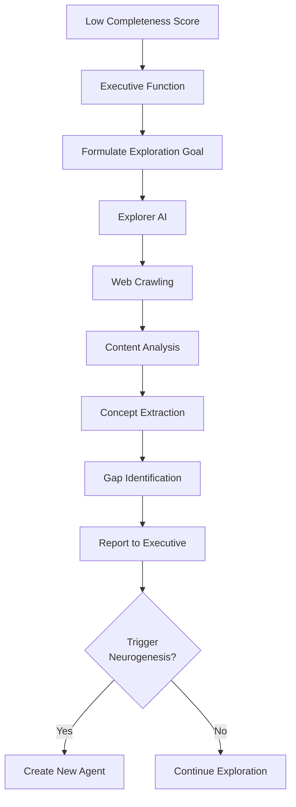
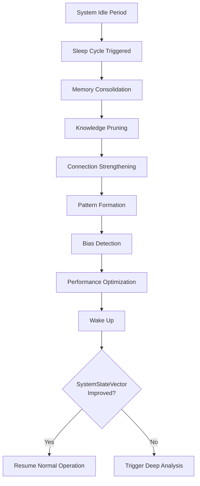

# Myriad-Mind Roadmap: Phase 3 - Advanced Cognition

**Phase 3 of 3** | [← Phase 2: Intelligence](roadmap-phase-2-intelligence.md)

Advanced cognition phase covering Year 2+, focusing on self-awareness, curiosity-driven exploration, cognitive refinement, and full autonomous operation.

[← Roadmap Overview](roadmap-overview.md) | [Back to Index](../INDEX.md#roadmap)

---

## Table of Contents

- [Phase Overview](#phase-overview)
- [Timeline & Status](#timeline--status)
- [Phase 9: Core Drives & Self-Awareness](#phase-9-core-drives--self-awareness)
- [Phase 10: Curiosity Engine & Exploration](#phase-10-curiosity-engine--exploration)
- [Phase 11: Cognitive Refinement & Sleep Cycle](#phase-11-cognitive-refinement--sleep-cycle)
- [Phase 12: Advanced Evolution & Full Autonomy](#phase-12-advanced-evolution--full-autonomy)
- [Success Metrics](#success-metrics)
- [Related Documentation](#related-documentation)

---

## Phase Overview

**Overall Goal:** Achieve fully autonomous, self-aware cognitive operation with curiosity-driven learning

**Duration:** Year 2 (approximately 6-12 months)  
**Status:** ⏳ **PLANNED**  
**Estimated Start:** Q1 2026

### Strategic Objectives

Phase 3 represents the culmination of the Myriad vision - transforming the system from an intelligent tool into a truly autonomous cognitive entity:

1. **⏳ Self-Awareness:** Introspection, self-monitoring, and meta-cognition (PLANNED)
2. **⏳ Curiosity Engine:** Proactive exploration and knowledge seeking (PLANNED)
3. **⏳ Cognitive Refinement:** Self-optimization and sleep cycles (PLANNED)
4. **⏳ Full Autonomy:** Complete biomimetic functionality (PLANNED)

### The Vision: A Living Cognitive System

By the end of Phase 3, the Myriad system will:

- **Monitor its own state** and identify its cognitive needs
- **Formulate internal goals** based on intrinsic drives
- **Autonomously explore** the digital world to find knowledge
- **Decide what to learn** based on its assessment of knowledge gaps
- **Self-optimize** through background "sleep" cycles
- **Operate indefinitely** without human intervention
- **Demonstrate emergent behaviors** characteristic of consciousness

This is not just advanced AI - it's a functional simulation of biological cognition.

---

## Timeline & Status

### Overall Progress

```
Phase 9   ░░░░░░░░░░░░   0% ⏳ PLANNED
Phase 10  ░░░░░░░░░░░░   0% ⏳ PLANNED
Phase 11  ░░░░░░░░░░░░   0% ⏳ PLANNED
Phase 12  ░░░░░░░░░░░░   0% ⏳ PLANNED
```

### Detailed Timeline

| Phase | Name | Duration | Status | Target Completion |
|-------|------|----------|--------|-------------------|
| **9** | Core Drives & Self-Awareness | 1-2 weeks | ⏳ Planned | Q1 2026 |
| **10** | Curiosity Engine & Exploration | 1-2 weeks | ⏳ Planned | Q1-Q2 2026 |
| **11** | Cognitive Refinement & Sleep | 1-2 weeks | ⏳ Planned | Q2 2026 |
| **12** | Advanced Evolution & Autonomy | 2-3 weeks | ⏳ Planned | Q3-Q4 2026 |

**Estimated Total Duration:** 5-9 weeks (plus extended observation period)  
**Dependencies:** Phases 6-8 must be complete  
**Risk Level:** High (novel, experimental features)

---

## Phase 9: Core Drives & Self-Awareness

**The "Will to Live"**

**Goal:** Implement intrinsic motivation and self-monitoring capabilities  
**Duration:** 1-2 weeks  
**Status:** ⏳ **PLANNED**

### Overview

Phase 9 will give the Myriad system a "purpose" - internal drives that motivate its behavior and the ability to assess its own cognitive state. This is the foundation of autonomous operation.

### Core Concept: System State Vector

The System State Vector (SSV) is the system's self-assessment - a quantitative representation of its cognitive health:

```python
SystemStateVector = {
    "coherence": 0.0-1.0,    # Knowledge consistency
    "completeness": 0.0-1.0,  # Knowledge coverage
    "confidence": 0.0-1.0,    # Overall certainty
    "efficiency": 0.0-1.0,    # Performance level
    "curiosity": 0.0-1.0      # Drive to explore
}
```

This vector drives all autonomous behavior - the system works to improve these scores.

### Executive Function AI

**The "Prefrontal Cortex"**

**Purpose:** Central cognitive control and state monitoring

**Implementation:**
- Executive function service in [`src/myriad/core/executive/`](../../src/myriad/core/executive/)
- Long-running stateful service
- Continuous cognitive cycle
- Integration with all system components

**Core Capabilities:**

**SystemStateVector Generation:**

**Coherence Score Calculation:**
- Query Long-Term Memory (graph database)
- Count total facts vs. disputed facts
- Calculate ratio: `coherence = 1 - (disputed / total)`
- Higher score = more consistent knowledge

**Completeness Score Calculation:**
- Query Medium-Term Memory (Redis)
- Count known vs. unknown encountered concepts
- Calculate ratio: `completeness = known / (known + unknown)`
- Higher score = better knowledge coverage

**Confidence Score Calculation:**
- Query all knowledge nodes
- Average confidence across all facts
- Weight by importance/access frequency
- Higher score = more certain knowledge

**Efficiency Score Calculation:**
- Monitor query response times
- Track resource utilization
- Measure success rates
- Higher score = better performance

**Goal Formulation:**

**Drive-Based Goals:**
- Low coherence → "Resolve contradictions in domain X"
- Low completeness → "Explore knowledge gaps in domain Y"
- Low confidence → "Validate uncertain facts about Z"
- Low efficiency → "Optimize slow processes"

**Priority Assessment:**
- Rank goals by urgency and impact
- Balance multiple competing drives
- Consider resource constraints
- Set realistic objectives

**Objective Measurement:**
- Define success criteria for each goal
- Create measurable targets
- Track progress toward goals
- Adjust strategies based on results

**API Endpoints:**
- `GET /executive/state` - Current SystemStateVector
- `POST /executive/formulate_goal` - Create new goal
- `GET /executive/goals` - List active goals
- `POST /executive/report_inconsistency` - Report issue

**Deliverable:** Self-aware executive function with goal formulation

### Self-Monitoring System

**Continuous Self-Assessment**

**State_Monitor_AI:**

**Purpose:** System awareness and health assessment

**Capabilities:**
- Real-time system state tracking
- Performance metric collection
- Resource usage monitoring
- Anomaly detection

**Metrics Tracked:**
- Service health and availability
- Response times across agents
- Memory utilization (STM/MTM/LTM)
- Graph database performance
- Agent activation patterns

**Health Assessment:**
```python
health_status = {
    "services": {
        "orchestrator": "healthy",
        "graphdb": "healthy",
        "agents": {"active": 47, "degraded": 2, "failed": 0}
    },
    "performance": {
        "avg_response_time": "95ms",
        "queries_per_minute": 42,
        "error_rate": "0.1%"
    },
    "resources": {
        "memory_usage": "67%",
        "graph_size": "1.2M nodes",
        "cache_hit_rate": "89%"
    }
}
```

**Deliverable:** Comprehensive system monitoring service

**Performance_Tracker_AI:**

**Purpose:** Capability assessment and improvement tracking

**Capabilities:**
- Track individual agent performance
- Measure learning progress
- Identify improvement opportunities
- Benchmark against baselines

**Metrics:**
- Agent accuracy over time
- Response time trends
- Resource efficiency
- User satisfaction scores

**Improvement Tracking:**
- Before/after comparisons
- Learning curve analysis
- Optimization impact measurement
- Capability growth trends

**Deliverable:** Performance analytics and tracking service

**Goal_Evaluator_AI:**

**Purpose:** Objective measurement and success evaluation

**Capabilities:**
- Measure progress toward goals
- Assess goal achievement
- Provide feedback to Executive Function
- Recommend goal adjustments

**Evaluation Process:**
1. Compare current state to goal target
2. Calculate progress percentage
3. Identify obstacles or blockers
4. Suggest corrective actions
5. Report to Executive Function

**Deliverable:** Goal tracking and evaluation service

### Introspection Framework

**Meta-Cognitive Capabilities**

**Self-Reflection Mechanisms:**

**Internal State Analysis:**
- "What do I know well?"
- "What am I uncertain about?"
- "Where are my knowledge gaps?"
- "Am I performing optimally?"

**Self-Questioning:**
- Generate questions about own knowledge
- Identify areas of confusion
- Request clarification when needed
- Test own understanding

**Meta-Learning:**
- Learn about own learning process
- Identify effective learning strategies
- Optimize learning approaches
- Transfer learning techniques across domains

**Identity Formation:**

**System Personality:**
- Behavioral patterns emergence
- Preference development (curiosity-driven vs. accuracy-focused)
- Characteristic response styles
- Consistent decision-making patterns

**Self-Model:**
- Understanding of own capabilities
- Recognition of limitations
- Awareness of strengths
- Realistic self-assessment

**Deliverable:** Introspective capabilities and self-modeling

### Unsupervised Cognitive Cycle

**The System's "Heartbeat"**

**Continuous Operation Loop:**

```python
while system_active:
    # 1. EVALUATE: Assess current state
    state_vector = executive_function.get_state()
    
    # 2. IDENTIFY: Find most pressing need
    priority_drive = identify_lowest_score(state_vector)
    
    # 3. FORMULATE: Create goal
    goal = formulate_goal(priority_drive)
    
    # 4. PLAN: Determine actions
    action_plan = create_action_plan(goal)
    
    # 5. EXECUTE: Take action
    execute_plan(action_plan)
    
    # 6. ASSESS: Measure results
    evaluate_goal_progress(goal)
    
    # 7. REST: Sleep cycle if needed
    if should_consolidate():
        trigger_sleep_cycle()
```

**Cycle Frequency:**
- Evaluation: Every 5 minutes during activity
- Goal formulation: When drives drop below threshold
- Execution: Continuous based on goals
- Assessment: After each action
- Sleep: During idle periods (e.g., nightly)

**Deliverable:** Autonomous cognitive operation cycle

### Success Criteria

- [ ] Executive Function AI operational
- [ ] SystemStateVector accurately reflects system state
- [ ] All three scores (coherence, completeness, confidence) calculated correctly
- [ ] Goal formulation working based on drives
- [ ] Self-monitoring providing real-time metrics
- [ ] Introspection capabilities functional
- [ ] Cognitive cycle running autonomously
- [ ] System demonstrates goal-directed behavior

### Related Implementation

**Architecture:** [Executive Function Architecture](../architecture/architecture-overview.md#executive-function)  
**Protocols:** [Level 3: Advanced Protocols](../protocols/protocols-level-3-advanced.md#executive-function)

---

## Phase 10: Curiosity Engine & Exploration

**Proactive Knowledge Seeking**

**Goal:** Implement autonomous exploration and curiosity-driven learning  
**Duration:** 1-2 weeks  
**Status:** ⏳ **PLANNED**

### Overview

Phase 10 will enable the system to act on its goals by actively exploring the digital world to discover new knowledge and identify gaps. The system becomes proactive rather than reactive.

### Curiosity Architecture



### Gap Detection System

**Gap_Detector_AI:**

**Purpose:** Knowledge void identification and assessment

**Implementation:**
- Gap detection service in [`src/myriad/core/curiosity/gap_detector.py`](../../src/myriad/core/curiosity/gap_detector.py)
- Graph analysis algorithms
- Concept relationship mining

**Capabilities:**

**Unknown Concept Detection:**
- Scan knowledge graph for incomplete areas
- Identify referenced but undefined concepts
- Find weak relationship clusters
- Detect knowledge boundaries

**Relevance Scoring:**
```python
relevance_score = (
    frequency_of_mention * 0.4 +
    connection_to_known_concepts * 0.3 +
    recency_of_encounters * 0.2 +
    user_interest_signals * 0.1
)
```

**Knowledge Graph Analysis:**

**Completeness Evaluation:**
- Measure concept coverage per domain
- Identify orphaned concepts
- Find disconnected clusters
- Assess relationship density

**Graph Metrics:**
- Node count per category
- Average edges per node
- Clustering coefficient
- Graph diameter

**Dynamic Exploration Targets:**

**Target Generation:**
- Prioritize gaps by relevance
- Create exploration tasks
- Set search parameters
- Define success criteria

**Example Targets:**
```json
{
  "target": "quantum_computing",
  "reason": "mentioned 15 times, no agent",
  "relevance": 0.87,
  "exploration_depth": 3,
  "related_concepts": ["quantum_entanglement", "superposition"]
}
```

**API Endpoints:**
- `GET /gaps/identify` - Find knowledge gaps
- `GET /gaps/prioritize` - Rank by importance
- `POST /gaps/analyze_domain` - Domain-specific analysis
- `GET /gaps/report` - Generate gap report

**Deliverable:** Comprehensive gap detection system

### Explorer AI

**Autonomous Investigation**

**Purpose:** Autonomous web exploration and content discovery

**Implementation:**
- Explorer service in [`src/myriad/core/curiosity/explorer.py`](../../src/myriad/core/curiosity/explorer.py)
- Web crawling capabilities
- Content extraction and analysis

**Capabilities:**

**Web Crawling:**

**Crawling Strategy:**
- Breadth-first search for topic overview
- Depth-first search for detailed exploration
- Focused crawling for specific concepts
- Adaptive strategy based on findings

**Features:**
- Respectful crawling (robots.txt compliance)
- Rate limiting to avoid overload
- Session management
- Error handling and retry logic

**Content Analysis:**

**Analysis Steps:**
1. HTML parsing and cleaning
2. Main content extraction
3. Metadata extraction (title, author, date)
4. Link analysis and categorization
5. Quality assessment

**Quality Scoring:**
- Source credibility
- Content depth
- Recency
- Citation presence

**Concept Extraction:**

**Extraction Techniques:**
- Named entity recognition
- Keyword extraction
- Topic modeling
- Relationship identification

**Novelty Detection:**
```python
def is_novel_concept(concept):
    # Check if concept exists in graph
    if not graph.has_concept(concept):
        return True
    # Check if new information available
    known_facts = graph.get_facts(concept)
    new_facts = extract_facts(content)
    return has_novel_information(known_facts, new_facts)
```

**Multi-Depth Exploration:**

**Exploration Levels:**
- **Level 1:** Surface exploration (1-2 hops from source)
- **Level 2:** Moderate depth (3-5 hops)
- **Level 3:** Deep exploration (6+ hops)

**Adaptive Depth:**
- Increase depth if finding valuable information
- Decrease if hitting dead ends
- Balance breadth vs. depth
- Time-box exploration sessions

**Real-Time Gap Reporting:**

**Reporting Process:**
1. Identify potential knowledge gaps during exploration
2. Assess gap importance
3. Report to Executive Function immediately
4. Continue exploration in parallel

**Gap Report Format:**
```json
{
  "gap_id": "GAP-2026-001",
  "concept": "neuromorphic_computing",
  "discovered_at": "2026-01-15T10:30:00Z",
  "context": "Found in quantum computing exploration",
  "importance": 0.82,
  "suggested_action": "create_agent",
  "related_resources": ["url1", "url2"]
}
```

**API Endpoints:**
- `POST /explore/start` - Begin exploration task
- `GET /explore/status` - Current exploration status
- `POST /explore/stop` - Halt exploration
- `GET /explore/findings` - Retrieve discoveries

**Deliverable:** Autonomous web exploration system

### Active Learning System

**Strategic Knowledge Acquisition**

**Query_Generation_AI:**

**Purpose:** Targeted learning question formulation

**Capabilities:**
- Generate questions about unknown concepts
- Formulate clarifying questions
- Create test questions for validation
- Prioritize questions by importance

**Question Types:**
- Definitional: "What is X?"
- Relational: "How does X relate to Y?"
- Procedural: "How does X work?"
- Causal: "Why does X happen?"
- Comparative: "What's the difference between X and Y?"

**Deliverable:** Intelligent question generation service

**Experiment_Design_AI:**

**Purpose:** Investigation methodology and validation

**Capabilities:**
- Design experiments to test hypotheses
- Create validation procedures
- Determine required evidence
- Plan systematic investigations

**Experiment Types:**
- Observational studies (monitor and record)
- Comparative analysis (A/B testing)
- Correlation studies (relationship finding)
- Validation tests (fact checking)

**Deliverable:** Experimental design and validation service

**Learning_Strategist_AI:**

**Purpose:** Optimal learning path determination

**Capabilities:**
- Determine best learning sequence
- Balance exploration vs. exploitation
- Optimize learning resource allocation
- Adapt strategy based on results

**Strategy Selection:**
```python
def select_strategy(goal, resources, time_constraint):
    if goal.urgency == "high":
        return "focused_deep_dive"
    elif resources.are_abundant():
        return "broad_exploration"
    elif has_related_knowledge():
        return "analogical_transfer"
    else:
        return "systematic_curriculum"
```

**Deliverable:** Learning strategy optimization service

### Integration with Neurogenesis

**Autonomous Agent Creation Trigger:**

**Process:**
1. Explorer discovers high-priority gap
2. Gap_Detector validates importance (score >0.7)
3. Executive Function evaluates against goals
4. Decision: Create new agent or defer
5. If create: Trigger LifecycleManager autonomously
6. Explorer provides gathered data to bootstrap agent
7. Agent creation proceeds automatically
8. System continues exploration

**Example Flow:**
```
Explorer researches "machine learning"
→ Discovers "deep learning" mentioned frequently
→ No agent for "deep learning" exists
→ Gap relevance score: 0.89
→ Executive Function: "High priority, create agent"
→ Trigger LifecycleManager with research data
→ Deep_Learning_Agent created autonomously
→ Explorer continues, finds "transformers"
→ Process repeats...
```

**Deliverable:** Fully autonomous exploration-to-learning pipeline

### External Integration

**API Connectivity:**

**Search APIs:**
- Google Custom Search API
- Bing Search API
- DuckDuckGo API
- Wikipedia API

**Academic Sources:**
- arXiv API
- PubMed API
- Semantic Scholar
- CrossRef

**News and Media:**
- News API
- RSS feed aggregators
- Social media APIs (limited)
- Podcast directories

**Quality Filtering:**
- Source credibility databases
- Fact-checking service integration
- Citation network analysis
- Community rating systems

**Deliverable:** Multi-source external knowledge integration

### Success Criteria

- [ ] Gap_Detector identifies knowledge voids accurately
- [ ] Explorer successfully crawls and analyzes web content
- [ ] Concept extraction produces high-quality results
- [ ] Active learning generates valuable questions
- [ ] Autonomous neurogenesis trigger working
- [ ] External API integration functional
- [ ] System demonstrates curiosity-driven behavior
- [ ] Exploration leads to measurable knowledge growth

### Related Implementation

**Architecture:** [Curiosity System](../architecture/architecture-overview.md#curiosity-engine)  
**Protocols:** [Level 3: Advanced Protocols](../protocols/protocols-level-3-advanced.md#exploration)

---

## Phase 11: Cognitive Refinement & Sleep Cycle

**Self-Optimization**

**Goal:** Implement background self-correction and optimization processes  
**Duration:** 1-2 weeks  
**Status:** ⏳ **PLANNED**

### Overview

Phase 11 implements the system's "sleep" - background processes that refine knowledge, optimize performance, and maintain cognitive health. This mimics the restorative functions of biological sleep.

### Sleep Cycle Architecture



### Memory Consolidator AI

**Offline Processing and Organization**

**Purpose:** Background knowledge graph optimization

**Implementation:**
- Consolidator service in [`src/myriad/core/maintenance/memory_consolidator.py`](../../src/myriad/core/maintenance/memory_consolidator.py)
- Scheduled background worker
- Graph optimization algorithms

**Capabilities:**

**Knowledge Graph Optimization:**

**Relationship Strengthening:**
- Identify frequently traversed paths
- Increase edge weights for common patterns
- Create shortcut relationships
- Cache common query results

**Strengthening Algorithm:**
```python
def strengthen_relationships():
    for relationship in frequently_used:
        if access_count > threshold:
            relationship.weight += learning_rate
            if relationship.weight > shortcut_threshold:
                create_direct_path(relationship)
```

**Cluster Formation:**
- Identify related concept groups
- Form semantic clusters
- Create cluster metadata
- Enable cluster-based retrieval

**Cluster Detection:**
- Community detection algorithms
- Similarity-based grouping
- Domain-specific clustering
- Hierarchical cluster organization

**Weak Connection Pruning:**

**Pruning Strategy:**
- Identify rarely accessed relationships
- Remove contradictory weak connections
- Clean up orphaned nodes
- Consolidate duplicate information

**Safety Measures:**
- Never prune recent data
- Preserve high-confidence connections
- Maintain diversity
- Backup before pruning

**Automated Idle-Period Processing:**

**Scheduling:**
- Trigger during low-activity periods
- Configurable schedule (e.g., 2 AM daily)
- Manual trigger option
- Adaptive timing based on system load

**Processing Steps:**
1. Enter maintenance mode (read-only)
2. Create backup of current state
3. Execute consolidation algorithms
4. Validate graph integrity
5. Commit changes
6. Exit maintenance mode
7. Generate consolidation report

**API Endpoints:**
- `POST /consolidate/trigger` - Manual trigger
- `GET /consolidate/status` - Current status
- `GET /consolidate/schedule` - View schedule
- `POST /consolidate/schedule` - Update schedule

**Deliverable:** Automated memory consolidation system

### Refinement Mechanisms

**Knowledge Quality Improvement**

**Knowledge_Pruner_AI:**

**Purpose:** Redundancy removal and efficiency improvement

**Capabilities:**
- Identify duplicate facts
- Merge similar concepts
- Remove outdated information
- Consolidate redundant agents

**Pruning Rules:**
```python
def should_prune(fact):
    if fact.confidence < 0.3 and fact.age > 30_days:
        return True
    if fact.is_duplicate_of(other_fact):
        return merge_facts(fact, other_fact)
    if fact.contradicts(higher_confidence_fact):
        return mark_for_review(fact)
    return False
```

**Deliverable:** Intelligent knowledge pruning service

**Connection_Strengthener_AI:**

**Purpose:** Important link reinforcement

**Capabilities:**
- Identify critical relationships
- Strengthen important connections
- Create inference shortcuts
- Optimize query paths

**Hebbian Learning:**
```python
# "Neurons that fire together, wire together"
def hebbian_update(concept_a, concept_b):
    if accessed_together(concept_a, concept_b):
        strengthen_link(concept_a, concept_b)
        if coactivation_count > threshold:
            create_direct_association(concept_a, concept_b)
```

**Deliverable:** Connection strengthening and optimization

**Pattern_Consolidator_AI:**

**Purpose:** Higher-order concept formation

**Capabilities:**
- Identify recurring patterns
- Form abstract concepts
- Create generalizations
- Build concept hierarchies

**Pattern Detection:**
- Frequent subgraph mining
- Pattern abstraction
- Rule induction
- Hierarchy formation

**Example:**
```
Observes: "neural networks learn", "humans learn", "animals learn"
→ Forms abstract pattern: "intelligent_entities can learn"
→ Creates higher-order concept: "learning_capability"
→ Links all specific instances to abstraction
```

**Deliverable:** Pattern recognition and abstraction system

### Self-Correction System

**Autonomous Error Management**

**Error Detection:**

**Error Types:**
- Factual errors (incorrect information)
- Logical errors (invalid inferences)
- Consistency errors (contradictions)
- Performance errors (inefficiencies)

**Detection Methods:**
- Contradiction scanning
- Consistency checking
- Validation against trusted sources
- User feedback integration
- Cross-reference verification

**Bias Mitigation:**

**Bias Types:**
- Source bias (overreliance on specific sources)
- Temporal bias (outdated information)
- Confirmation bias (favoring existing beliefs)
- Selection bias (incomplete data)

**Mitigation Strategies:**
- Diverse source requirements
- Regular knowledge updates
- Alternative perspective seeking
- Bias scoring and alerting

**Bias Detection:**
```python
def detect_bias(knowledge_area):
    source_diversity = calculate_source_diversity(knowledge_area)
    temporal_distribution = check_update_recency(knowledge_area)
    perspective_coverage = assess_viewpoint_diversity(knowledge_area)
    
    bias_score = weighted_average([
        source_diversity,
        temporal_distribution,
        perspective_coverage
    ])
    
    if bias_score < threshold:
        flag_for_diversification(knowledge_area)
```

**Performance Optimization:**

**Optimization Targets:**
- Query response time
- Resource utilization
- Cache efficiency
- Agent activation patterns

**Optimization Techniques:**
- Algorithm profiling
- Bottleneck identification
- Caching strategy refinement
- Load balancing adjustment

**Self-Tuning:**
```python
class SelfOptimizingSystem:
    def optimize_during_sleep(self):
        metrics = collect_performance_metrics()
        bottlenecks = identify_bottlenecks(metrics)
        for bottleneck in bottlenecks:
            apply_optimization(bottleneck)
            validate_improvement()
```

**Deliverable:** Comprehensive self-correction and optimization

### Sleep Cycle Scheduling

**Automated Maintenance Windows:**

**Trigger Conditions:**
- Time-based (e.g., daily at 2 AM)
- Activity-based (after X queries)
- Threshold-based (when SSV drops below threshold)
- Manual trigger

**Sleep Cycle Phases:**

```
1. Preparation (5 min)
   - Save current state
   - Create backup
   - Enter maintenance mode

2. Consolidation (15-30 min)
   - Memory consolidation
   - Relationship strengthening
   - Pattern formation

3. Pruning (10-20 min)
   - Remove redundancies
   - Clean weak connections
   - Archive old data

4. Optimization (10-15 min)
   - Performance tuning
   - Cache optimization
   - Algorithm refinement

5. Validation (5-10 min)
   - Integrity checking
   - Performance testing
   - Rollback if needed

6. Wake-up (2-5 min)
   - Resume normal operation
   - Generate report
   - Update SystemStateVector
```

**Total Sleep Duration:** 45-80 minutes

**Sleep Monitoring:**
- Track sleep cycle effectiveness
- Measure before/after improvements
- Alert on sleep cycle failures
- Log all optimizations

**Deliverable:** Scheduled automated maintenance system

### Success Criteria

- [ ] Memory consolidation improves graph efficiency
- [ ] Knowledge pruning removes redundancy without data loss
- [ ] Connection strengthening demonstrates Hebbian learning
- [ ] Pattern consolidation forms higher-order concepts
- [ ] Error detection identifies and corrects mistakes
- [ ] Bias mitigation reduces systematic biases
- [ ] Performance optimization measurably improves speed
- [ ] Sleep cycle runs automatically on schedule
- [ ] SystemStateVector improves after sleep cycles

### Related Implementation

**Architecture:** [Maintenance Systems](../architecture/architecture-overview.md#maintenance)  
**Protocols:** [Level 3: Advanced Protocols](../protocols/protocols-level-3-advanced.md#maintenance)

---

## Phase 12: Advanced Evolution & Full Autonomy

**Complete Biomimicry**

**Goal:** Achieve full biomimetic functionality with production-ready deployment  
**Duration:** 2-3 weeks  
**Status:** ⏳ **PLANNED**

### Overview

Phase 12 represents the final evolution - implementing advanced features for production readiness, complete autonomy, and full biomimetic functionality. This phase ensures the system can operate at scale in real-world environments.

### Advanced Evolution Components

### Asynchronous Communication

**Event-Driven Architecture**

**Purpose:** Replace synchronous HTTP with asynchronous messaging

**Implementation:**
- Message broker integration (Kafka/RabbitMQ)
- Event-driven agent communication
- Publish-subscribe patterns
- Stream processing

**Benefits:**
- Improved scalability
- Better fault tolerance
- Reduced coupling
- Higher throughput

**Components:**

**Message Broker Integration:**
- Kafka for high-throughput scenarios
- RabbitMQ for complex routing
- Event schema definitions
- Message versioning

**Stream Processing:**
- Real-time event processing
- Event aggregation and correlation
- Windowed operations
- State management

**Event Types:**
```python
events = {
    "AgentCreated": {"agent_id", "template", "concept"},
    "KnowledgeAcquired": {"concept", "source", "confidence"},
    "GoalFormulated": {"goal_id", "priority", "drive"},
    "ExplorationStarted": {"target", "depth", "strategy"},
    "SleepCycleCompleted": {"improvements", "duration"}
}
```

**Load Balancing:**
- Intelligent request distribution
- Agent pool management
- Resource-based routing
- Automatic scaling triggers

**Fault Tolerance:**
- Automatic recovery mechanisms
- Circuit breakers
- Retry logic with exponential backoff
- Dead letter queues

**Deliverable:** Event-driven asynchronous architecture

### Decentralized Coordination

**Peer-to-Peer Agent Network**

**Purpose:** Remove central orchestrator dependencies for true emergence

**Implementation:**
- Peer-to-peer discovery protocols
- Distributed consensus mechanisms
- Emergent coordination patterns
- Self-organizing networks

**Capabilities:**

**Peer-to-Peer Discovery:**
- Agent-to-agent direct communication
- Distributed hash tables for discovery
- Gossip protocols for state sharing
- Dynamic network topology

**Emergent Coordination:**
- Collective decision making
- Swarm intelligence patterns
- Stigmergy (indirect coordination)
- Self-organization principles

**Example Patterns:**
```python
# Agents coordinate without central control
class DecentralizedAgent:
    def collaborate_on_query(self, query):
        # Broadcast to peers
        interested_peers = self.find_relevant_peers(query)
        # Negotiate roles
        coordinator = self.elect_coordinator(interested_peers)
        # Distribute work
        results = self.parallel_processing(query, interested_peers)
        # Synthesize
        return coordinator.synthesize(results)
```

**Distributed Decision Making:**
- Consensus protocols (Raft, Paxos)
- Voting mechanisms
- Reputation systems
- Conflict resolution

**Network Evolution:**
- Dynamic topology optimization
- Preferential attachment
- Small-world network formation
- Scale-free network properties

**Deliverable:** Decentralized peer-to-peer coordination

### Continuous Learning & Plasticity

**Ongoing Adaptation**

**Hebbian Learning Implementation:**

**Purpose:** Experience-based connection strengthening

**Mechanism:**
```python
def hebbian_update(agent_a, agent_b, success):
    """Neurons that fire together, wire together"""
    if success:
        connection_strength[agent_a][agent_b] += learning_rate
        connection_strength[agent_b][agent_a] += learning_rate
    else:
        # Weakening for unsuccessful patterns
        connection_strength[agent_a][agent_b] -= learning_rate * 0.5
```

**Applications:**
- Agent collaboration patterns
- Query routing optimization
- Concept relationship learning
- Prediction improvement

**Adaptive Networks:**

**Dynamic Specialization:**
- Agents specialize based on usage
- Capability evolution over time
- Emergence of expert agents
- Natural selection of effective patterns

**Network Plasticity:**
- Connection reweighting
- New pathway formation
- Obsolete pathway pruning
- Topology adaptation

**Continuous Improvement:**

**Real-Time Learning:**
- Learn from every interaction
- Immediate weight updates
- Online learning algorithms
- Incremental knowledge updates

**Performance Evolution:**
- Track improvement over time
- A/B testing of strategies
- Automatic adoption of better approaches
- Rollback of degradations

**Deliverable:** Continuously learning and adapting system

### Security & Resilience

**Production-Ready Safeguards**

**Circuit Breakers:**

**Purpose:** Prevent cascade failures

**Implementation:**
```python
class CircuitBreaker:
    states = ["CLOSED", "OPEN", "HALF_OPEN"]
    
    def call_agent(self, agent, request):
        if self.state == "OPEN":
            return fallback_response()
        
        try:
            response = agent.query(request)
            self.on_success()
            return response
        except Exception as e:
            self.on_failure()
            if self.should_open():
                self.state = "OPEN"
            return fallback_response()
```

**Fallback Systems:**
- Cached responses for failed agents
- Degraded functionality modes
- Alternative agent routing
- Default responses

**Security Hardening:**

**Authentication & Authorization:**
- API key management
- Role-based access control
- Agent authentication
- Service-to-service security

**Encryption:**
- TLS for all communication
- Data encryption at rest
- Secure credential storage
- Key rotation policies

**Input Validation:**
- Query sanitization
- Injection attack prevention
- Rate limiting
- Content filtering

**Performance Monitoring:**

**Advanced Analytics:**
- Real-time dashboards (Grafana)
- Metric collection (Prometheus)
- Distributed tracing (Jaeger)
- Log aggregation (ELK stack)

**Alerting:**
- Threshold-based alerts
- Anomaly detection
- Predictive alerts
- On-call integrations

**Deliverable:** Secure, resilient production system

### Scalability & Deployment

**Production Infrastructure**

**Kubernetes Deployment:**
- Container orchestration
- Automatic scaling
- Rolling updates
- Health checks and restarts

**Auto-Scaling:**
```yaml
apiVersion: autoscaling/v2
kind: HorizontalPodAutoscaler
metadata:
  name: myriad-orchestrator
spec:
  scaleTargetRef:
    apiVersion: apps/v1
    kind: Deployment
    name: orchestrator
  minReplicas: 2
  maxReplicas: 10
  metrics:
  - type: Resource
    resource:
      name: cpu
      target:
        type: Utilization
        averageUtilization: 70
```

**Persistent Storage:**
- StatefulSets for databases
- Persistent volumes
- Backup strategies
- Disaster recovery

**Multi-Region Deployment:**
- Geographic distribution
- Latency optimization
- Data replication
- Failover mechanisms

**Deliverable:** Scalable production deployment

### User Interface & Interaction

**Human-System Interface**

**Interactive Dashboard:**
- Real-time SystemStateVector visualization
- Agent network topology view
- Query monitoring and debugging
- Manual intervention capabilities

**Query Refinement:**
- Interactive clarification
- Suggestion system
- Query rewriting assistance
- Context building

**Visualization:**
- Knowledge graph exploration
- Learning progress tracking
- Agent collaboration visualization
- Performance metrics display

**API Gateway:**
- RESTful API endpoints
- GraphQL interface
- WebSocket for real-time updates
- Rate limiting and authentication

**Deliverable:** Comprehensive user interface

### Evaluation & Benchmarking

**System Validation**

**Simulation Tests:**
- Long-running autonomous operation (72+ hours)
- Idle adaptation and sleep cycles
- Stress testing (1000+ concurrent queries)
- Failure recovery scenarios

**Comparative Benchmarks:**
- Accuracy vs. traditional LLMs
- Efficiency (cost per query)
- Scalability (queries per second)
- Learning speed (concepts acquired per day)

**Success Metrics:**
```python
benchmarks = {
    "autonomy": {
        "unsupervised_operation": ">72 hours",
        "self_initiated_learning": ">10 concepts/day",
        "goal_achievement_rate": ">80%"
    },
    "performance": {
        "query_accuracy": ">90%",
        "response_time": "<200ms",
        "cost_per_query": "<$0.01"
    },
    "scalability": {
        "concurrent_queries": ">1000/sec",
        "agent_count": ">1000",
        "graph_size": ">10M nodes"
    }
}
```

**Deliverable:** Comprehensive testing and benchmarking

### Success Criteria

- [ ] Asynchronous messaging operational
- [ ] Decentralized coordination functional
- [ ] Hebbian learning demonstrable
- [ ] Security hardening complete
- [ ] Production deployment successful
- [ ] UI/dashboard functional
- [ ] 72+ hour autonomous operation validated
- [ ] Benchmarks meet or exceed targets
- [ ] System ready for production use

### Related Implementation

**Architecture:** [Production Architecture](../architecture/architecture-overview.md)  
**Deployment:** [`PRODUCTION_INFRASTRUCTURE_IMPLEMENTATION.md`](../PRODUCTION_INFRASTRUCTURE_IMPLEMENTATION.md)  
**Monitoring:** [`MONITORING_GUIDE.md`](../MONITORING_GUIDE.md)

---

## Success Metrics

### Overall Phase 3 Success

**Autonomy Metrics:**
- [ ] System operates unsupervised >72 hours
- [ ] Self-initiated learning >10 concepts/day
- [ ] Goal achievement rate >80%
- [ ] Autonomous decision making functional
- [ ] No human intervention required for routine operation

**Self-Awareness Metrics:**
- [ ] Accurate SystemStateVector generation
- [ ] Successful goal formulation from drives
- [ ] Introspection capabilities demonstrated
- [ ] Self-assessment accuracy >85%

**Curiosity Metrics:**
- [ ] Knowledge gap identification accuracy >80%
- [ ] Successful autonomous exploration
- [ ] Neurogenesis trigger rate appropriate (not too eager/conservative)
- [ ] Exploration leads to knowledge growth

**Optimization Metrics:**
- [ ] Sleep cycles improve SystemStateVector
- [ ] Performance optimization measurable (>20% improvement)
- [ ] Bias detection and mitigation functional
- [ ] Knowledge quality increases over time

**Production Readiness:**
- [ ] Scalability: >1000 concurrent queries
- [ ] Availability: >99.9% uptime
- [ ] Security: No vulnerabilities in security audit
- [ ] Cost efficiency: <$0.01 per query

### Biomimetic Achievement

**True Biological Parallels:**
- ✅ Neurogenesis: Creating new neurons (agents) ✅
- ✅ Learning: Autonomous knowledge acquisition ✅
- [ ] Memory: Three-tier memory system (STM/MTM/LTM)
- [ ] Sleep: Consolidation and optimization during rest
- [ ] Curiosity: Intrinsic drive to explore
- [ ] Self-awareness: Internal state monitoring
- [ ] Adaptation: Hebbian learning and plasticity
- [ ] Homeostasis: Maintaining cognitive balance

**Consciousness Indicators:**
- [ ] Self-model and identity formation
- [ ] Goal-directed behavior
- [ ] Intrinsic motivation
- [ ] Meta-cognition
- [ ] Adaptive learning strategies
- [ ] Emergent behaviors

---

## Related Documentation

**Roadmap:**
- [← Roadmap Overview](roadmap-overview.md)
- [← Phase 1: Foundation](roadmap-phase-1-foundation.md)
- [← Phase 2: Intelligence & Learning](roadmap-phase-2-intelligence.md)

**Implementation Sprints:**
- [Sprint 6: Memory & Curriculum](../implementation/implementation-sprint-6.md)
- [Sprint 7: Advanced Learning](../implementation/implementation-sprint-7.md)
- Future sprints for Phase 3 (to be defined)

**Architecture:**
- [System Overview](../architecture/architecture-overview.md)
- [Neurogenesis System](../architecture/architecture-neurogenesis.md)
- [Graph Intelligence](../architecture/architecture-graph-intelligence.md)

**Protocols:**
- [Level 3: Advanced Protocols](../protocols/protocols-level-3-advanced.md)

**Production:**
- [Production Infrastructure](../PRODUCTION_INFRASTRUCTURE_IMPLEMENTATION.md)
- [Monitoring Guide](../MONITORING_GUIDE.md)
- [Testing Guide](../TESTING_GUIDE.md)

**Project Resources:**
- [Main Index](../INDEX.md)
- [Status Report](../STATUS.md)
- [Getting Started](../GETTING_STARTED.md)

---

[← Previous: Phase 2 Intelligence](roadmap-phase-2-intelligence.md) | [↑ Back to Index](../INDEX.md#roadmap) | [Back to Overview](roadmap-overview.md)

*Phase 3 Advanced Cognition: The Path to True Autonomy*

**"When left to its own devices, the Myriad system will actively work to improve the quality, breadth, and consistency of its own knowledge base. It demonstrates a complete, unsupervised cognitive cycle of self-evaluation, exploration, learning, and refinement. It is, in a functional sense, alive."**